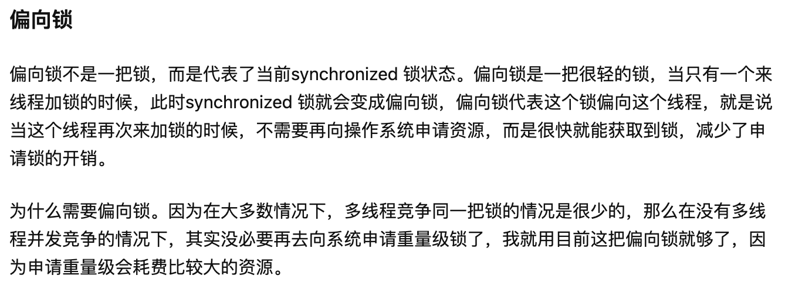
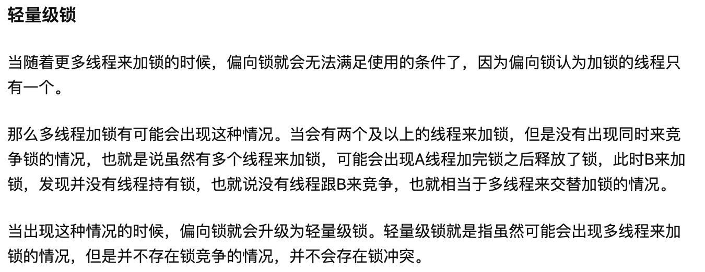
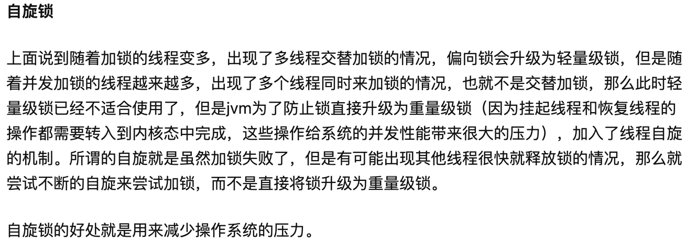

# Java同步及锁

## 方式1：wait() / notify()

```java
public class WaitNotify {
    private static Integer count = 0;
    private static final String lock = "lock";

    public static void main(String[] args) {
        new Thread(new Producer()).start();
        new Thread(new Consumer()).start();
        new Thread(new Producer()).start();
        new Thread(new Consumer()).start();
    }

    static class Producer implements Runnable {
        @Override
        public void run() {
            for (int i = 0; i < 5; i++) {
                try {
                    Thread.sleep(1000);
                } catch (InterruptedException e1) {
                    e1.printStackTrace();
                }
                synchronized (lock) {
                    Integer FULL = 5;
                    while (count.equals(FULL)) {
                        try {
                            lock.wait();
                        } catch (InterruptedException e) {
                            e.printStackTrace();
                        }
                    }
                    count++;
                    System.out.println(Thread.currentThread().getName() + "produce:: " + count);
                    lock.notifyAll();
                }
            }
        }
    }

    static class Consumer implements Runnable {
        @Override
        public void run() {
            for (int i = 0; i < 5; i++) {
                try {
                    Thread.sleep(8000);
                } catch (InterruptedException e1) {
                    e1.printStackTrace();
                }
                synchronized (lock) {
                    while (count == 0) {
                        try {
                            lock.wait();
                        } catch (InterruptedException e) {
                            e.printStackTrace();
                        }
                    }
                    count--;
                    System.out.println(Thread.currentThread().getName() + "consume:: " + count);
                    lock.notifyAll();
                }
            }
        }
    }
}
```

## 方式2：ReentrantLock的Condition

```java
public class ReentrantLockTest {
    private static Integer count = 0;
    final Lock lock = new ReentrantLock();
    final Condition put = lock.newCondition();
    final Condition get = lock.newCondition();

    public static void main(String[] args) {
        ReentrantLockTest t = new ReentrantLockTest();
        new Thread(t.new Producer()).start();
        new Thread(t.new Consumer()).start();
        new Thread(t.new Consumer()).start();
        new Thread(t.new Producer()).start();
    }

    class Producer implements Runnable {
        @Override
        public void run() {
            for (int i = 0; i < 5; i++) {
                try {
                    Thread.sleep(1000);
                } catch (InterruptedException e1) {
                    e1.printStackTrace();
                }
                lock.lock();
                try {
                    Integer FULL = 5;
                    while (count.equals(FULL)) {
                        try {
                            put.await();
                        } catch (InterruptedException e) {
                            e.printStackTrace();
                        }
                    }
                    count++;
                    System.out.println(Thread.currentThread().getName() + "produce:: " + count);
                    get.signal();
                } finally {
                    lock.unlock();
                }
            }
        }
    }

    class Consumer implements Runnable {

        @Override
        public void run() {
            for (int i = 0; i < 5; i++) {
                try {
                    Thread.sleep(1000);
                } catch (InterruptedException e1) {
                    e1.printStackTrace();
                }
                lock.lock();
                try {
                    while (count == 0) {
                        try {
                            get.await();
                        } catch (Exception e) {
                            e.printStackTrace();
                        }
                    }
                    count--;
                    System.out.println(Thread.currentThread().getName() + "consume:: " + count);
                    put.signal();
                } finally {
                    lock.unlock();
                }
            }
        }
    }
}
```

### 关于ReentrantLock和synchronized

ReentrantLock是可中断的，并且可支持公平锁，synchronized是非公平锁。并且ReentrantLock通过多次newCondition可以获得多个Condition对象,可以简单的实现比较复杂的线程同步的功能。

synchronized的性能和ReentrantLock已经差不都了。

synchronized 在jdk 1.6以前的确是一把很重的锁，每次使用锁的时候都是直接向操作系统请求的，所以效率低，且占资源，但是在jdk1.6以后，jvm对synchronized 进行了优化，加入了锁升级的功能，使得synchronized 在一些情况下并不是一把重量级的锁，而是一个很轻的一把锁。

在1.6以后，jdk对synchronized 优化，包括锁升级、锁粗化、锁消除。

#### 1、锁升级
锁升级其实是指，随着多线程并发加锁的程度提高而相应的对锁的状态的升级，可以分为：偏向锁、轻量级锁、自旋锁、重量级锁。





#### 2、锁消除

对一些代码上要求同步，但是被检测到不可能存在共享数据竞争的锁进行消除，如下面的情况是不会出现多线程竞争monitor的：

```java
public class SynchronizedDemo {

    public static void main(String[] args) {
        Object monitor = new Object();
        synchronized (monitor){
            System.out.println("加锁成功....");
        }
    }
}
```

#### 3、锁粗化
如下示例，循环内部每次都对同一个对象进行加锁和解锁，对于这种一串零碎的操作都对同一个对象加锁情况，虚拟机将会把加锁同步的范围扩展 （粗化）到整个操作序列的外部。以上述代码为例，也就是扩展到把for循环这个操作加锁，这样只需要加锁一次就可以了。

```java
public class SynchronizedDemo {

    private static final Object MONITOR = new Object();

    public static void main(String[] args) {

        for (int i = 0; i < 10; i++) {
            synchronized (MONITOR) {
                System.out.println("加锁成功....");
            }
        }
    }
}
```


## 方式3：BlockingQueue

ArrayBlockingQueue的内部正是采用了方式2实现的。

```java
public class BlockingQueueTest {
    private static Integer count = 0;
    final BlockingQueue<Integer> bq = new ArrayBlockingQueue<>(5);

    public static void main(String[] args)  {
        BlockingQueueTest t = new BlockingQueueTest();
        new Thread(t.new Producer()).start();
        new Thread(t.new Consumer()).start();
        new Thread(t.new Consumer()).start();
        new Thread(t.new Producer()).start();
    }
    class Producer implements Runnable {
        @Override
        public void run() {
            for (int i = 0; i < 5; i++) {
                try {
                    Thread.sleep(1000);
                } catch (Exception e) {
                    e.printStackTrace();
                }
                try {
                    bq.put(1);
                    count++;
                    System.out.println(Thread.currentThread().getName() + "produce:: " + count);
                } catch (InterruptedException e) {
                    e.printStackTrace();
                }
            }
        }
    }
    class Consumer implements Runnable {

        @Override
        public void run() {
            for (int i = 0; i < 5; i++) {
                try {
                    Thread.sleep(1000);
                } catch (InterruptedException e1) {
                    e1.printStackTrace();
                }
                try {
                    bq.take();
                    count--;
                    System.out.println(Thread.currentThread().getName()+ "consume:: " + count);
                } catch (Exception e) {
                    e.printStackTrace();
                }
            }
        }
    }
}
```

## 方式4：Semaphore

信号量（Semaphore）维护了一个许可集。在许可可用前会阻塞每一个 acquire()，然后再获取该许可。每个 release() 添加一个许可，从而可能释放一个正在阻塞的获取者。

Semaphore 通常用于限制可以访问某些资源（物理或逻辑的）的线程数目。 

```java
public class SemaphoreTest {
    int count = 0;
    final Semaphore put = new Semaphore(5);//初始令牌个数
    final Semaphore get = new Semaphore(0);
    final Semaphore mutex = new Semaphore(1);

    public static void main(String[] args) {
        SemaphoreTest t = new SemaphoreTest();
        new Thread(t.new Producer()).start();
        new Thread(t.new Consumer()).start();
        new Thread(t.new Consumer()).start();
        new Thread(t.new Producer()).start();
    }

    class Producer implements Runnable {
        @Override
        public void run() {
            for (int i = 0; i < 5; i++) {
                try {
                    Thread.sleep(1000);
                } catch (Exception e) {
                    e.printStackTrace();
                }
                try {
                    put.acquire();//注意顺序
                    mutex.acquire();
                    count++;
                    System.out.println(Thread.currentThread().getName() + "produce:: " + count);
                } catch (Exception e) {
                    e.printStackTrace();
                } finally {
                    mutex.release();
                    get.release();
                }

            }
        }
    }

    class Consumer implements Runnable {

        @Override
        public void run() {
            for (int i = 0; i < 5; i++) {
                try {
                    Thread.sleep(1000);
                } catch (InterruptedException e1) {
                    e1.printStackTrace();
                }
                try {
                    get.acquire();//注意顺序
                    mutex.acquire();
                    count--;
                    System.out.println(Thread.currentThread().getName() + "consume:: " + count);
                } catch (Exception e) {
                    e.printStackTrace();
                } finally {
                    mutex.release();
                    put.release();
                }
            }
        }
    }
}
```

Semaphore还能实现限流的操作。

## 方式5：PipedInputStream / PipedOutputStream

这个方式不推荐使用，缓冲区不易控制，并且大小也有限制。

```java
public class PIO {
    final PipedInputStream pis = new PipedInputStream();
    final PipedOutputStream pos = new PipedOutputStream();
    public static void main(String[] args) {
        PIO t = new PIO();
        new Thread(t.new Producer()).start();
        new Thread(t.new Consumer()).start();
    }
    class Producer implements Runnable{

        @Override
        public void run() {
            try {
                pis.connect(pos);
            } catch (IOException e) {
                e.printStackTrace();
            }
            try {
                while(true){
                    sleep(2000);
                    int n = (int)(Math.random()*255);
                    System.out.println(Thread.currentThread().getName()+"produce::"+n);
                    pos.write(n);
                    pos.flush();
                }
            } catch (Throwable e) {
                e.printStackTrace();
            }finally {
                try {
                    pis.close();
                    pos.close();
                } catch (IOException e) {
                    e.printStackTrace();
                }
            }

        }
    }
    class Consumer implements Runnable{

        @Override
        public void run() {
            int n;
            try {
                while(true){
                    n = pis.read();
                    System.out.println(Thread.currentThread().getName()+"consume::"+n);
                }
            } catch (IOException e) {
                e.printStackTrace();
            }finally{
                try {
                    pis.close();
                    pos.close();
                } catch (IOException e) {
                    e.printStackTrace();
                }

            }
        }
    }
}
```

### 锁的类型


#### 偏向锁/轻量级锁/自旋锁/重量级锁
如上
#### 可重入锁/不可重入锁
可重入锁又名递归锁，是指在同一个线程在外层方法获取锁的时候，在进入内层方法会自动获取锁。

ReetrantLock和Synchronized都是可重入锁，可重入锁的一个好处是可一定程度避免死锁。

```java
synchronized void setA() throws Exception{
 　　Thread.sleep(1000);
 　　setB();
} 
synchronized void setB() throws Exception{
　　Thread.sleep(1000);
}
```
关于可重入锁/不可重入锁：[锁的简单应用](https://www.cnblogs.com/dj3839/p/6580765.html)

#### 独享锁/共享锁
共享锁也叫S锁，读锁，该锁可以被多个线程持有；独享锁也叫X锁，写锁，排他锁，该锁只能被一个线程持有。

#### 乐观锁/悲观锁
悲观锁认为自己在使用数据的时候一定有别的线程来修改数据，因此在获取数据的时候会先加锁，确保数据不会被别的线程修改。Java中，synchronized关键字和Lock的实现类都是悲观锁。

乐观锁认为自己在使用数据时不会有别的线程修改数据，所以不会添加锁，只是在更新数据的时候去判断之前有没有别的线程更新了这个数据。如果这个数据没有被更新，当前线程将自己修改的数据成功写入。如果数据已经被其他线程更新，则根据不同的实现方式执行不同的操作（例如报错或者自动重试）。

#### 公平锁/非公平锁
公平锁是指多个线程按照申请锁的顺序来获取锁，线程直接进入队列中排队，队列中的第一个线程才能获得锁。公平锁的优点是等待锁的线程不会饿死。缺点是整体吞吐效率相对非公平锁要低，等待队列中除第一个线程以外的所有线程都会阻塞，CPU唤醒阻塞线程的开销比非公平锁大。

非公平锁是多个线程加锁时直接尝试获取锁，获取不到才会到等待队列的队尾等待。但如果此时锁刚好可用，那么这个线程可以无需阻塞直接获取到锁，所以非公平锁有可能出现后申请锁的线程先获取锁的场景。非公平锁的优点是可以减少唤起线程的开销，整体的吞吐效率高，因为线程有几率不阻塞直接获得锁，CPU不必唤醒所有线程。缺点是处于等待队列中的线程可能会饿死，或者等很久才会获得锁。

参考资料：[不可不说的Java“锁”事](https://tech.meituan.com/2018/11/15/java-lock.html)