# kotlin Coroutine分析（1）

## 协程编译后是个啥 —— 示例1：单个协程多个方法
写一个测试代码：

```java
class Test {
    private fun startCoroutine() {
        CoroutineScope(Dispatchers.IO).launch {
            println("funTest")
            suspendFun1()
            suspendFun2()
        }
    }

    suspend fun suspendFun1() {
        coroutineScope {
            println("suspendFun1")
        }
    }

    suspend fun suspendFun2() {
        coroutineScope {
            println("suspendFun2")
        }
    }
}
```

编译完后：

原来的Test文件变成：
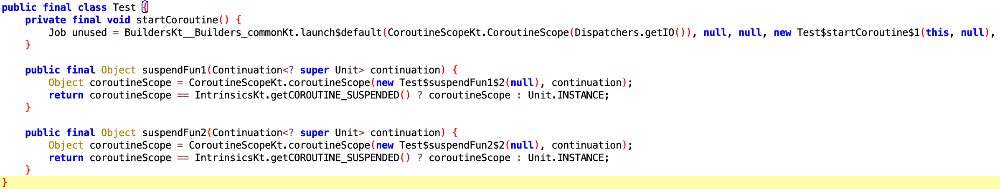

同时出来3个内部类：

`Test$startCoroutine$1`：
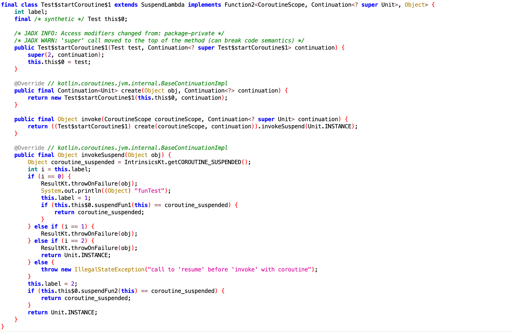

`Test$suspendFun1$2`：
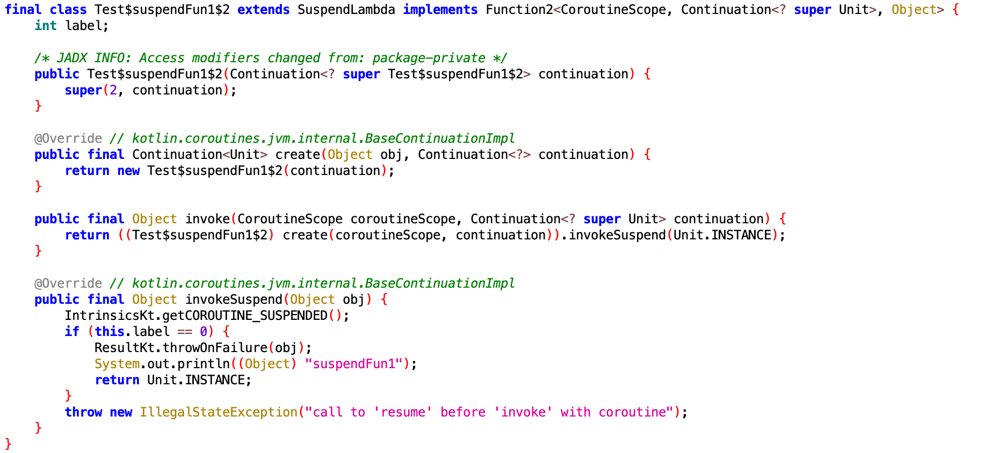

`Test$suspendFun2$2`：
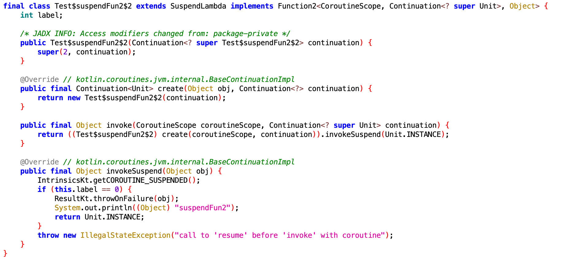

Kotlin协程中使用了状态机，编译器会将协程体编译成一个匿名内部类，每一个挂起函数的调用位置对应一个挂起点。

### 1、看下startCoroutine()方法
很长的一串代码，其中`BuildersKt__Builders_commonKt`这个类感觉是编译器生成的（源码里没找到），我们主要关注下`launch$default`的接受参数：
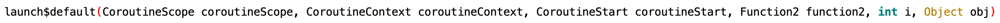
其他参数不care，我们看下Function2：
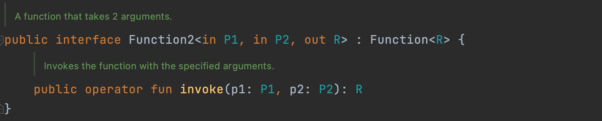
其实就是接受2个参数的回调方法。

最后调用到的是`BuildersKt.class`里的`launch()`方法：
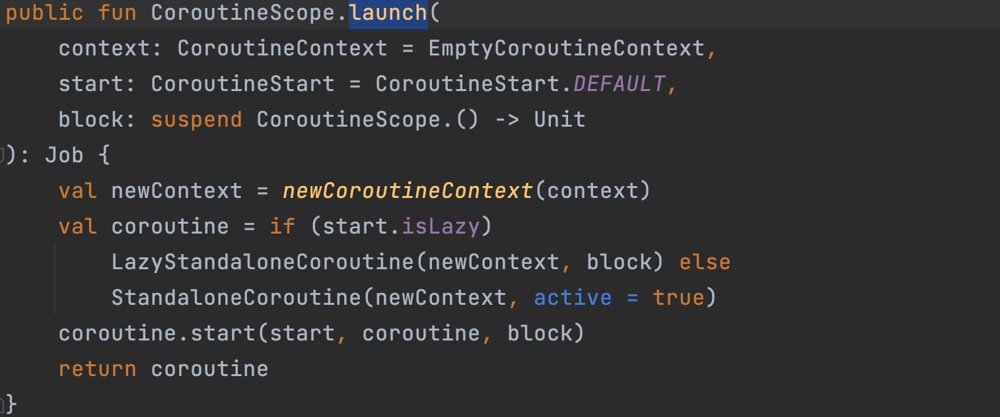

### 2、SuspendLambda类
上面的三个内部类都继承了这个类，这个是啥呢？
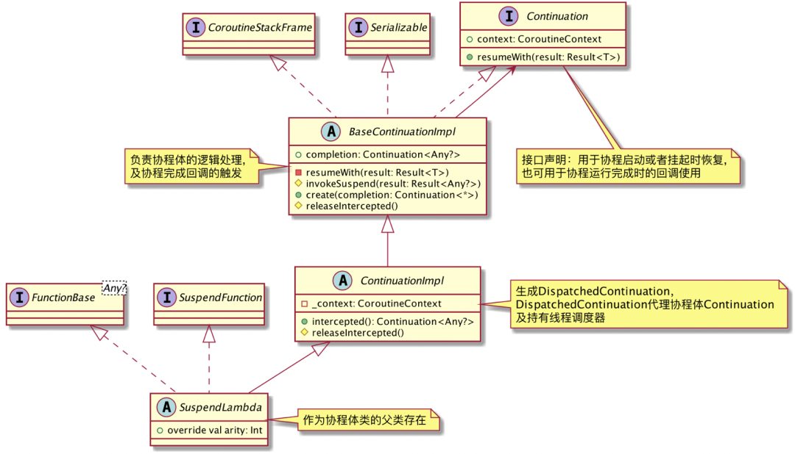

核心继承链：**SuspendLambda->ContinuationImpl->BaseContinuationImpl->Continuation**

核心的实现是在`BaseContinuationImpl`这个类里：

```java
internal abstract class BaseContinuationImpl(  
     public val completion: Continuation<Any?>?  
 ) : Continuation<Any?>, CoroutineStackFrame, Serializable {  
     public final override fun resumeWith(result: Result<Any?>) {  
          ...  
          invokeSuspend(param)  
          ...  
     }  
     protected abstract fun invokeSuspend(result: Result<Any?>): Any?  
 }
```
BaseContinuationImpl定义了一个抽象方法invokeSuspend()，并重写了Continuation的resumeWith()，并在其中调用invokeSuspend()，上文我们提到协程体的操作都被转换成了invokeSuspend()的调用，那么协程体的执行其实就是resumeWith()被调用到。

### 2、两个挂起点怎么依次执行的？
代码里有2个挂起点，怎么通过一次resumeWith，可以执行多个挂起点呢?

从上面`Test$startCoroutine$1`的`invokeSuspend()`方法里面的代码看，就是一个顺序的调用，分别调用到`suspendFun1`和`suspendFun2`，编译之后方法为：
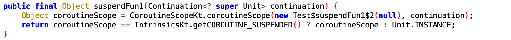

需要关注的是`CoroutineScopeKt.coroutineScope`，它的代码实现是：

编译之后的代码：
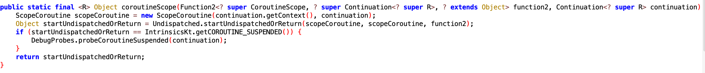

核心代码是`Undispatched.startUndispatchedOrReturn()`：
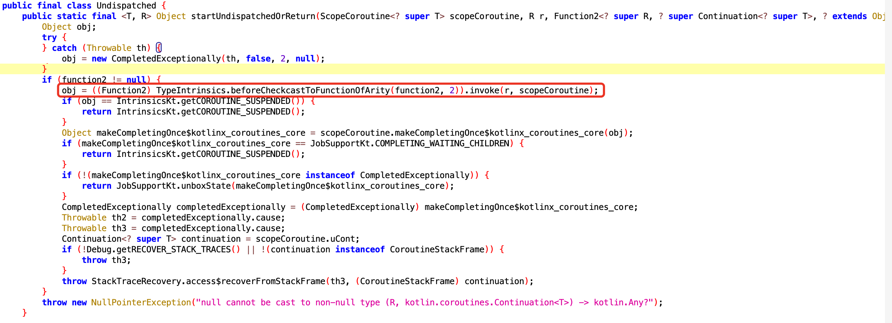

这里就会调用到每个挂起点对应的方法：
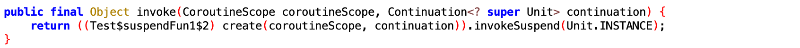

## 协程编译后是个啥 —— 示例2：协程内开协程
写一个测试代码：

```java
class Test {
     fun startCoroutine() {
        CoroutineScope(Dispatchers.IO).launch {
            println("funTest")
            CoroutineScope(Dispatchers.IO).launch {
                suspendFun1()
            }
            suspendFun2()
        }
    }

    suspend fun suspendFun1() {
        coroutineScope {
            println("suspendFun1")
        }
    }

    suspend fun suspendFun2() {
        coroutineScope {
            println("suspendFun2")
        }
    }
}
```

编译完后，`Test`和`Test$suspendFun1$2`、`Test$suspendFun2$2`都没有变化，唯一的变化是`Test$startCoroutine$1`：
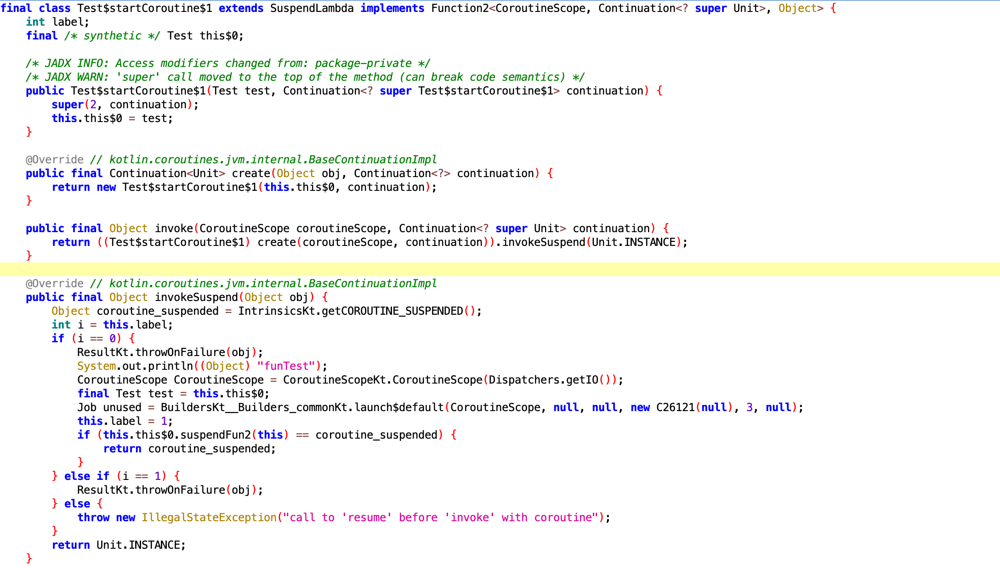
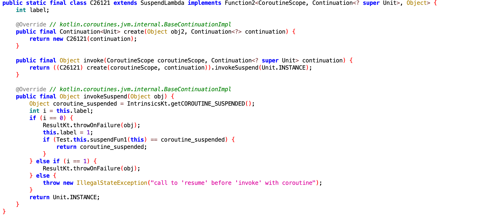

在协程里再开协程的情况下，入口还是一样，都是在`Test$startCoroutine$1`的`invokeSuspend`方法，对于不开协程的方法是直接调用，而开了协程的方法则通过调用`Test$startCoroutine$1`的方式启动：
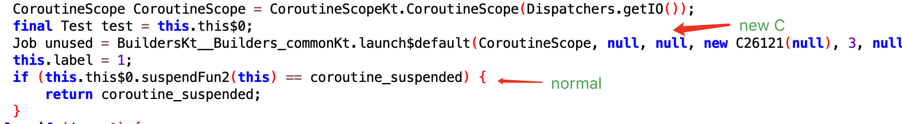

## 协程编译后是个啥 —— 示例3：并行协程
写一个测试代码：

```java
class Test {
     fun startCoroutine() {
        CoroutineScope(Dispatchers.IO).launch {
            CoroutineScope(Dispatchers.IO).launch {
                suspendFun1()
            }
        }
         CoroutineScope(Dispatchers.IO).launch {
             CoroutineScope(Dispatchers.IO).launch {
                 suspendFun2()
             }
         }
    }

    suspend fun suspendFun1() {
        coroutineScope {
            println("suspendFun1")
        }
    }

    suspend fun suspendFun2() {
        coroutineScope {
            println("suspendFun2")
        }
    }
}
```
编译后的代码`Test$suspendFun1$2`、`Test$suspendFun2$2`都没变化，主要是`Test`变化了：
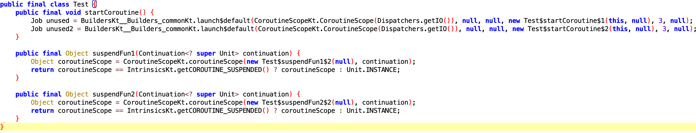
就是会有2个`Test$startCoroutine`，分别跑在不同的协程。

## Dispatcher的实现

### Main：MainDispatcherLoader

针对的就是主线程上的协程。

它的实现主要是SPI的概念，基本ServiceLoader去实现，核心是下面的代码：

```java
@JvmField
val dispatcher: MainCoroutineDispatcher = loadMainDispatcher()

private fun loadMainDispatcher(): MainCoroutineDispatcher {
    return try {
        val factories = if (FAST_SERVICE_LOADER_ENABLED) {
            FastServiceLoader.loadMainDispatcherFactory()
        } else {
            // We are explicitly using the
            // `ServiceLoader.load(MyClass::class.java, MyClass::class.java.classLoader).iterator()`
            // form of the ServiceLoader call to enable R8 optimization when compiled on Android.
            ServiceLoader.load(
                    MainDispatcherFactory::class.java,
                    MainDispatcherFactory::class.java.classLoader
            ).iterator().asSequence().toList()
        }
        @Suppress("ConstantConditionIf")
        factories.maxByOrNull { it.loadPriority }?.tryCreateDispatcher(factories)
            ?: createMissingDispatcher()
    } catch (e: Throwable) {
        // Service loader can throw an exception as well
        createMissingDispatcher(e)
    }
}
```

由于ServiceLoader的性能问题，kotlin做了相应的优化，使用了FastServiceLoader。

### Default：DefaultScheduler

这里其实`ExperimentalCoroutineDispatcher`的子类，具体逻辑在父类。

### Default：CommonPool

pool采用了2种线程池：

* ForkJoinPool
* newFixedThreadPool

根据是否有SecurityManager来决定用哪一个，有的话就用newFixedThreadPool，没有的话就用ForkJoinPool。

核心代码如下：

```java
private fun createPool(): ExecutorService {
    if (System.getSecurityManager() != null) return createPlainPool()
    // Reflection on ForkJoinPool class so that it works on JDK 6 (which is absent there)
    val fjpClass = Try { Class.forName("java.util.concurrent.ForkJoinPool") }
        ?: return createPlainPool() // Fallback to plain thread pool
    // Try to use commonPool unless parallelism was explicitly specified or in debug privatePool mode
    if (!usePrivatePool && requestedParallelism < 0) {
        Try { fjpClass.getMethod("commonPool").invoke(null) as? ExecutorService }
            ?.takeIf { isGoodCommonPool(fjpClass, it) }
            ?.let { return it }
    }
    // Try to create private ForkJoinPool instance
    Try { fjpClass.getConstructor(Int::class.java).newInstance(parallelism) as? ExecutorService }
        ?. let { return it }
    // Fallback to plain thread pool
    return createPlainPool()
}

private fun createPlainPool(): ExecutorService {
    val threadId = AtomicInteger()
    return Executors.newFixedThreadPool(parallelism) {
        Thread(it, "CommonPool-worker-${threadId.incrementAndGet()}").apply { isDaemon = true }
    }
}
```

执行task的代码如下：

```java
override fun dispatch(context: CoroutineContext, block: Runnable) {
    try {
        (pool ?: getOrCreatePoolSync()).execute(wrapTask(block))
    } catch (e: RejectedExecutionException) {
        unTrackTask()
        // CommonPool only rejects execution when it is being closed and this behavior is reserved
        // for testing purposes, so we don't have to worry about cancelling the affected Job here.
        DefaultExecutor.enqueue(block)
    }
}
```

#### 扩展：ForkJoinPool是啥？

* Work Stealing算法

工作窃取算法是指某个线程从其他队列里窃取任务来执行。

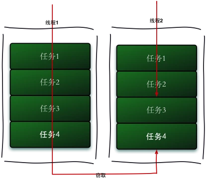

我们需要做一个比较大的任务，可以把这个任务分割为若干互不依赖的子任务，为了减少线程间的竞争，把这些子任务分别放到不同的队列里，并为每个队列创建一个单独的线程来执行队列里的任务，线程和队列一一对应。比如A线程负责处理A队列里的任务。但是，有的线程会先把自己队列里的任务干完，而其他线程对应的队列里还有任务等待处理。干完活的线程与其等着，不如去帮其他线程干活，于是他就去其他线程的队列里窃取一个任务来执行。而在这时他们会访问同一个队列，所以为了减少窃取任务线程和被窃取任务线程之间的竞争，通常会使用双端队列，被窃取任务线程永远从双端队列的头部拿任务执行，而窃取任务的线程永远从双端队列的尾部拿任务执行。

* Fork/Join 框架

我们再通过 Fork 和 Join 这两个单词来理解下 Fork/Join 框架，Fork 就是把一个大任务切分为若干子任务并行的执行，Join 就是合并这些子任务的执行结果，最后得到这个大任务的结果。

[Fork/Join 框架介绍](https://www.infoq.cn/article/fork-join-introduction)

### IO：LimitingDispatcher

这是个限制执行任务的分发器。如代码：

```java
private fun dispatch(block: Runnable, tailDispatch: Boolean) {
    var taskToSchedule = block
    while (true) {
        // Commit in-flight tasks slot
        val inFlight = inFlightTasks.incrementAndGet()

        // Fast path, if parallelism limit is not reached, dispatch task and return
        if (inFlight <= parallelism) {
            dispatcher.dispatchWithContext(taskToSchedule, this, tailDispatch)
            return
        }

        // Parallelism limit is reached, add task to the queue
        queue.add(taskToSchedule)

        if (inFlightTasks.decrementAndGet() >= parallelism) {
            return
        }

        taskToSchedule = queue.poll() ?: return
    }
}
```

## 启动的一个大致流程

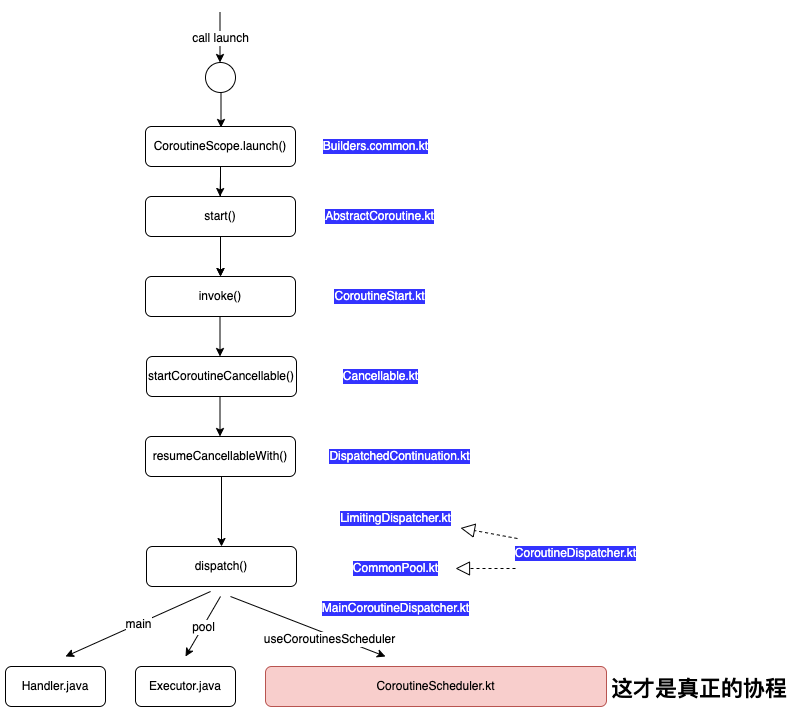


## 关于性能

### 协程 — IO

协程的测试代码：

```java
val count = CountDownLatch(100_000)
val start = System.currentTimeMillis()
CoroutineScope(Dispatchers.IO).launch {
    for (i in 0 until 100_000) {
        launch(Dispatchers.IO) {
            delay(10)
            count.countDown()
        }
    }
    Log.e("111", "for循环结束，time："+(System.currentTimeMillis() - start))
    count.await()
    Log.e("111", "所有任务执行完，time："+(System.currentTimeMillis() - start))
}
```

打印的日志：

```
E/111: for循环结束，time：20434
E/111: 所有任务执行完，time：24989
```

### 协程 — Default

协程的测试代码：

```java
val count = CountDownLatch(100_000)
val start = System.currentTimeMillis()
CoroutineScope(Dispatchers.Default).launch {
    for (i in 0 until 100_000) {
        launch(Dispatchers.Default) {
            delay(10)
            count.countDown()
        }
    }
    Log.e("111", "for循环结束，time："+(System.currentTimeMillis() - start))
    count.await()
    Log.e("111", "所有任务执行完，time："+(System.currentTimeMillis() - start))
}
```

打印的日志：

```
E/111: for循环结束，time：3539
E/111: 所有任务执行完，time：4712
```

### 线程 — core thread 64

协程的测试代码：

```java
val count = CountDownLatch(100_000)
val ex = Executors.newFixedThreadPool(64)
Thread {
    val start = System.currentTimeMillis()
    for (i in 0 until 100_000) {
        ex.execute {
            sleep(10)
            count.countDown()
        }
    }
    Log.e("111", "for循环结束，time：" + (System.currentTimeMillis() - start))
    count.await()
    Log.e("111", "所有任务执行完，time：" + (System.currentTimeMillis() - start))
}.start()
```

打印的日志：

```
E/111: for循环结束，time：409
E/111: 所有任务执行完，time：19112
```

### 线程 — core thread 1000

协程的测试代码：

```java
val count = CountDownLatch(100_000)
val ex = Executors.newFixedThreadPool(1000)
Thread {
    val start = System.currentTimeMillis()
    for (i in 0 until 100_000) {
        ex.execute {
            sleep(10)
            count.countDown()
        }
    }
    Log.e("111", "for循环结束，time：" + (System.currentTimeMillis() - start))
    count.await()
    Log.e("111", "所有任务执行完，time：" + (System.currentTimeMillis() - start))
}.start()
```

打印的日志：

```
E/111: for循环结束，time：2077
E/111: 所有任务执行完，time：5533
```

总结：

1. Executors.newFixedThreadPool再大就会OOM了，说明线程多了是会内存爆了的
2. IO的性能比Default差，按上面的分析IO是limit的线程池，Default是优化后的线程池
3. 为啥核心线程多for循环的时间会增大？？—— 因为开辟线程的耗时?
4. 协程总体上并没有特别提升性能，更多的是方便开发者进行并行开发


