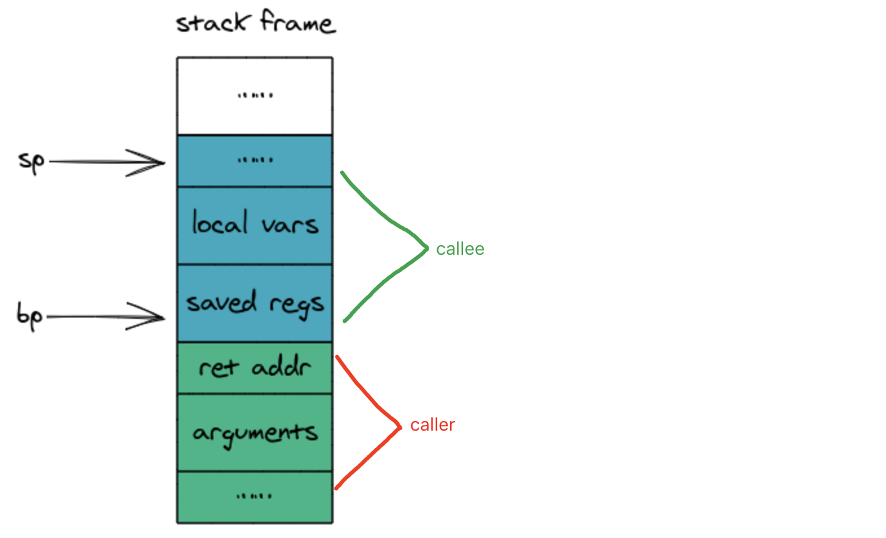
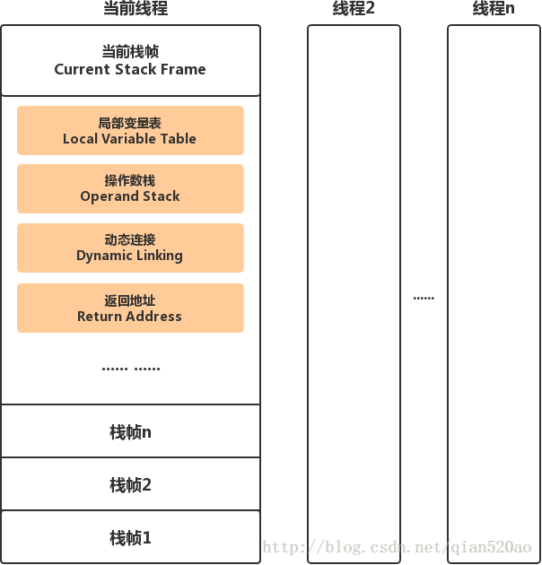
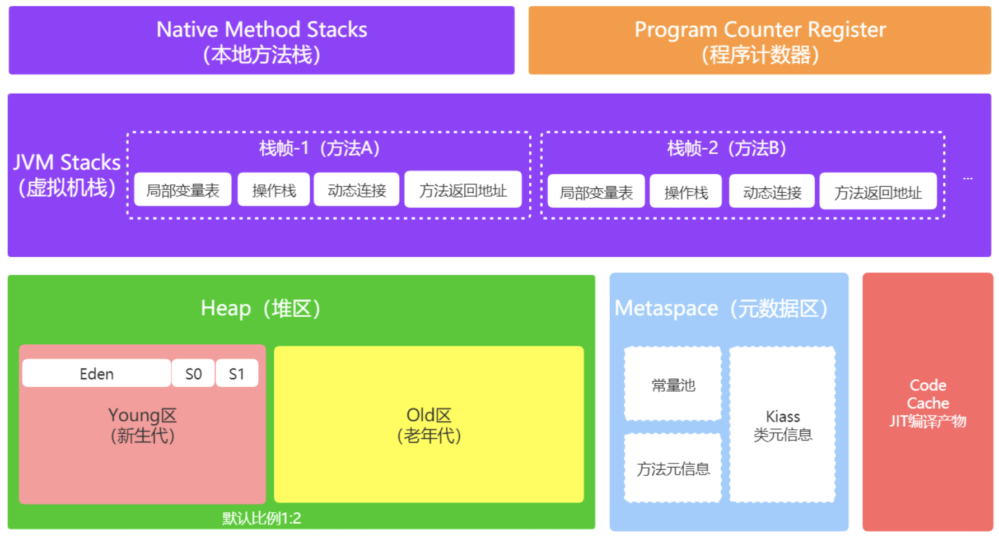

# 关于栈帧

## C++栈帧的内容
栈帧中存储了函数参数、返回地址、保存的寄存器、局部变量，因此完整的栈结构可能像下面这样：



* 函数参数（arguments）
 * 在X64中如果函数参数超过6个，前6个通过寄存器进行传递，其余参数则通过栈来进行参数传递，当少于等于6个或没有参数时，这个时候该栈帧部分可以忽略。在需要通过栈来传递参数时，调用函数需要先将参数压入自己的栈帧中，然后被调用函数从调用函数的栈帧中对参数进行访问。所以图中参数部分在调用函数的栈帧中。
* 返回地址（ret addr）
 * 将函数参数压栈之后，需要把调用位置处的下一条指令地址压栈，以便被调用函数执行完之后可以回到原来的位置继续执行，这个地址就是返回地址。
* 保存的寄存器（saved regs）
 * 存放的是需要被调用者来保存的寄存器，例如旧的栈基址（old bp）旧保存在其中。
* 局部变量（local vars）
 * 这个部分是存储在栈中而不是寄存器中的局部变量，如果函数没有局部变量或局部变量都存储在寄存器中，那么该栈帧部分可以忽略。 
 
## java栈帧的内容


具体看：[运行时栈帧结构](https://blog.csdn.net/qian520ao/article/details/79118474)
 
而栈帧在jvm内存结构中的位置：


## 栈帧的创建

通常用一个叫做栈基址（bp）的寄存器来保存正在运行函数栈帧的开始地址，由于栈指针（sp）始终保存的是栈顶的地址，所以栈指针保存的也就是正在运行函数栈帧的结束地址。


关于栈帧创建和销毁的细节可参考：[函数栈帧](https://gitbook.coder.cat/function-call-principle/content/function-stack-frame.html)

**C/C++中销毁栈帧并不会清空被销毁栈帧中的数据**

## 关于栈帧的奇怪现象

```
void init_array() {
    int arr[10];
    for (int i = 0; i < 10; ++i) {
        arr[i] = i;
    }
    printf("%p\n", arr);
}

void print_array() {
    int arr1[10];
    for (int i : arr1) {
        printf("%d\t", i);
    }
    printf("\n");
    printf("%p\n", arr1);
}
void a() {
    int i = 10;
}

void b() {
    int j;
    printf("%d\n", j);
}

void c() {
    long foo = 10;
    long arr[2] = {1, 2};
    arr[-1] = 20;
    printf("foo is %ld", foo);
}

int main() {
    init_array();
    print_array();

    a();
    b();
    c();
}
```

结果如下：

```
0x7ffee1a4d790
0	1	2	3	4	5	6	7	8	9
0x7ffee1a4d790


0x7ffee1a4d7bc
10
0x7ffee1a4d7bc


foo is 20
```

还是因为栈帧不销毁里面的数据，只是sp和bp指针的变化。当2个函数调用，栈帧结构和大小一样时，会导致读取到前一个函数里面的值。

还有一个问题是，由于C/C++不检查数组越界访问，所以哪怕栈帧结构和大小不一样，当我们越界访问时，还是可能读到之前栈帧的数据。

所以在写C++代码时，需要注意：

* 给变量赋初试值，不要用缺省值
* 不要越界访问

## 一些结论

### 为什么尽量用循环来代替递归调用？
每一次函数调用都需要初始化和销毁栈帧，因此会带来额外的开销。同时当递归次数过多时，会导致栈内存耗尽，最终出现栈溢出。

### 为什么内联（inline）函数效率高？
内联函数跟普通函数在编写和调用上没什么区别，inline关键字也只是给编译器一个提示，告诉编译器这个函数要内联。

在编译器实际编译出的指令中，只是把内联函数的指令copy到调用者的函数中，因此也就不会为它初始化栈帧。这样避免了栈帧所带来的开销，使用内联函数可以提升执行效率。

### 为什么静态变量在函数返回后不会被释放？
这是因为静态变量根本不在堆栈这块内存区域中，它存放在一个叫做静态区的地方，所以函数返回时销毁的是栈内存，并不会影响静态区。

### C/C++数组越界访问的危害？
C/C++并不会不检查数组越界访问，这将导致你越界访问的那段内存可能存放着相邻的其他变量，甚至是函数返回地址等重要数据。如果你还对其进行了修改，后果也很难想象，通常数组越界的bug也很难调试。


