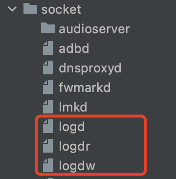
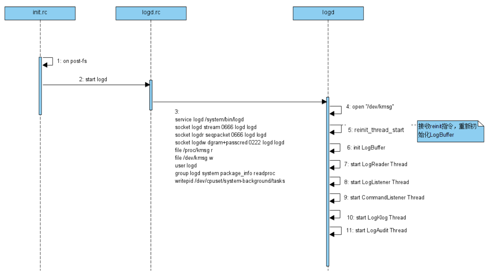
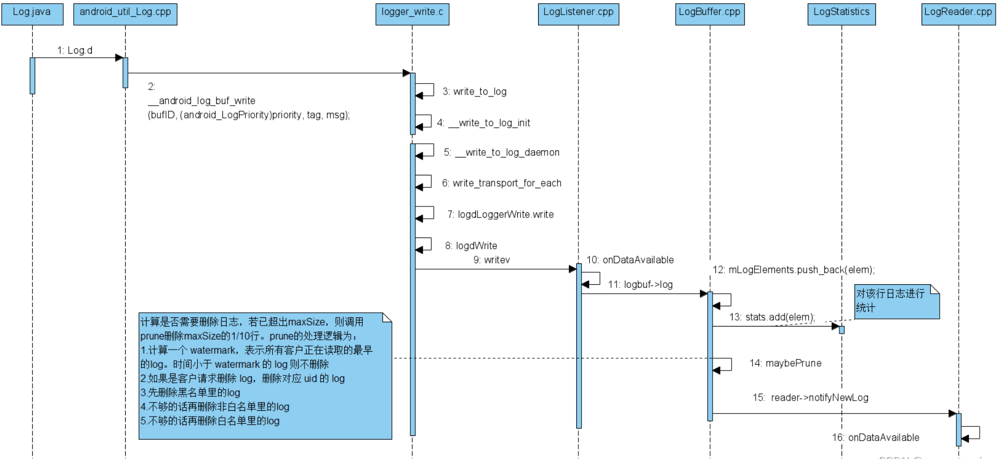
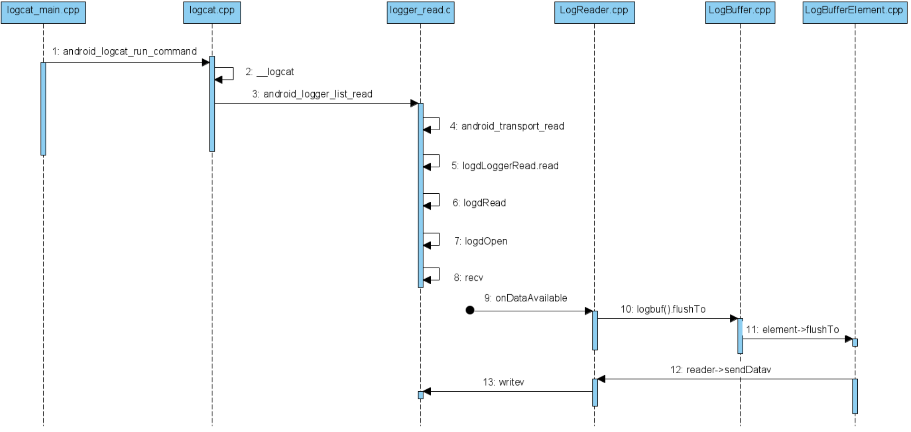
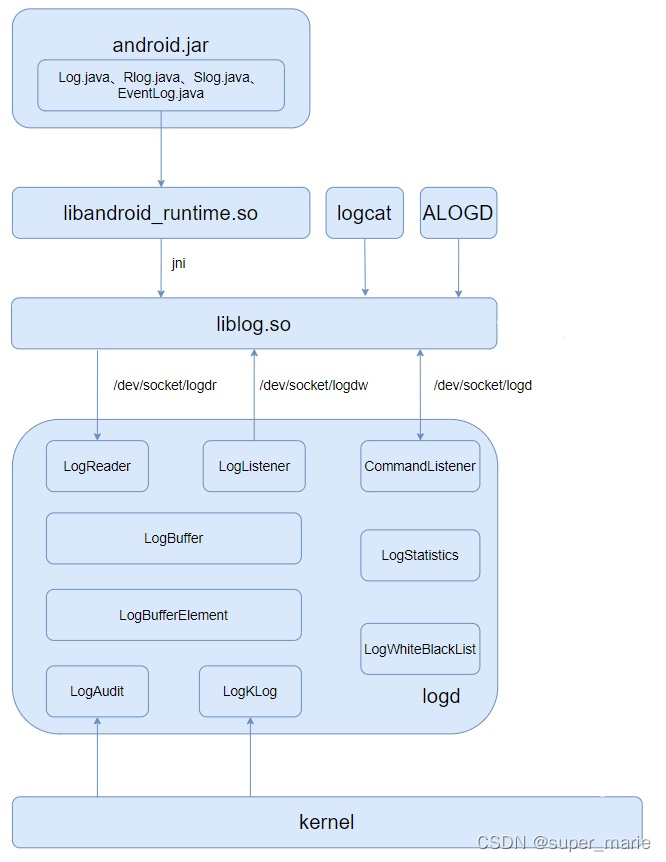
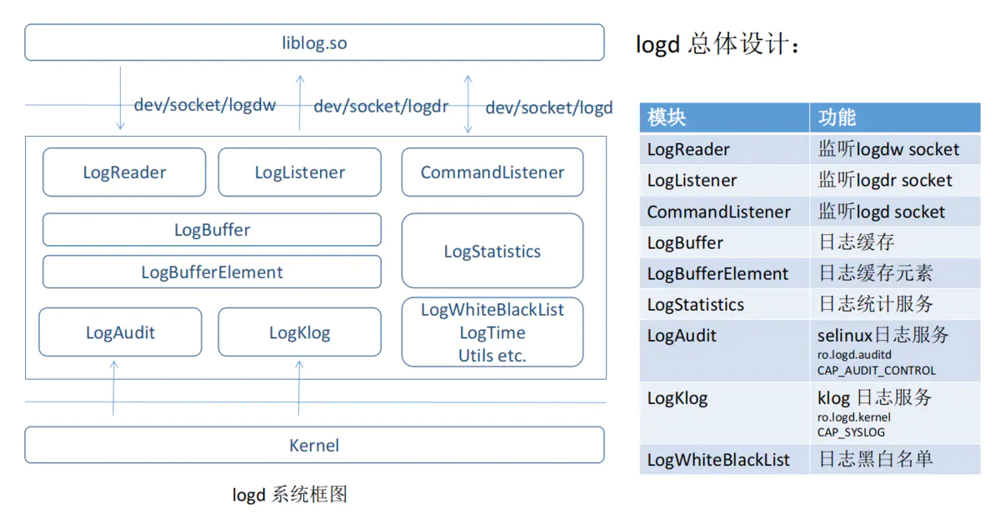

# 安卓原生log架构

## Logd进程的启动

logd进程是在Android系统启动时，init进程通过解析`init.rc`文件来启动的，文件路径：`system/core/rootdir/init.rc`

```c
... ...
on post-fs
    # Load properties from
    #     /system/build.prop,
    #     /odm/build.prop,
    #     /vendor/build.prop and
    #     /factory/factory.prop
    load_system_props
    # start essential services
    start logd
    start servicemanager
    start hwservicemanager
    start vndservicemanager
... ...
```

而start logd又会调用到`logd.rc`文件，文件路径为：`system/core/logd/logd.rc`

```c
service logd /system/bin/logd
    socket logd stream 0666 logd logd
    socket logdr seqpacket 0666 logd logd
    socket logdw dgram+passcred 0222 logd logd
    file /proc/kmsg r
    file /dev/kmsg w
    user logd
    group logd system package_info readproc
    writepid /dev/cpuset/system-background/tasks

service logd-reinit /system/bin/logd --reinit
    oneshot
    disabled
    user logd
    group logd
    writepid /dev/cpuset/system-background/tasks

on fs
    write /dev/event-log-tags "# content owned by logd
"
    chown logd logd /dev/event-log-tags
    chmod 0644 /dev/event-log-tags
```

在 logd.rc 中，会启动 logd 进程，并创建三个socket，启动完成后，还会启动 logd-reinit。代码路径：`system/core/logd/main.cpp`

```c
int main(int argc, char* argv[]) {
    ... ...	
    // Serves the purpose of managing the last logs times read on a
    // socket connection, and as a reader lock on a range of log
    // entries.

    LastLogTimes* times = new LastLogTimes();

    // LogBuffer is the object which is responsible for holding all
    // log entries.

    logBuf = new LogBuffer(times);

    signal(SIGHUP, reinit_signal_handler);

    if (__android_logger_property_get_bool(
            "logd.statistics", BOOL_DEFAULT_TRUE | BOOL_DEFAULT_FLAG_PERSIST |
                                   BOOL_DEFAULT_FLAG_ENG |
                                   BOOL_DEFAULT_FLAG_SVELTE)) {
        logBuf->enableStatistics();
    }

    // LogReader listens on /dev/socket/logdr. When a client
    // connects, log entries in the LogBuffer are written to the client.

    LogReader* reader = new LogReader(logBuf);
    if (reader->startListener()) {
        exit(1);
    }

    // LogListener listens on /dev/socket/logdw for client
    // initiated log messages. New log entries are added to LogBuffer
    // and LogReader is notified to send updates to connected clients.

    LogListener* swl = new LogListener(logBuf, reader);
    // Backlog and /proc/sys/net/unix/max_dgram_qlen set to large value
    if (swl->startListener(600)) {
        exit(1);
    }

    // Command listener listens on /dev/socket/logd for incoming logd
    // administrative commands.

    CommandListener* cl = new CommandListener(logBuf, reader, swl);
    if (cl->startListener()) {
        exit(1);
    }
    ... ...
}
```

上面的核心逻辑就是启动各个 log 监听器：

* /dev/socket/logdr：监听的客户端的连接，用作读取
* /dev/socket/logdw：监听的是日志的写入
* /dev/socket/logd：监听的是log指令

对应的文件：



完成的流程：



我们看下日志写入的监听`system/core/logd/LogListener.h`：

```h
class LogListener : public SocketListener {
    LogBufferInterface* logbuf;
    LogReader* reader;

   public:
    LogListener(LogBufferInterface* buf, LogReader* reader /* nullable */);

   protected:
    virtual bool onDataAvailable(SocketClient* cli);

   private:
    static int getLogSocket();
};
```

对应的cpp实现：

```c
... ...
int LogListener::getLogSocket() {
    static const char socketName[] = "logdw";
    int sock = android_get_control_socket(socketName);

    if (sock < 0) {  // logd started up in init.sh
        sock = socket_local_server(
            socketName, ANDROID_SOCKET_NAMESPACE_RESERVED, SOCK_DGRAM);

        int on = 1;
        if (setsockopt(sock, SOL_SOCKET, SO_PASSCRED, &on, sizeof(on))) {
            return -1;
        }
    }
    return sock;
}
... ...
```

socket的实现在`system/core/libsysutils/src/SocketListener.cpp`：

```c
int SocketListener::startListener(int backlog) {

    ...

    //创建线程，并启动线程
    if (pthread_create(&mThread, NULL, SocketListener::threadStart, this)) {
        SLOGE("pthread_create (%s)", strerror(errno));
        return -1;
    }

    return 0;
}

void *SocketListener::threadStart(void *obj) {
    SocketListener *me = reinterpret_cast<SocketListener *>(obj);

    //启动监听
    me->runListener();
    pthread_exit(NULL);
    return NULL;
}

void SocketListener::runListener() {

    SocketClientCollection pendingList;

    //进入死循环
    while(1) {
        ...
        //当列表中存在事件时，调用到 onDataAvailable() 进行处理
        while (!pendingList.empty()) {
            /* Pop the first item from the list */
            it = pendingList.begin();
            SocketClient* c = *it;
            pendingList.erase(it);
            /* Process it, if false is returned, remove from list */
            if (!onDataAvailable(c)) {
                release(c, false);
            }
            c->decRef();
        }
    }
}
```

## 写入日志

1、`frameworks/base/core/java/android/util/Log.java`

```java
public static int v(@Nullable String tag, @NonNull String msg) {
    return println_native(LOG_ID_MAIN, VERBOSE, tag, msg);
}

/** @hide */
@UnsupportedAppUsage
public static native int println_native(int bufID, int priority, String tag, String msg);
```

2、`frameworks/base/core/jni/android_util_Log.cpp`

```c
static jint android_util_Log_println_native(JNIEnv* env, jobject clazz,
        jint bufID, jint priority, jstring tagObj, jstring msgObj)
{
    const char* tag = NULL;
    const char* msg = NULL;

    if (msgObj == NULL) {
        jniThrowNullPointerException(env, "println needs a message");
        return -1;
    }

    if (bufID < 0 || bufID >= LOG_ID_MAX) {
        jniThrowNullPointerException(env, "bad bufID");
        return -1;
    }

    if (tagObj != NULL)
        tag = env->GetStringUTFChars(tagObj, NULL);
    msg = env->GetStringUTFChars(msgObj, NULL);

    int res = __android_log_buf_write(bufID, (android_LogPriority)priority, tag, msg);

    if (tag != NULL)
        env->ReleaseStringUTFChars(tagObj, tag);
    env->ReleaseStringUTFChars(msgObj, msg);

    return res;
}
```

3、`system/logging/liblog/logger_write.cpp`

```c
static int write_to_log(log_id_t log_id, struct iovec* vec, size_t nr) {
  int ret;
  struct timespec ts;

  if (log_id == LOG_ID_KERNEL) {
    return -EINVAL;
  }

  clock_gettime(CLOCK_REALTIME, &ts);

  if (log_id == LOG_ID_SECURITY) {
    if (vec[0].iov_len < 4) {
      return -EINVAL;
    }

    ret = check_log_uid_permissions();
    if (ret < 0) {
      return ret;
    }
    if (!__android_log_security()) {
      /* If only we could reset downstream logd counter */
      return -EPERM;
    }
  } else if (log_id == LOG_ID_EVENTS || log_id == LOG_ID_STATS) {
    if (vec[0].iov_len < 4) {
      return -EINVAL;
    }
  }

  ret = LogdWrite(log_id, &ts, vec, nr);
  PmsgWrite(log_id, &ts, vec, nr);

  return ret;
}
```

4、`system/logging/liblog/logd_writer.cpp`

核心是`LogdWrite`，通过socket跟logd通信。

```c
int LogdWrite(log_id_t logId, struct timespec* ts, struct iovec* vec, size_t nr) {
  ... ....

  LogdSocket& logd_socket =
      logId == LOG_ID_SECURITY ? LogdSocket::BlockingSocket() : LogdSocket::NonBlockingSocket();

  if (logd_socket.sock() < 0) {
    return -EBADF;
  }
  ... ...
  header.tid = gettid();
  header.realtime.tv_sec = ts->tv_sec;
  header.realtime.tv_nsec = ts->tv_nsec;

  newVec[0].iov_base = (unsigned char*)&header;
  newVec[0].iov_len = sizeof(header);

  int32_t snapshot = atomic_exchange_explicit(&dropped, 0, memory_order_relaxed);
  if (snapshot && __android_log_is_loggable_len(ANDROID_LOG_INFO, "liblog", strlen("liblog"),
                                                ANDROID_LOG_VERBOSE)) {
    android_log_event_int_t buffer;

    header.id = LOG_ID_EVENTS;
    buffer.header.tag = LIBLOG_LOG_TAG;
    buffer.payload.type = EVENT_TYPE_INT;
    buffer.payload.data = snapshot;

    newVec[headerLength].iov_base = &buffer;
    newVec[headerLength].iov_len = sizeof(buffer);

    ret = TEMP_FAILURE_RETRY(writev(logd_socket.sock(), newVec, 2));
    if (ret != (ssize_t)(sizeof(header) + sizeof(buffer))) {
      atomic_fetch_add_explicit(&dropped, snapshot, memory_order_relaxed);
    }
  }
  ... ....
}
```

最后由linux的`writev()`方法完成写入，就开始向`dev/socket/logdw`进行数据的写入，而一旦该 socket写入数据，那么`LogListener`就会被唤醒，`onDataAvailable()`回调函数进行处理，那么接下来就会开始将数据存放到`logbuf`中。

5、`system/core/logd/LogListener.cpp`

通知到logd的监听。

```c
bool LogListener::onDataAvailable(SocketClient* cli) {
	... ...
	if (logbuf != nullptr) {
        int res = logbuf->log(
            logId, header->realtime, cred->uid, cred->pid, header->tid, msg,
            ((size_t)n <= USHRT_MAX) ? (unsigned short)n : USHRT_MAX);
        if (res > 0 && reader != nullptr) {
            reader->notifyNewLog(static_cast<log_mask_t>(1 << logId));
        }
    }
    ... ...
}
```

6、`system/core/logd/LogBuffer.cpp`

```c
int LogBuffer::log(log_id_t log_id, log_time realtime, uid_t uid, pid_t pid,
                   pid_t tid, const char* msg, unsigned short len) {
	...
	...
}
```

完整流程：


## 读取日志

log内容的读取，在串口或者借助ADB使用通过指令 logcat 进行读取，而该命令的解析就是借助 logcat command 指令解析监听完成的。

logcat command 解析器的创建，是通过 logcatd.rc 文件解析进行创建的，文件路径：`system/logging/logcat/logcatd.rc`

```c
... ...
# logcatd service
service logcatd /system/bin/logcatd -L -b ${logd.logpersistd.buffer:-all} -v threadtime -v usec -v printable -D -f /data/misc/logd/logcat -r ${logd.logpersistd.rotate_kbytes:-2048} -n ${logd.logpersistd.size:-256} --id=${ro.build.id}
    class late_start
    disabled
    # logd for write to /data/misc/logd, log group for read from log daemon
    user logd
    group log
    task_profiles ServiceCapacityLow
    oom_score_adjust -600
```

1、当该 service 启动时，触发`system/logging/logcat/logcat.cpp`：

```c
int main(int argc, char** argv) {
    Logcat logcat;
    return logcat.Run(argc, argv);
}

int Logcat::Run(int argc, char** argv) {
	... ...
	int ret = android_logger_list_read(logger_list.get(), &log_msg);
	if (ret < 0) {
            if (ret == -EAGAIN) break;

            if (ret == -EIO) {
                error(EXIT_FAILURE, 0, "Unexpected EOF!");
            }
            if (ret == -EINVAL) {
                error(EXIT_FAILURE, 0, "Unexpected length.");
            }
            error(EXIT_FAILURE, errno, "Logcat read failure");
     }
     ... ...    
}
```

2、核心是`android_logger_list_read `，代码路径：`system/logging/liblog/logger_read.cpp`

```c
int android_logger_list_read(struct logger_list* logger_list, struct log_msg* log_msg) {
  if (logger_list == nullptr || logger_list->log_mask == 0) {
    return -EINVAL;
  }

  int ret = 0;

  ... ...
  if (logger_list->mode & ANDROID_LOG_PSTORE) {
    ret = PmsgRead(logger_list, log_msg);
  } else {
    ret = LogdRead(logger_list, log_msg);
  }
  ... ...
 }
```

3、核心是`LogdRead`方法，代码路径：`system/logging/liblog/logd_reader.cpp`

```c
int LogdRead(struct logger_list* logger_list, struct log_msg* log_msg) {
  int ret = logdOpen(logger_list);
  if (ret < 0) {
    return ret;
  }

  /* NOTE: SOCK_SEQPACKET guarantees we read exactly one full entry */
  ret = TEMP_FAILURE_RETRY(recv(ret, log_msg, LOGGER_ENTRY_MAX_LEN, 0));
  if ((logger_list->mode & ANDROID_LOG_NONBLOCK) && ret == 0) {
    return -EAGAIN;
  }

  if (ret == -1) {
    return -errno;
  }
  return ret;
}
```

`logdOpen()`是跟`/dev/socket/logdr`建立链接，而这会唤醒`LogReader`线程，就会调用到 `LogReader.onDataAvailable()`函数；其次会调用`recv()`接收socket数据。

4、`system/core/logd/LogReader.cpp`

```c
bool LogReader::onDataAvailable(SocketClient* cli) {
   ...
        //调用到 logbuffer
        logbuf().flushTo(cli, sequence, nullptr, FlushCommand::hasReadLogs(cli),
                         FlushCommand::hasSecurityLogs(cli),
                         logFindStart.callback, &logFindStart);
...
}
```

完成流程：


## log的读写流程


## log的整体架构



关于logd的详细介绍:




## 扩展阅读：writev() 和 recv()
TODO
## 扩展阅读：init.rc语法
TODO

##参考

[深入理解安卓日志系统（logcat / liblog / logd）](https://www.jianshu.com/p/987525e0a696)