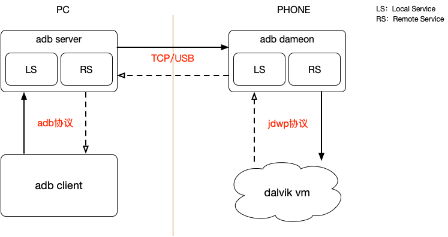
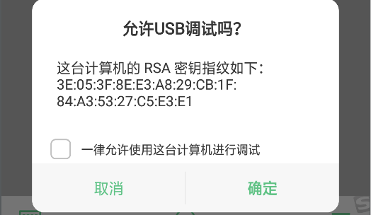
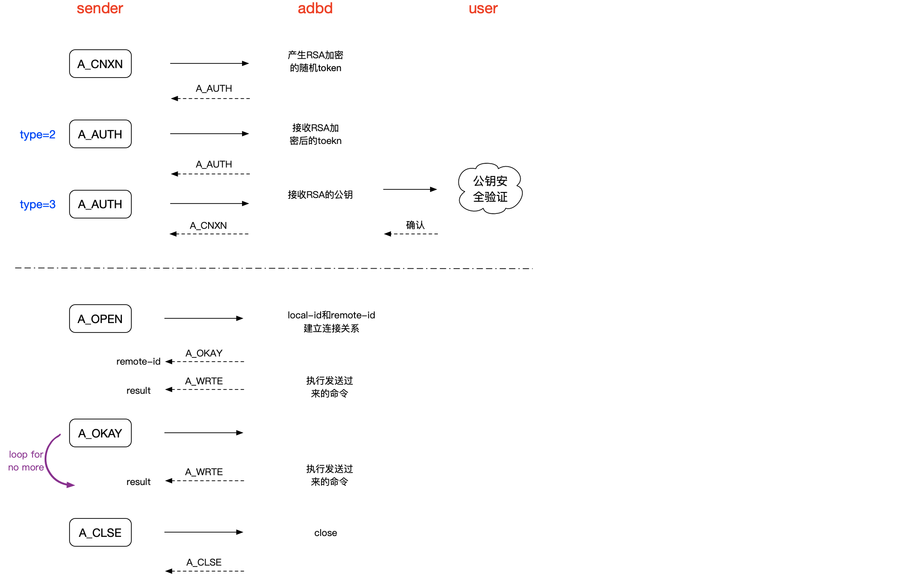

# ADB通信协议

## ADB的通信架构

ADB的通信架构会涉及到如下几个核心的模块：

* **adb server**
* **adb daemon(adbd)**
* **adb client**
* **DDMS**
* **JDWP**

### adb server

该模块是运行在电脑上的后台进程，进程名为adb，用于管理adb client与运行在手机上的adbd进程通信。

adb server会创建`local socket`和`remote socket`，前者用于和adb client同信，后者通过TCP/USB和adbd通信。

它主要是负责2件事情：

* 管理运行的设备，负责维持与adbd进程与自身的数据通道
* 实现PC和手机之间的通信

adb client可以通过`adb start-server`、`adb kill-server`来启动和终止与server之间的通信。

### adb daemon

该模块是运行在手机上的服务进程，其进程名为adbd，它主要负责：

* 用来连接手机和adb server
* 为手机提供adb服务
* adbd会创建`local socket`和`remote socket`，前者通过jdwp协议和dalvik vm进行通信，后者通过TCP/USB和adb server进行通信

### adb client

该模块是运行在电脑上的，一般是通过命令行运行adb命令开调用来触达adb client，如adb install等等命令。

其主要的职责是解析命令的参数，做必要的预处理，然后发送给adb server，然后adb server将该命令转发还给手机，由adbd进行处理，产生结果再由adbd和adb server传回结果。

在这个过程中，client首先会检查adb server是否在运行，没有运行的话需要启动adb server。

> 总结

他们之间的通信关系如下：



### DDMS

DDMS将IDE和手机设备之间建立起了一座桥梁，可以很方面的查看到目标机器上的信息。

### JDWP

jdwp，即java debug wire protocol，Java调试线协议，是一个为Java调试而设计的通讯交互协议，它定义了调试器和被调试程序之间传递的信息的格式。

通过jdwp，就能实现IDE和vm之间的通信，可以调试vm，获取VM的包括类、对象、线程等信息。因此它是java调试技术的基础，更多关于JDWP的内容参考：[JDWP 协议及实现](https://www.ibm.com/developerworks/cn/java/j-lo-jpda3/index.html?ca=drs-)和[Android虚拟机调试器原理与实现](http://www.droidsec.cn/android%E8%99%9A%E6%8B%9F%E6%9C%BA%E8%B0%83%E8%AF%95%E5%99%A8%E5%8E%9F%E7%90%86%E4%B8%8E%E5%AE%9E%E7%8E%B0/)

> 额外补充

adb server和设备之间的通信有USB和TCP方式，是这样区分的：

* USB：真实的物理设备
* TCP：模拟器或者真实的物理设备

在`system/core/adb/adb.c`源码中**(很老的版本了，新版本不确定是不是这样的，个人感觉逻辑上应该差不多吧)**：

```c
/* for the device, start the usb transport if the
 * android usb device exists and the "service.adb.tcp.port" and
 * "persist.adb.tcp.port" properties are not set.
 * Otherwise start the network transport.
 */
property_get("service.adb.tcp.port", value, "");
if (!value[0])
    property_get("persist.adb.tcp.port", value, "");
if (sscanf(value, "%d", &port) == 1 && port > 0) {
    // listen on TCP port specified by service.adb.tcp.port property
    local_init(port);
} else if (access("/dev/android_adb", F_OK) == 0) {
    // listen on USB
    usb_init();
} else {
    // listen on default port
    local_init(DEFAULT_ADB_LOCAL_TRANSPORT_PORT);
}
init_jdwp();
```

就是adbd启动的时候会先检查是否设置了`service.adb.tcp.port`，设置了则采用TCP方式连接；没设置就去看USB设备下的`/dev/android_adb`文件是否存在，有的话则采用USB方式，否则用缺省的TCP端口去连接。

## adb协议

android sdk采用C++实现了adb协议，从而可以通过命令行的方式去执行很多adb shell的命令。结合[protocol.txt文件](https://android.googlesource.com/platform/system/core/+/master/adb/protocol.txt)和[RemoteAdbShell](https://github.com/cgutman/RemoteAdbShell)来分析下adb协议。

协议的消息头结构体：

```c
struct message {
    unsigned command; 
    unsigned arg0;
    unsigned arg1;
    unsigned data_length;
    unsigned data_crc32;
    unsigned magic;
};
```

消息头是一个24字节的结构体，command指示出何种命令，arg0、arg1可以用来传递消息的补充信息，payloadLength是如果有payload数据的话，则指出数据的长度，checksum检查消息的合法性，magic是魔法数，它是由`command ^ 0xffffffff`计算而来。

关于合法性的校验如下：

```java
public static boolean validateMessage(AdbMessage msg)
{
	/* Magic is cmd ^ 0xFFFFFFFF */
	if (msg.command != (msg.magic ^ 0xFFFFFFFF))
		return false;
	
	if (msg.payloadLength != 0)
	{
		if (getPayloadChecksum(msg.payload) != msg.checksum)
			return false;
	}
	
	return true;
}
```

adb协议定义了6种通信的消息，如下。

### A_CNXN：connect

向adb_server发起建立连接的命令，它将产生的消息是：

```
message(A_CNXN, version, maxdata, "system-identity-string")
```

其中A_CNXN是固定的值：

```
#define A_CNXN 0x4e584e43
```

而version和maxdata是固定的值，在新版本中：

```
version=0x01000000 
maxdata=256*1024
```

而在老版本中：

```
version=0x01000000 
maxdata=4096
```

maxdata确保了通信的数据包不能超过给定的值，除非在CONNECT的过程中设备告诉adb server它支持的maxdata值。

`system-identity-string`是必须满足如下格式的：

```
<systemtype>:<serialno>:<banner>
```

* systemtype：类型，可以选择bootloader、device或host
* serialno：unique ID，可不填
* banner：human-readable version
or identifier string

**PS：测试下来，system-identity-string不填也是可以建立连接的**

### A_AUTH：authentication

A_AUTH消息是通知接收者需要和发送者进行身份的认证（RSA认证），它将产生的消息是：

```
message(A_AUTH, type, 0, "data")
```

其中A_AUTH是固定的值：

```
#define A_AUTH 0x48545541
```

* TOKEN：type=1，此时data数据是随机的，接收者将用私钥对其加密
* SIGNATURE：type=2，接收者回应包含已经加过密的data数据的AUTH通信包
* RSAPUBLICKEY：type=3，接收者回应包含data数据为对应公钥的AUTH通信包

此时手机屏幕上回弹出时候需要安装公钥的对话框：



一旦验证通过，则通信建立完成。

### A_OPEN：open

A_OPEN通知接受者，发送者有一个由local-id唯一标记的信息流，它希望能连接到由payload指定的位置。local-id一般设置为自增类型。

它将产生的消息是：

```
message(A_OPEN, local-id, remote-id, "")
```

其中A_OPEN是固定的值：

```
#define A_OPEN 0x4e45504f
```

通常可用的payload包括：

* **"tcp:\<host>:\<port>"** - host may be omitted to indicate localhost
* **"udp:\<host>:\<port>"** - host may be omitted to indicate localhost
* **"local-dgram:\<identifier>"**
* **"local-stream:\<identifier>"**
* **"shell"** - local shell service
* **"upload"** - service for pushing files across (like aproto's /sync)
* **"fs-bridge"** - FUSE protocol filesystem bridge

A\_OPEN消息会导致两种消息的A\_OKAY，指示连接已经建立；A\_CLSE，指示连接建立失败。A\_OPEN消息的发出也以为这A\_OKAY消息发出了。

### A_OKAY：ready

A_OKAY告知接收者，发送者的（通过local-id唯一标识）已经准备好写数据了，并且已经和自己（通过remote-id唯一标识）建立了连接。

它将产生的消息是：

```
message(A_OKAY, local-id, remote-id, "")
```

其中A_OKAY是固定的值：

```
#define A_OKAY 0x59414b4f
```

### A_CLSE：close

A_CLSE通知接收者，发送者和接受者的通信通道已经关闭。它将产生的消息是：

```
message(A_CLSE, local-id, remote-id, "")
```

其中A_CLSE是固定的值：

```
#define A_CLSE 0x45534c43
```

### A_WRTE：write

发送消息数据给到接收者，payload不能超过maxdata。它将产生的消息是：

```
message(A_WRTE, local-id, remote-id, "")
```

其中A_WRTE是固定的值：

```
#define A_WRTE 0x45545257
```

write消息是在ready消息收到后才能发出的，后面有新的write消息要发出的话，需要等待其他的ready消息收到后。

> 总结

完整的通信流可描述为：



## adb协议支持的命令

比如我们常用的的shell命令：

```
shell:command arg1 arg2 ...
```

更多命令具体参考[https://android.googlesource.com/platform/system/core/+/master/adb/SERVICES.TXT](https://android.googlesource.com/platform/system/core/+/master/adb/SERVICES.TXT)

## adb自定义协议使用场景

在APM系统中，采集CPU和内存消耗一般是通过读取系统文件。如CPU是读取：

```
/proc/stat
```

在8.0系统上，已经无法读取该文件了，这个时候通过adb自定义协议可以完成这个事情。只要发起这个命令：

```
shell:dumpsys cpuinfo | grep PACKAGE_NAME
```

## 参考资料

[https://android.googlesource.com/platform/system/core/+/master/adb/protocol.txt](https://android.googlesource.com/platform/system/core/+/master/adb/protocol.txt)
[https://android.googlesource.com/platform/system/core/+/master/adb/SERVICES.TXT](https://android.googlesource.com/platform/system/core/+/master/adb/SERVICES.TXT)
[https://juejin.im/post/5b7f837ef265da438151a05f#heading-15](https://juejin.im/post/5b7f837ef265da438151a05f#heading-15)