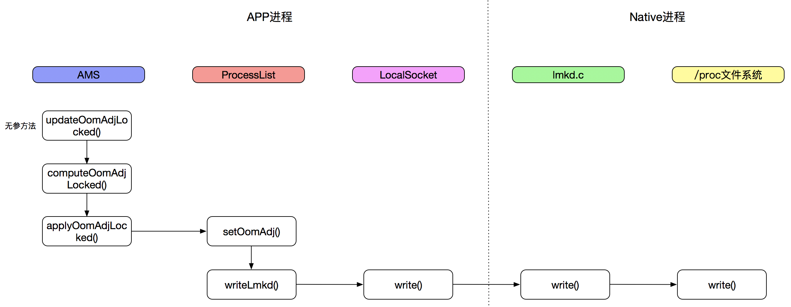
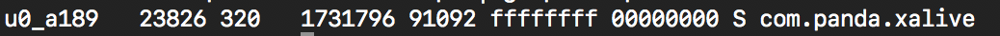
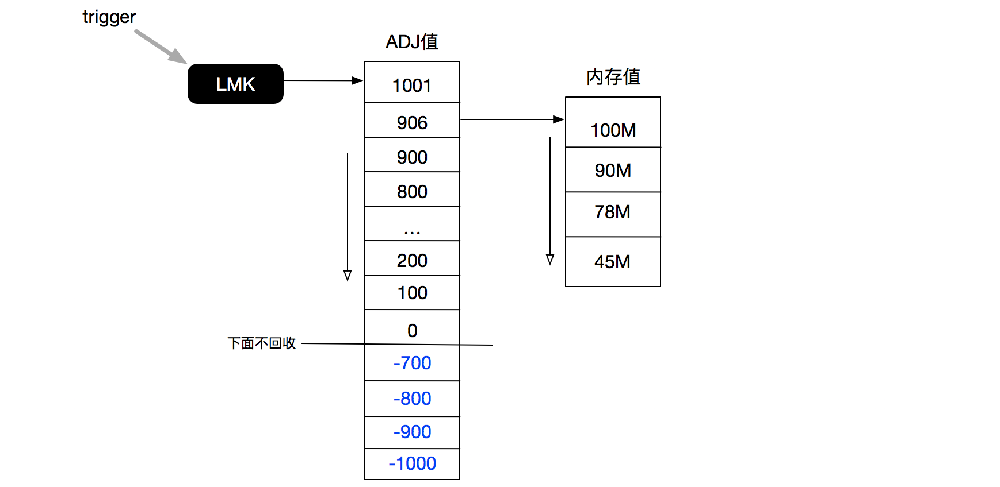

# APP的“死”与“活”

这篇文章主要介绍APP在安卓系统中是怎么被杀死的，按照怎样的一个策略去释放进程；同时介绍一些延长应用存活时间的方案，虽然这个在现在安卓系统上越来越难实现了，但是也是可以稍微了解下，主要也是通过这些hack的方案更好的了解安卓系统对进程的管理。

## 进程是怎么被杀死的？

我们知道，安卓系统里的所有APP都是被系统所托管的，也就是说，安卓系统负责APP进程的创建和回收。

进程创建很简单，就是在APP启动的时候，由Zygote进程fork出一个新的进程出来（注：系统服务system server也是由Zygote所创建），这个不是我们这边文章的重点，后面会有专门的文章来叙述。

进程的回收发生在如下几种情况：

* 进程Crash掉了
* 用户主动的退出（杀进程，不杀进程的app还是在系统中的，这样是为了能快速的再次启动~）
* **内存紧张，并且进程已经不在可见进程了**

前面2种是用户行为或APP本身问题导致的进程回收，而第3种是系统行为，也是我们做APP保活可以做的地方。在内存紧张时，由Low Memory Killer根据进程的优先级来按顺序的进行回收。

### Low Memory Killer（LMK)

Low Memory Killer是基于Linux的Out Of Memory Killer（OOMKiller）优化的一种内存回收机制，相对与OOMKiller，它发生的时机要稍微早一点。

> 为什么要有这样的改进？

一般的内存分配的逻辑是：程序向OS申请一段连续的内存空间，然后返回这段空间的起始地址。如果没有足够的空间可分配，则返回null回来，表示系统没有可分配的内存。

Linux的内存分配则更加的积极：**它假设应用申请了内存空间后并不会立即去使用它，所以允许超剩余内存的申请，当应用真的需要使用它的时候，操作系统可能已经通过回收了其他应用的内存空间而变得有能力去满足这个应用的需求，简单的说，就是允许应用申请比实际可分配空间（包括物理内存和Swap）更多的内存，这个特性称为OverCommit。**

如果申请的内存在需要使用的时候还没有被释放掉，那么就会触发OOM Killer，直接干掉这个进程，这个可能不是用户想要得到的结果。而LMK则将内存回收的时间提前，选择杀死那么优先级最低的进程来释放内存，同时设置了不同的内存大小触发时机，这样更加的灵活。

> LMK的执行原理

安卓内核会每隔一段时间会检查当前系统的空闲内存是否低于某个预置，如果是，则按照oom_adj的值按照从大到小的顺序杀死进程，直到释放的内存足够。

所以这里有2个最直接相关的值：

* **内存阈值**
* **oom_adj值**

> 1、LMK之内存阈值

LMK是个多层次的内存回收器，它会根据内存的不同的阈值进行内存的回收，而具体的内存的的阈值是写在系统文件里的，位置在**`/sys/module/lowmemorykiller/parameters/minfree`**（必须在root下查看）：


上面数字的单位是页（page），1page=4KB。内存阈值在不同的手机上时不一样的，那么这个值是怎么来确定的呢？这个可以看下`ProcessList`的代码：

```java
private void updateOomLevels(int displayWidth, int displayHeight, boolean write) {
    // Scale buckets from avail memory: at 300MB we use the lowest values to
    // 700MB or more for the top values.
    float scaleMem = ((float)(mTotalMemMb-350))/(700-350);

    // Scale buckets from screen size.
    int minSize = 480*800;  //  384000
    int maxSize = 1280*800; // 1024000  230400 870400  .264
    float scaleDisp = ((float)(displayWidth*displayHeight)-minSize)/(maxSize-minSize);
    if (false) {
        Slog.i("XXXXXX", "scaleMem=" + scaleMem);
        Slog.i("XXXXXX", "scaleDisp=" + scaleDisp + " dw=" + displayWidth
                + " dh=" + displayHeight);
    }

    float scale = scaleMem > scaleDisp ? scaleMem : scaleDisp;
    if (scale < 0) scale = 0;
    else if (scale > 1) scale = 1;
    int minfree_adj = Resources.getSystem().getInteger(
            com.android.internal.R.integer.config_lowMemoryKillerMinFreeKbytesAdjust);
    int minfree_abs = Resources.getSystem().getInteger(
            com.android.internal.R.integer.config_lowMemoryKillerMinFreeKbytesAbsolute);
    if (false) {
        Slog.i("XXXXXX", "minfree_adj=" + minfree_adj + " minfree_abs=" + minfree_abs);
    }

    final boolean is64bit = Build.SUPPORTED_64_BIT_ABIS.length > 0;

    for (int i=0; i<mOomAdj.length; i++) {
        int low = mOomMinFreeLow[i];
        int high = mOomMinFreeHigh[i];
        if (is64bit) {
            // Increase the high min-free levels for cached processes for 64-bit
            if (i == 4) high = (high*3)/2;
            else if (i == 5) high = (high*7)/4;
        }
        mOomMinFree[i] = (int)(low + ((high-low)*scale));
    }

    if (minfree_abs >= 0) {
        for (int i=0; i<mOomAdj.length; i++) {
            mOomMinFree[i] = (int)((float)minfree_abs * mOomMinFree[i]
                    / mOomMinFree[mOomAdj.length - 1]);
        }
    }

    if (minfree_adj != 0) {
        for (int i=0; i<mOomAdj.length; i++) {
            mOomMinFree[i] += (int)((float)minfree_adj * mOomMinFree[i]
                    / mOomMinFree[mOomAdj.length - 1]);
            if (mOomMinFree[i] < 0) {
                mOomMinFree[i] = 0;
            }
        }
    }

    // The maximum size we will restore a process from cached to background, when under
    // memory duress, is 1/3 the size we have reserved for kernel caches and other overhead
    // before killing background processes.
    mCachedRestoreLevel = (getMemLevel(ProcessList.CACHED_APP_MAX_ADJ)/1024) / 3;

    // Ask the kernel to try to keep enough memory free to allocate 3 full
    // screen 32bpp buffers without entering direct reclaim.
    int reserve = displayWidth * displayHeight * 4 * 3 / 1024;
    int reserve_adj = Resources.getSystem().getInteger(com.android.internal.R.integer.config_extraFreeKbytesAdjust);
    int reserve_abs = Resources.getSystem().getInteger(com.android.internal.R.integer.config_extraFreeKbytesAbsolute);

    if (reserve_abs >= 0) {
        reserve = reserve_abs;
    }

    if (reserve_adj != 0) {
        reserve += reserve_adj;
        if (reserve < 0) {
            reserve = 0;
        }
    }

    if (write) {
        ByteBuffer buf = ByteBuffer.allocate(4 * (2*mOomAdj.length + 1));
        buf.putInt(LMK_TARGET);
        for (int i=0; i<mOomAdj.length; i++) {
            buf.putInt((mOomMinFree[i]*1024)/PAGE_SIZE);
            buf.putInt(mOomAdj[i]);
        }

        writeLmkd(buf);
        SystemProperties.set("sys.sysctl.extra_free_kbytes", Integer.toString(reserve));
    }
    // GB: 2048,3072,4096,6144,7168,8192
    // HC: 8192,10240,12288,14336,16384,20480
}
```

上面的代码主要做了如下几件事情：

1. 根据手机的内存值，计算一个内存的比例值scaleMem（具体意义不明白~~）
2. 根据传入的window的displayWidth/displayHeight，计算一个视图的比例值scaleDisp
3. 在scaleMem和scaleDisp中选择最大的一个
4. 计算内存阈值，这里会经过3个步骤的计算（具体略）
5. 传给LMKD守护进程（**进程间通信采用了socket方式**），并且写入到minfree文件里

**这个方法是在什么时候触发的呢？**

`updateOomLevels()`是在AMS的`updateConfiguration()`方法里调用的，也就是说在设备配置变化的时候就会触发。

**为什么是6个值？**

这个就是安卓系统做的分层次回收，它定义了6个层级的回收阈值，分别对应到了不同的进程状态。

具体的定义：

```java
private final int[] mOomAdj = new int[] {
        FOREGROUND_APP_ADJ, 
        VISIBLE_APP_ADJ, 
        PERCEPTIBLE_APP_ADJ,
        BACKUP_APP_ADJ, 
        CACHED_APP_MIN_ADJ, 
        CACHED_APP_MAX_ADJ
};
```

* `FOREGROUND_APP_ADJ`：前台进程
 * 该进程拥有一个正在和用户交互的activity
 * 该进程拥有一个service，该service与用户正在交互的Activity绑定
 * 该进程拥有一个service，该service通过startForeground()称为了前台服务
 * 某个进程拥有一个BroadcastReceiver，并且该BroadcastReceiver正在执行其onReceive()方法
* `VISIBLE_APP_ADJ`：可见进程
 * 该进程拥有不在前台但是用户任可见的activity（比如支付时拉起的第三方支付浮窗）
 * 该进程拥有绑定到可见或前台activity的service 
* `PERCEPTIBLE_APP_ADJ`：可感知进程
 * 播放音乐进程
 * 计步进程
* `BACKUP_APP_ADJ`：备份进程
 * 做备份操作的进程
* `CACHED_APP_MIN_ADJ`：不可见进程最小adj值    
* `CACHED_APP_MAX_ADJ`：不可见进程最大adj值

这6个adj值被写入到了**`/sys/module/lowmemorykiller/parameters/adj`**里（root手机可以查看），android 7.0之前这些值都是各位数的，android 7.0之后，这些值都被重新赋值了，adj值越大优先级越低。一般以0作为系统进程和应用进程的分界线，小于0的是系统进程，LMK一般不会回收。

> 2、oom_adj值

每个应用进程的adj值是怎么计算和存储的呢？

核心方法（都在AMS里）：

* updateOomAdjLocked()：触发更新adj
* computeOomAdjLocked()：计算当前进程的adj值
* applyOomAdjLocked()：应用adj值

更为详细的关于何时触发更新？怎么计算的？请参考文章[Android进程调度之adj算法](http://gityuan.com/2016/08/07/android-adj/)。

总结下来，可以用一张流程图表示：



我们看下**`oom_adj`值**和**`oom_score_adj`值**。`oom_adj`是指示出当前进程是属于哪一类的进程，这个值在`computeOomAdjLocked()`里会计算出来；`oom_score_adj`这个是当前进程的所打的一个分数（具体怎么打分的不清楚，但是不同进程同一`oom_adj`值，`oom_score_adj`是一样的）

他们也是写入到文件里的，具体在`/proc/<pid>/`下：

* `/proc/<pid>/oom_adj`
* `/proc/<pid>/oom_score_adj`

如何找到一个APP进程的pid值呢？

```shell
adb shell ps | grep <包名/进程名>
```



第二个数字23826就是当前进程的pid值。

> 3、总结&示例说明

安卓系统每隔一段时间（具体不清楚~）会检查下当前内存的空闲情况，看看是否存在低于minfree列表中的某个阈值。

我们假设有这么个表格：

|  | | | | | | |
| ------ | ------ | ------ | ------ | ------ | ------ | ------ |
| **oom_adj** | 0 | 100 | 200 | 300 | 900 | 906 |
| **oom\_score\_adj** | 0 | 69 | 117 | 190 | 529 | 1000 |
| **minfree** | 12288 | 18432 | 24576 | 36864 | 43008 | 49152

如果剩余内存少于24576（约98M），那么安卓系统就会找出当前在/proc下`oom_adj`的值大于等于2进程，按照`oom_adj`的值大小逆序排列；然后LMK会从最大的`oom_adj`的值的进程开始kill，释放他们的内存，直到内存的阈值超过了24576；如果有`oom_adj`的值相等的进程，则优先kill占用内存大的进程。

整个过程描述：



### 进程与进程优先级

在Android中，应用进程划分5级：

* 前台进程(Foreground process)
* 可见进程(Visible process)
* 服务进程(Service process)
* 后台进程(Background process)
* 空进程(Empty process)
 * 不含任何活动应用组件的进程。保留这种进程的的唯一目的是用作缓存，以缩短下次在其中运行组件所需的启动时间，这就是所谓热启动。为了使系统资源在进程缓存和底层内核缓存之间保持平衡，系统往往会终止这些进程。

根据进程中当前活动组件的重要程度，Android会对进程的优先级进行评定，这个可以在`ProcessList.java`里可以看到，具体为（基于android 8.0）：

| adj | adj值 | 解释 | 
| ------ | ------ | ------ |
| UNKNOWN_ADJ | 1001 | 无法确定的进程，一般发生在缓存的时候 |
| CACHED\_APP\_MAX\_ADJ | 906 | 空进程，最大adj值 |
| CACHED\_APP\_MIN\_ADJ | 900 | 空进程，最小adj值 |
| SERVICE\_B\_ADJ | 800 | 不活跃进程 |
| PREVIOUS\_APP\_ADJ | 700 | 上一次交互的进程，比如对个应用切换 |
| HOME\_APP\_ADJ | 600 | Launcher进程，尽量不要kill它 |
| SERVICE_ADJJ | 500 | 程序里的service进程 |
| HEAVY\_WEIGHT\_APP\_ADJ | 400 | 重型进程，一般运行在后台，尽量不要kill它 |
| BACKUP\_APP\_ADJ | 300 | 备份进程 |
| PERCEPTIBLE\_APP\_ADJ | 200 | 可感知进程 |
| VISIBLE\_APP\_ADJ | 100 | 可见进程 |
| FOREGROUND\_APP\_ADJ | 0 | 前台进程 |
| PERSISTENT\_SERVICE\_ADJ | -700 | 系统进程，或持续存在进程附着的服务进程 |
| PERSISTENT\_PROC\_ADJ | -800 | 系统持续性进程，如电话 |
| SYSTEM\_ADJ | -900 | system进程 |
| NATIVE\_ADJ | -1000 | native进程，不属于JVM内存处理范围 |

## 如何让APP活的久一点？

让app活的久一点，可以从两个方面来优化：

1. **尽量保证不被系统杀死**
2. **能够自我复活**

### 如何保证不被杀？

核心就是**提高adj的值**，让系统觉得不能杀。最厉害的就是将自己的应用弄成系统应用，但是这个不在技术讨论的范畴。

> 1、进程拆分

内存的大小也是系统杀死进程的一个考量，所以通过进程拆分来来减少整个app的内存大小。如webview单进程，push模块单进程。

> 2、onTrimeMemory的回调

`OnTrimMemory()`也是从内存的角度来保活的方案，通过对自我的瘦身来降低内存，降低被后台杀死的风险。我们知道，`OnTrimMemory()`可以做到不同级别额裁剪，这个就给上层更合理的去做裁剪。

> 3、开启前台Service

前台service可以提高应用的adj值，降低被系统回收的概率。

操作就是：在应用启动的时候，启动service，并通过使用`startForeground()`将当前service设置为前台service来提高优先级。这里需要注意android系统的不同版本对于开启前台服务的控制：

* API < 18：直接startForeground()即可
* API >= 18：startForeground()必须给用户一个可见的notification
* API >= 26：在Android8.0之后, google对后台启动service进行了更加严格的限制，但是还是可以通过`ContextCompat.startForegroundService()`创建前台服务

对于会出现可见notification的情况，可以专门开启一个服务去关闭它。

示例：

```java
public class CancelNoticeService extends Service {
    private Handler handler;

    @Override
    public IBinder onBind(Intent intent) {
        return null;
    }

    @Override
    public void onCreate() {
        super.onCreate();
        handler = new Handler();
        Notification.Builder builder = new Notification.Builder(this);
        builder.setSmallIcon(R.mipmap.ic_launcher);
        startForeground(ForegroundService.NOTICE_ID,builder.build());
        handler.postDelayed(new Runnable() {
            @Override
            public void run() {
                stopForeground(true);
                NotificationManager manager = (NotificationManager)getSystemService(NOTIFICATION_SERVICE);
                manager.cancel(ForegroundService.NOTICE_ID);
                stopSelf();
            }
        }, 300);
    }
}
```

> 4、1像素Activity

这个主要是在锁屏后的保活，通过在锁屏后（app已经被退到后台）打开一个1像素的Activity。

```java
public class SinglePixelActivity extends AppCompatActivity {
    @Override
    protected void onCreate(@Nullable Bundle savedInstanceState) {
        super.onCreate(savedInstanceState);
        Window mWindow = getWindow();
        mWindow.setGravity(Gravity.LEFT | Gravity.TOP);
        WindowManager.LayoutParams params = mWindow.getAttributes();
        params.x = 0;
        params.y = 0;
        params.height = 1;
        params.width = 1;
        mWindow.setAttributes(params);
        SinglePixelManager.instance().setSingleActivity(this);
    }
}
```

这里是不是1像素不重要，因为屏幕开启后，会关闭这个Activity。并且不能一直让这个1像素一直占住屏幕，因为会导致Launcher无法点击。

> 5、循环播放无声音频

这个就是比较极端的一种方式了，可能会带来耗电方面的损耗。同时，在某些手机上，用户是知道你在播放的，如下图：


可以看到播放的波浪，这个效果很好，在某些手机上连一键清理都无法清理掉，但是在产品中使用还是得慎重。

### 如何复活？

防止app不会系统回收可以做的方案比较少，而且随着安卓系统的升级，对这方面的控制越来越严格。

那么我们还可以从复活的角度来思考app存活的问题。随着系统的升级，复活的可能性也是越来越低，下面大致说一下可以尝试的方式（其实很多也没啥卵用~）：

> 1、START_STICKY

如果service进程被kill掉，保留service的状态为开始状态，但不保留启动时候传来的intent对象。随后系统会尝试重新创建service，由于服务状态为开始状态，所以创建服务后一定会调用onStartCommand(Intent,int,int)方法。如果在此期间没有任何启动命令被传递到service，那么参数Intent将为null。

**这个主要是针对系统资源不足而导致的服务被关闭。其他情况下的app杀死是没啥效果的。**

> 2、JobScheduler

JobScheduler是Android 5.0引入的允许在将来的某个时刻在达到预先定义的条件的情况下执行指定的任务的API。通常情况下，即使APP被系统停止，预定的任务仍然会被执行。

JobScheduler工作原理：

首先在一个实现了JobService的子类的onStartJob方法中执行这项任务，使用JobInfo的Builder方法来设定条件并和实现了JobService的子类的组件名绑定，然后调用系统服务JobScheduler的schedule方法。这样，即便在执行任务之前应用程序进程被杀，也不会导致任务不会执行，因为系统服务JobScheduler会使用bindServiceAsUser的方法把实现了JobService的子类服务启动起来，并执行它的onStartJob方法。

JobScheduler只有在5.0以上才能使用，对于5.0以下的怎么办呢？可以参考[https://github.com/evant/JobSchedulerCompat](https://github.com/evant/JobSchedulerCompat) （这个项目作者已经很久不维护了，但是可以在它的基础上去做完善和修改，同时也可以作为我们了解安卓CS架构的一个好的实例）

> 3、安卓账号自同步

利用Android系统提供的账号和同步机制实现。安卓会定期唤醒账户更新服务，我们可以自己设定同步的事件间隔，且发起更新的是系统，不会受到任何限制。

关于安卓账号详细介绍请移步[https://developer.android.com/training/sync-adapters/](https://developer.android.com/training/sync-adapters/)

该方法局限性还是很大的，用户会发现莫名出现一个账户，并且同步是必须联网的。

> 4、网络连接保活

*  GCM
* 公共的第三方push通道(信鸽等)
* 自身跟服务器通过轮询，或者长连接

更多的细节可以参考微信团队分享的网络保活的方案[http://www.52im.net/thread-209-1-1.html](http://www.52im.net/thread-209-1-1.html)。

> 5、系统广播

这个意义也不太大了。

## 参考文献

[http://www.52im.net/thread-1135-1-1.html](http://www.52im.net/thread-1135-1-1.html)

[http://www.52im.net/thread-210-1-1.html](http://www.52im.net/thread-210-1-1.html)

[https://github.com/Marswin/MarsDaemon](https://github.com/Marswin/MarsDaemon)

[https://juejin.im/entry/5b22663df265da59bf79f25b/](https://juejin.im/entry/5b22663df265da59bf79f25b/)

[http://skyseraph.com/2016/06/19/Android/%E4%B8%80%E7%A7%8D%E6%8F%90%E9%AB%98Android%E5%BA%94%E7%94%A8%E8%BF%9B%E7%A8%8B%E5%AD%98%E6%B4%BB%E7%8E%87%E6%96%B0%E6%96%B9%E6%B3%95/#%E5%AE%88%E6%8A%A4%E8%BF%9B%E7%A8%8B-%E8%BF%9B%E7%A8%8B%E4%BA%92%E6%8B%89](http://skyseraph.com/2016/06/19/Android/%E4%B8%80%E7%A7%8D%E6%8F%90%E9%AB%98Android%E5%BA%94%E7%94%A8%E8%BF%9B%E7%A8%8B%E5%AD%98%E6%B4%BB%E7%8E%87%E6%96%B0%E6%96%B9%E6%B3%95/#%E5%AE%88%E6%8A%A4%E8%BF%9B%E7%A8%8B-%E8%BF%9B%E7%A8%8B%E4%BA%92%E6%8B%89)

[https://juejin.im/post/58cf80abb123db3f6b45525d](https://juejin.im/post/58cf80abb123db3f6b45525d)
