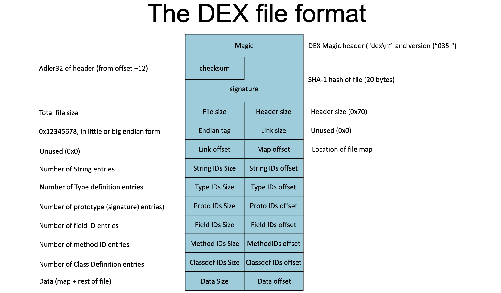
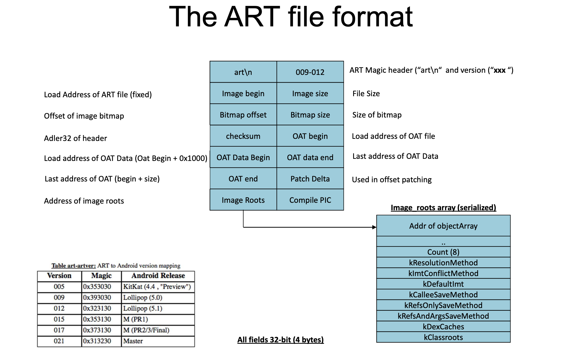
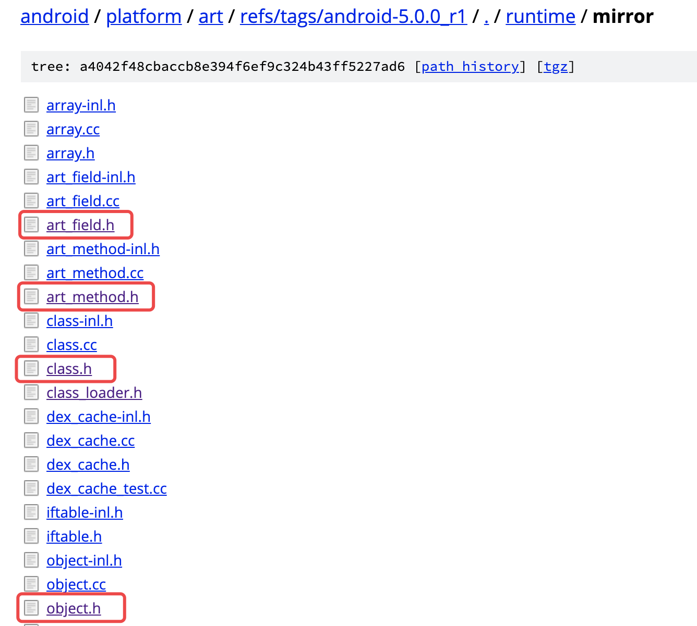
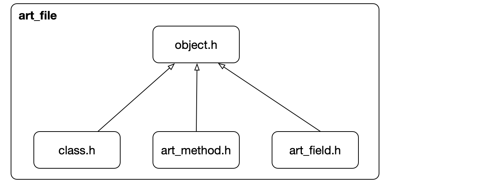
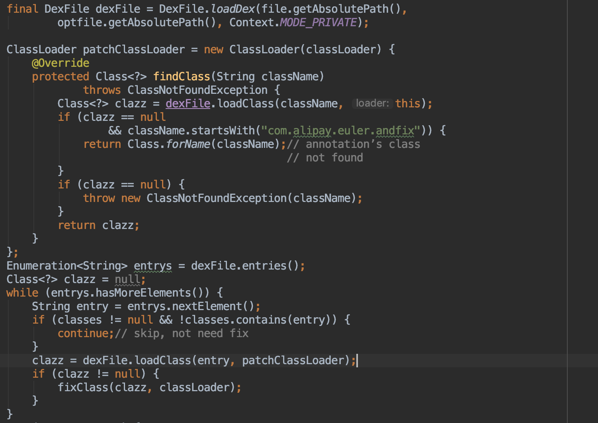

# AndFix源码阅读随笔

## AndFix之Dalvik



详细的定义进入源码`/vm/oo/Object.h`（android 4.4），地址：[https://android.googlesource.com/platform/dalvik/+/refs/tags/android-4.4_r1/vm/oo/Object.h](https://android.googlesource.com/platform/dalvik/+/refs/tags/android-4.4_r1/vm/oo/Object.h)

我们关心的是Method的定义：

```c
struct Method {
    /* the class we are a part of */
    ClassObject*    clazz;
    /* access flags; low 16 bits are defined by spec (could be u2?) */
    u4              accessFlags;
    /*
     * For concrete virtual methods, this is the offset of the method
     * in "vtable".
     *
     * For abstract methods in an interface class, this is the offset
     * of the method in "iftable[n]->methodIndexArray".
     */
    u2             methodIndex;
    /*
     * Method bounds; not needed for an abstract method.
     *
     * For a native method, we compute the size of the argument list, and
     * set "insSize" and "registerSize" equal to it.
     */
    u2              registersSize;  /* ins + locals */
    u2              outsSize;
    u2              insSize;
    /* method name, e.g. "<init>" or "eatLunch" */
    const char*     name;
    /*
     * Method prototype descriptor string (return and argument types).
     *
     * TODO: This currently must specify the DexFile as well as the proto_ids
     * index, because generated Proxy classes don't have a DexFile.  We can
     * remove the DexFile* and reduce the size of this struct if we generate
     * a DEX for proxies.
     */
    DexProto        prototype;
    /* short-form method descriptor string */
    const char*     shorty;
    /*
     * The remaining items are not used for abstract or native methods.
     * (JNI is currently hijacking "insns" as a function pointer, set
     * after the first call.  For internal-native this stays null.)
     */
    /* the actual code */
    const u2*       insns;          /* instructions, in memory-mapped .dex */
    /* JNI: cached argument and return-type hints */
    int             jniArgInfo;
    /*
     * JNI: native method ptr; could be actual function or a JNI bridge.  We
     * don't currently discriminate between DalvikBridgeFunc and
     * DalvikNativeFunc; the former takes an argument superset (i.e. two
     * extra args) which will be ignored.  If necessary we can use
     * insns==NULL to detect JNI bridge vs. internal native.
     */
    DalvikBridgeFunc nativeFunc;
    /*
     * JNI: true if this static non-synchronized native method (that has no
     * reference arguments) needs a JNIEnv* and jclass/jobject. Libcore
     * uses this.
     */
    bool fastJni;
    /*
     * JNI: true if this method has no reference arguments. This lets the JNI
     * bridge avoid scanning the shorty for direct pointers that need to be
     * converted to local references.
     *
     * TODO: replace this with a list of indexes of the reference arguments.
     */
    bool noRef;
    /*
     * JNI: true if we should log entry and exit. This is the only way
     * developers can log the local references that are passed into their code.
     * Used for debugging JNI problems in third-party code.
     */
    bool shouldTrace;
    /*
     * Register map data, if available.  This will point into the DEX file
     * if the data was computed during pre-verification, or into the
     * linear alloc area if not.
     */
    const RegisterMap* registerMap;
    /* set if method was called during method profiling */
    bool            inProfile;
};
```

### Dalvik的初始化

Dalvik虚拟机功能是通过进程内的`libdvm.so`动态库来提供的，通过获取库里的函数的指针，就能直接操作Dalvik虚拟机完成自己要做的事情。

想要获得这些函数的指针其实很简单，只需要先调用`dlopen`获得libdvm.so动态库的句柄，然后再调用`dlsym`同时传输想要找的函数或全局变量的名字（这个名字必须要出现在libdvm.so动态库的符号表中）。

看AndFix的这段代码：

```c
extern jboolean __attribute__ ((visibility ("hidden"))) dalvik_setup(
		JNIEnv* env, int apilevel) {
	void* dvm_hand = dlopen("libdvm.so", RTLD_NOW);
	if (dvm_hand) {
		dvmDecodeIndirectRef_fnPtr = dvm_dlsym(dvm_hand, apilevel > 10 ? "_Z20dvmDecodeIndirectRefP6ThreadP8_jobject" : "dvmDecodeIndirectRef");
		if (!dvmDecodeIndirectRef_fnPtr) {
			return JNI_FALSE;
		}
		dvmThreadSelf_fnPtr = dvm_dlsym(dvm_hand, apilevel > 10 ? "_Z13dvmThreadSelfv" : "dvmThreadSelf");
		if (!dvmThreadSelf_fnPtr) {
			return JNI_FALSE;
		}
		jclass clazz = env->FindClass("java/lang/reflect/Method");
		jClassMethod = env->GetMethodID(clazz, "getDeclaringClass", "()Ljava/lang/Class;");

		return JNI_TRUE;
	} else {
		return JNI_FALSE;
	}
}

typedef Object* (*dvmDecodeIndirectRef_func)(void* self, jobject jobj);
typedef void* (*dvmThreadSelf_func)();

dvmDecodeIndirectRef_func dvmDecodeIndirectRef_fnPtr;
dvmThreadSelf_func dvmThreadSelf_fnPtr;

jmethodID jClassMethod;
```

#### 知识点1：typedef的函数体声明

上面的`dvmDecodeIndirectRef_func`和`dvmThreadSelf_func`都是typedef的函数体声明，举个例子说明：

```c
#include <iostream>
using namespace std;

typedef int (*func)(char);

int GetChar(char a)
{
    cout<<a<<endl;
    return 0;
} 
int main()
{
   func f1;
   f1 = GetChar;
   f1('o');
   return 0;
}
```

#### 知识点2：Name Mangling机制

上面dvm_dlsym传入的函数名都很奇怪，这是啥意思呢？

C++是支持函数重载的，还有命名空间，并且不同类中可以定义同名的函数，如果函数最终编译之后的名字都是原来的函数名的话，那么将造成严重的名字冲突问题，例如同名函数的重载、不同命名空间内或不同类中的同名函数等，这些都会造成函数重名。那怎么解决这个问题呢，C++中引入了符号改编（Name Mangling）机制，即编译之后的真实函数名除了本来的函数名外，还加入了例如命名空间名字、类名字以及函数参数类型的缩略名等信息。

如上面的`_Z20dvmDecodeIndirectRefP6ThreadP8_jobject`：

* `_Z`：说明这是一个全局函数
* `20`：函数名实际的名称20个字符
* `dvmDecodeIndirectRef`：函数名实际的名称
* `P6ThreadP8_jobject`：函数参数，2个一维数组

更为具体的介绍参考：[https://blog.csdn.net/roland_sun/article/details/43233565](https://blog.csdn.net/roland_sun/article/details/43233565)

### dalvik修复

```c
extern void __attribute__ ((visibility ("hidden"))) dalvik_replaceMethod(
		JNIEnv* env, jobject src, jobject dest) {
	jobject clazz = env->CallObjectMethod(dest, jClassMethod);
	ClassObject* clz = (ClassObject*) dvmDecodeIndirectRef_fnPtr(
			dvmThreadSelf_fnPtr(), clazz);
	clz->status = CLASS_INITIALIZED;

	Method* meth = (Method*) env->FromReflectedMethod(src);
	Method* target = (Method*) env->FromReflectedMethod(dest);
	LOGD("dalvikMethod: %s", meth->name);

	meth->clazz = target->clazz;
	meth->accessFlags |= ACC_PUBLIC;
	meth->methodIndex = target->methodIndex;
	meth->jniArgInfo = target->jniArgInfo;
	meth->registersSize = target->registersSize;
	meth->outsSize = target->outsSize;
	meth->insSize = target->insSize;

	meth->prototype = target->prototype;
	meth->insns = target->insns;
	meth->nativeFunc = target->nativeFunc;
}
```

修复的过程其实就是将源class的method里的属性值都替换成目标class的method里的属性值。

## AndFix之Art



art的文件格式每个版本都有不同，我们以5.0为基础来看下字段的定义，源码定义在：




他们的关系是：



### art修复

art的修复和dalvik的差不多，都是将源class的method里的属性值都替换成目标class的method里的属性值。

```c
extern void __attribute__ ((visibility ("hidden"))) art_replaceMethod(
		JNIEnv* env, jobject src, jobject dest) {
    if (apilevel > 23) {
        replace_7_0(env, src, dest);
    } else if (apilevel > 22) {
		replace_6_0(env, src, dest);
	} else if (apilevel > 21) {
		replace_5_1(env, src, dest);
	} else if (apilevel > 19) {
		replace_5_0(env, src, dest);
    }else{
        replace_4_4(env, src, dest);
    }
}
```

### art的内存分配和回收

> 内存分配

ART的分配有2种方式：

* **DLMalloc**：传统的lic分配器
 * 详细介绍：[http://g.oswego.edu/dl/html/malloc.html](http://g.oswego.edu/dl/html/malloc.html)
 * 多线程没有做优化，只是用了一个通用的lock
 * 线程冲突的解决方法是GC
* **ROSalloc**：Runs-of-Slots-Allocator 
 * art/runtime/gc/allocator/rosalloc.h
 * Supports"Bulk Free"
 * 在申请小的对象时可以使用`thread-local-storage region`
 * 大的对象可以分开独立锁住

> 内存回收

art使用2种GC：

* The Foreground collector
* The Background collector

大致的GC算法有：

* Mark/Sweep
* Concurrent Mark/Sweep
* Semi-Space, Mark/Sweep
* Generation Semi-Space
* Mark Compact Collector
* Heap Trimming Collector
* Concurrent Copying Collector
* Homogenous Space Compactor

## 加载dex的方式

上面我们看到了andfix修复dex的整个逻辑，那么dex是如何装载的呢？有2种方式：

* java层装载
* native层装载

### java层装载

**这是AndFix所采用的方式。**

我们可以用最简单的方式加载，就是用DexClassLoader：

```java
val dexClassLoader = DexClassLoader(internalPath,cacheFile.absolutePath,null,classLoader)
val clazz = dexClassLoader.loadClass("com.test.A")
val impl = clazz.newInstance()
```

AndFix直接采用DexFile进行加载：


### native层装载

参考：[https://github.com/crmulliner/ddi](https://github.com/crmulliner/ddi)，基于dalvik的，暂时没有基于art的。

```c
int dexstuff_loaddex(struct dexstuff_t *d, char *path)
{
	jvalue pResult;
	jint result;
	
	log("dexstuff_loaddex, path = 0x%x\n", path)
	void *jpath = d->dvmStringFromCStr_fnPtr(path, strlen(path), ALLOC_DEFAULT);
	u4 args[2] = { (u4)jpath, (u4)NULL };
	
	d->dvm_dalvik_system_DexFile[0].fnPtr(args, &pResult);
	result = (jint) pResult.l;
	log("cookie = 0x%x\n", pResult.l)

	return result;
}
```

当然这种native的方式比较复杂，不推荐使用。**其实DexFile的内部也是这个逻辑，java层只是个API，最后会调到`dalvik_system_DexFile.cpp`去完成真正的加载。**

## AndFix的缺陷

兼容性查，热更的覆盖率有限，新的安卓系统发布都需要去适配。**根本原因就是是native的替换是字段级别的替换**。所以现在已经不再使用。

## 参考文章

[https://blog.csdn.net/Roland_Sun/article/details/38640297](https://blog.csdn.net/Roland_Sun/article/details/38640297)

[https://android.googlesource.com/platform/dalvik/+/donut-release/vm/native/InternalNativePriv.h](https://android.googlesource.com/platform/dalvik/+/donut-release/vm/native/InternalNativePriv.h)

[https://www.jianshu.com/p/67081d9b0a9c](https://www.jianshu.com/p/67081d9b0a9c)