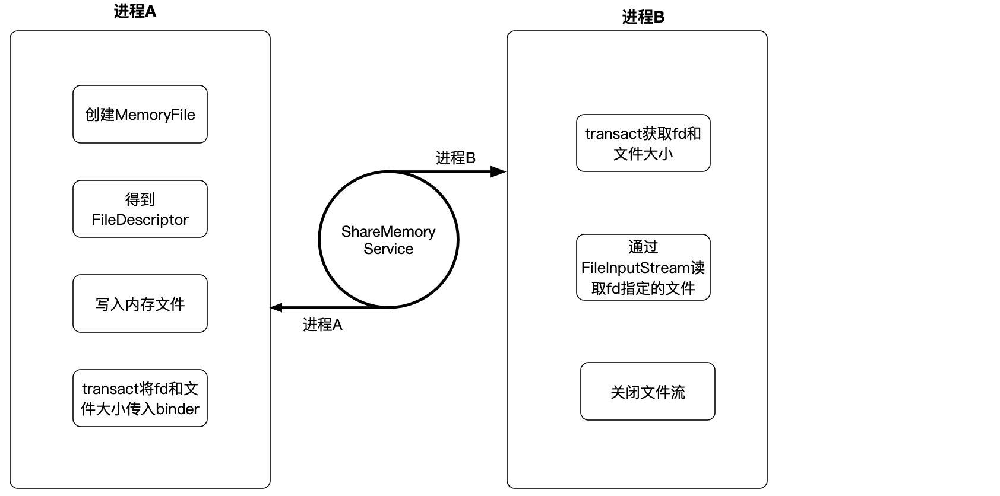
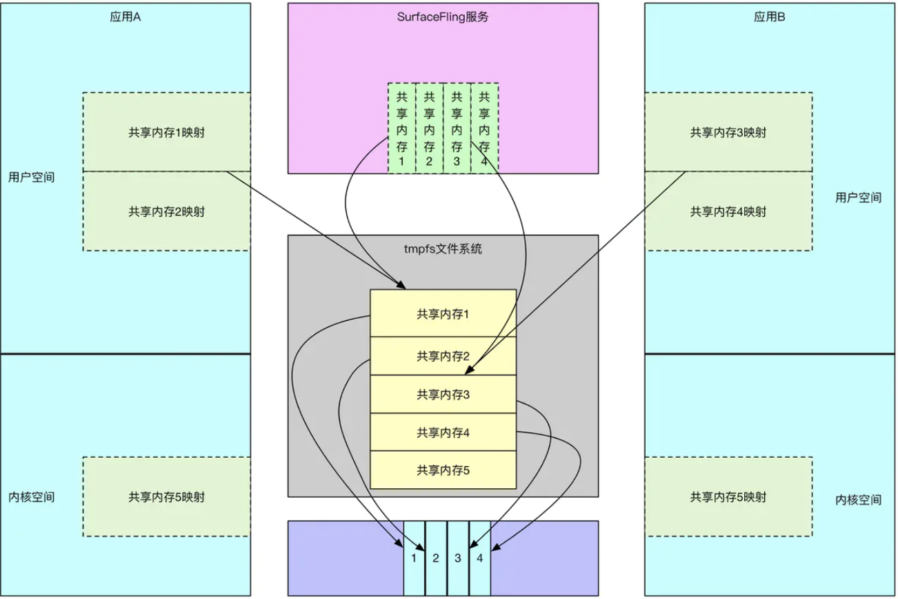
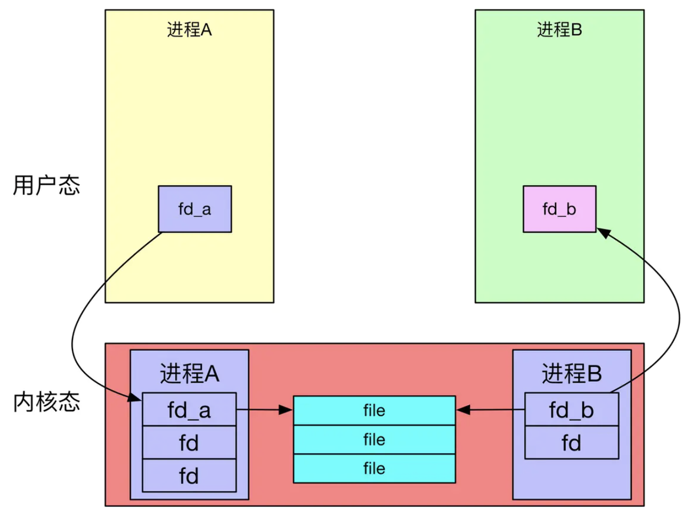
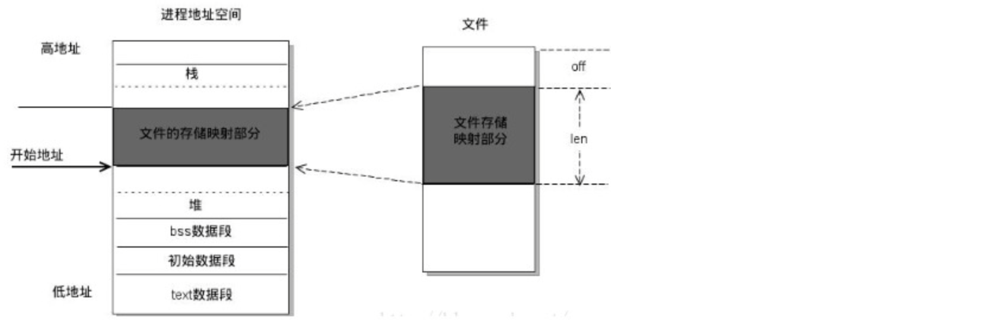
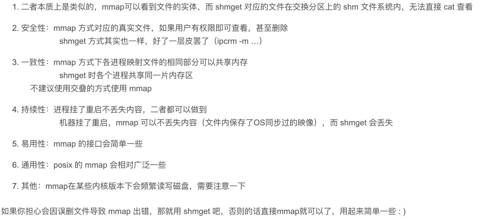

# Android匿名共享内存

跨进程通信时，数据量大于1MB要怎么传递呢？用匿名共享内存（Ashmem）是个不错的选择，它不仅可以减少内存复制的次数，还没有内存大小的限制。

在Android中我们熟知的IPC方式有`Socket`、`File`、`ContentProvider`、`Binder`、`共享内存`。其中共享内存的效率最高，可以做到0拷贝，在跨进程进行大数据传输，日志收集等场景下非常有用。

## 基本使用

Android的匿名共享内存(Ashmem) 基于 Linux 的共享内存，都是在**`临时文件系统(tmpfs)`**上创建虚拟文件，再映射到不同的进程。它可以让多个进程操作同一块内存区域，并且除了物理内存限制，没有其他大小限制。相对于Linux的共享内存，Ashmem对内存的管理更加精细化，并且添加了互斥锁。

android使用匿名共享内存的主要是4个步骤： 

1. 通过 MemoryFile / SharedMemory开辟内存空间，获得 FileDescriptor
2. 将 FileDescriptor 传递给其他进程
3. 往共享内存写入数据
4. 从共享内存读取数据



具体代码可参考：[Android 匿名共享内存的使用](https://zhuanlan.zhihu.com/p/92769131)

> 扩展阅读：tmpfs文件系统

tmpfs是一种基于内存的虚拟文件系统,它最大的特点就是它的存储空间在VM(virtual memory)里面,VM是由linux内核里面的vm子系统管理，现在大多数操作系统都采用了虚拟内存管理机制。

缺点：不具备持久性，即系统重启后，数据将会丢失
优点: 

(1) 动态文件系统大小

/mnt/tmpfs 最初会只有很小的空间，但随着文件的复制和创建，tmpfs 文件系统驱动程序会分配更多的 VM，并按照需求动态地增加文件系统的空间。而且，当 /mnt/tmpfs 中的文件被删除时，tmpfs 文件系统驱动程序会动态地减小文件系统并释放 VM 资源，这样做可以将 VM 返回到循环当中以供系统中其它部分按需要使用。因为 VM 是宝贵的资源，所以您一定不希望任何东西浪费超出它实际所需的 VM，tmpfs 的好处之一就在于这些都是自动处理的。

(2) tmpfs 的另一个主要的好处是它闪电般的速度。因为典型的 tmpfs 文件系统会完全驻留在 RAM 中，读写几乎可以是瞬间的。



## 源码分析

### 1、MemoryFile.java（SharedMemory.java）

- MemoryFile.java
 
```java
public MemoryFile(String name, int length) throws IOException {
            //通过SharedMemory创建匿名共享内存
            mSharedMemory = SharedMemory.create(name, length);
            //映射
            mMapping = mSharedMemory.mapReadWrite();    
    }


```

- SharedMemory

```java
public static @NonNull SharedMemory create(@Nullable String name, int size)
            throws ErrnoException {
    	//实际上调用了native层去创建匿名共享内存，并返回文件描述符
        return new SharedMemory(nCreate(name, size));
    }

private static native FileDescriptor nCreate(String name, int size) throws ErrnoException;
```

### 2、C层打开匿名内存空间

- `android_os_SharedMemory.cpp`：核心的代码就是`ashmem_create_region`

```c
jobject SharedMemory_nCreate(JNIEnv* env, jobject, jstring jname, jint size) {
    // Name is optional so we can't use ScopedUtfChars for this as it throws NPE on null
    const char* name = jname ? env->GetStringUTFChars(jname, nullptr) : nullptr;
    int fd = ashmem_create_region(name, size);
    // Capture the error, if there is one, before calling ReleaseStringUTFChars
    int err = fd < 0 ? errno : 0;
    if (name) {
        env->ReleaseStringUTFChars(jname, name);
    }
    if (fd < 0) {
        throwErrnoException(env, "SharedMemory_create", err);
        return nullptr;
    }
    // 通过C层创建java层对应的FileDescriptor
    jobject jifd = jniCreateFileDescriptor(env, fd);
    if (jifd == nullptr) {
        close(fd);
    }
    return jifd;
}
```

- `ashmem-dev.cpp`：真实创建ashmen（Anonymous Shared Memory）的地方

```c++
/*
 * ashmem_create_region - creates a new ashmem region and returns the file
 * descriptor, or <0 on error
 *
 * `name' is an optional label to give the region (visible in /proc/pid/maps)
 * `size' is the size of the region, in page-aligned bytes
 */
int ashmem_create_region(const char *name, size_t size)
{
    int ret, save_errno;
    // 也是一种创建匿名内存空间的方式
    if (has_memfd_support()) {
        return memfd_create_region(name ? name : "none", size);
    }
    // 创建匿名内存空间
    int fd = __ashmem_open();
    if (fd < 0) {
        return fd;
    }
    // 通过ioctl设置名字，TEMP_FAILURE_RETRY宏定义会让返回的结果为false时一直重试
    //ioctl是系统调用，用户进程和内存进行交互，内部调用copy_from_user获取到用户进程传递的数据
    if (name) {
        char buf[ASHMEM_NAME_LEN] = {0};
        strlcpy(buf, name, sizeof(buf));
        ret = TEMP_FAILURE_RETRY(ioctl(fd, ASHMEM_SET_NAME, buf));
        if (ret < 0) {
            goto error;
        }
    }
    // 设置匿名共享文件大小
    ret = TEMP_FAILURE_RETRY(ioctl(fd, ASHMEM_SET_SIZE, size));
    if (ret < 0) {
        goto error;
    }
    return fd;
error:
    save_errno = errno;
    close(fd);
    errno = save_errno;
    return ret;
}
```

- `__ashmem_open`方法：提供了锁机制

```c
static int __ashmem_open()
{
    int fd;
    pthread_mutex_lock(&__ashmem_lock);
    fd = __ashmem_open_locked();
    pthread_mutex_unlock(&__ashmem_lock);
    return fd;
}
```

- `__ashmem_open_locked()`方法

```c
// 获取匿名共享内存路径，Android Q之后使用这个方式获取
static std::string get_ashmem_device_path() {
    static const std::string boot_id_path = "/proc/sys/kernel/random/boot_id";
    std::string boot_id;
    if (!android::base::ReadFileToString(boot_id_path, &boot_id)) {
        ALOGE("Failed to read %s: %s.\n", boot_id_path.c_str(), strerror(errno));
        return "";
    };
    boot_id = android::base::Trim(boot_id);
    return "/dev/ashmem" + boot_id;
}

// 打开匿名内存空间
static int __ashmem_open_locked()
{
    static const std::string ashmem_device_path = get_ashmem_device_path();
    if (ashmem_device_path.empty()) {
        return -1;
    }
    int fd = TEMP_FAILURE_RETRY(open(ashmem_device_path.c_str(), O_RDWR | O_CLOEXEC));
    // fallback for APEX w/ use_vendor on Q, which would have still used /dev/ashmem
    if (fd < 0) {
        int saved_errno = errno;
        fd = TEMP_FAILURE_RETRY(open("/dev/ashmem", O_RDWR | O_CLOEXEC));
        // // Android Q之前的设备这里fd < 0，使用原来的路径"/dev/ashmem"
        if (fd < 0) {
            /* Q launching devices and newer must not reach here since they should have been
             * able to open ashmem_device_path */
            ALOGE("Unable to open ashmem device %s (error = %s) and /dev/ashmem(error = %s)",
                  ashmem_device_path.c_str(), strerror(saved_errno), strerror(errno));
            return fd;
        }
    }
    struct stat st;
    // 校验fd的状态
    int ret = TEMP_FAILURE_RETRY(fstat(fd, &st));
    if (ret < 0) {
        int save_errno = errno;
        close(fd);
        errno = save_errno;
        return ret;
    }
    if (!S_ISCHR(st.st_mode) || !st.st_rdev) {
        close(fd);
        errno = ENOTTY;
        return -1;
    }
    __ashmem_rdev = st.st_rdev;
    return fd;
}
```

### 3、建立内存到文件的映射

- SharedMemory.java

```java
public @NonNull ByteBuffer mapReadWrite() throws ErrnoException {
    return map(OsConstants.PROT_READ | OsConstants.PROT_WRITE, 0, mSize);
}
    
public @NonNull ByteBuffer map(int prot, int offset, int length) throws ErrnoException {
    checkOpen();
    validateProt(prot);
    if (offset < 0) {
        throw new IllegalArgumentException("Offset must be >= 0");
    }
    if (length <= 0) {
        throw new IllegalArgumentException("Length must be > 0");
    }
    if (offset + length > mSize) {
        throw new IllegalArgumentException("offset + length must not exceed getSize()");
    }
    long address = Os.mmap(0, length, prot, OsConstants.MAP_SHARED, mFileDescriptor, offset);
    boolean readOnly = (prot & OsConstants.PROT_WRITE) == 0;
    Runnable unmapper = new Unmapper(address, length, mMemoryRegistration.acquire());
    return new DirectByteBuffer(length, address, mFileDescriptor, unmapper, readOnly);
}
```

## 跨进程的fd不是同一个fd

虽然共享内存对应的的文件是同一个，但是不同进程的fd其实是不一样的。

通过Binder传递文件描述符来处理，Android的Binder对于fd的传递也做了适配，原理其实就是在内核层为要传递的目标进程转换fd，因为在linux中fd只是对本进程是有效、且唯一，进程A打开一个文件得到一个fd，不能直接为进程B使用，因为B中那个fd可能压根无效、或者对应其他文件，不过，虽然同一个文件可以有多个文件描述符，但是文件只有一个，在内核层也只会对应一个inode节点与file对象，这也是内核层可以传递fd的基础，Binder驱动通过当前进程的fd找到对应的文件，然后为目标进程新建fd，并传递给目标进程，核心就是把进程A中的fd转化成进程B中的fd，看一下Android中binder的实现：

```c
void binder_transaction(){
   ...
        case BINDER_TYPE_FD: {
        int target_fd;
        struct file *file;
        <!--关键点1 可以根据fd在当前进程获取到file ，多个进程打开同一文件，在内核中对应的file是一样-->
        file = fget(fp->handle);
        <!--关键点2,为目标进程获取空闲fd-->
        target_fd = task_get_unused_fd_flags(target_proc, O_CLOEXEC);
        <!--关键点3将目标进程的空闲fd与file绑定-->
        task_fd_install(target_proc, target_fd, file);
        fp->handle = target_fd;
    } break;    
    ...
 }

<!--从当前进程打开的files中找到file在内核中的实例-->
struct file *fget(unsigned int fd)
{
    struct file *file;
    struct files_struct *files = current->files;
    rcu_read_lock();
    file = fcheck_files(files, fd);
    rcu_read_unlock();
    return file;
}


static void task_fd_install(
    struct binder_proc *proc, unsigned int fd, struct file *file)
{
    struct files_struct *files = proc->files;
    struct fdtable *fdt;
    if (files == NULL)
        return;
    spin_lock(&files->file_lock);
    fdt = files_fdtable(files);
    rcu_assign_pointer(fdt->fd[fd], file);
    spin_unlock(&files->file_lock);
}
```



## mmap和shmem的区别

在说mmap之前我们先说一下普通的读写文件的原理，进程调用read或是write后会陷入内核，因为这两个函数都是系统调用，进入系统调用后，内核开始读写文件，假设内核在读取文件，内核首先把文件读入自己的内核空间，读完之后进程在内核回归用户态，内核把读入内核内存的数据再copy进入进程的用户态内存空间。实际上我们同一份文件内容相当于读了两次，先读入内核空间，再从内核空间读入用户空间。

Linux提供了内存映射函数mmap, 它把文件内容映射到一段内存上(准确说是虚拟内存上), 通过对这段内存的读取和修改, 实现对文件的读取和修改,mmap()系统调用使得进程之间可以通过映射一个普通的文件实现共享内存。普通文件映射到进程地址空间后，进程可以向访问内存的方式对文件进行访问，不需要其他系统调用(read,write)去操作。



关于mmap的可以参考这个文章[mmap映射区](https://blog.csdn.net/hj605635529/article/details/73163513)



## 总结

Android匿名共享内存是基于Linux共享内存的，都是在tmpfs文件系统上新建文件，并将其映射到不同的进程空间，从而达到共享内存的目的，只是，Android在Linux的基础上进行了改造，并借助Binder+fd文件描述符实现了共享内存的传递。
