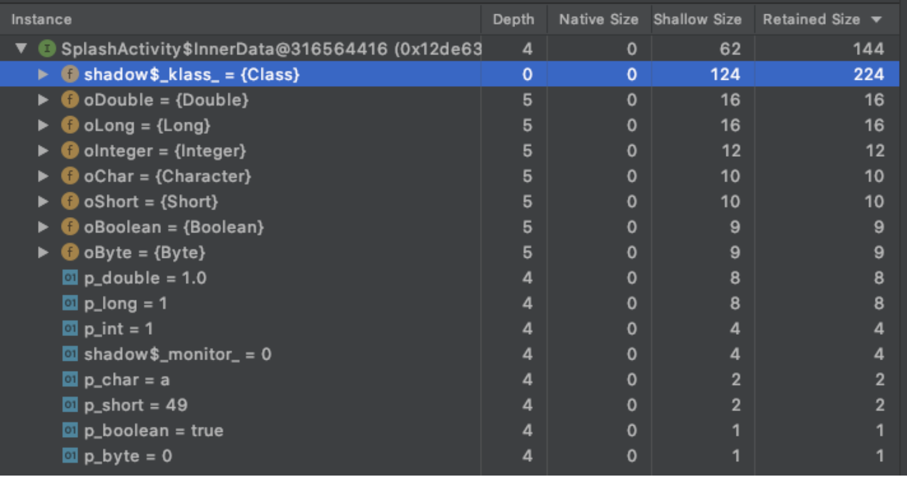
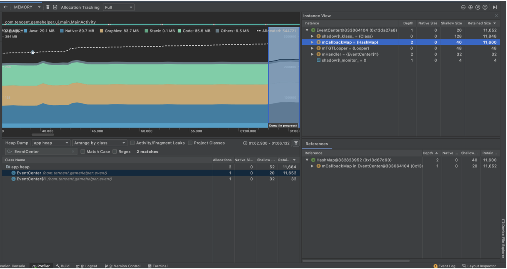
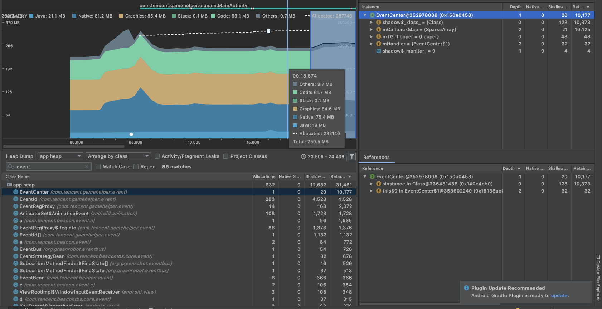

# Android针对包装器类的内存优化

因为Java一般的环境中都有比较充足的内存, 所以很少有人会谈到基础数据包装类占用内存的优化.这里先用AndroidStudio的profile看一下基础数据类型和包装类占用的内存大小

```java
private static class InnerData {

    Boolean oBoolean = new Boolean(true);
    Byte oByte = new Byte("0");
    Character oChar = new Character('c');
    Short oShort = new Short("1");
    Integer oInteger = new Integer(1);
    Long oLong = new Long(1l);
    Double oDouble = new Double(1d);


    boolean p_boolean = true;
    byte p_byte = 0;
    char p_char = 'a';
    short p_short = '1';
    int p_int = 1;
    long p_long = 1;
    double p_double = 1;
}
```



|  类型   | 大小  | 类型  | 大小  |
|  ----  | ----  | ----  | ----  |
|  Double	| 16bytes | double | 8bytes |
|  Long|16bytes|long|8bytes |
|  Integer|12bytes|int|4bytes |
|  Character|10bytes|char|2bytes |
|  Short|10bytes|short|2bytes |
|  Boolean|9bytes|boolean|1byte |
|  Byte|9bytes|byte|1byte |

这里可以看到基本数据和包装类都相差了8bytes的大小. 当我们项目中有大量的map用到了int作为键位时, 可以考虑使用SparseArray来替换.

## 项目实际使用

进入首页后java占用平均内存: 20.3MB(截图的内存是heap dump后暴涨起来的, 可忽略), 我们抽一个类进行优化: EventCenter, 该类在初始化时会往hashmap中存入40个数据, 占据内存是11600.



我们把EventCenter中的HashMap<Integer, HashSet<IEventHandler>>改成SparseArray<HashSet<IEventHandler>>

java占用内存降到了19MB左右, mCallbackMap占用内存降到10125.



不过SparseArray有个缺陷就是它使用的是二分查找, 数据很多的情况下没有hashmap这么快, 但是对于数据量200以下来看, 最多查找次数是2的8次方=256>200, 基本上和线性查找差别不大.

而实际代码跑起来测试, 在数据量500以下, 查找/顺序插入/逆序插入, 相差时间仅有1ms差别, 在app开发的大部分场景下, 当使用Integer作为key时, 都可以用SparseArray代替Map.