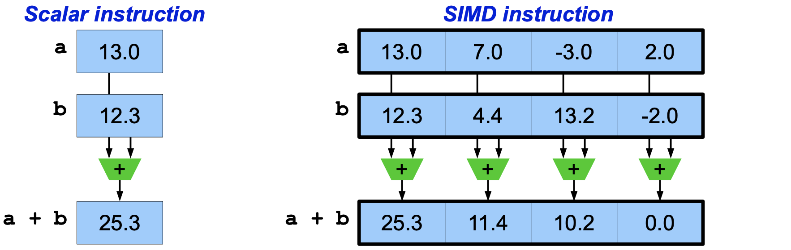

# C++ SIMD开发

## SIMD基本概念

SIMD就是单条指令可以一次应用到多条数据计算上:

不过CPU上的支持的SIMD指令包括如下：

* Intel:
 * SSE2
 * SSE4.2
 * AVX
 * AVX2
 * AVX-512 as found on KNLs
 * AVX-512 as found on Xeon Skylake CPUs
 * ... ...
* Arm
 * NEON 128 bits as found on ARMv7 CPUs
 * NEON 128 bits as found on Aarch64 CPUs
 * SVE
 * ... ...

## 详细的技术文档

[The C++ scientist](http://johanmabille.github.io/blog/archives/)

[SIMD Programming](https://s/teaching/HPC/SIMD.pdf)

## 开源库

[xsimd](https://github.com/xtensor-stack/xsimd)：SIMD (Single Instruction, Multiple Data) is a feature of microprocessors that has been available for many years. SIMD instructions perform a single operation on a batch of values at once, and thus provide a way to significantly accelerate code execution. However, these instructions differ between microprocessor vendors and compilers.

xsimd provides a unified means for using these features for library authors. Namely, it enables manipulation of batches of numbers with the same arithmetic operators as for single values. It also provides accelerated implementation of common mathematical functions operating on batches.

[nsimd](https://github.com/agenium-scale/nsimd)：NSIMD is a vectorization library that abstracts SIMD programming. It was designed to exploit the maximum power of processors at a low development cost.