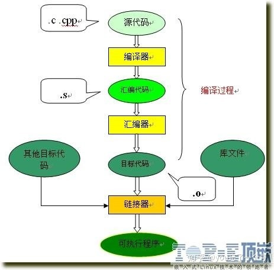
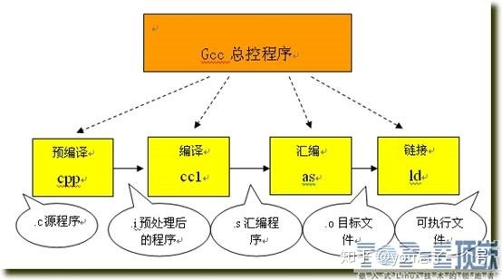

# C++头文件作用和使用规范

## C++编译过程

整个编译过程分为两大步：

1. 编译 ：把文本形式的源代码翻译成机器语言，并形成目标文件(.obj)
2. 连接 ：把目标文件(.obj) 操作系统的启动代码和库文件组织起来形成可执行程序

**1.1 编译预处理**

将源代码的.c 、.cpp 、.h 等文件包含到一个文件中。在这个过程中会使用一些预处理指令要求编译器使用什么样的方式包含这些文件。预处理结束之后对于c语言编译器会生成一个.i 文件。C++会生成.ii文件。

这个过程有如下具体过程：

* 拷贝#include 包含的文件代码，替换掉#include
* 进行#define 宏定义的替换 
* 处理条件编译指令 （#ifndef #ifdef #endif）
* 删除所有的注释//和 /**/
* 添加行号和文件标识

**1.2 编译优化**

这阶段要做的工作主要是，通过语法分析和词法分析，确定所有指令是否符合规则，之后翻译成汇编代码。这个过程将.i文件转化位.s文件。

**1.3 汇编**

汇编过程就是把汇编语言翻译成目标机器指令的过程，生成目标文件（.obj .o等）。目标文件中存放的也就是与源程序等效的目标的机器语言代码。这个过程将.s文件转化成.o文件。

**2.1 连接过程**

由汇编程序生成的目标文件并不能立即就执行，还要通过链接过程。

原因：
  
  1. 某个源文件调用了另一个源文件中的函数或常量
  2. 在程序中调用了某个库文件中的函数

链接程序的主要工作就是将有关的目标文件连接起来。这个过程将.o文件转化成可执行的文件。

整个的流程如下：

更具体的每个阶段的产出物：

## 为什么需要头文件？

使用源文件实现模块的功能，使用头文件暴露单元的接口。用户只需包含相应的头文件就可使用该头文件中暴露的接口，而不需要暴露具体实现。

**但是为什么不能直接引用可执行文件呢，非要通过头文件来暴露接口？**编译出来的二进制码（比如.o,.obj,.lib,.dll)不包含自我描述的符号信息，要复用这种可执行码的话得另外的文件。（C#和Java的可执行码自带元数据信息，但是这也意味着运行时的内存需求增加，毕竟这种自我描述的数据对最终用户来说是无用）

头文件是怎么参与编译的：**在预处理阶段，编译器将源文件包含的头文件内容复制到包含语句(#include)处。在源文件编译时，连同被包含进来的头文件内容一起编译，生成目标文件(.obj)。如果所包含的头文件非常庞大，则会严重降低编译速度。**

## 使用规范 

1. 尽量把能放到cpp的code放到cpp里
2. 每个头文件的都应仅仅导入此头文件所必须的一些头文件，不要导入一些仅仅在.c文件里需要的头文件
3. 头文件只包含声明，把模块中的结构体、函数原型和使用extern修饰的全局变量的声明放在.h文件中
4. 把模块内部的声明移出头文件

[如何组织好 C 的头文件](https://reality0ne.com/how-to-struct-c-header-files/)
