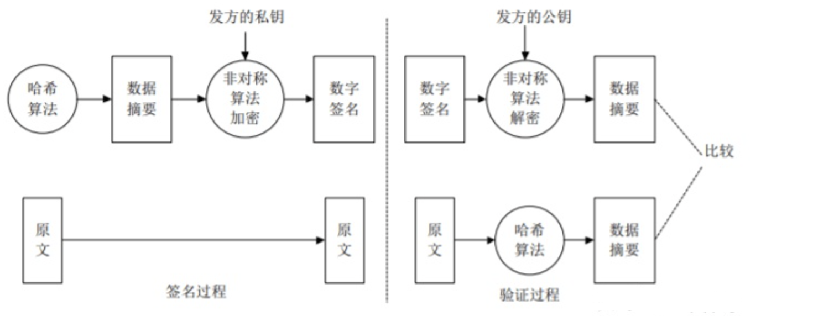

# HTTPS知识点

## TLS 链接流程

### 1、Client发送：Client Hello

首先客户端会发送：

* 客户端支持的TLS版本
* 客户端支持的加密套件，如对称加密算法、非对称加密算法、哈希算法
* 客户端随机数

来让服务端进行选择。

### 2、Server发送： ServerHello

服务端收到客户端的client hello信息后，根据自身的条件，选择出TLS版本、加密套件，并产生服务端随机数一起发送给客户端。

这样的客户端和服务端就打成了如下的一致：

* 同样的TLS版本
* 同样的对称加密算法、非对称加密算法、哈希算法
* 同样的客户端的随机数
* 同样的服务端随机数

### 3、Server发送：服务器证书

数字证书主要包含证书发布机构，证书有效期，公钥，证书所有者，签名使用的算法，指纹以及指纹算法。数字证书可以保证里面的公钥一定是证书持有者的。

**数字证书都有哪些内容：**

* Issuer--证书的发布机构

发布证书的机构，指明证书是哪个公司创建的（并不是指使用证书的公司）。出了问题具体的颁发机构是要负责的

* Valid from，Valid to--证书的有效期

证书的使用期限。过了这个期限证书就会作废，不能使用。

* Public key--公钥

刚开始的时候介绍过公钥的概念，用于对消息加密的。

* Subject--主题

证书是颁发给谁了，一般是个人或公司名称或机构名称或公司网站的网址。

* Signature algorithm--签名所使用的算法

数字证书的数字签名所使用的加密算法，根据这个算法可以对指纹解密。指纹加密的结果就是数字签名。

* Thumbprint，Thumbprint algorithm--指纹以及指纹算法（一种HASH算法）

指纹和指纹算法会使用证书机构的私钥加密后和证书放在一起。主要用来保证证书的完整性，确保证书没有修改过。使用者在打开证书时根据指纹算法计算证书的hash值，和刚开始的值一样，则表示没有被修改过。

**客户端验证的流程：**

首先应用程序读取证书中的Issuer（发布机构），然后会在操作系统或浏览器内置的受信任的发布机构中去找该机构的证书。

如果找不到就说明证书是水货，证书有问题，程序给错误信息。如果找到了，或用户确认使用该证书。就会拿上级证书的公钥，解密本级证书，得到数字指纹。

然后对本级证书的公钥进行数字摘要算法（证书中提供的指纹加密算法）计算结果，与解密得到的指纹对比。如果一样，说明证书没有被修改过。公钥可以放心使用，可以开始握手通信了。

### 4、Client 连发3个消息

* Pre-master secret（使用服务器公钥加密）
* 将开始传输加密消息
* 客户端握手结束通知，表示客户端的握手阶段已经结束

客户端使用一些加密算法(例如：RSA,Diffie-Hellman)产生一个48个字节的Key，这个Key叫PreMaster Secret。该PreMaster Secret用服务器公钥加密传送，防止被窃听。

PreMaster secret是在客户端使用RSA或者Diffie-Hellman等加密算法生成的。它将用来跟服务端和客户端在Hello阶段产生的随机数结合在一起生成Master secret。在客户端使用服务单的公钥对PreMaster secret进行加密之后传送给服务端，服务端将使用私钥进行解密得到PreMaster secret。也就是说服务端和客户端都有一份相同的PreMaster secret和随机数。

至于为什么一定要用三个随机数，来生成Master Secret，由于SSL协议中证书是静态的，因此需要引入一种随机因素来保证协商出来的密钥的随机性。SSL协议不信任每个主机都能生成完全随机的随机数，所以这里需要服务器和客户端共生成3个随机数，每增加一个自由度，随机性就会相应增加。

同时需要注意前两个随机数都是明文传输的，窃听者是可以轻易获取到的，只有最后一个 PreMaster Secret 是加密传输的，只有拥有服务器私钥才能解密，一旦 PreMaster Secret 泄露，那么本次通信就就完全可被破解了。

### 5、Server 连发2个消息

服务器通过上面的三个随机数(random_1,random_2,PreMaster Secret)，计算出本次会话的『会话密钥(session secret)』，然后向客户端发送下面信息：

* 编码改变通知，表示随后的信息都将用双方商定的加密方法和密钥发送
* 服务器握手结束通知，表示服务器的握手阶段已经结束

## MORE

1.服务器随机数作用？

避免replay attack:重放攻击 虽然解不开加密信息，但是将发送的加密数据拦截后重复发送给服务器，来搞破坏，比如拦截的是转账请求，换个时间段继续重放请求，多次转账。 每次链接后拿到的服务器随机数都不一样，避免被重放攻击
