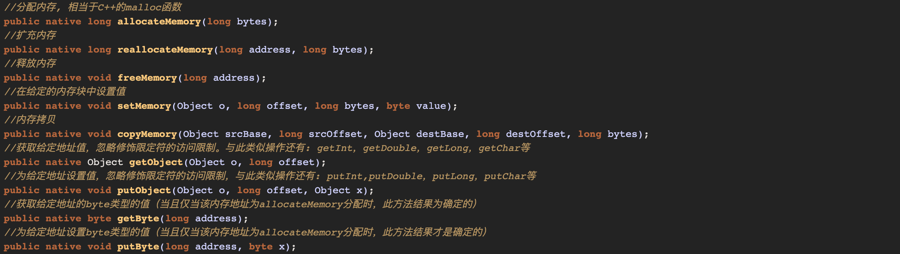
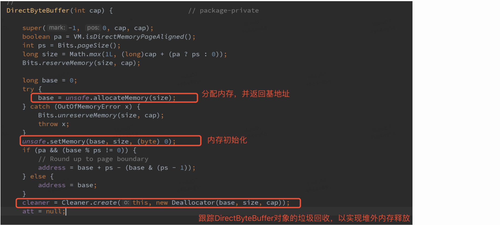
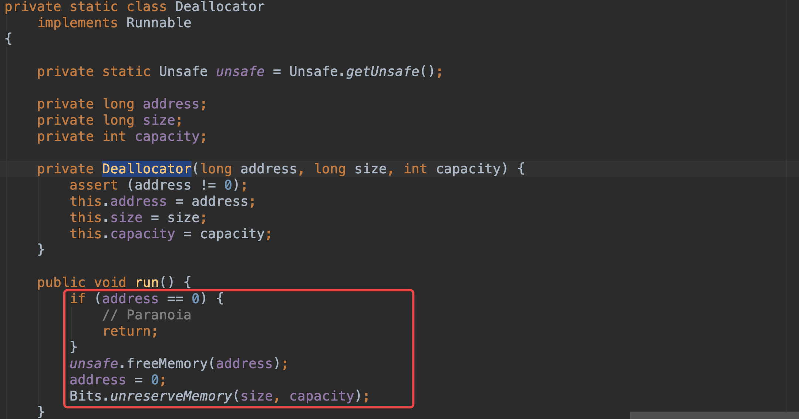
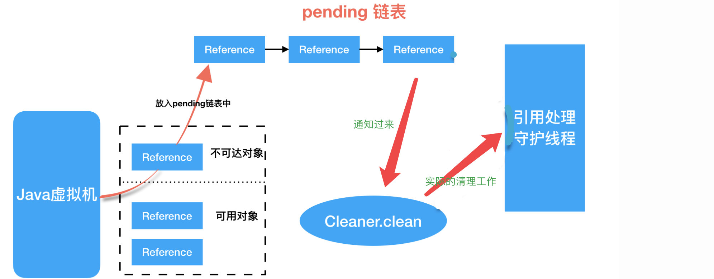

# Java堆外内存

通常Java中创建的对象都处于堆内内存中，堆内内存是由JVM所管控的Java进程内存，并且它遵循JVM的内存管理机制，JVM会采用垃圾回收机制统一管理堆内存。

堆外内存就是把内存对象分配在Java虚拟机堆以外的内存，这些内存直接受操作系统管理，而不是虚拟机。

## 堆外内存的优势

### 提高了GC的性能

GC是有成本的，堆中的对象数量越多，GC的开销也会越大，开销越大性能会有很大的损耗

### I/O性能提升

使用堆内内存进行I/O操作时，JVM会使用堆外内存做一次额外的中转，也就是会多一次内存拷贝。

堆外内存直接少了这次拷贝，I/O的性能就能有提高

## 堆外内存的缺陷

内存难以控制，使用了堆外内存就间接失去了JVM管理内存的可行性，改由自己来管理，当发生内存溢出时排查起来非常困难

可以指定堆外内存的最大空间`-XX:MaxDirectMemorySize`，当使用达到了阈值的时候将调用System.gc来做一次full gc，以此来回收掉没有被使用的堆外内存。

## 如何使用堆外内存

* 使用Unsafe
* 使用DirectByteBuffer

### Unsafe

Unsafe中有一部分操作就是堆外内存的分配、拷贝、释放、给定地址值操作等方法。



一般我们用反射的方式去操作：

```java
private static Object unsafe;
private static Class unsafeClass;

static {
    try {
        unsafeClass = Class.forName("sun.misc.Unsafe");
        Field theUnsafe = unsafeClass.getDeclaredField("theUnsafe");
        theUnsafe.setAccessible(true);
        unsafe = theUnsafe.get(null);
    } catch (Exception e) {
        try {
            final Field theUnsafe = unsafeClass.getDeclaredField("THE_ONE");
            theUnsafe.setAccessible(true);
            unsafe = theUnsafe.get(null);
        } catch (Exception e2) {
            Log.w(TAG, "Unsafe not found o.O");
        }
    }
}

public static long allocateMemory(long bytes) {
    try {
        return (int) unsafeClass.getDeclaredMethod("allocateMemory",long.class).invoke(unsafe, bytes);
    } catch (Exception e) {
        Log.w(TAG, e);
        return 0;
    }
}
```

### DirectByteBuffer

DirectByteBuffer也是用Unsafe去实现内存分配的，对堆内存的分配、读写、回收都做了封装。

它的构造函数：


这里面主要关注Cleaner对象，它继承自虚引用PhantomReference，源码[Cleaner.java](http://www.docjar.com/html/api/sun/misc/Cleaner.java.html)

堆外内存的回收就依赖于这个Cleaner和引用队列ReferenceQueue，原理：

> 当GC发现DirectByteBuffer对象变成垃圾时，会触发`Cleaner#clean`，从而可以调用到DirectByteBuffer中的Deallocator线程，一定程度上防止了内存泄露。



整体的描述：



如果我们需要在某个对象被回收的时候，做一些处理，可以参看DirectByteBuffer的写法，具体代码如下：

```java
public class Test {

    public Test() {
        try {
            Class<?> threadClazz = Class.forName("sun.misc.Cleaner");
            Method method = threadClazz.getMethod("create", Object.class, Runnable.class);
            method.invoke(null, this, new Deallocator());
            System.out.println("cleaner is created");
        } catch (Exception e) {
            e.printStackTrace();
        }
    }

    private static class Deallocator implements Runnable
    {

        private Deallocator() {
        }

        public void run() {
            System.out.println("gc is called!");
        }

    }

    public static void main(String[] args) {
        Test test = new Test();
        test = null;
        System.gc();
    }
}

/////////result:

cleaner is created
gc is called!

Process finished with exit code 0
```

### 扩展阅读：Reference类

这部分内容参考了[深入理解JDK中的Reference原理和源码实现](http://www.throwable.club/2019/02/16/java-reference/)

Reference类主要的变量：

* **referent**：具体对象，引用指向的对象
* **queue**：对象关联的队列，也就是引用队列，当Reference实例持有的对象referent要被回收的时候，Reference实例会被放入引用队列
* **next**：下一个Reference实例，Reference是单链表结构
* **discovered**：JVM操作的变量

ReferenceHandler线程，是由Reference静态代码块中建立并且运行的线程。

ReferenceQueue，会被Reference所引用，就是链表的操作。

> 如何判断对象的可达性和对象是否存活？

**可达性算法**

这个算法的基本思路是通过一系列的称为”GC Roots”(GC根集)的对象作为起始点，从这些节点开始向下搜索，搜索所走过的路径称为引用链(Reference Chain)，当一个对象到GC根集没有任何引用链相连(从图论的角度看，也就是从GC根集到这个对象是不可达的)时，则证明此对象是不可用的。

在Java语言中，可以作为GC根集的对象包括下面几种：

* 虚拟机栈(栈帧中的本地变量表)中引用的对象。
* 方法区中常量引用的对象(在JDK1.8之后不存在方法区，也就是有可能是metaspace中常量引用的对象)。
* 本地方法栈中JNI(即一般常说的Native方法)引用的对象。

**finalize函数**

一个对象判定为”死亡”至少需要经历两次标记的过程，而这第二次就是finalize函数。

如果一个对象被判定为有必要执行finalize()方法，那么这个对象将会被放置在一个叫F-Queue的队列之中，并且稍后由一个优先级低的Finalizer线程去取该队列的元素，”尝试执行”元素的finalize()方法。

尝试执行是因为JVM会保证触发满足条件的对象的finalize()方法，但是并不承诺会等待它执行结束，这是因为：如果一个对象在执行finalize()方法耗时较长，甚至发生了死循环，将会导致F-Queue的队列中的其他元素永远处于等待状态，极端情况下有可能导致整个内存回收系统崩溃。

**Finalizer守护线程**


### 堆内存的读写

```c
public ByteBuffer put(int i, byte x) {
    unsafe.putByte(ix(checkIndex(i)), ((x)));
    return this;
}

public byte get(int i) {
    return ((unsafe.getByte(ix(checkIndex(i)))));
}
```

就是各种基本类型的put/get，无法支持java bean，对于java bean需要序列化和反序列化处理。

## 使用场景

堆外内存适合在如下的场景中使用：

* GC比较频繁的场景
* 注重I/O效率的场景
* 长期存在的对象

## 参考文章

[Java魔法类：Unsafe应用解析](https://tech.meituan.com/2019/02/14/talk-about-java-magic-class-unsafe.html)