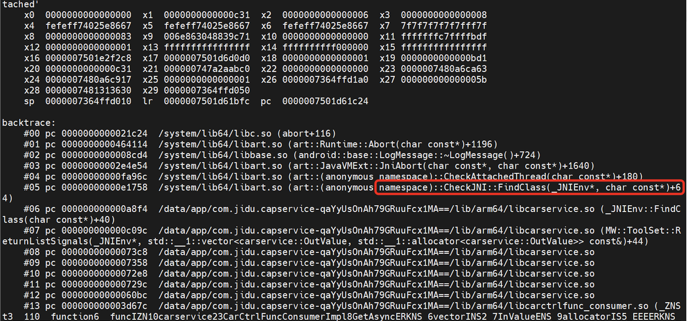

# Jni FindClass新线程crash问题分析

## 问题

在项目中遇到了这个问题：

在调用jni的FindClass方法时报错，上图是堆栈。具体原因是说找不到`com.XXX.XXX.KeyValue`，但是我看打出的apk包里是有这个代码的，路径也没有报错。

问题变的非常诡异。。。

最后分析的结果是：在jni新的线程里就会出现找不到的问题。为什么呢？

## java class IDs

在网上看到这样一段描述：

> Basically this can occur if the thread where you ask FindClass is not the main thread and in your thread system does not build a map of java class IDs.

> Check this out, probably you have to ask FindClass first in the main thread (when JNI loads or somewhere else), and then you will have ability to do that in any thread.

上面的意思是在子线程中，系统还没有构建java class IDs的映射，解决的办法就是在jni onload的时候去FindClass，然后存起来使用。

那什么事java class IDs呢？看下面这段话：

>  This usually does what you want. You can get into trouble if you create a thread yourself (perhaps by calling pthread_create and then attaching it with AttachCurrentThread). Now there are no stack frames from your application. If you call FindClass from this thread, the JavaVM will start in the "system" class loader instead of the one associated with your application, so attempts to find app-specific classes will fail.

新起的线程是没有栈帧的，所以在当前线程去FindClass时用的是系统的classloader，而不是和应用相关的classloader，所以找不到。

那怎么解决呢？

* 1、在` JNI_OnLoad`里加载并且缓存，这个的问题是需要将很多FindClass的结果写成静态的
* 2、通过java将class传给native方法，不过这个需要注意的是需要通过GlobalRef引用下，否则在新线程中拿不到这个对象

* 3、在主线程外FindClass，然后通过GlobalRef引用，最后传给子线程的方式

* 4、缓存`ClassLoader`对象，直接通过`loadClass`来找类，这个可以参考：[https://svn.apache.org/repos/asf/mesos/branches/0.10.x/src/java/jni/convert.cpp](https://svn.apache.org/repos/asf/mesos/branches/0.10.x/src/java/jni/convert.cpp)

## 栈帧

每一次函数的调用，都会在调用栈(call stack)上维护一个独立的栈帧(stack frame)，每一个函数独占自己的栈帧空间。

每个独立的栈帧一般包括:

* 函数的返回地址和参数
* 临时变量: 包括函数的非静态局部变量以及编译器自动生成的其他临时变量
* 函数调用的上下文

函数栈帧的大小并不固定，一般与其对应函数的局部变量多少有关。函数运行过程中，其栈帧大小也是在不停变化的。