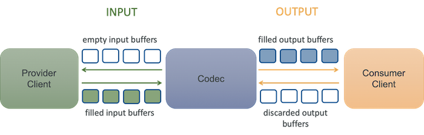

# MediaCodec原理和基本操作

音视频的原始数据非常庞大，难以存储和传输。要解决音视频数据的存储和传输问题，就需要对这些数据进行压缩，音视频数据压缩技术就是音视频编码。 编码的目的就是在最小图像或音频信息丢失情况下得到最大的压缩，解码是相对编码的，其目的是最大限度的还原原始图像或声音信息。编解码的意义就是便于数据传输和存储。

音视频编解码格式非常多（h264、h265、vp8、vp9、aac、opus……），实现每种编解码都需要引入外部库，导致项目臃肿、包体积过大且运行性能差。

MediaCodec是Google为Android开发者和芯片厂商搭建的一套用于调用硬件编解码器组件的统一接口。MediaCodec与常规编解码库相比具有非常明显的优势，它速度快、效率高、CPU占用率低、内存小、节省包体积。使用MediaCodec可以解决项目臃肿、减小包体积和提升编解码性能。

# 原理

MediaCodec处理数据的方式是**异步+双缓冲**的方式。

一个简单描述是：生产者请求一个空的输入缓冲区，用数据填充它并将其发送到编解码器进行处理。编解码器处理完数据并将其转换到一个编解码完的已经填满的的输出缓冲区，费者请求一个已填满的输出缓冲区，使用它的内容并将其释放回编解码器。



mediacodec的作用是处理输入的数据生成输出数据。首先生成一个输入数据缓冲区，将数据填入缓冲区提供给codec，codec会采用异步的方式处理这些输入的数据，然后将填满输出缓冲区提供给消费者，消费者消费完后将缓冲区返还给codec。

> MediaCodec可以 对三种数据进行操作:压缩数据（即为经过H254. H265. 等编码的视频数据或AAC等编码的音频数据）、原始音频数据和原始视频数据。这三种数据都可以使用ByteBuffer来处理，但是强烈建议使用Surface来处理原始视频数据，以提高编解码器的性能。Surface使用的是原生视频缓冲区，不需要映射或复制到字节缓冲区;因此，它的效率要高得多。

在整个编解码过程中，MediaCodec的使用会经历**停止（stoped）**、**执行（executing）**、**释放(released)**。

停止有三个子状态：

* 配置（configured）
* 未初始化(uninitialized)
* 错误(error)

执行有三个子状态：

* 刷新(flushed)
* 运行(running)
* 结束流(end-of-stream)


* 当你使用任意一种工厂方法（factory methods）创建了一个编解码器，此时编解码器处于未初始化状态（Uninitialized）。首先，你需要使用configure(…)方法对编解码器进行配置，这将使编解码器转为配置状态（Configured）。然后调用start()方法使其转入执行状态（Executing）。在这种状态下你可以通过上述的缓存队列操作处理数据。
* 执行状态（Executing）包含三个子状态： 刷新（Flushed）、运行（ Running） 以及流结束（End-of-Stream）。在调用start()方法后编解码器立即进入刷新子状态（Flushed），此时编解码器会拥有所有的缓存。一旦第一个输入缓存（input buffer）被移出队列，编解码器就转入运行子状态（Running），编解码器的大部分生命周期会在此状态下度过。当你将一个带有end-of-stream 标记的输入缓存入队列时，编解码器将转入流结束子状态（End-of-Stream）。在这种状态下，编解码器不再接收新的输入缓存，但它仍然产生输出缓存（output buffers）直到end-of- stream标记到达输出端。你可以在执行状态（Executing）下的任何时候通过调用flush()方法使编解码器重新返回到刷新子状态（Flushed）。
* 通过调用stop()方法使编解码器返回到未初始化状态（Uninitialized），此时这个编解码器可以再次重新配置 。当你使用完编解码器后，你必须调用release()方法释放其资源。
* 在极少情况下编解码器会遇到错误并进入错误状态（Error）。这个错误可能是在队列操作时返回一个错误的值或者有时候产生了一个异常导致的。通过调用 reset()方法使编解码器再次可用。你可以在任何状态调用reset()方法使编解码器返回到未初始化状态（Uninitialized）。否则，调用 release()方法进入最终的Released状态。

## 编解码的流程

MediaCodec的基本调用流程都遵循一个统一的模式：

* 创建并配置一个 MediaCodec 对象
* 循环直到完成:
 * 如果输入缓冲区就绪，读取一个输入块，并复制到输入缓冲区中
 * 如果输出缓冲区就绪，复制输出缓冲区的数据
* 释放 MediaCodec 对象

伪代码说明如下：

```sh
createEncoderByType/createDecoderByType/createByCodecName
configure
start
while(true) {
     dequeueInputBuffer  //从输入流队列中取数据进行编码操作 
     getInputBuffers     //获取需要编码数据的输入流队列，返回的是一个ByteBuffer数组 
     queueInputBuffer    //输入流入队列 
     dequeueOutputBuffer //从输出队列中取出编码操作之后的数据
     getOutPutBuffers    // 获取编解码之后的数据输出流队列，返回的是一个ByteBuffer数组
     releaseOutputBuffer //处理完成，释放ByteBuffer数据
}
flush：清空的输入和输出端口。
stop：终止decode/encode会话
release：释放编解码器实例使用的资源。
```

[MediaCodec使用demo](https://blog.csdn.net/u013028621/article/details/62417181)

# 参考

[Android多媒体--MediaCodec 中文API文档](https://www.cnblogs.com/roger-yu/p/5635494.html)