# PackageManagerService分析(一）—— PMS的启动流程

## 整体框架介绍

PMS是一种CS的架构模型，依托Binder的通信机制实现C-S的访问。总的一个框架图如下：

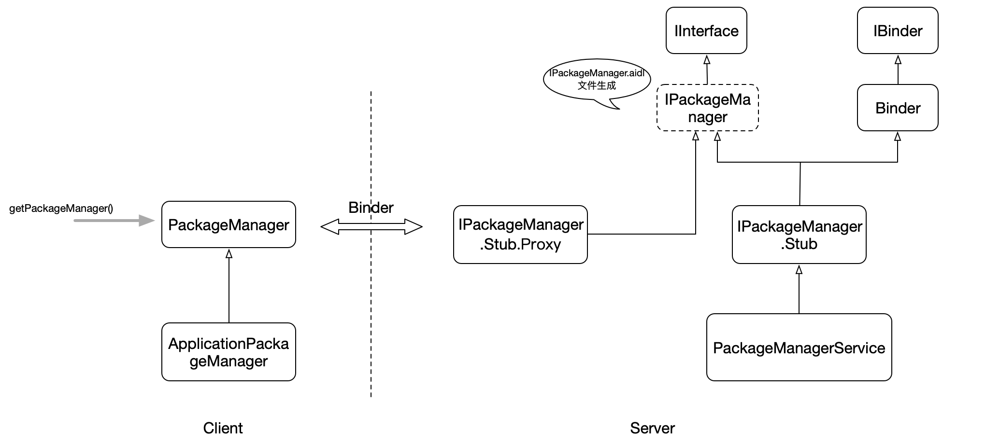

服务端是通用的Binder架构，没啥可分析的，我们主要看下客户端的逻辑，调用的逻辑是从Context触发的。

ContextImpl.java

```java
@Override
public PackageManager getPackageManager() {
    if (mPackageManager != null) {
        return mPackageManager;
    }

    IPackageManager pm = ActivityThread.getPackageManager();
    if (pm != null) {
        // Doesn't matter if we make more than one instance.
        return (mPackageManager = new ApplicationPackageManager(this, pm));
    }

    return null;
}
```

而这里的核心是ActivityThread.java：

```java
public static IPackageManager getPackageManager() {
    if (sPackageManager != null) {
        //Slog.v("PackageManager", "returning cur default = " + sPackageManager);
        return sPackageManager;
    }
    IBinder b = ServiceManager.getService("package");
    //Slog.v("PackageManager", "default service binder = " + b);
    sPackageManager = IPackageManager.Stub.asInterface(b);
    //Slog.v("PackageManager", "default service = " + sPackageManager);
    return sPackageManager;
}
```

而这里的核心是`getService("package")`：

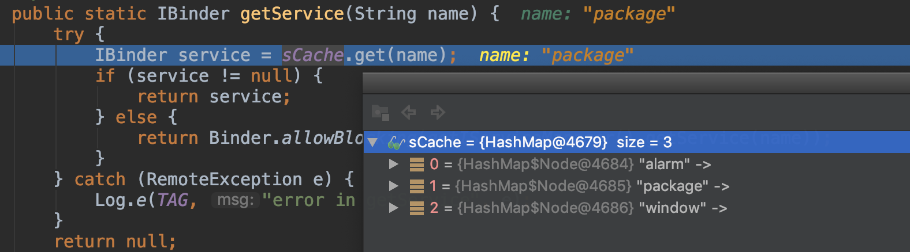

这3个map值是在什么时候写入到sCache里的呢？是在**ActivityThread.bindApplication()完成的。**

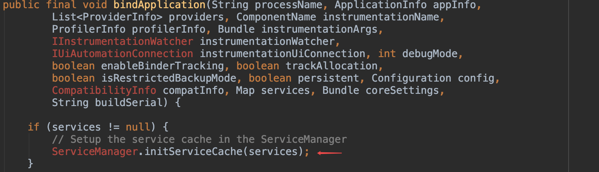

## 启动流程

如[安卓进程启动流程](安卓进程启动流程.md)文章分析的，PMS是在`SystemServer`的`startBootstrapServices()`里启动的：

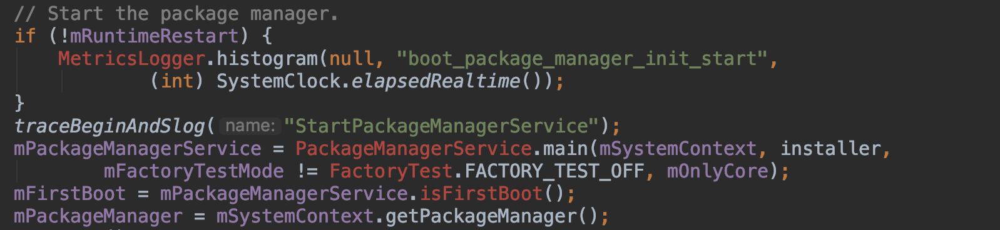

`main()`函数的核心其实就是调用了PMS的构造方法：

```java
public static PackageManagerService main(Context context, Installer installer,
        boolean factoryTest, boolean onlyCore) {
    // Self-check for initial settings.
    PackageManagerServiceCompilerMapping.checkProperties();

    PackageManagerService m = new PackageManagerService(context, installer,
            factoryTest, onlyCore);
    m.enableSystemUserPackages();
    ServiceManager.addService("package", m);
    return m;
}
```

> onlyCore

我们需要关注下这个`onlyCore`字段，这个值的作用**是来决定PMS是否需要扫描`/data`分区下的文件。为true时，表示只需要扫描系统文件；当其为false时，才会扫描data分区文件。**

```java
private static final String ENCRYPTING_STATE = "trigger_restart_min_framework";
private static final String ENCRYPTED_STATE = "1";
    
// Only run "core" apps if we're encrypting the device.
String cryptState = SystemProperties.get("vold.decrypt");
if (ENCRYPTING_STATE.equals(cryptState)) {
    Slog.w(TAG, "Detected encryption in progress - only parsing core apps");
    mOnlyCore = true;
} else if (ENCRYPTED_STATE.equals(cryptState)) {
    Slog.w(TAG, "Device encrypted - only parsing core apps");
    mOnlyCore = true;
}
```

我的nexus 6手机的`vold.decrypt`为：


就是只要不是1或`trigger_restart_min_framework`，就需要扫描data分区。**`vold.decrypt`是是获取Android磁盘加密状态，这个是android3.0引入的一个概念，默认情况下是关闭的，也就是需要扫描data分区。**

构造函数里做了很多的事情，本文不会细致的分析没行代码，主要从几个核心的模块入手来大体剖析PMS的启动流程：

### 1、PMS环境的准备工作

> Settings的初始化

这个Settings类不是我们常用的设置页面，它是一个全局管理者，协助PMS保存APK的一些信息。

```java
Settings(Object lock) {
    this(Environment.getDataDirectory(), lock);
}

Settings(File dataDir, Object lock) {
    mLock = lock;

    mRuntimePermissionsPersistence = new RuntimePermissionPersistence(mLock);

    mSystemDir = new File(dataDir, "system");
    mSystemDir.mkdirs();
    FileUtils.setPermissions(mSystemDir.toString(),
            FileUtils.S_IRWXU|FileUtils.S_IRWXG
            |FileUtils.S_IROTH|FileUtils.S_IXOTH,
            -1, -1);
    mSettingsFilename = new File(mSystemDir, "packages.xml");
    mBackupSettingsFilename = new File(mSystemDir, "packages-backup.xml");
    mPackageListFilename = new File(mSystemDir, "packages.list");
    FileUtils.setPermissions(mPackageListFilename, 0640, SYSTEM_UID, PACKAGE_INFO_GID);

    final File kernelDir = new File("/config/sdcardfs");
    mKernelMappingFilename = kernelDir.exists() ? kernelDir : null;

    // Deprecated: Needed for migration
    mStoppedPackagesFilename = new File(mSystemDir, "packages-stopped.xml");
    mBackupStoppedPackagesFilename = new File(mSystemDir, "packages-stopped-backup.xml");
}
```

主要是2个文件：

* **/data/system/packages.list**：记录手机里所有app的name、dataPath等信息
* **/data/system/packages.xml**：记录了系统的permisssions以及每个APK的name、codePath、flags、version等信息这些信息主要通过APK的AndroidManifest.xml解析获取，解析完APK后将更新信息写入这个文件，下次开机直接从里面读取相关信息添加到内存相关结构中。

具体参考[packages.xml和packages.list全解析](https://zhuanlan.zhihu.com/p/31124919)

```java
mSettings.addSharedUserLPw("android.uid.system", Process.SYSTEM_UID,
        ApplicationInfo.FLAG_SYSTEM, ApplicationInfo.PRIVATE_FLAG_PRIVILEGED);
mSettings.addSharedUserLPw("android.uid.phone", RADIO_UID,
        ApplicationInfo.FLAG_SYSTEM, ApplicationInfo.PRIVATE_FLAG_PRIVILEGED);
mSettings.addSharedUserLPw("android.uid.log", LOG_UID,
        ApplicationInfo.FLAG_SYSTEM, ApplicationInfo.PRIVATE_FLAG_PRIVILEGED);
mSettings.addSharedUserLPw("android.uid.nfc", NFC_UID,
        ApplicationInfo.FLAG_SYSTEM, ApplicationInfo.PRIVATE_FLAG_PRIVILEGED);
mSettings.addSharedUserLPw("android.uid.bluetooth", BLUETOOTH_UID,
        ApplicationInfo.FLAG_SYSTEM, ApplicationInfo.PRIVATE_FLAG_PRIVILEGED);
mSettings.addSharedUserLPw("android.uid.shell", SHELL_UID,
        ApplicationInfo.FLAG_SYSTEM, ApplicationInfo.PRIVATE_FLAG_PRIVILEGED);
```

在一开始，PMS将system, phone, log, nfc, bluetooth, shell六种系统默认的shareUserId写到Settings中。

两个后面会用到的方法：

**1、 Setings.readLPw()**

执行从packages.xml或packages-backup.xml文件中获得packages、permissions相关信息，添加到相关内存列表中。

**2、Settings.writeLPr()**

将解析出的每个APK的信息（mSetting.mPackages）保存到packages.xml文件。

> 2、SystemConfig

系统全局的配置信息的数据结构。

```java
SystemConfig() {
    // Read configuration from system
    readPermissions(Environment.buildPath(
            Environment.getRootDirectory(), "etc", "sysconfig"), ALLOW_ALL);
    // Read configuration from the old permissions dir
    readPermissions(Environment.buildPath(
            Environment.getRootDirectory(), "etc", "permissions"), ALLOW_ALL);
    // Allow Vendor to customize system configs around libs, features, permissions and apps
    int vendorPermissionFlag = ALLOW_LIBS | ALLOW_FEATURES | ALLOW_PERMISSIONS |
            ALLOW_APP_CONFIGS;
    readPermissions(Environment.buildPath(
            Environment.getVendorDirectory(), "etc", "sysconfig"), vendorPermissionFlag);
    readPermissions(Environment.buildPath(
            Environment.getVendorDirectory(), "etc", "permissions"), vendorPermissionFlag);
    // Allow ODM to customize system configs around libs, features and apps
    int odmPermissionFlag = ALLOW_LIBS | ALLOW_FEATURES | ALLOW_APP_CONFIGS;
    readPermissions(Environment.buildPath(
            Environment.getOdmDirectory(), "etc", "sysconfig"), odmPermissionFlag);
    readPermissions(Environment.buildPath(
            Environment.getOdmDirectory(), "etc", "permissions"), odmPermissionFlag);
    // Only allow OEM to customize features
    readPermissions(Environment.buildPath(
            Environment.getOemDirectory(), "etc", "sysconfig"), ALLOW_FEATURES);
    readPermissions(Environment.buildPath(
            Environment.getOemDirectory(), "etc", "permissions"), ALLOW_FEATURES);
}
```

主要是如下几个文件：

* `/etc/sysconfig`
* `/etc/permissions`
* `/vendor/etc/sysconfig`
* `/vendor/etc/permissions`
* `/oem/etc/sysconfig`
* `/oem/etc/permissions`
* `/odm/etc/sysconfig`
* `/odm/etc/permissions`

SystemConfig主要就是解析xml文件来做些全局的控制。PMS主要是为了获取global gids、system permissions和available features。

```java
Trace.traceBegin(TRACE_TAG_PACKAGE_MANAGER, "get system config");
SystemConfig systemConfig = SystemConfig.getInstance();
mGlobalGids = systemConfig.getGlobalGids();
mSystemPermissions = systemConfig.getSystemPermissions();
mAvailableFeatures = systemConfig.getAvailableFeatures();
Trace.traceEnd(TRACE_TAG_PACKAGE_MANAGER);
```

### 2、扫描系统的APK

扫描的文件夹路径：

* `/vendor/overlay`
* `/system/framework`：系统资源型app和jar
* `/system/priv-app`：系统核心app
* `/system/app`：系统app
* `/vendor/priv-app`
* `/vendor/app`
* `/oem/app`

vendor和oem都是存放各自手机厂商的软件和文件。

这里的代码就是不停的去扫描上面的文件夹，代码的结构都是一样的：

```java
//收集供应商包名：/vendor/overlay
File vendorOverlayDir = new File(VENDOR_OVERLAY_DIR);
scanDirLI(vendorOverlayDir, PackageParser.PARSE_IS_SYSTEM
        | PackageParser.PARSE_IS_SYSTEM_DIR, scanFlags | SCAN_TRUSTED_OVERLAY, 0);

//收集包名：/system/framework
scanDirTracedLI(frameworkDir, PackageParser.PARSE_IS_SYSTEM
        | PackageParser.PARSE_IS_SYSTEM_DIR
        | PackageParser.PARSE_IS_PRIVILEGED,
        scanFlags | SCAN_NO_DEX, 0);

//收集私有的系统包名：/system/priv-app
final File privilegedAppDir = new File(Environment.getRootDirectory(), "priv-app");
scanDirTracedLI(privilegedAppDir, PackageParser.PARSE_IS_SYSTEM
        | PackageParser.PARSE_IS_SYSTEM_DIR
        | PackageParser.PARSE_IS_PRIVILEGED, scanFlags, 0);

//收集原生系统包名：/system/app
final File systemAppDir = new File(Environment.getRootDirectory(), "app");
scanDirTracedLI(systemAppDir, PackageParser.PARSE_IS_SYSTEM
        | PackageParser.PARSE_IS_SYSTEM_DIR, scanFlags, 0);

//收集手机厂商私有包名：/vendor/priv-app
final File privilegedVendorAppDir = new File(Environment.getVendorDirectory(), "priv-app");
scanDirTracedLI(privilegedVendorAppDir, PackageParser.PARSE_IS_SYSTEM
        | PackageParser.PARSE_IS_SYSTEM_DIR
        | PackageParser.PARSE_IS_PRIVILEGED, scanFlags, 0);

//收集手机厂商包名：/vendor/app
File vendorAppDir = new File(Environment.getVendorDirectory(), "app");
vendorAppDir = vendorAppDir.getCanonicalFile();
scanDirTracedLI(vendorAppDir, PackageParser.PARSE_IS_SYSTEM
        | PackageParser.PARSE_IS_SYSTEM_DIR, scanFlags, 0);

//收集手机厂商包名：/oem/app
final File oemAppDir = new File(Environment.getOemDirectory(), "app");
scanDirTracedLI(oemAppDir, PackageParser.PARSE_IS_SYSTEM
        | PackageParser.PARSE_IS_SYSTEM_DIR, scanFlags, 0);
```

完成了系统的扫描，又具体做了一些其他的事情：

> `possiblyDeletedUpdatedSystemApps` 和 `mExpectingBetter`

`possiblyDeletedUpdatedSystemApps`的含义是可能被删除的app，而`mExpectingBetter`的含义是更好的选择。

需要了解这2个概念，我们需要了解OTA升级。

**OTA升级其实就是标准系统升级方式，全称是Over-the-Air Technology。OTA升级无需备份数据，所有数据都会完好无损的保留下来，这个概念在ROM开发中比较常见。**

对于一次OTA升级，会导致三种情况：

* 系统应用无更新
* 系统应用有新版本
* 系统应用被删除

系统APP升级的话，则PMS的Settings中会将原来的系统APP标识为Disable状态，这时候通过Settings.isDisabledSystemPackageLPr()函数调用便返回了false，会将新版本的系统app暂存到`mExpectingBetter`里；如果一个系统APP不复存在，且被标记为Disable状态，说明这个系统APP已经彻底不存在了，直接删除；如果不复存在的系统APP没有被标记为Disable状态，那还不能确定该系统APP是否已经被删除，因为还没有扫Data分区的文件，暂存到`possiblyDeletedUpdatedSystemApps`里。

我们看看源码是不是这样：

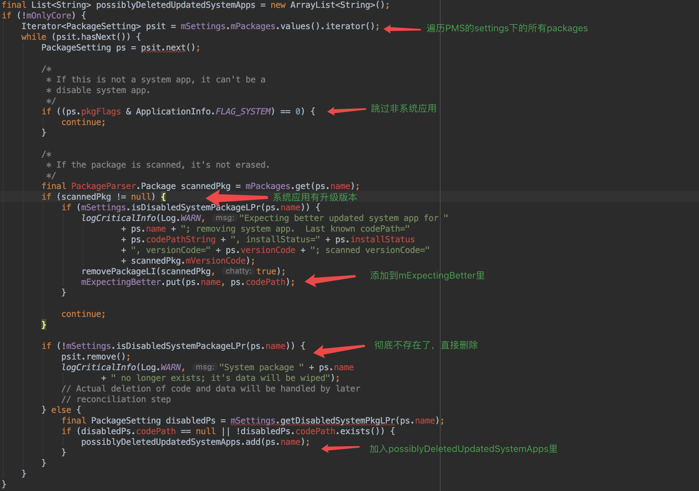

对这2个暂存数据需要等到扫描data分区的时候才能真正进行操作。

### 3、扫描其他的APK

这里就是去扫描/data分区文件，是否扫描data分区是由`mOnlyCore`来决定的，如上面onlyCore的分析。

扫描的文件夹路径：

* `/data/app`：非系统app
* `/data/app-private`：受DRM保护的app

```java
// 收集/data/app
scanDirTracedLI(mAppInstallDir, 0, 
				scanFlags | SCAN_REQUIRE_KNOWN, 0);

// 收集/data/app-private
scanDirTracedLI(mDrmAppPrivateInstallDir, 
				   mDefParseFlags | PackageParser.PARSE_FORWARD_LOCK, 
                 scanFlags | SCAN_REQUIRE_KNOWN, 0);
```

在扫描这些文件之后，PMS还做了一些清理工作：

> 接着处理`possiblyDeletedUpdatedSystemApps` 和 `mExpectingBetter`

在扫描系统目录的时候，有暂存了`possiblyDeletedUpdatedSystemApps` 和 `mExpectingBetter`的数据。现在是处理的时候了。

`possiblyDeletedUpdatedSystemApps`的处理：**首先是从清除settings中的被替换系统应用列表中剔除该package记录，如果在data分区找到了不复存在的系统应用，则将其标注为非系统应用。**

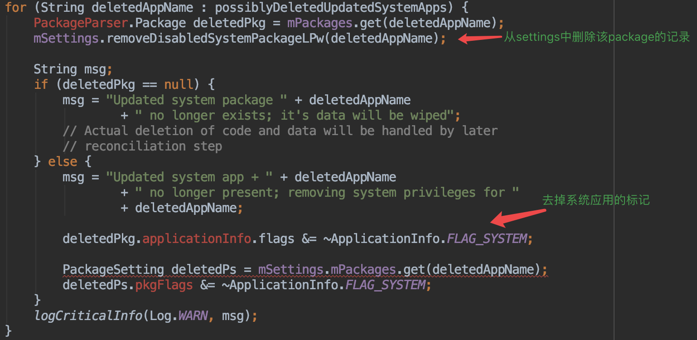

`mExpectingBetter`的处理：**如果在Data分区无法找到这些升级过的系统应用，那就是用户在OTA升级时，清除了Data分区的数据，对于这种场景，需要重新扫描一下该应用原来位于系统分区的文件。**

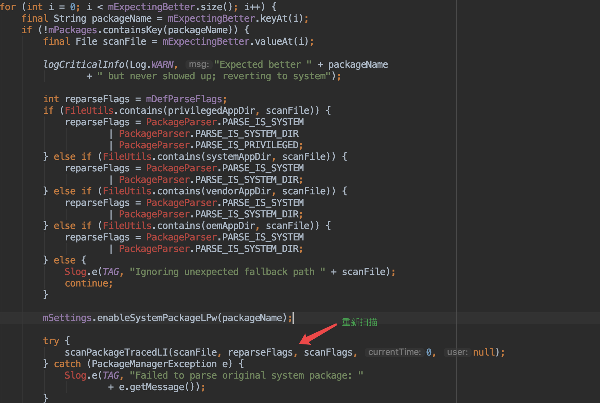

### 3.1 scanDirTracedLI()逻辑

上面的核心逻辑都逃不脱scanDirTracedLI()方法，它是完成文件扫描工作的核心。我们接下来将看看具体的流程。

**6.0开始这块的代码相较于以前有了很大的改进，通过在PMS和PackageParser之间加入ParallelPackageParser来提高扫描解析文件的效率，从而可以提高开机的速度。**

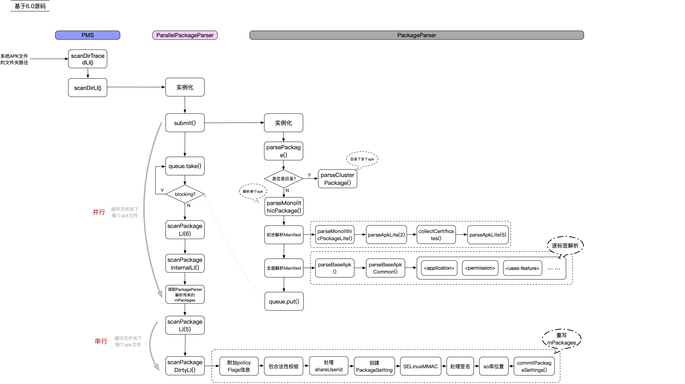

我们从三个主要步骤来分析：

> 1、轮询文件夹

每个文件夹下会有很多的apk，需要一个一个的去扫描。这里采用了**线程池+阻塞队列**的方式来处理的：

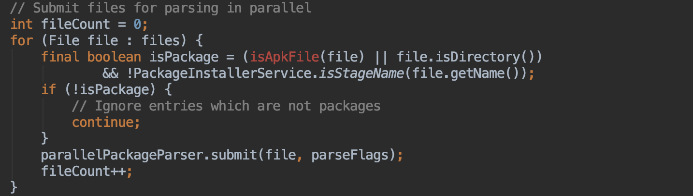

> 2、解析APK的信息

通过上面的线程池的submit，将操作发送给PackageParser对象。

```java
public Package parsePackage(File packageFile, int flags, boolean useCaches)
        throws PackageParserException {
    Package parsed = useCaches ? getCachedResult(packageFile, flags) : null;
    if (parsed != null) {
        return parsed;
    }

    if (packageFile.isDirectory()) {
        parsed = parseClusterPackage(packageFile, flags);
    } else {
        parsed = parseMonolithicPackage(packageFile, flags);
    }

    cacheResult(packageFile, flags, parsed);

    return parsed;
}
```

如果路径是文件夹，则走`parseClusterPackage()`方法，否则走`parseMonolithicPackage()`方法。`parseClusterPackage()`会再次去解开文件夹进去找apk，所以我们主要看`parseMonolithicPackage()`的逻辑。

**_理解Cluster和Monolithic_**

这个是在android L之后才有的概念，从L开始安卓系统是支持APK拆分的，就是原来一个大的APK文件被拆分成多个独立的APK，这些小的APK文件拥有相同的签名，而解析的过程就是将这些小的APK组合成一个Package。原来单独的APK我们称之为Monolithic，而拆分后的APK则称之为Cluster。

大家可以比较下android L之前和之后的手机，可以看到android L之前app是直接放在某个目录下，而android L之后则会在目录下再建个包名称一样的文件夹，这就是为了支持APK拆分而设计的。

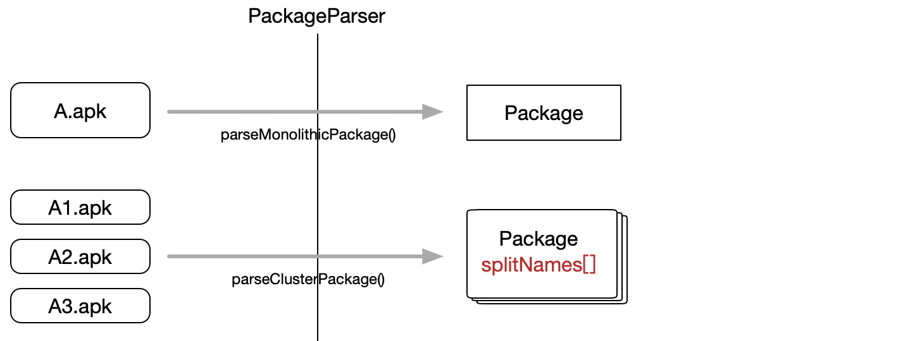

PackageParser主要就是去解析AndroidManifest.xml来得到apk里的信息：

**1、parseMonolithicPackageLite()**

初步解析，就是不会解析整个的AndroidManifest.xml，它只会分析2层tag。

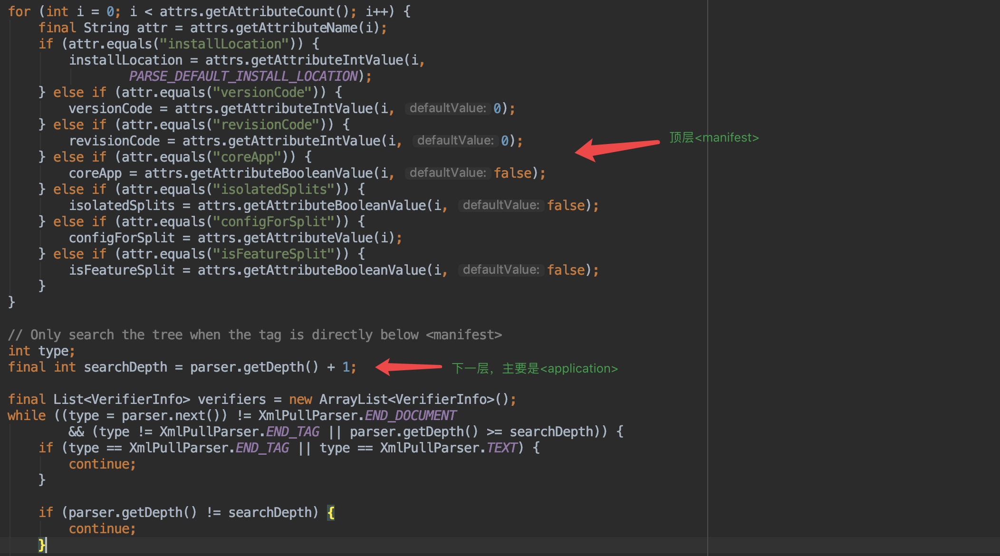

**为啥要有这么个初步分析呢？主要是做个快速的判断。**

```java
final PackageLite lite = parseMonolithicPackageLite(apkFile, flags);
if (mOnlyCoreApps) {
    if (!lite.coreApp) {
        throw new PackageParserException(INSTALL_PARSE_FAILED_MANIFEST_MALFORMED,
                "Not a coreApp: " + apkFile);
    }
}
```

**2、parseBaseApk()**

全面解析，具体代码不做分析，就是去解析AndroidManifest.xml，最后需要得到如下的数据结构：

```java
public final static class Package implements Parcelable {
	public String packageName;
	public String manifestPackageName;
	// For now we only support one application per package.
    public ApplicationInfo applicationInfo = new ApplicationInfo();

    public final ArrayList<Permission> permissions = new ArrayList<Permission>(0);
    public final ArrayList<PermissionGroup> permissionGroups = new ArrayList<PermissionGroup>(0);
    public final ArrayList<Activity> activities = new ArrayList<Activity>(0);
    public final ArrayList<Activity> receivers = new ArrayList<Activity>(0);
    public final ArrayList<Provider> providers = new ArrayList<Provider>(0);
    public final ArrayList<Service> services = new ArrayList<Service>(0);
    public final ArrayList<Instrumentation> instrumentation = new ArrayList<Instrumentation>(0);

    public final ArrayList<String> requestedPermissions = new ArrayList<String>();
    
    ... ...
}
```

> 3、汇集APK包信息到PMS

主要是将Package的数据结构进行再加工，将信息存储到PMS的PackageSetting中。

**1、assertPackageIsValid()**

这是个包合法性的校验操作，很长的一段代码，通过这个代码我们可以知道一个apk安装失败有哪些原因了，比如：

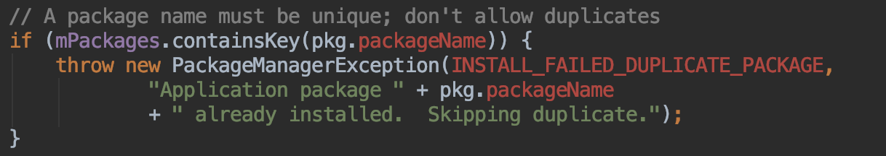

**2、处理ShareUserId的逻辑**

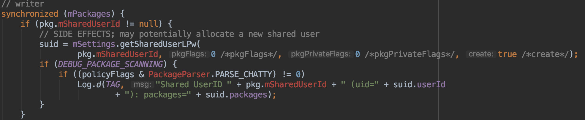

对于APK中有定义**android:ShareUserId**，则会为其创建一个ShareUserSetting对象，并将信息保存到Settings中：

下面是Settings.java中的代码：

```java
final ArrayMap<String, SharedUserSetting> mSharedUsers =
            new ArrayMap<String, SharedUserSetting>();
            
/** Gets and optionally creates a new shared user id. */
SharedUserSetting getSharedUserLPw(String name, int pkgFlags, int pkgPrivateFlags,
        boolean create) throws PackageManagerException {
    SharedUserSetting s = mSharedUsers.get(name);
    if (s == null && create) {
        s = new SharedUserSetting(name, pkgFlags, pkgPrivateFlags);
        s.userId = newUserIdLPw(s);
        if (s.userId < 0) {
            // < 0 means we couldn't assign a userid; throw exception
            throw new PackageManagerException(INSTALL_FAILED_INSUFFICIENT_STORAGE,
                    "Creating shared user " + name + " failed");
        }
        Log.i(PackageManagerService.TAG, "New shared user " + name + ": id=" + s.userId);
        mSharedUsers.put(name, s);
    }
    return s;
}
```

**3、创建PackageSetting对象**

生成PackageSetting对象，每一个APK都会对应一个PacageSetting对象，而Settings对象会保存这些包和PacageSetting对象的映射关系，而这些映射关系最后都会序列化到/data/system/packages.xml文件中。

**4、SELinuxMMAC**

**5、处理apk的签名信息**

**6、设置APK依赖的SO库**

核心的方法就是`setNativeLibraryPaths()`，就是设置给定APK包的so库的位置，而具体的位置又根据安装的方式和安装的位置的不同而有区别。大致的位置逻辑是：

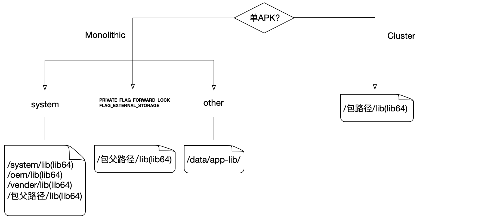

更多的细节会在后面的专门介绍安装过程的文章中分析。

**7、修改apk的安装更新时间**

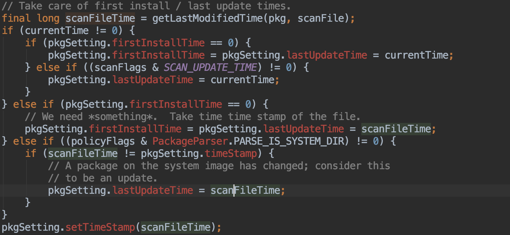

**8、commitPackageSettings()**

这个方法主要是填充PMS的数据结构，每一个包的Package数据中，会将settings、activitys、providers、services、receivers、permissions、instrumentations、broadcasts填充到PMS中。

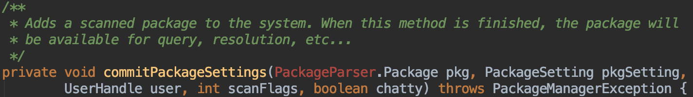

经过这个方法后，apk包才能真正的进入可运行的状态。

我们看看activitys的加入逻辑：

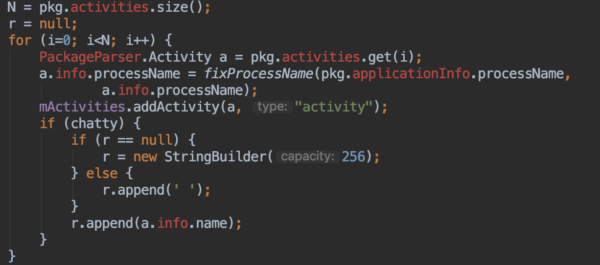

### 4、扫描结束阶段

完成了1、2、3的步骤后，就是大头的扫描工作已经完成，apk运行的环境都基本ok。

> 1、权限授权

通过调用`updatePermissionsLPw()`来完全Permission权限的授予，具体权限的概念将在后续文章中介绍。

> 2、apk的data文件夹的处理

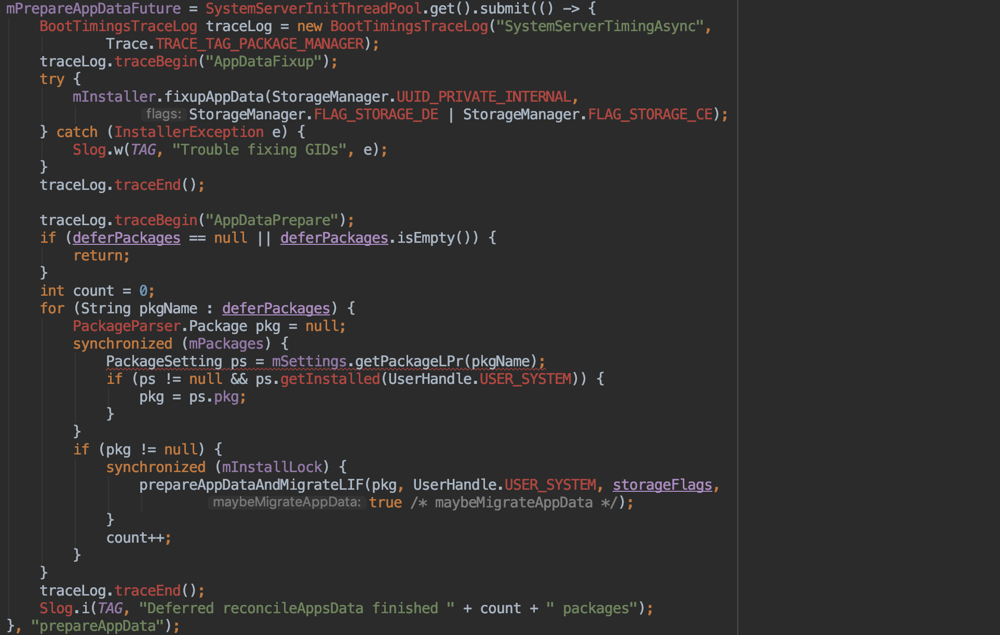

> 3、写入xml

将PMS的各个apk的信息写入到`packages.xml`里：


### 5、PMS ready阶段

这个阶段核心就是创建`PackageInstallerService`服务。

```java
public PackageInstallerService(Context context, PackageManagerService pm) {
    mContext = context;
    mPm = pm;

    mInstallThread = new HandlerThread(TAG);
    mInstallThread.start();

    mInstallHandler = new Handler(mInstallThread.getLooper());

    mCallbacks = new Callbacks(mInstallThread.getLooper());

    mSessionsFile = new AtomicFile(
            new File(Environment.getDataSystemDirectory(), "install_sessions.xml"));
    mSessionsDir = new File(Environment.getDataSystemDirectory(), "install_sessions");
    mSessionsDir.mkdirs();
}
```

这个服务是配合installd的。

### 补充1：Settings、PackageSetting和ShareUserStting的关系

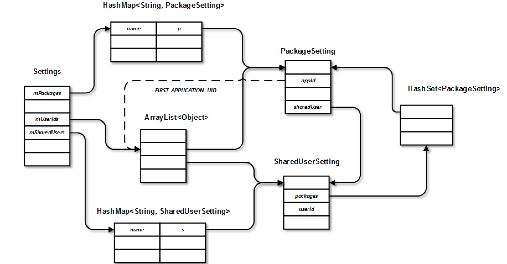

### 补充2：关于XXXLI()和XXXLP()

PMS的源码里有很多以LI或LP结尾的方法，这是啥意思呢？

**PMS的部分函数带有LI后缀，表示需要获取mInstalllock这个锁时才能执行；部分函数带有LP后缀，表示需要获取mPackages这个锁才能执行。**

### 补充3：工具类`android.os.FileUtils`

hide文件，对上层不暴露。一个操作文件的工具类，包括了权限赋予、文件uid、权限拷贝、crc32计算、文件类型等等操作。了解一下，后续的工作中可以作为文件处理的参考。

## 参考文献

[https://maoao530.github.io/2017/01/10/packagemanager/](https://maoao530.github.io/2017/01/10/packagemanager/)

[https://yq.aliyun.com/articles/61570#12](https://yq.aliyun.com/articles/61570#12)

[https://wenku.baidu.com/view/69da4ae919e8b8f67c1cb95a.html](https://wenku.baidu.com/view/69da4ae919e8b8f67c1cb95a.html)

[https://www.cnblogs.com/chenbin7/archive/2013/06/05/2865202.html](https://www.cnblogs.com/chenbin7/archive/2013/06/05/2865202.html)

[http://duanqz.github.io/2017-01-04-Package-Manage-Mechanism#32-%E6%96%87%E4%BB%B6%E6%89%AB%E6%8F%8F](http://duanqz.github.io/2017-01-04-Package-Manage-Mechanism#32-%E6%96%87%E4%BB%B6%E6%89%AB%E6%8F%8F)

[https://juejin.im/post/5bd90b6c518825278729cfaa?utm_source=gold_browser_extension](https://juejin.im/post/5bd90b6c518825278729cfaa?utm_source=gold_browser_extension)

[http://gityuan.com/2016/11/06/packagemanager/](http://gityuan.com/2016/11/06/packagemanager/)