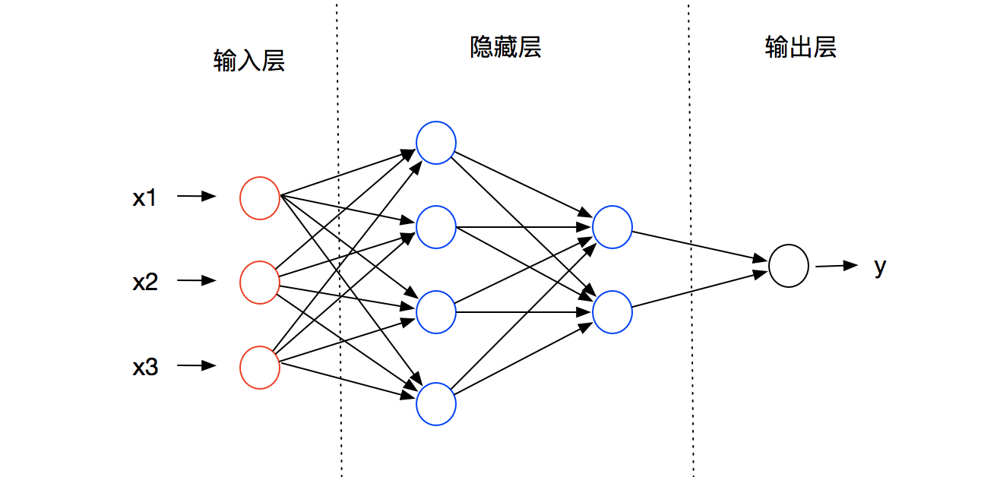
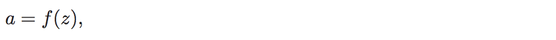
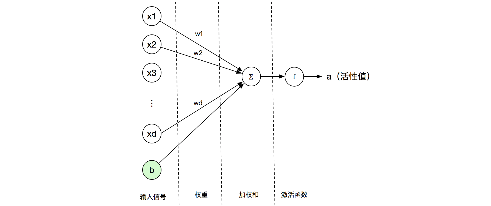
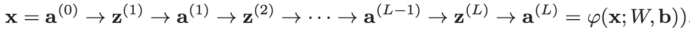
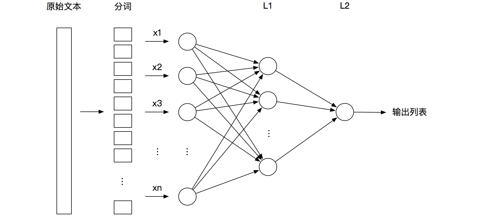
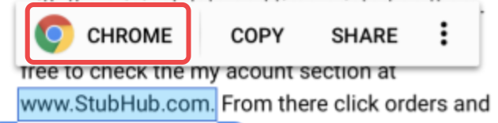
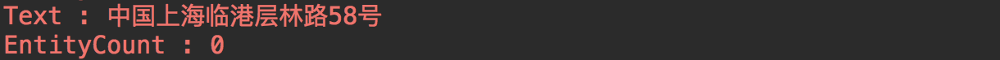
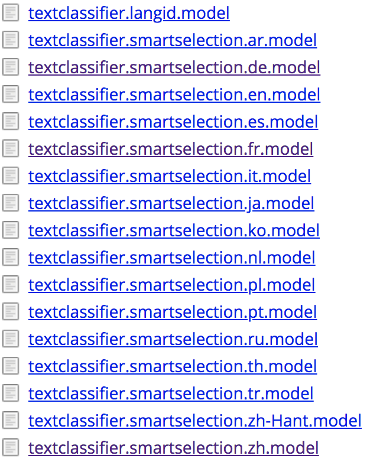

# Android P之Smart Linkify

## Linkify

这是个很老的工具类了，就是使textview称为可点击链接，它默认支持：

* web
* email
* phone
* map
* all

有2种方式设置点击链接：

* xml方式：通过`android:autoLink`设置。这种方式不是很灵活，并且不能自定义。
* code方式

> code方式详解

**系统已有的模式**

```java
public static final boolean addLinks(@NonNull Spannable text, @LinkifyMask int mask)

private static boolean addLinks(@NonNull Spannable text, @LinkifyMask int mask, @Nullable Context context)

public static final boolean addLinks(@NonNull TextView text, @LinkifyMask int mask)
```

如果不需要定制的话，则直接使用上面的方式进行添加可点击链接即可。

核心代码：

```java
private static boolean addLinks(@NonNull Spannable text, @LinkifyMask int mask,
	    @Nullable Context context) {
	if (mask == 0) {
	    return false;
	}
	
	URLSpan[] old = text.getSpans(0, text.length(), URLSpan.class);
	
	for (int i = old.length - 1; i >= 0; i--) {
	    text.removeSpan(old[i]);
	}
	
	ArrayList<LinkSpec> links = new ArrayList<LinkSpec>();
	
	if ((mask & WEB_URLS) != 0) {
	    gatherLinks(links, text, Patterns.AUTOLINK_WEB_URL,
	        new String[] { "http://", "https://", "rtsp://" },
	        sUrlMatchFilter, null);
	}
	
	if ((mask & EMAIL_ADDRESSES) != 0) {
	    gatherLinks(links, text, Patterns.AUTOLINK_EMAIL_ADDRESS,
	        new String[] { "mailto:" },
	        null, null);
	}
	
	if ((mask & PHONE_NUMBERS) != 0) {
	    gatherTelLinks(links, text, context);
	}
	
	if ((mask & MAP_ADDRESSES) != 0) {
	    gatherMapLinks(links, text);
	}
	
	pruneOverlaps(links);
	
	if (links.size() == 0) {
	    return false;
	}
	
	for (LinkSpec link: links) {
        applyLink(link.url, link.start, link.end, text);
    }
	
	return true;
}
```

步骤：

1. 清除textview里的所有的span（**所有系统和自定义混合使用的时候，一定要先设置系统的**）
2. 如果是web模式，则解析textview里有的web链接
3. 如果是email模式，则解析textview里有的email链接
4. 如果是phone模式，则解析textview里有的phone链接
5. 如果是map模式，则解析textview里有的map链接
6. 去掉textview的overlap
7. 调用`applyLink()`方法给所有的可点击链接加上下划线

**自定义模式**

```java
public static final void addLinks(@NonNull TextView text, @NonNull Pattern pattern, @Nullable String scheme)

public static final void addLinks(@NonNull TextView text, @NonNull Pattern pattern,@Nullable String scheme, @Nullable MatchFilter matchFilter, @Nullable TransformFilter transformFilter)

... ...
```

如果是自定义模式，则需要调用上面的方法（方法很多，未完全列出来），**其核心就是通过正则去匹配**，所以这种自定义模式必须要传入一个Pattern值。

核心代码：

```java
public static final boolean addLinks(@NonNull Spannable spannable, @NonNull Pattern pattern,
        @Nullable  String defaultScheme, @Nullable String[] schemes,
        @Nullable MatchFilter matchFilter, @Nullable TransformFilter transformFilter) {
    final String[] schemesCopy;
    if (defaultScheme == null) defaultScheme = "";
    if (schemes == null || schemes.length < 1) {
        schemes = EmptyArray.STRING;
    }

    schemesCopy = new String[schemes.length + 1];
    schemesCopy[0] = defaultScheme.toLowerCase(Locale.ROOT);
    for (int index = 0; index < schemes.length; index++) {
        String scheme = schemes[index];
        schemesCopy[index + 1] = (scheme == null) ? "" : scheme.toLowerCase(Locale.ROOT);
    }

    boolean hasMatches = false;
    Matcher m = pattern.matcher(spannable);

    while (m.find()) {
        int start = m.start();
        int end = m.end();
        boolean allowed = true;

        if (matchFilter != null) {
            allowed = matchFilter.acceptMatch(spannable, start, end);
        }

        if (allowed) {
            String url = makeUrl(m.group(0), schemesCopy, m, transformFilter);

            applyLink(url, start, end, spannable);
            hasMatches = true;
        }
    }

    return hasMatches;
}
```

步骤：

1. 通过正则去查找匹配项
2. 生成展现的可点击url
3. 调用`applyLink()`方法给所有的可点击链接加上下划线
4. 重复1、2、3，知道字符串扫描结束

例子：

```java
@Override
protected void onCreate(Bundle savedInstanceState) {
    super.onCreate(savedInstanceState);
    setContentView(R.layout.activity_main);
    TextView tv = (TextView) findViewById(R.id.tv);
    Pattern p = Pattern.compile("tencent://\\S*");
    Linkify.addLinks(tv, p, "mm"); 
}
```

对于自定义的模式，由于没有具体的activity去处理，所以会crash，需要定义可处理的activity：

```xml
<activity android:name=".MmActivity">
    <intent-filter>
        <action android:name="android.intent.action.VIEW" />   
        <category android:name="android.intent.category.DEFAULT" />
        <data android:scheme="tencent" />
    </intent-filter>
</activity>
```

> 补充

其实要实现类似Linkify的功能还有其他的方式：

* **Html.fromHtml()**：将需要的字符串解析成html
* **SpannableString**：就是通过SpannableString来装饰字符串（Linkify内部就是这种方式）

## Smart Linkify

Smart Linkify是在基于Android O发布的`Smart Text Selection`的基础上，加入机器学习和神经网络相关的内容来进一步提升识别推断的能力。

### 前馈神经网络

Smart Linkify首先引入小型的前馈神经网络来寻找对象，因为在文本中找出风格迥异写法的手机号和邮箱地址是很困难的一件事情。

> 理论基础

前馈神经网络是目前三大神经网络结构中的一种：

* **前馈网络**
* 反馈网络
* 图网络

前馈网络将各个神经元按照接收信息的先后顺序分为不同的组，每一组相当于一个神经层，每一次神经元仅接收前一层神经元的输出作为自己的输入，整个网络只会在一个方向上进行传播。

前馈网络将第0层称之为输入层，最后一层称之为输出层，其他中间层称之为隐藏层。



这里会涉及到一些数学概念：

* L：表示神经网络的层数；
* m<sup>(l)</sup>：表示第l层神经元的个数
* f<sup>l(·)</sup>：表示l层神经元的激活函数
* W<sup>(l)</sup>：表示l−1层到第l层的权重矩阵
* b<sup>(l)</sup>：表示l−1层到第l层的偏置
* z<sup>(l)</sup>：表示l层神经元的净输入
* a<sup>(l)</sup>：表示l层神经元的输出

为了更好的理解层的输入输出，我们先了解下神经元的输入输出。

**神经元**

神经元的生物特征就是通过多个树突接受信号，通过唯一轴突来传递信息。人工神经元的功能就是对生物神经元的抽象。

最早的神经元是心理学家McCulloch和数学家Pitts提出的**M-P神经元**，它的特点是激活函数是阶跃函数，现代神经元在M-P神经元的基础上发展，最大区别就是激活函数是连续可导的。

人工神经元处理数据的过程如下：


* 接受信号：x = [x1, x2, x3,...,xn]
* 信号权重：w = [w1, w2, w3,...,wn]
* 偏置：b
 * 偏置可以理解成为了使图像有平移的功能而加入的常量值，如果没有偏置，那么所有图像就必交于一固定点

神经元首先用输入信号做加权计算，得到X的加权和：


将结果z经过激活函数（activation function）的非线性化处理得到该神经元的活性值（activation）a。



整个的流程可以用一张图表示为：



**为啥需要激活函数呢？**

从上面可以看出，加权求和后的方程是线性的，线性方程的特点就是复杂性较低，无法去模拟复杂类型的数据，如音视频之类的。没有经过激活函数处理的神经网络仅仅可以理解成线性回归模型。

而且线性方程是无法收敛的，对于神经网络需要梯度下降来做收敛是无法满足的。

目前流行的激活函数有：

* Sigmoid
* tanh
* softplus
* softsign
* ELU
* ReLU
* ... ...

激活函数的具体内容不分析，感兴趣的同学可以自行google。

理解完了神经元的运行，再回到神经网络上，他的计算就是一层一层的往下计算了：

z<sup>(l)</sup> = w<sup>(l)</sup>*a<sup>(l-1)</sup> + b<sup>(l)</sup>

a<sup>(l-1)</sup> = f<sub>(l-1)</sub>(z<sup>(l-1)</sup>)

前馈神经网络通过逐层的信息传递，最后得到的输出是a<sup>(L)</sup>。



> 在Smart Linkify中的应用

Smart Linkify里采用了两个紧凑低延时的前馈神经网络。神经网络的训练集是来源于是从网络上收集过来的，生成地址、电话等其他对应的列表。据了解，google的训练集的采集做到了针对不同的语言特征而采用了不同的算法。

大致流程如下：

1. 对输入文本进行分词的提取，生成输入向量A
2. 将输入向量A投入到神经网络中，第一层的神经网络为每个分词分配一个值（0~1），根据分词所代表的有效性和置信度，得分低的分词将从列表中删除，从而得到下一层的输入向量B
3. 第二层神经网络对输入向量B进行分类

图形可描述为：



**PS：对于google的具体操作是对网上各个片段信息的整合，也不一定是准确的。**

## TextClassifier API

这个是google提供出来的基于上面神经网络对文本进行分类的API。跟上层开发比较有关系的几个类如下：

#### TextClassificationManager.java

这个是文本分类服务，主要提供了访问和设置`TextClassifier`的方法。和其他的系统服务一样，也是通过`getSystemService()`来获取：

```java
TextClassificationManager tcm = getSystemService(TextClassificationManager.class);
```

#### TextClassifier.java

是文本分类的接口定义，系统缺省的实现是`TextClassifierImpl`。

它目前定义了文本分类的类别：

* TYPE_UNKNOWN
* TYPE_OTHER
* TYPE_EMAIL
* TYPE_PHONE
* TYPE_ADDRESS
* TYPE_URL

核心的方法：

```java
public TextSelection suggestSelection(
   CharSequence text,
   int selectionStartIndex,
   int selectionEndIndex,
   LocaleList defaultLocales
)

public TextClassification classifyText(
	CharSequence text, 
	int startIndex, 
	int endIndex, 
	LocaleList defaultLocales
)
```

上面2个方法都是得到文本的分类，`TextClassification`和`TextSelection`都记录了文本分类的一些基本信息。

#### TextSelection.java

文本分类的基本信息，包括：

* getText()：被分类的文本
* getEntityCount()：可能的分类个数
* getConfidenceScore()：每个分类的置信度值（0~1）
* getEntity()：被归为的类别
* getSelectionStartIndex()：文本被分类的开始位置
* getSelectionEndIndex()：文本被分类的结束位置

#### TextClassification.java

文本分类的基本信息，包括：

* getText()：被分类的文本
* getEntityCount()：可能的分类个数
* getConfidenceScore()：每个分类的置信度值（0~1）
* getEntity()：被归为的类别
* getIcon()、getLabel()、getIntent()、getOnClickListener()：这些可以看成是为了显示快捷方式和点击直接调转，如图(红框)：
 

#### TextClassifierImpl.java

TextClassifier.java的默认实现类。当自己不设置的时候，系统就默认使用这个。

#### SmartSelection.java

native library interface的java包装层：

```java
static {
    System.loadLibrary("textclassifier");
}

private static native int[] nativeSuggest(
      long context, String text, int selectionBegin, int selectionEnd);

private static native ClassificationResult[] nativeClassifyText(
      long context, String text, int selectionBegin, int selectionEnd, int hintFlags);
```

大致的关系图为：


### 实例介绍

我们通过一个实例来看看，输出的结果是怎样的。

```java
public class MainActivity2 extends Activity {
    public static final String TAG = "111";

    @RequiresApi(api = Build.VERSION_CODES.O)
    @Override
    protected void onCreate(Bundle savedInstanceState) {
        super.onCreate(savedInstanceState);

        TextClassificationManager tcm = getSystemService(TextClassificationManager.class);
        final TextClassifier tc = tcm.getTextClassifier();

        String phone = "13671283112";
        String phone2 = "+8613671283112";
        String url = "http://www.baidu.com";
        String url2 = "www.baidu.com";
        String email = "hcjext@163.com";
        String address = "No.58,CengLin Road,Lingang,Shanghai,China";
        String chinese = "中国上海临港层林路58号";
        String other = "This is an apple";
        String other2 = "This is an 13671283112 apple";
        final List<String> texts = new ArrayList<>(Arrays.asList(phone, phone2, url, url2, email, address,chinese, other, other2));

        new Thread(new Runnable() {
            @Override
            public void run() {
                for (String text : texts) {
                    TextClassification result = tc.classifyText(text, 0, text.length(), LocaleList.getDefault());
                    int entCount = result.getEntityCount();
                    Log.e(TAG, "Text : " + text);
                    Log.e(TAG, "EntityCount : " + String.valueOf(entCount));
                    for (int i = 0; i < entCount; i++) {
                        String ent = result.getEntity(i);
                        Log.e(TAG, "entity: " + ent
                                + ", score: " + result.getConfidenceScore(ent)
                                + ", label: " + result.getLabel()
                                + ", intent:  " + result.getIntent());
                    }
                }

                for (String text : texts) {
                    TextSelection result = tc.suggestSelection(text, 0, text.length(), LocaleList.getDefault());
                    int entCount = result.getEntityCount();
                    Log.e(TAG, "Text : " + text);
                    Log.e(TAG, "EntityCount : " + String.valueOf(entCount));
                    for (int i = 0; i < entCount; i++) {
                        String ent = result.getEntity(i);
                        Log.e(TAG, "entity: " + ent
                                + ", score: " + result.getConfidenceScore(ent)
                                + ", start: " + result.getSelectionStartIndex()
                                + ", end:  " + result.getSelectionEndIndex());
                    }
                }
            }
        }).start();
    }
}
```

当在英文环境下时TextClassification返回的信息：


**有没有注意到这个这个EntityCount是0？？**



因为没有使用到中文的网络语言模型，所以识别不了，反馈网络是要基于已经学习的模型来判断的。

### 关于语言模型

语言模型是怎么使用的呢？我们看下TextClassifierImpl类：

```java
private static final String MODEL_DIR = "/etc/textclassifier/";
private static final String MODEL_FILE_REGEX = "textclassifier\\.smartselection\\.(.*)\\.model";
private static final String UPDATED_MODEL_FILE_PATH = "/data/misc/textclassifier/textclassifier.smartselection.model";
```

这3个参数其实告知语言模型存放的位置，从哪里可以读取到模型。我的测试机上的【android 26的模拟器】：


可以看到只有en的语言模型。

实际的读取是在`getFactoryModelFilePathsLocked()`里操作的：

```java
private Map<Locale, String> getFactoryModelFilePathsLocked() {
    if (mModelFilePaths == null) {
        final Map<Locale, String> modelFilePaths = new HashMap<>();
        final File modelsDir = new File(MODEL_DIR);
        if (modelsDir.exists() && modelsDir.isDirectory()) {
            final File[] models = modelsDir.listFiles();
            final Pattern modelFilenamePattern = Pattern.compile(MODEL_FILE_REGEX);
            final int size = models.length;
            for (int i = 0; i < size; i++) {
                final File modelFile = models[i];
                final Matcher matcher = modelFilenamePattern.matcher(modelFile.getName());
                if (matcher.matches() && modelFile.isFile()) {
                    final String language = matcher.group(1);
                    final Locale locale = Locale.forLanguageTag(language);
                    modelFilePaths.put(locale, modelFile.getAbsolutePath());
                }
            }
        }
        mModelFilePaths = modelFilePaths;
    }
    return mModelFilePaths;
}
```

> 如何安装其他模型？

目前google支持如下语言的模型：



安装的方式有**预安装**，或**将模型作为系统映像来更新**。这块的google的介绍比较少，我也没太弄明白~

## 参考文献

[https://nndl.github.io/](https://nndl.github.io/)

[http://www.atyun.com/26326.html](http://www.atyun.com/26326.html)

[https://source.android.com/devices/tech/display/textclassifier](https://source.android.com/devices/tech/display/textclassifier)

[https://android.googlesource.com/platform/external/libtextclassifier/+/refs/heads/oreo-dev/Android.mk](https://android.googlesource.com/platform/external/libtextclassifier/+/refs/heads/oreo-dev/Android.mk)
