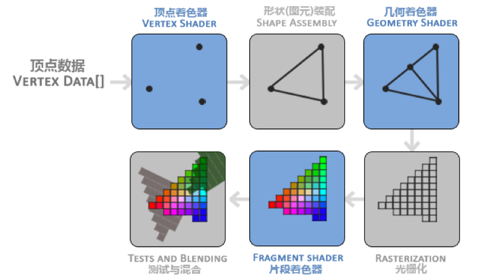
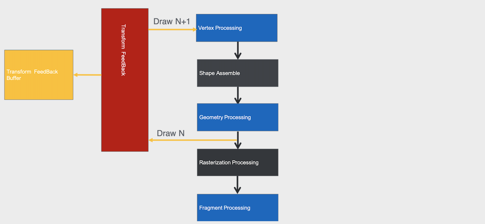
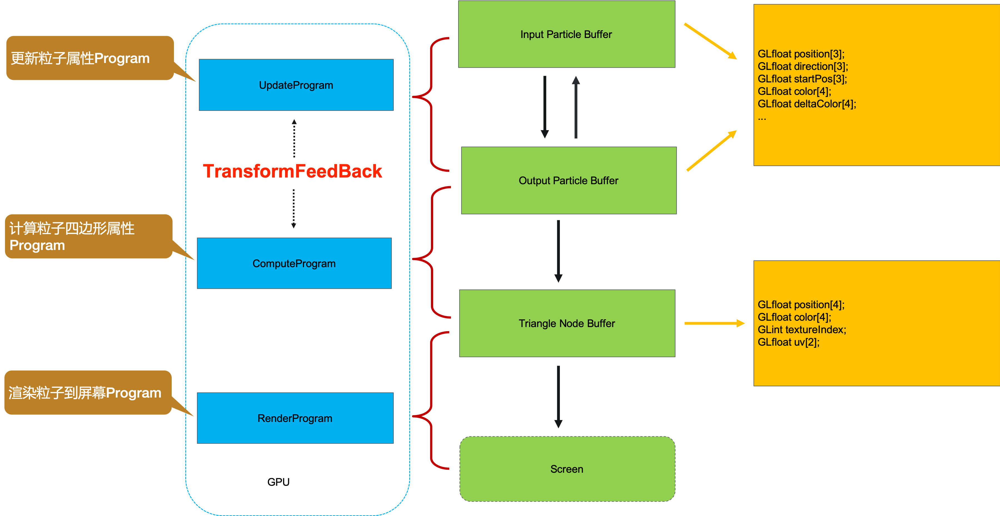

# Transform Feedback介绍

## 概述

一般情况下，经过顶点着色器或几何着色器之后的顶点数据是直接发到下面的处理流程中的：



那如果我们想在顶点着色器或几何着色器之后捕获经过GPU处理之后的数据该怎么办呢？



Transform Feedback的一个优势是把顶点着色器处理后的数据写回顶点缓冲区对象（Vertex Buffer Objects, VBOs），避免GPU、CPU之间往返拷贝数据，节省时间。由于iOS使用统一内存模型，GPU、CPU数据实际都在存储在主存，而Android不一定，如Nexus 6P，映射GPU地址到CPU，经我们团队测试，大约消耗20ms。

## 基本操作和API

一个实际的例子：通过GPU来计算平方根，并获得平方根的结果值。

```c
// Headers
#include <cstdio>
#include <stdio.h>
#include <stdlib.h>
#include <vector>
#include <algorithm>
#include <GL/glew.h>
#include <GLFW/glfw3.h>
#include <glm/glm.hpp>
#include <glm/gtc/matrix_transform.hpp>
#include <glm/gtx/norm.hpp>
using namespace glm;

// Vertex shader
const GLchar* vertexShaderSrc = "#version 150 core\n"
                                "    in float inValue;\n"
                                "    out float outValue;\n"
                                "    void main()\n"
                                "    {\n"
                                "        outValue = sqrt(inValue);\n"
                                "    }";

int main()
{
    // Initialize GLEW
    if( !glfwInit() )
    {
        fprintf( stderr, "Failed to initialize GLFW\n" );
        getchar();
        return -1;
    }

    // Compile shader
    GLuint shader = glCreateShader(GL_VERTEX_SHADER);
    glShaderSource(shader, 1, &vertexShaderSrc, nullptr);
    glCompileShader(shader);

    // Create program and specify transform feedback variables
    GLuint program = glCreateProgram();
    glAttachShader(program, shader);

    const GLchar* feedbackVaryings[] = { "outValue" };
    glTransformFeedbackVaryings(program, 1, feedbackVaryings, GL_INTERLEAVED_ATTRIBS);

    glLinkProgram(program);
    glUseProgram(program);

    // Create VAO，使用VBO前，可以配置VAO，不配置也不影响运行结果。
    GLuint vao;
    glGenVertexArrays(1, &vao);
    glBindVertexArray(vao);

    // Create input VBO and vertex format
    GLfloat data[] = { 1.0f, 2.0f, 3.0f, 4.0f, 5.0f };

    GLuint vbo;
    glGenBuffers(1, &vbo);
    glBindBuffer(GL_ARRAY_BUFFER, vbo);
    glBufferData(GL_ARRAY_BUFFER, sizeof(data), data, GL_STATIC_DRAW);

    GLint inputAttrib = glGetAttribLocation(program, "inValue");
    glEnableVertexAttribArray(inputAttrib);
    glVertexAttribPointer(inputAttrib, 1, GL_FLOAT, GL_FALSE, 0, 0);

    // Create transform feedback buffer
    GLuint tbo;
    glGenBuffers(1, &tbo);
    glBindBuffer(GL_ARRAY_BUFFER, tbo);
    glBufferData(GL_ARRAY_BUFFER, sizeof(data), nullptr, GL_STATIC_READ);

    // Perform feedback transform
    glEnable(GL_RASTERIZER_DISCARD);

    glBindBufferBase(GL_TRANSFORM_FEEDBACK_BUFFER, 0, tbo);

    glBeginTransformFeedback(GL_POINTS);
    glDrawArrays(GL_POINTS, 0, 5);
    glEndTransformFeedback();

    // 由于我们不打算画任何东西，光栅化器应该被禁用
    glDisable(GL_RASTERIZER_DISCARD);
    // 等待结果
    glFlush();

    // Fetch and print results
    GLfloat feedback[5];
    glGetBufferSubData(GL_TRANSFORM_FEEDBACK_BUFFER, 0, sizeof(feedback), feedback);
    printf("result：%f %f %f %f %f\n", feedback[0], feedback[1], feedback[2], feedback[3], feedback[4]);

    // 清理数据
    glDeleteProgram(program);
    glDeleteShader(shader);
    glDeleteBuffers(1, &tbo);
    glDeleteBuffers(1, &vbo);
    glDeleteVertexArrays(1, &vao);

    return 0;
}
```

更多例子[Transform feedback示例解析](https://blog.csdn.net/niu2212035673/article/details/79041437)

**Transform Feedback缓存**：transform feedback对象主要用于管理将顶点捕捉到缓存对象的相关状态，这个状态中包含了链接到transform feedback缓存绑定点的缓存对象，transform feedback对象必须和一个缓存对象绑定才能输出数据，它本身是不存储输出数据的。

有2个方式进行绑定：

> glBindBufferBase

将整个缓存绑定到transform feedback上：

```c
void glBindBufferBase(	GLenum target,
 	GLuint index,
 	GLuint buffer);
```

* target: 绑定目标必须设为GL_TRANSFORM_FEEDBACK_BUFFER
* index: 缓存绑定点索引，表示使用第N个输出属性

> glBindBufferRange

将缓存的部分绑定到transform feedback上：

```c
void glBindBufferRange(	GLenum target,
 	GLuint index,
 	GLuint buffer,
 	GLintptr offset,
 	GLsizeiptr size);
```

**绑定Transform Feedback输出变量**：在transform feedback过程中顶点着色器可能会输出多个变量。与transform feedback对象所绑定的缓存需要记录那些变量，这些都需要在应用程序中设置。

> glTransformFeedbackVaryings

设置缓存记录的变量

```c
void glTransformFeedbackVaryings(	GLuint program,
 	GLsizei count,
 	const char **varyings,
 	GLenum bufferMode);
```

* bufferMode：捕获变量的模式
 * `GL_INTERLEAVED_ATTRIBS`(分量模式)：将所有属性写入一个缓冲区对象
 * `GL_SEPARATE_ATTRIBS`（交叉模式）：将属性写入多个缓冲区对象，或将不同的偏移量写入缓冲区 

**启动和停止Transform Feedback**：transform feedback可以随时启动或停止，甚至暂停，如果启动transform feedback时，它并没有处于暂停的状态，它会重新开始将数据记录到当前绑定的ransform feedback缓存中，不过如果transform feedback正处于暂停的状态，那么再次启动它将会从之前暂停的位置开始记录。

> glBeginTransformFeedback

```c
void glBeginTransformFeedback(GLenum primitiveMode);
void glEndTransformFeedback(void);
``` 
* primitiveMode：指定输出的模式，`GL_POINTS`、`GL_LINES`、`GL_TRIANGLES`

**从Transform Feedback取数据**：我们可以从TF中获取到存储好的数据。

```c
GLfloat feedback[5];
glGetBufferSubData(GL_TRANSFORM_FEEDBACK_BUFFER, 0, sizeof(feedback), feedback);
```

**Transform Feedback对象（OpenGL 4.0）**：transform feedback状态封装在一个transform feedback对象中，这个状态中包括所有记录顶点数据的缓存对象等，transform feedback对象的创建和其他的缓存对象类似，首先要创建一个对象名称，然后绑定到OpenGL环境中。

> glGenTransformFeedbacks

创建对象名

```c
void glGenTransformFeedbacks(	GLsizei n,
 	GLuint *ids);
```

> glBindTransformFeedback

绑定到OpenGL环境

> glDeleteTransformFeedbacks

删除对象

> glDrawTransformFeedback

绘制Transform Feedback的内容

## Transform Feedback的实际的使用场景

GPU粒子系统的有效的利用了GPU的并行性的特点，但是它存在一个严重的问题：
**GPU计算好的数据需要写回CPU，在下次计算的时候再传给GPU。**


这是就需要用TF的方式来每个粒子计算的结果：




