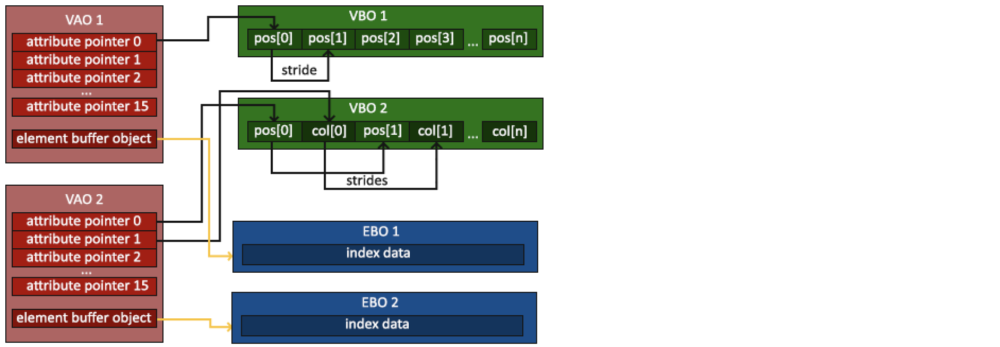
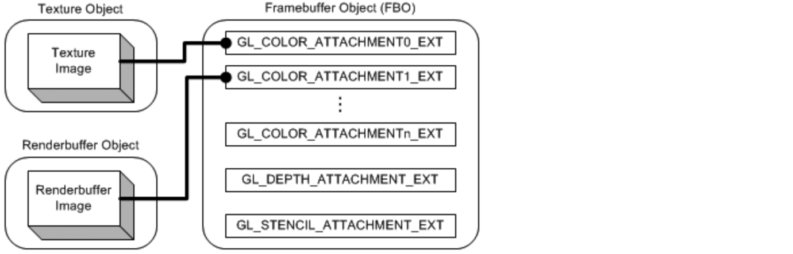
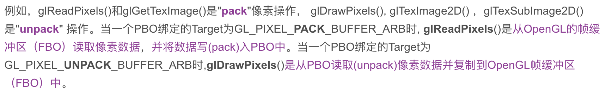
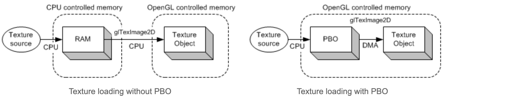

# VBO、VAO、EBO（IBO）、FBO和PBO介绍

## 顶点缓冲对象（Vertex Buffer Objects，VBO）

顶点缓冲对象VBO是在显卡存储空间中开辟出的一块内存缓存区，用于存储顶点的各类属性信息，如顶点坐标，顶点法向量，顶点颜色数据等。在渲染时，可以直接从VBO中取出顶点的各类属性数据，由于VBO在显存而不是在内存中，不需要从CPU传输数据，处理效率更高。

可以开辟很多个VBO，每个VBO在OpenGL中有唯一标识的ID，这个ID对应着具体的VBO的显存地址，通过这个ID可以对特定的VBO内的数据进行存取操作。

```java
// 初始化
GLfloat vertices[] = {
    0.0f, 0.0f,
    1.0f, 0.0f, 
    0.0f, 1.0f
}

GLuint vbo;
glGenBuffer(1, &vbo);
glBindBuffer(GL_ARRAY_BUFFER, vbo);
glBufferData(GL_ARRAY_BUFFER, sizeof(vertices), vertices, GL_STREAM_DRAW);

...

// 绘制
glBindBuffer(GL_ARRAY_BUFFER, vbo);
glEnableVertexAttribArray(0);
glVertexAttribPointer(0, 2, GL_FLOAT, GL_FALSE, 2, (void*)0);
glDrawArray(GL_TRIANGLES, 0, 3);

... 
```

在**初始化阶段**，VBO是不知道它所存储的是什么数据，而是在**渲染阶段glVertexAttribPointer()**才确定数据作用类型（顶点位置、float类型、从偏移量0处开始采集数据、2个float算一个采集步长等等），到真正**绘制操作glDrawArray()/glDrawElement()**的时候才从VBO里读取需要的数据进入渲染流水线。

## 顶点数组对象（Vertex Arrary Object，VAO）

VBO保存了一个模型的顶点属性信息，每次绘制模型之前需要绑定顶点的所有信息，当数据量很大时，重复这样的动作变得非常麻烦。VAO可以把这些所有的配置都存储在一个对象中，每次绘制模型时，只需要绑定这个VAO对象就可以了

VAO本身并没有存储顶点的相关属性数据，这些信息是存储在VBO中的，VAO相当于是对很多个VBO的引用，把一些VBO组合在一起作为一个对象统一管理。

```java
// 初始化
unsigned int VAO;
glGenVertexArrays(1, &VAO);  
glBindVertexArray(VAO);

glBindBuffer(GL_ARRAY_BUFFER, VBO);
glBufferData(GL_ARRAY_BUFFER, sizeof(vertices), vertices, GL_STATIC_DRAW);

glBindBuffer(GL_ELEMENT_ARRAY_BUFFER, EBO);
glBufferData(GL_ELEMENT_ARRAY_BUFFER, sizeof(indices), indices, GL_STATIC_DRAW);

glVertexAttribPointer(0, 3, GL_FLOAT, GL_FALSE, 3 * sizeof(float), (void*)0);
glEnableVertexAttribArray(0); 

...

// 绘制
glBindVertexArray(VAO);
glDrawElements(GL_TRIANGLES, 6, GL_UNSIGNED_INT, 0)
glBindVertexArray(0);
```

**VBO是优化性能的，VAO是用来简化绘制代码的。**

## 索引缓冲对象（Element Buffer Object，EBO）

**EBO又可以理解为IBO（Index Buffer Object）**

索引缓冲对象EBO相当于OpenGL中的顶点数组的概念，是为了解决同一个顶点多次重复调用的问题，可以减少内存空间浪费，提高执行效率。当需要使用重复的顶点时，通过顶点的位置索引来调用顶点，而不是对重复的顶点信息重复记录，重复调用。

EBO中存储的内容就是顶点位置的索引indices，EBO跟VBO类似，也是在显存中的一块内存缓冲器，只不过EBO保存的是顶点的索引。

```java
// 初始化
GLuint EBO;
glGenBuffers(1, &EBO);
glBindBuffer(GL_ELEMENT_ARRAY_BUFFER, EBO);
glBufferData(GL_ELEMENT_ARRAY_BUFFER, sizeof(indices), indices, GL_STATIC_DRAW);

// 绘制
glDrawElements(GL_TRIANGLES, 6, GL_UNSIGNED_INT, 0);
```

> 总结

VBO、VAO和EBO的关系可以描述如下：



一个完整的例子：

```java
// set up vertex data (and buffer(s)) and configure vertex attributes
// ------------------------------------------------------------------
float vertices[] = {
     0.5f,  0.5f, 0.0f,  // top right
     0.5f, -0.5f, 0.0f,  // bottom right
    -0.5f, -0.5f, 0.0f,  // bottom left
    -0.5f,  0.5f, 0.0f   // top left 
};
unsigned int indices[] = {  // note that we start from 0!
    0, 1, 3,  // first Triangle
    1, 2, 3   // second Triangle
};
unsigned int VBO, VAO, EBO;
glGenVertexArrays(1, &VAO);
glGenBuffers(1, &VBO);
glGenBuffers(1, &EBO);
// bind the Vertex Array Object first, then bind and set vertex buffer(s), and then configure vertex attributes(s).
glBindVertexArray(VAO);

glBindBuffer(GL_ARRAY_BUFFER, VBO);
glBufferData(GL_ARRAY_BUFFER, sizeof(vertices), vertices, GL_STATIC_DRAW);

glBindBuffer(GL_ELEMENT_ARRAY_BUFFER, EBO);
glBufferData(GL_ELEMENT_ARRAY_BUFFER, sizeof(indices), indices, GL_STATIC_DRAW);

glVertexAttribPointer(0, 3, GL_FLOAT, GL_FALSE, 3 * sizeof(float), (void*)0);
glEnableVertexAttribArray(0);

// note that this is allowed, the call to glVertexAttribPointer registered VBO as the vertex attribute's bound vertex buffer object so afterwards we can safely unbind
glBindBuffer(GL_ARRAY_BUFFER, 0); 

// remember: do NOT unbind the EBO while a VAO is active as the bound element buffer object IS stored in the VAO; keep the EBO bound.
//glBindBuffer(GL_ELEMENT_ARRAY_BUFFER, 0);

// You can unbind the VAO afterwards so other VAO calls won't accidentally modify this VAO, but this rarely happens. Modifying other
// VAOs requires a call to glBindVertexArray anyways so we generally don't unbind VAOs (nor VBOs) when it's not directly necessary.
glBindVertexArray(0); 
```

## 帧缓冲对象（Frame Buffer Object，FBO）

一个FBO也包含一些存储颜色、深度和模板数据的区域。

下图显示了帧缓存对象、纹理对象和渲染缓存对象之间的联系：



在一个FBO中有多个颜色关联点（`GL_COLOR_ATTACHMENT0_EXT`...`GL_COLOR_ATTACHMENTn_EXT`），一个深度关联点（`GL_DEPTH_ATTACHMENT_EXT`），和一个模板关联点（`GL_STENCIL_ATTACHMENT_EXT`）。

每个FBO中至少有一个颜色关联点，其数目与实体显卡相关。可以通过`GL_MAX_COLOR_ATTACHMENTS_EXT`来查询颜色关联点的最大数目。

FBO提供了一种高效的切换机制；将前面的帧缓存关联图像从FBO分离，然后把新的帧缓存关联图像关联到FBO。在帧缓存关联图像之间切换比在FBO之间切换要快得多。FBO提供了glFramebufferTexture2DEXT()来切换2D纹理对象和glFramebufferRenderbufferEXT()来切换渲染缓存对象。

创建frame buffer的方式如下：

```java
int frameBuffer = GL30.glGenFramebuffers();
//generate name for frame buffer
GL30.glBindFramebuffer(GL30.GL_FRAMEBUFFER, frameBuffer);
//create the framebuffer
GL11.glDrawBuffer(GL30.GL_COLOR_ATTACHMENT0);
//indicate that we will always render to color attachment 0
return frameBuffer;
```

## 像素缓冲区对象（Pixel Buffer Object，PBO）

为了缓冲区对象不仅能存储顶点数据，还能存储像素数据，而同VBO的框架设计了PBO，但是多个2个"Target"标签，来指明绑定的PBO做什么不同的操作：

* `GL_PIXEL_PACK_BUFFER_ARB`：传递像素数据到PBO中
* `GL_PIXEL_UNPACK_BUFFER_ARB`：从PBO中传回数据



PBO的最大优势是通过DMA(Direct Memory Access) 快速地在显卡上传递像素数据，而不影响CPU的时钟周期（中断）。



创建pixel buffer和VBO基本上是一致的，具体步骤：

1. 使用glGenBuffers()新建一个缓冲区对象
2. 使用glBindBuffer()绑定一个缓冲区对象
3. 使用glBufferData()复制像素信息到缓冲区对象

## 参考文章

[VAO 与 VBO 的前世今生](https://www.photoneray.com/opengl-vao-vbo/)

[http://www.songho.ca/opengl/gl_pbo.html#pack](http://www.songho.ca/opengl/gl_pbo.html#pack)