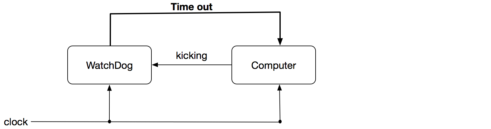
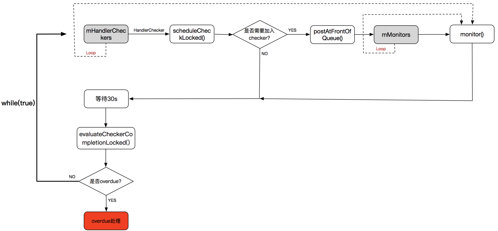
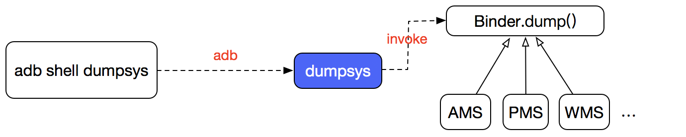
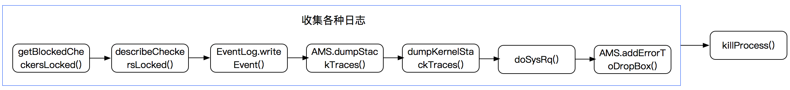
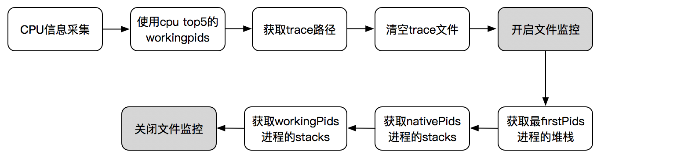

# Framework WatchDog原理分析

前面一篇文章论述过[安卓进程启动流程](./安卓进程启动流程.md)，在system_server启动的时候有个WatchDog类，这个类是用来干什么的呢？今天就来看下它的作用与实现原理。源码分析基于android27。

## WatchDog的由来

WatchDog概念最早来自于单片机，**用来解决单片机系统发生故障或死锁时的自恢复问题**。WatchDog其实是个计时器，更为规范的称谓是**computer operating properly timer(COP timer)**。

WatchDog在系统启动的时候设置一个倒计时，系统在运行的过程中需要不断的去reset这个倒计时，以防止它变成0，这个操作叫做**kicking**。如果倒计时结束，则会发出一个timeout signal来进行校正操作，如系统重启。



更具体的关于系统WatchDog介绍请看[https://en.wikipedia.org/wiki/Watchdog_timer](https://en.wikipedia.org/wiki/Watchdog_timer)

## Framework里的WatchDog

安卓里的Framework WatchDog是用来防止系统服务出现问题。

我们将从3个大的方面来剖析WatchDog：

* **WatchDog的初始化**
* **WatchDog的检测**
* **WatchDog的处理**

### WatchDog的初始化

WatchDog其实是个Thread类，它是在system_server进程启动的时候一起启动的，在SystemServer的`startOtherServices()`方法里触发：

```java
private void startOtherServices() {
	... ...
	traceBeginAndSlog("InitWatchdog");
    final Watchdog watchdog = Watchdog.getInstance();
    watchdog.init(context, mActivityManagerService);
    traceEnd();
    ... ...
    mActivityManagerService.systemReady(new Runnable() {

       public void run() {
          traceBeginAndSlog("StartWatchdog");
          Watchdog.getInstance().start();
          traceEnd();
       }
    }
    ... ...
}
```

Watchdog采用单例模式，在`getInstance()`方法里完成了对象的实例化：

```java
private Watchdog() {
    super("watchdog");
    mMonitorChecker = new HandlerChecker(FgThread.getHandler(),
            "foreground thread", DEFAULT_TIMEOUT);
    mHandlerCheckers.add(mMonitorChecker);
    // Add checker for main thread.  We only do a quick check since there
    // can be UI running on the thread.
    mHandlerCheckers.add(new HandlerChecker(new Handler(Looper.getMainLooper()),
            "main thread", DEFAULT_TIMEOUT));
    // Add checker for shared UI thread.
    mHandlerCheckers.add(new HandlerChecker(UiThread.getHandler(),
            "ui thread", DEFAULT_TIMEOUT));
    // And also check IO thread.
    mHandlerCheckers.add(new HandlerChecker(IoThread.getHandler(),
            "i/o thread", DEFAULT_TIMEOUT));
    // And the display thread.
    mHandlerCheckers.add(new HandlerChecker(DisplayThread.getHandler(),
            "display thread", DEFAULT_TIMEOUT));

    // Initialize monitor for Binder threads.
    addMonitor(new BinderThreadMonitor());

    mOpenFdMonitor = OpenFdMonitor.create();

    // See the notes on DEFAULT_TIMEOUT.
    assert DB ||
            DEFAULT_TIMEOUT > ZygoteConnectionConstants.WRAPPED_PID_TIMEOUT_MILLIS;
}
```

> 1、Looper Checker

**对消息队列的检测，检测是否有服务长时间的占用Looper。**而这是通过server_service进程里的几个公共的线程实现的：

* **FgThread**：线程优先级为0
* **UiThread**：线程优先级为-2，并且线程组设置为`THREAD_GROUP_TOP_APP`
* **IoThread**：线程优先级为0
* **DisplayThread**：线程优先级为-3

因为线程是公共的，所以线程都是单例模式。

我们看个使用的示例（WMS里截屏的一个操作），使用到了FgThread：

```java
@Override
public boolean requestAssistScreenshot(final IAssistScreenshotReceiver receiver) {
    if (!checkCallingPermission(READ_FRAME_BUFFER,
            "requestAssistScreenshot()")) {
        throw new SecurityException("Requires READ_FRAME_BUFFER permission");
    }

    FgThread.getHandler().post(() -> {
        Bitmap bm = screenshotApplications(null /* appToken */, DEFAULT_DISPLAY,
                -1 /* width */, -1 /* height */, true /* includeFullDisplay */,
                1f /* frameScale */, Bitmap.Config.ARGB_8888, false /* wallpaperOnly */,
                false /* includeDecor */);
        try {
            receiver.send(bm);
        } catch (RemoteException e) {
        }
    });

    return true;
}
```

关于哪些系统服务使用了哪些线程，可以参考[System server里创建常见的几个thread](https://blog.csdn.net/songyinzhong/article/details/52275031)

> 2、Monitor Checker

**检测是否长时间持有了系统服务的对象锁，也就是阻塞了。**

```java
private static final class BinderThreadMonitor implements Watchdog.Monitor {
    @Override
    public void monitor() {
        Binder.blockUntilThreadAvailable();
    }
}
```

这个是监控binder线程是否出现了阻塞。

> 3、添加需要检测的对象

WatchDog的核心是检测服务是否出现异常，那系统服务如AMS、PMS等等都是怎么加入到WatchDog检测系统中的呢？

系统服务要加入到WatchDog检测，可以有2种方式：

**addMonitor()**

也就是Monitor Checker。如果有服务要采用这种方式，则需要实现`Monitor`接口

```java
public void addMonitor(Monitor monitor) {
    synchronized (this) {
        if (isAlive()) {
            throw new RuntimeException("Monitors can't be added once the Watchdog is running");
        }
        mMonitorChecker.addMonitor(monitor);
    }
}
```

**addThread()**

也就是Looper Checker，需要检测的系统服务将需要检测的Handler给到WatchDog：

```java
public void addThread(Handler thread, long timeoutMillis) {
    synchronized (this) {
        if (isAlive()) {
            throw new RuntimeException("Threads can't be added once the Watchdog is running");
        }
        final String name = thread.getLooper().getThread().getName();
        mHandlerCheckers.add(new HandlerChecker(thread, name, timeoutMillis));
    }
}
```

当然，系统服务也可以同时使用这2种检测，如AMS就是这样的：

```java
public ActivityManagerService(Context systemContext) {
    ... ...
	mHandlerThread = new ServiceThread(TAG,THREAD_PRIORITY_FOREGROUND, false /*allowIo*/);
    mHandlerThread.start();
    mHandler = new MainHandler(mHandlerThread.getLooper());
    Watchdog.getInstance().addMonitor(this);
	Watchdog.getInstance().addThread(mHandler);
}
```

> 4、init()

这个很简单，就是注册`ACTION_REBOOT`的广播。

```java
public void init(Context context, ActivityManagerService activity) {
    context.registerReceiver(new RebootRequestReceiver(),
            new IntentFilter(Intent.ACTION_REBOOT),
            android.Manifest.permission.REBOOT, null);
}
```

### WatchDog的检测

WatchDog是个Thread类，在ActivityManagerService.systemReady()里将触发线程的运行。

检测的流程：



> 1、scheduleCheckLocked() 

```java
public void scheduleCheckLocked() {
    if (mMonitors.size() == 0 && mHandler.getLooper().getQueue().isPolling()) {
        mCompleted = true;
        return;
    }

    if (!mCompleted) {
        // we already have a check in flight, so no need
        return;
    }

    mCompleted = false;
    mCurrentMonitor = null;
    mStartTime = SystemClock.uptimeMillis();
    mHandler.postAtFrontOfQueue(this);
}
```

如果HandlerChecker里的mMonitors为空，并且当前的loop是alive的则不需要启动检查，否则将通过Handle将当前的runnable发送到MQ的最前面执行。

`postAtFrontOfQueue()`后会触发runnable执行：

```java
@Override
public void run() {
    final int size = mMonitors.size();
    for (int i = 0 ; i < size ; i++) {
        synchronized (Watchdog.this) {
            mCurrentMonitor = mMonitors.get(i);
        }
        mCurrentMonitor.monitor();
    }
}
```

> 2、等待

不是马上就去检查是否是overdue，而是先会等待30s，这个30s就是检查的间隔。

```java
long start = SystemClock.uptimeMillis();
while (timeout > 0) {
    if (Debug.isDebuggerConnected()) {
        debuggerWasConnected = 2;
    }
    try {
        wait(timeout);
    } catch (InterruptedException e) {
        Log.wtf(TAG, e);
    }
    if (Debug.isDebuggerConnected()) {
        debuggerWasConnected = 2;
    }
    timeout = CHECK_INTERVAL - (SystemClock.uptimeMillis() - start);
}
```

这里使用的是`uptimeMillis()`时间方法，这个在系统sleep的时候是不会增长的。

> 3、evaluateCheckerCompletionLocked()

WatchDog定义了完成的state值：

* **COMPLETED（0）**：完成，只有在mMonitors为空，并且当前的loop是alive的场景
* **WAITING（1）**：等待时间小于30s
* **WAITED_HALF（2）**：等待时间再30s~60s之间
* **OVERDUE（3）**：超过了60s，异常情况

```java
private int evaluateCheckerCompletionLocked() {
    int state = COMPLETED;
    for (int i=0; i<mHandlerCheckers.size(); i++) {
        HandlerChecker hc = mHandlerCheckers.get(i);
        state = Math.max(state, hc.getCompletionStateLocked());
    }
    return state;
}
```

就是找到mHandlerCheckers里state值最大的，以最大的值来判断整个系统服务运行的状态。

下面的代码片段是HandlerChecker的state值的计算方法：

```java
public int getCompletionStateLocked() {
    if (mCompleted) {
        return COMPLETED;
    } else {
        long latency = SystemClock.uptimeMillis() - mStartTime;
        if (latency < mWaitMax/2) {
            return WAITING;
        } else if (latency < mWaitMax) {
            return WAITED_HALF;
        }
    }
    return OVERDUE;
}
```

COMPLETED、WAITING状态直接忽略，WAITED_HALF则拉取堆栈日志，这个后面具体分析。

## 安卓日志系统

在我们开始WatchDog的处理逻辑之前，我们需要先来了解下安卓系统中的日志系统，因为后面的处理跟日志系统有很大的关系。

### 1、logcat

logcat其实分多种类型的日志缓冲区：

* **events**：用于系统诊断性事件记录，系统诊断性事件通常用来记录一定的系统级别的操作，如GC、watchdog等。它对应的是`android.util.EventLog`工具类，将写入到**/dev/log/events**，并且这个日志还会补充写入到**/system/etc/event-log-tags**
* **system**：系统相关的日志，如系统服务。它对应的是`android.util.Slog`工具类，将写入到**/dev/log/system**
* **radio**：通信模块相关的日志，它对应的是`android.util.Slog`工具类，将写入到**/dev/log/radio**
* **main**：这个就是我们在logcat里看到的日志，对应的是`android.util.Log`工具类，将写入到**/dev/log/main**

我们重点看下EventLog，下面是eventlog打下的日志

```json
I/am_create_activity( 1008): [0,338534098,7730,com.tencent.ttpic.dev/com.tencent.ttpic.module.MainActivity,android.intent.action.MAIN,NULL,NULL,270532608,com.sec.android.app.launcher]
I/wm_task_created( 1008): [7730,1]
I/wm_task_moved( 1008): [7730,1,1]
I/am_pause_activity( 1008): [0,243002110,com.sec.android.app.launcher/com.android.launcher2.Launcher]
I/power_partial_wake_state( 1008): [1,ActivityManager-Launch]
I/am_on_paused_called( 1815): [0,com.android.launcher2.Launcher]
I/am_restart_activity( 1008): [0,338534098,7730,com.tencent.ttpic.dev/com.tencent.ttpic.module.MainActivity]
I/am_on_resume_called(23478): [0,com.tencent.ttpic.module.MainActivity]
I/sf_frame_dur(  261): [com.sec.android.app.launcher/com.android.launcher2.Launcher,34,2,0,0,0,0,4]
I/choreographer_frame_skip(23478): [23478,24]
I/am_activity_launch_time( 1008): [0,338534098,com.tencent.ttpic.dev/com.tencent.ttpic.module.MainActivity,625,6001520,0]
I/power_partial_wake_state( 1008): [1,LocationManagerService]
I/power_partial_wake_state( 1008): [1,LocationManagerService]
```

关于日志的解释请看[Android EventLog含义](http://gityuan.com/2016/05/15/event-log/)。

### 2、dumpsys

dumpsys可以查看几乎所有的系统服务的信息。



核心是dumpsys，它的实现是在`frameworks/native/cmds/dumpsys/dumpsys.cpp`里，具体的代码就不贴了，主要是做了下面几件事情：

1. 获取ServiceManager，这个是系统服务注册的地方
2. 解析argv参数，根据参数设置不同的执行指令
3. 获取需要输入日志的系统服务
4. 调用系统服务的dump()方法

所有的系统服务都会实现Binder.dump()方法：

```java
protected void dump(@NonNull FileDescriptor fd, @NonNull PrintWriter fout,@Nullable String[] args) { }
```

关于dumpsys命令的使用请参考[dumpsys命令用法](http://gityuan.com/2016/05/14/dumpsys-command/)

### 3、dropbox

上面有提到logcat缓冲区，但是它有大小的限制，历史的日志会被冲洗掉。dropbox的引入就是将日志持久化，尽可能的保存可能多历史日志，所有的历史日志都是保存在`/data/system/dropbox`（查看需要root权限）。

dropbox日志大多数情况下是系统服务在使用（当然我们也可以在上层应用的开发中使用）。注意，dropbox是一条记录就是一个文件，如果文件超过了大小则会进行gzip压缩。

dropbox的核心类：

* DropBoxManager.java
* DropBoxManagerService.java

关于dropbox的更细节的介绍请参考[Android DropBoxManager Service](http://xiaocong.github.io/blog/2012/11/21/to-introduce-android-dropboxmanager-service/)

在DropBoxManager完成写日志到文件的时候，它会发出一个系统的广播`android.intent.action.DROPBOX_ENTRY_ADDED`，但应用层无法捕获。

### 3、traces

记录了一个时间段的函数调用栈信息，记录在`/data/anr/traces.txt`。

## WatchDog的处理

发现了系统服务出现了异常，那怎么处理呢？



> 1、写EventLog

对有阻塞的系统服务写记录日志到eventlog中，一个阻塞服务一条记录：

```java
public String describeBlockedStateLocked() {
    if (mCurrentMonitor == null) {
        return "Blocked in handler on " + mName + " (" + getThread().getName() + ")";
    } else {
        return "Blocked in monitor " + mCurrentMonitor.getClass().getName()
                + " on " + mName + " (" + getThread().getName() + ")";
    }
}
```

> 2、AMS.dumpStackTraces()

这里主要是写traces.txt文件，流程上是和ANR是一样的。



**2.1 cup信息采集**

```java
public static File dumpStackTraces(boolean clearTraces, ArrayList<Integer> firstPids,
            ProcessCpuTracker processCpuTracker, SparseArray<Boolean> lastPids,
            ArrayList<Integer> nativePids) {
            
            ... ...
            processCpuTracker.init();
            try {
                Thread.sleep(200);
            } catch (InterruptedException ignored) {
            }

            processCpuTracker.update();
            ... ...
}
```

主要是调用`ProcessCpuTracker.java`类里的update()方法，而这个方法主要是读取`/proc/stat`里的数据。

**2.2 获取trace路径**

trace路径的路径是写到系统环境里的，通过如下方式获取：

```java
SystemProperties.get("dalvik.vm.stack-trace-dir", "");
或
SystemProperties.get("dalvik.vm.stack-trace-file", null);
```

**2.3 firstPids、nativePids、workingPids**

firstPids就是`system_server`进程的pid

nativePids的进程包括2部分：`NATIVE_STACKS_OF_INTEREST` 和 `HAL_INTERFACES_OF_INTEREST`

它们的定义在：

```java
public static final String[] NATIVE_STACKS_OF_INTEREST = new String[] {
    "/system/bin/audioserver",
    "/system/bin/cameraserver",
    "/system/bin/drmserver",
    "/system/bin/mediadrmserver",
    "/system/bin/mediaserver",
    "/system/bin/sdcard",
    "/system/bin/surfaceflinger",
    "media.extractor", // system/bin/mediaextractor
    "media.codec", // vendor/bin/hw/android.hardware.media.omx@1.0-service
    "com.android.bluetooth",  // Bluetooth service
};

public static final List<String> HAL_INTERFACES_OF_INTEREST = Arrays.asList(
    "android.hardware.audio@2.0::IDevicesFactory",
    "android.hardware.bluetooth@1.0::IBluetoothHci",
    "android.hardware.camera.provider@2.4::ICameraProvider",
    "android.hardware.graphics.composer@2.1::IComposer",
    "android.hardware.media.omx@1.0::IOmx",
    "android.hardware.sensors@1.0::ISensors",
    "android.hardware.vr@1.0::IVr"
);
```

workingPids是排除上面进程的工作进程。

**2.4 文件监控**

整个dump的操作必须在20s内完成，否则直接终止。

**2.5 dumpJavaTracesTombstoned() 和 dumpNativeBacktraceToFileTimeout()**

获取firstPids和workingPids进程的堆栈就是调用的dumpJavaTracesTombstoned()这个方法操作的，而nativePids则是调用dumpNativeBacktraceToFileTimeout()方法操作的。

```java
private static long dumpJavaTracesTombstoned(int pid, String fileName, long timeoutMs) {
    final long timeStart = SystemClock.elapsedRealtime();
    if (!Debug.dumpJavaBacktraceToFileTimeout(pid, fileName, (int) (timeoutMs / 1000))) {
        Debug.dumpNativeBacktraceToFileTimeout(pid, fileName,
                (NATIVE_DUMP_TIMEOUT_MS / 1000));
    }

    return SystemClock.elapsedRealtime() - timeStart;
}
```

dumpJavaTracesTombstoned() 和 dumpNativeBacktraceToFileTimeout()实际的操作都是在`core/jni/android_os_Debug.cpp`里：

```java
static jboolean android_os_Debug_dumpJavaBacktraceToFileTimeout(JNIEnv* env, jobject clazz,
        jint pid, jstring fileName, jint timeoutSecs) {
    const bool ret =  dumpTraces(env, pid, fileName, timeoutSecs, kDebuggerdJavaBacktrace);
    return ret ? JNI_TRUE : JNI_FALSE;
}
static jboolean android_os_Debug_dumpNativeBacktraceToFileTimeout(JNIEnv* env, jobject clazz,
        jint pid, jstring fileName, jint timeoutSecs) {
    const bool ret = dumpTraces(env, pid, fileName, timeoutSecs, kDebuggerdNativeBacktrace);
    return ret ? JNI_TRUE : JNI_FALSE;
}
```

> 3、dumpKernelStackTraces()

dump内核的堆栈信息：

```java
private File dumpKernelStackTraces() {
    String tracesPath = SystemProperties.get("dalvik.vm.stack-trace-file", null);
    if (tracesPath == null || tracesPath.length() == 0) {
        return null;
    }

    native_dumpKernelStacks(tracesPath);
    return new File(tracesPath);
}
```

> 4、doSysRq()

```java
doSysRq('w');
doSysRq('l');

//
private void doSysRq(char c) {
    try {
        FileWriter sysrq_trigger = new FileWriter("/proc/sysrq-trigger");
        sysrq_trigger.write(c);
        sysrq_trigger.close();
    } catch (IOException e) {
        Slog.w(TAG, "Failed to write to /proc/sysrq-trigger", e);
    }
}
```

通知系统内核来dump出所有阻塞线程，并且输出所有CPU的backtrace到kernel log。

这是用到了**sysrq**概念。

这个也是Linux系统里的概念，它的作用是在系统个出现无法响应的时候，可以通过按键真的的方式来完成预先定义的系统操作，比如保证磁盘数据的安全不丢失、手机无响应的日志等等。

具体预先定义的方法请看[https://kernel.googlesource.com/pub/scm/linux/kernel/git/pjt/test/+/v2.6.13-rc3/Documentation/sysrq.txt](https://kernel.googlesource.com/pub/scm/linux/kernel/git/pjt/test/+/v2.6.13-rc3/Documentation/sysrq.txt)

使用也很简单，就是向`/proc/sysrq-trigger`文件写入我们的指令，如：

```shell
# 立即重新启动计算机
echo "b" > /proc/sysrq-trigger

# 导出线程状态信息
echo "t" > /proc/sysrq-trigger
```

> 5、写入DropBox

将ActivityManagerService.dumpStackTraces()获取的stacks信息写入到DropBox里。

> 6、killProcess()

```java
Process.killProcess(Process.myPid());
System.exit(10);
``` 

当杀死system_server进程，从而导致zygote进程自杀，进而触发init执行重启Zygote进程，手机就会重启。

## 参考文章

[http://gityuan.com/2016/06/21/watchdog/](http://gityuan.com/2016/06/21/watchdog/)

[https://blog.csdn.net/songyinzhong/article/details/52275031](https://blog.csdn.net/songyinzhong/article/details/52275031)

[http://duanqz.github.io/2015-10-12-Watchdog-Analysis#3-%E9%97%AE%E9%A2%98%E5%88%86%E6%9E%90%E6%96%B9%E6%B3%95](http://duanqz.github.io/2015-10-12-Watchdog-Analysis#3-%E9%97%AE%E9%A2%98%E5%88%86%E6%9E%90%E6%96%B9%E6%B3%95)

[http://xiaocong.github.io/blog/2012/11/21/to-introduce-android-dropboxmanager-service/](http://xiaocong.github.io/blog/2012/11/21/to-introduce-android-dropboxmanager-service/)