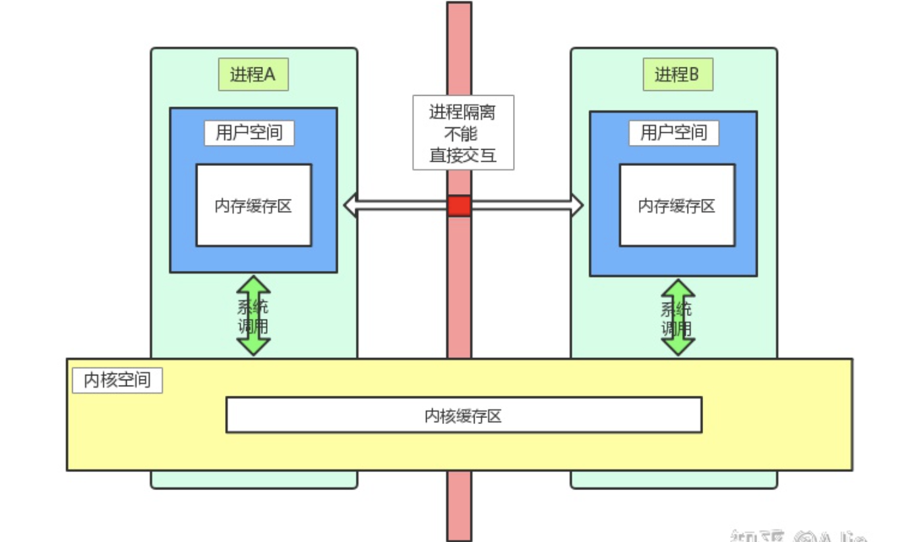

# binder的一些东西

## 原始IPC的缺陷

传统的IPC过程如下：

1. 数据发送方进程将数据放在内存缓存区，通过系统调用陷入内核态 
2. 内核程序在内核空间开辟一块内核缓存区，通过 copy_from_user 函数将数据从数据发送方用户空间的内存缓存区拷贝到内核空间的内核缓存区中 
3. 数据接收方进程在自己的用户空间开辟一块内存缓存区
4. 内核程序将内核缓存区中通过 copy_to_user 函数将数据拷贝到数据接收方进程的内存缓存区



这有2个主要的问题：

* 性能低，因为需要2次数据拷贝
* 空间浪费，接收方进程事先不知道需要开辟多大的内存用于存放数据，因此需要开辟尽可能大的空间或者事先调用 API 来解决这个问题

## binder的优化

Binder IPC 通信过程如下：

 1. Binder 驱动在内核空间创建一个数据接收缓存区 
 2. 然后在内核空间开辟一块内存缓存区并与数据接收缓存区建立映射关系，同时，建立数据接收缓存区与数据接收方的内存缓存区的映射关系 
 3. 数据发送方通过系统调用 copy_from_user 函数将数据从内存缓存区拷贝到内核缓存区，由于内核缓存区通过数据接收缓存区跟数据接收方的内存缓存区存在间接的映射关系，相当于将数据直接拷贝到了接收方的用户空间，这样便完成了一次 IPC 的过程

 

更为具体的描述，binder如何做到1次拷贝


核心是通过内存映射：

> Binder IPC 机制中涉及到的内存映射通过 mmap() 来实现，mmap() 是操作系统中一种内存映射的方法。内存映射简单的讲就是将用户空间的一块内存区域映射到内核空间，映射关系建立后，用户对这块内存区域的修改可以直接反应到内核空间；反之内核空间对这段区域的修改也能直接反应到用户空间。


## 再次梳理下AIDL的工作流程


我们看一下生成的AIDL文件骨架：

```java
public interface IMyAidlInterface extends android.os.IInterface 
{
	... ...
	public static class Default implements com.example.aidl.IMyAidlInterface 
	{
		... ...
	}
	
	public static abstract class Stub extends android.os.Binder implements com.example.aidl.IMyAidlInterface 
	{
		... ...
		private static class Proxy implements com.example.aidl.IMyAidlInterface 
		{
			... ...
		}
	}
}
```

### Stub

Stub下的`asInterface`方法：

```java
public static com.example.aidl.IMyAidlInterface asInterface(android.os.IBinder obj)
{
  if ((obj==null)) {
    return null;
  }
  android.os.IInterface iin = obj.queryLocalInterface(DESCRIPTOR);
  if (((iin!=null)&&(iin instanceof com.example.aidl.IMyAidlInterface))) {
    return ((com.example.aidl.IMyAidlInterface)iin);
  }
  return new com.example.aidl.IMyAidlInterface.Stub.Proxy(obj);
}
```

如果启动的service是同一个进程，那么会直接走进if里面，所有的调用都是本地调用了；如果不是同一个进程，那么会走到Proxy。

那上面这个方法在哪里触发的呢？—— 答案是在`onServiceConnected`

```java
private class MyServiceConnection(private val context: Context) : ServiceConnection {

        override fun onServiceConnected(name: ComponentName?, service: IBinder?) {
            (context as MainActivity).assistService = IMyAidlInterface.Stub.asInterface(service)
        }

        override fun onServiceDisconnected(name: ComponentName?) {
            Log.e("111", "unbind service")
        }

    }
```

### Proxy

如上面的代码，Proxy会拿到远程Stub的IBinder对象

```java
private android.os.IBinder mRemote;
Proxy(android.os.IBinder remote)
{
	mRemote = remote;
}
@Override public android.os.IBinder asBinder()
{
	return mRemote;
}
```

后面就是直接组装Parcel，然后通过mRemote来触发远程服务：

```java
mRemote.transact(Stub.TRANSACTION_basicTypes, _data, _reply, 0);
```

这里最终会调用到Stub下的`onTransact`方法：

```java
@Override public boolean onTransact(int code, android.os.Parcel data, android.os.Parcel reply, int flags) throws android.os.RemoteException
{
  java.lang.String descriptor = DESCRIPTOR;
  switch (code)
  {
    case INTERFACE_TRANSACTION:
    {
      reply.writeString(descriptor);
      return true;
    }
    case TRANSACTION_basicTypes:
    {
      data.enforceInterface(descriptor);
      int _arg0;
      _arg0 = data.readInt();
      long _arg1;
      _arg1 = data.readLong();
      boolean _arg2;
      _arg2 = (0!=data.readInt());
      float _arg3;
      _arg3 = data.readFloat();
      double _arg4;
      _arg4 = data.readDouble();
      java.lang.String _arg5;
      _arg5 = data.readString();
      this.basicTypes(_arg0, _arg1, _arg2, _arg3, _arg4, _arg5);
      reply.writeNoException();
      return true;
    }
    default:
    {
      return super.onTransact(code, data, reply, flags);
    }
  }
}
```

## 理解in、out、inout关键字

这几个关键字是用来指出数据流通的方向的。

aidl接口定义：

```java
interface IPersonManager {
    void addPersonIn(in Person person);
    void addPersonOut(out Person person);
    void addPersonInout(inout Person person);
}
```

服务端实现：

```java
override fun addPersonIn(person: Person?) {
    log(TAG,"服务端 addPersonIn() person = $person")
    person?.name = "被addPersonIn修改"
}

override fun addPersonOut(person: Person?) {
    log(TAG,"服务端 addPersonOut() person = $person}")
    person?.name = "被addPersonOut修改"
}

override fun addPersonInout(person: Person?) {
    log(TAG,"服务端 addPersonInout() person = $person}")
    person?.name = "被addPersonInout修改"
}
```

客户端实现：

```java
private fun addPersonIn() {
    var person = Person("寒冰")
    log(TAG, "客户端 addPersonIn() 调用之前 person = $person}")
    remoteServer?.addPersonIn(person)
    log(TAG, "客户端 addPersonIn() 调用之后 person = $person}")
}

private fun addPersonOut() {
    var person = Person("蛮王")
    log(TAG, "客户端 addPersonOut() 调用之前 person = $person}")
    remoteServer?.addPersonOut(person)
    log(TAG, "客户端 addPersonOut() 调用之后 person = $person}")
}

private fun addPersonInout() {
    var person = Person("艾克")
    log(TAG, "客户端 addPersonInout() 调用之前 person = $person}")
    remoteServer?.addPersonInout(person)
    log(TAG, "客户端 addPersonInout() 调用之后 person = $person}")
}
```

输出：

```
//in 方式  服务端那边修改了,但是服务端这边不知道
客户端 addPersonIn() 调用之前 person = Person(name=寒冰) hashcode = 142695478}
服务端 addPersonIn() person = Person(name=寒冰) hashcode = 38642374
客户端 addPersonIn() 调用之后 person = Person(name=寒冰) hashcode = 142695478}

//out方式 客户端能感知服务端的修改,且客户端不能向服务端传数据
//可以看到服务端是没有拿到客户端的数据的!
客户端 addPersonOut() 调用之前 person = Person(name=蛮王) hashcode = 15787831}
服务端 addPersonOut() person = Person(name=) hashcode = 231395975}
客户端 addPersonOut() 调用之后 person = Person(name=被addPersonOut修改) hashcode = 15787831}

//inout方式 客户端能感知服务端的修改
客户端 addPersonInout() 调用之前 person = Person(name=艾克) hashcode = 143615140}
服务端 addPersonInout() person = Person(name=艾克) hashcode = 116061620}
客户端 addPersonInout() 调用之后 person = Person(name=被addPersonInout修改) hashcode = 143615140}
```

**不管服务端是否有修改传过去的对象数据，客户端的对象引用是不会变的，变化的只是客户端的数据。合情合理，跨进程是序列化与反序列化的方式操作数据。**

## 线程安全

线程安全的问题根源是AIDL的方法是在服务端的Binder线程池中执行的，所以多个客户端同时进行连接且操作数据时可能存在多个线程同时访问的情形。我们就需要在服务端AIDL方法中处理多线程同步问题。

例如服务端的一个实现：有个mPersonList的成员变量

```
override fun addPerson(person: Person?): Boolean {
    log(TAG, "服务端 addPerson() 当前线程 : ${Thread.currentThread().name}")
    return mPersonList.add(person)
}
```

这个mPersonList如果用非线程安全的List就会出现线程安全问题，解决的办法是使用线程安全的List。比如CopyOnWriteArrayList。

需要注意的是，即时服务端使用了CopyOnWriteArrayList，但是客户端这边拿到的还是ArrayList。

```java
//服务端
private val mPersonList = CopyOnWriteArrayList<Person?>()

override fun getPersonList(): MutableList<Person?> = mPersonList

//客户端
private fun getPerson() {
    val personList = remoteServer?.personList
    personList?.let {
        log(TAG, "personList ${it::class.java}")
    }
}

//输出日志
personList class java.util.ArrayList
```

### AIDL监听 —— RemoteCallbackList

`RemoteCallbackList`是Android系统提供的用于管理远程回调列表的类，需要用他的原因是：

> Binder 会把客户端传递过来的对象重新转化并生成一个新的对象，虽然我们在注册和解注册过程中使用的是同一个客户端，但是通过 Binder 传递到服务端后，却会产生两个全新的对象。而对象是不能跨进程传输的，对象的跨进程传输本质上都是反序列化的过程，这就是为什么 AIDL 中的自定义对象都必须要实现 Parcelable 接口的原因。

而`RemoteCallbackList`使用binder作为key，就可以很好的解决每次服务端生成的新对象问题，因为binder是不变的。

```java
private var mCarControlSignalCb: RemoteCallbackList<ICarControlSignalListener> = RemoteCallbackList()
```

而对`RemoteCallbackList`的遍历，必须按照如下的标准进行：

```java
public void broadcast(Consumer<E> action) {
    int itemCount = beginBroadcast();
    try {
        for (int i = 0; i < itemCount; i++) {
            action.accept(getBroadcastItem(i));
        }
    } finally {
        finishBroadcast();
    }
}
```

## 权限校验

我们并不希望任意一个客户端都能访问服务器的方法，所以我们需要对 AIDL 加上权限校验。

这一块目前是采用自定义permission的方式去做。

## 死亡监听
