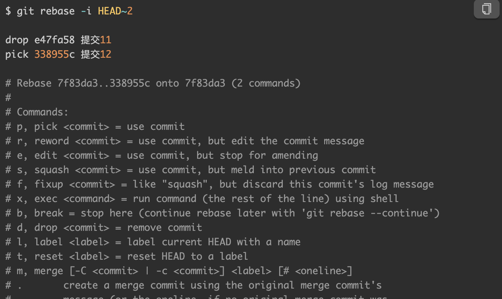
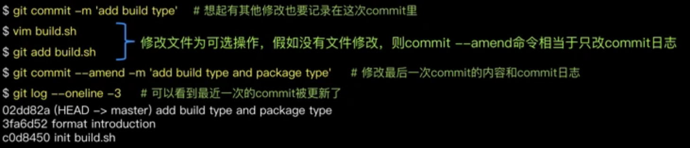
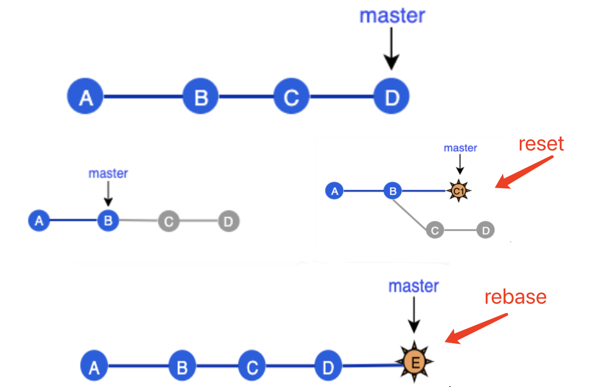

# git回滚总汇

## 1、仅在工作区修改的文件

当文件在工作区修改，还没有提交到暂存区和本地仓库时，可以用：

```
git checkout -- 文件名
```

## 2、已添加到暂存区的文件

即执行过 git add 添加到暂存区，但还没 commit，这时可以用：

```
git reset HEAD 文件名
```

## 3、已经commit，但是没有push

### 丢弃最新的提交

一般使用：

```
git reset --hard HEAD^
```

如果要连续回退多次的提交，则可以：

> 1. HEAD^：最新提交HEAD位置往回数一个提交， 多个 ^  就往回数多个提交
> 2. HEAD~n：同上
> 3. `git reset <要回滚到的 commit>` 或者 `git reset --hard <要回滚到的 commit>`

**git reset 默认会将被丢弃的记录所改动的文件保留在工作区中，以便重新编辑和再提交。加上 --hard 选项则不保留这部分内容，需谨慎使用。**

### 丢弃指定提交

针对想撤销中间某次的commit，可以使用如下的命令：

```
git rebase -i HEAD~n       ——  n是数字
```

执行之后，会有个编辑页面可以选择对每个提交做什么操作：


### 修改本地最近一次 commit

有时 commit 之后发现刚才没改全，想再次修改后仍记录在一个 commit 里。则可以使用：

```
git commit --amend [ -m <commit说明> ]
```

操作如下：


## 3、已经push到远端

使用：

```
git revert -n <要回滚到的 commit>         ——  n表示不自动提交
```

revert会回滚某次提交的内容，并生成新的提交，不会抹掉历史。但是reset会抹掉历史。

具体对比如下：



