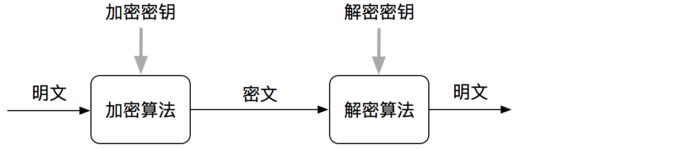
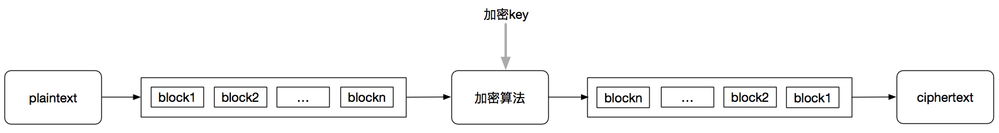
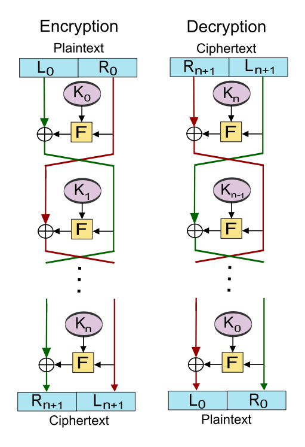
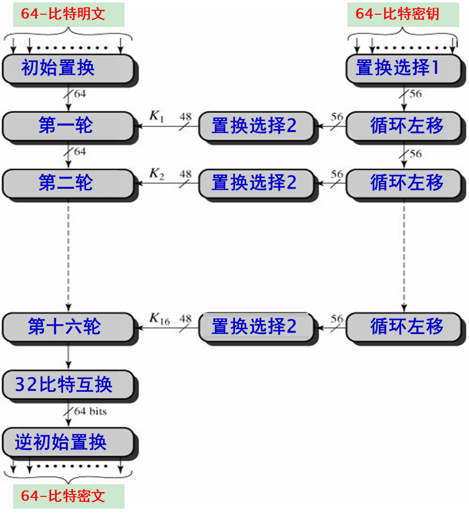
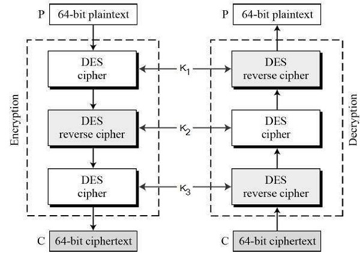
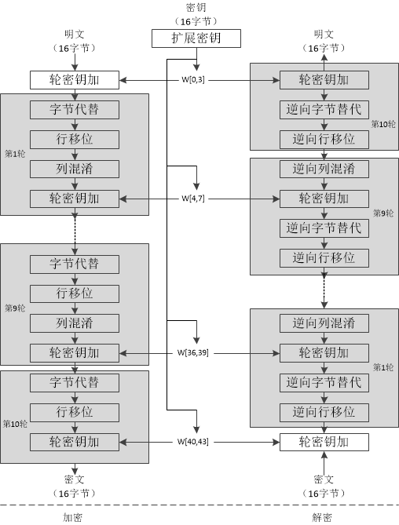
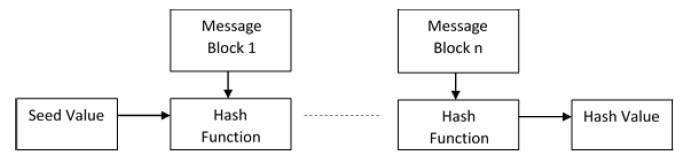
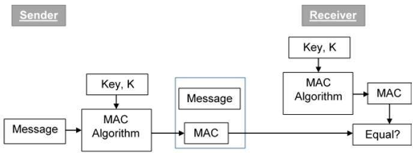

# google tink源码分析

## 密码学的基本概念

### 加密的基本要求

#### 1、保密性（confidentiality）
这是加密最基本的安全服务要求，通过数学算法进行数据的加密来实现保密性。

#### 2、完整性（integrity）
经过密码学的加密能够保证数据在任何时候都是完整不可窜改的。

#### 3、验证识别（Authentication）
验证识别提供了发送者的识别功能，保证了接收方收到的数据仅是由已经识别的发送方发送的。

#### 4、不可否认性（Non-Repudiation）
确保发送者不能拒绝先前承诺或行动的所有权，这种在订单交易中就比较重要。

### 密码系统

基本的密码系统应该包含如下的部分：

* 明文（Plaintext）
* 密文（Cophertext）
* 加密算法（Encryption Algorithm）
* 解密算法 (Decryption Algorithm)
* 加密密钥（Encryption Key）
* 解密密钥（Decryption Key），可能与加密密钥一样

现在的秘密系统主要是两大类型：

* 对称密钥加密密钥系统（Symmetric Key Encryption）
* 非对称密钥加密密钥系统（Asymmetric Key Encryption）

两大类型的划分主要就是根据加密和解密密钥的关系。

> 对称密钥加密密钥系统

它的显著特点是：

* 加密方和解密方在交换信息前需要知道交换密钥
* 需要比较安全健壮的交换密钥的通信机制
* 密钥可能需要定期修改，防止泄露
* n个人中，为了能够在任何两个人之间进行双方通信，组所需的密钥数量是n×（n-1）/ 2
* 密钥长度一般较小，加解密的过程比较快

对称密钥存在的挑战：

* **密钥通信安全**：密钥的交换需要安全的通信机制，这是整个通信的基石
* **信任危机**：信息交换的前提是隐含要求发送方和接收方相互信任，但是无法保证这种信任是真的可以信任的，比如密钥丢失。

常用的对称加密：

* DES
* 3DES
* AES
* Blowfish
* RC4、RC5、RC6
* ... ...

> 非对称密钥加密密钥系统

它的显著特点是：

* 公钥和私钥是相关的，但是无法根据某一个推算出另外一个
* 公钥是可以公开的
* 密钥长度一般较长，加解密的过程比较慢

非对称密钥存在的挑战：

同样存在信任问题，用户需要信任通信时使用的公钥确实是目标端的公钥，并且没有被恶意第三方欺骗。

而这个问题的解决就是通过Public Key Infrastructure（PKI）实现的，PKI安全的管理和证明公钥的合法性。

常用的非对称加密：

* RSA
* ECC
* HD
* Elgamal
* ... ...

> Kerckhoffs原则

Kerckhoffs原则是对加密系统的安全性的定义，即：**即使密码系统的任何细节已为人悉知，只要密匙（key，又称密钥或密钥）未泄漏，它也应是安全的。加密消息的安全性仅取决于秘密加密密钥的安全性。**

加密的强度指的是密码破解所需花费的时间与资源，这通常涉及到算法强度、密钥的长度等。

### 加密方式

#### 区段加密 (block cipher)

区段加密其实就是将明文拆分成固定大小的区段进行加密的操作，一个块就是一个分组。

> 分块细节

* **块大小**：块大小太小则容易被攻击，而太大的块使加密操作效率低下。块的大小最好是8的倍数。
* **填充**：明文的长度并不一定是块大小的倍数，对于不满足块大小的块需要填充。

> 分组加密模式

分组加密模式是一种怎么得到加密密文的解决方案，不同的模式会直接影响到加密后的数据安全性。

* **ECB模式**：即Electronic CodeBook mode，将明文分组加密之后的结果直接作为密文分组
* **CBC模式**：即Cipher Block Chaining mode，将明文分组与前一个生成密文分组进行XOR运算，然后再进行加密运算产生新的密文分组
* **CFB模式**：即Cipher FeedBack mode，不对明文直接加密，这个模式跟CBC很像，不同的是前一个密文分组是先单独加密操作，然后跟当前的明文分组进行XOR
* **OFB模式**：即Output FeedBack mode，不对明文直接加密，将明文分组和每个阶段的密码算法的输出作为密文分组
* **CTR模式**：即Counter mode，每个分组都有一个对应的计数器，密文分组是通过计数器进行加密，然后跟当前的明文分组进行XOR得到的

关于分组模式更为具体的描述请参考[揭开分组密码的面纱](https://juejin.im/post/5a8d77386fb9a0633229b737)。

> 使用

DES、3DES和AES都是使用区段加密的方式。

#### 流加密 (stream cipher）

流加密又称为序列密码。

在该方案中，明文被打散成1位，每次的加密操作都是对1位明文进行加密。流密码可以看成是块密码的一种极端场景，即块大小为1的块加密。

> 使用

### Feistel结构

Feistel结构是分组密码的的一种结构，常见的还有SP、Lai-Massey、MISTY等，Feistel也是DES加密的理论基础。

Feistel结构最简单的理解是：将明文分组分为L、R两个部分，然后对R进行加密，然后将结果跟L进行XOR操作，最后将结果与R进行置换，作为下一轮L、R的输入。

而Feistel的解密则是一个反向的过程。

**Feistel密码中使用的轮数取决于系统所需的安全性。更多轮次提供更安全的系统。但与此同时，更多轮次意味着低效的慢速加密和解密过程。因此，系统中的回合数取决于效率与安全权衡。**

#### DES的算法流程

DES算法的块大小是64位，密钥长度64位（但真实有效的密钥长度是56位，其他8位用作校验），Feistel轮数为16轮。

它核心经过如下几个步骤：

1. **密钥生成，从56位密钥中创建16个48位的密钥，其他8位用于奇偶校验**
2. **密码函数F的确定**
3. **明文初始置换，分为左32位L0和右32位R0，用于F函数16轮迭代运算的首次迭代的初始输入，Feistel运算，L16、R16合在一起64位，经过末置换函数IP-1，得到64位密文输出**

更为具体的请参考[Data Encryption Standard](https://www.tutorialspoint.com/cryptography/data_encryption_standard.htm)。

#### 3DES

随着计算能力的提升，56位的密钥很容易被破解，所以出现了3DES，相当于对数据块进行三次的DES操作，密钥的长度提升到了168位，在保留原来DES算法的基础上又能避免暴力破解。

3DES由三个不同的密钥K1、K2和K3组成。

加密的过程：

1. 使用密钥K1加密明文分块，得到C1
2. 使用密钥K2解密C1，得到C2
3. 使用密钥K3加密C2，得到最后的密文

中间的每个过程都是DES具体操作，解密就是加密的反处理。

#### AES

AES的出现是因为它比3DES更快更安全（密钥尺寸更小）。

**需要注意的是AES不是采用Feistel架构模式，它基于替换置换网络，由一系列相关联的操作组成。**

AES在字节而不是位上执行所有计算，因此，AES将明文块的128位视为16字节。AES中的轮数是可变的，取决于密钥的长度。AES使用10轮128位密钥，12轮用于192位密钥，14轮用于256位密钥。

更为具体的请参考[密码算法详解——AES](https://www.cnblogs.com/luop/p/4334160.html)

### 数据完整性

数据完整性的威胁主要来自**被动威胁**和**主动威胁**。

**被动威胁**主要来自于外界环境，如通信信道的噪声干扰，磁盘损坏等。
**主动威胁**主要来自人为的恶意攻击

### 哈希函数

哈希函数能很好的解决是上面提到的数据完整性的问题。

哈希函数是将数字输入值转换为另一个压缩数值的数学函数。散列函数的输入具有任意长度，但输出始终具有固定长度。

> 散列函数的典型特征

* 固定长度输出（哈希值）
 * 散列函数将任意长度的数据转换为固定长度。此过程通常称为散列数据
 * 散列比输入数据小得多，因此散列函数有时称为压缩函数
 * 由于散列是较大数据的较小表示，因此它也称为摘要。
 * 具有n位输出的散列函数被称为n位散列函数，流行的散列函数生成160到512位之间的值。
* 运作效率
 * 通常对于具有输入x的任何散列函数h，h（x）的计算是快速操作
 * 计算哈希函数比对称加密快得多

> 哈希算法的设计

哈希算法也是采用类似于分组密码的轮次的操作方式，每轮采用固定大小的输入，通常是最近消息块和最后一轮输出的组合。

**这么做的好处是即使是一位数据不同，两条消息的哈希值大不相同。**

> 流行的哈希函数

* MD系列
* SHA系列

### MAC

MAC，即消息验证码。

虽然哈希算法解决了数据完整性带来的威胁，但是数据存在的另一种威胁是缺少消息身份验证，即用户不确定消息的发起者。

MAC算法是一种对称密钥加密技术，用于提供消息认证。为了建立MAC过程，发送方和接收方共享对称密钥K。MAC和哈希唯一的区别也就是有没有这个共享密钥上。

MAC的处理过程：

整个过程是这样的：

* sender使用公知的MAC算法，通过输入的message和key计算得到MAC值
* sender将message和MAC值放在一起发送出去
* receiver收到消息后，读取其中的message，将message和key送到MAC算法中重新计算MAC值
* 比较接受的MAC值和计算的MAC值，只有匹配了才能证明sender的身份

> MAC的局限性

* 密钥的安全配送问题
* 无法提供不可否认性

### 密钥配送问题

为了解决密钥配送的问题，一般可以考虑如下方式:

> 1、事先共享密钥

就是在通信前先将密钥由专人送过去，有效，但不现实。

> 2、密钥分配中心

类似PKI的机构，但是这个安全性和可靠性无法百分百保证。

> 3、Diffie-Hellman密钥协商

DH是通过一种协商的机制来得到一个共知的密钥。这个是比RSA算法更早的算法。算法的基础依据是离散对数不可逆的数学依据，具体的请参考[DH密钥协商算法](https://thecodeway.com/blog/?p=964)

**但是DH算法是无法避免中间人攻击的。当然如果DH交换过程中也引入第三方信任机制，也可以解决中间人攻击问题。**

> 4、公钥密码

就是我们常用的非对称加密，它的问题是速度比较慢。

### 不可否认性问题

不可否认性的问题的解决是采用数字证书。除了提供消息不可否认性的能力之外，数字签名还提供消息认证和数据完整性。

* **消息验证**：
* **数据完整性**：对数据的任何修改都会导致数字签名验证的失败。
* **不可否认性**：签名具有唯一性。

https://www.tutorialspoint.com/cryptography/public_key_infrastructure.htm

https://halfrost.com/message_authentication_code/