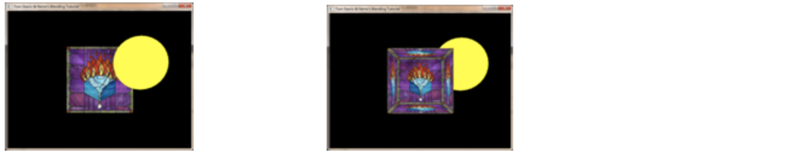
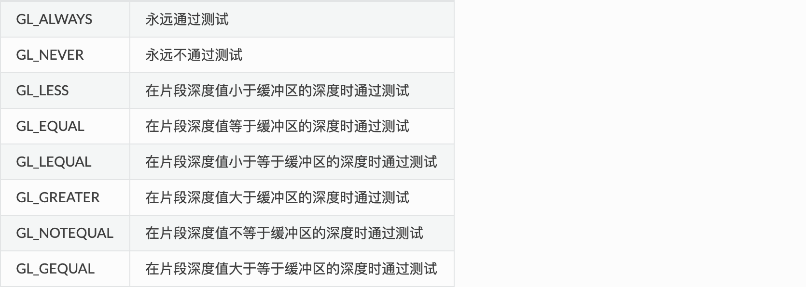
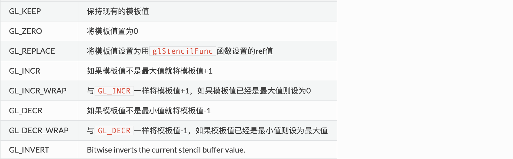
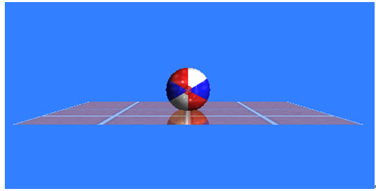

# opengl的缓冲区

## 缓冲区的分类

* 颜色缓冲区（**COLOR_BUFFER**）
* 深度缓冲区（**DEPTH_BUFFER**）
* 模板缓冲区（**STENCIL_BUFFER**）
* 累积缓冲区
* **帧缓存（framebuffer）**

## 颜色缓冲区

它用于保存屏幕上所显示的颜色信息，只是用了存储像素信息的许多缓冲区之一，包含RGB或sRGB形式的颜色数据和alpha值。

OpenGL在绘制图元时，先是在一个缓冲区中完成渲染，然后再把渲染结果交换到屏幕上。我们把这两个缓冲区称为**前颜色缓冲区（屏幕）**和**后颜色缓冲区**。

### 颜色缓冲的操作

#### glDrawBuffer()

指定在当前帧缓冲区的哪个颜色缓冲区进行绘制，并不影响深度、模板缓冲区。

#### glColorMask()

开启或关闭写颜色缓冲区。

```glsl
void glColorMask(GLboolean red,GLboolean green, GLboolean blue, GLboolean alpha)
```

一个颜色缓存掩码的例子，glColorMask(false, true, true, true)设置红色数据不会被写人颜色缓存，现在如果绘制一个黄色的三角形(1.0f,1.0f,0.0f,1.0f)，会发现最终图像是绿色。

#### glClear()
在每次绘制场景前，需要先清除颜色缓冲区

```
glClear(GL_COLOR_BUFFER_BIT);
```

#### glClearColor()

指定颜色缓冲中的清除值。默认值都是0，就是调用`glClear()`是使用的值。


## 深度缓冲区与深度测试

深度缓冲区是用来记录每个像素的深度值，当开启深度测试时，会将片段像素深度值和深度缓冲区深度值进行比较，从而决定片段哪些像素点可以swap到颜色缓冲区中，从而可以绘制出来。

当我们启用深度缓冲区时Z值决定哪个物体在前面，不启用深度缓冲区时，绘画顺序决定前后关系。如下图，先绘制了球体，然后绘制了立方体，球体的Z值-5，立方体Z值为-6，左边是开启深度测试，右边是未开启。



**深度测试在片段着色器运行之后，并且是在模板测试运行之后在屏幕空间中执行的。**

### 深度测试的操作

#### glEnable()

深度测试默认是关闭的，要启用深度测试的话，我们需要用`GL_DEPTH_TEST`选项来打开它。

```glsl
glEnable(GL_DEPTH_TEST);
```

#### glClear()

在每次绘制场景前，需要先清除深度缓冲区，否则深度缓冲区将保留上一次进行深度测试时所写的深度值。

```glsl
glClear(GL_COLOR_BUFFER_BIT | GL_DEPTH_BUFFER_BIT);
```

#### glDepthRange()

指定深度值的范围，默认深度缓存中深度值的范围在0.0到1.0之间，nearNormDepth和farNormalDepth可以取0.0到1.0范围内的任意值。

#### glClearDepth()

参数maxDepth可以是0.0到1.0范围内的任意值。glClearDepth用maxDepth对深度缓存进行初始化，而默认情况下，深度缓存用1.0进行初始化。

由于在进行深度测试中，大于深度缓存初始值的多边形都不会被绘制，因此glClearDepth函数可以用来加速深度测试处理。这里需要注意的是指定了深度缓存的初始化值之后，应调用：`glClear(GL_DEPTH_BUFFER_BIT)`完成深度缓存的初始化。

#### glDepthFunc()

深度测试函数，OpenGL 允许我们修改它深度测试使用的比较运算符，该函数用于指定将需要绘制的新像素的z值与深度缓冲区中对应位置的z值进行比较的函数，如果比深度缓存中的值小，那么用新像素的颜色值更新帧缓存中对应像素的颜色值。

```glsl
glDepthFunc(GL_LESS);
```

默认情况下使用GL_LESS，这将丢弃深度值高于或等于当前深度缓冲区的值的片段。



#### glDepthMask()

在某些情况下我们需要进行深度测试并相应地丢弃片段，但我们不希望更新深度缓冲区，基本上就是只读的深度缓冲区，OpenGL允许我们通过将其深度掩码设置为GL_FALSE禁用深度缓冲区写入。

> 假如这俩个物体时立体时，比如是立方体，立方体6个面，是有先后顺序的，如前，后面，假如立方体存在透明度，我们希望的是透过立方体的前面能看到立方体的后面，由于混合式针对物体间，立方体6个面之间不能存在混合，所以我们看到的效果是立方体前面遮盖住了立方体后面（由于启用深度测试，后面Z值在后，因此不会绘画）如果此时我们关闭`GL_DEPTH_TEST`，就会让立方体的每个面都进行绘画，哪怕他们的Z序是被遮挡的。 glDepthMask()就是解决这个问题。

### 如何调试深度信息

在片段渲染器的内置gl_FragCoord向量的 z 值包含那个片段的深度值。如果我们要吧深度值作为颜色输出，那么我们可以在场景中显示的所有片段的深度值。

```glsl
void main()
{
    color = vec4(vec3(gl_FragCoord.z), 1.0f);
}  
```

### 深度冲突（Z-Fighting）

Depth Buffer是非线性的，越靠近摄像机的地方，精度越高，因此在远离摄像机的地方，精度不够了，就容易出现两个深度值很接近的片段不断闪烁的问题。

[深度冲突](https://zhuanlan.zhihu.com/p/66175070)

## 模板缓冲区与模板测试

通过设置模版缓冲每个像素的值，我们可以指定在渲染的时候只渲染某些像素，从而可以达到一些特殊的效果。_举个例子，如果你要存储一个形状奇特的挡风玻璃，你只需要模板缓冲区存储这个挡风玻璃的形状，接着绘制整个屏幕，只有挡风玻璃所在区域中的内容会显示出来，这就是模板缓冲区的功能。_

### 模板测试的操作

#### glEnable()

开启模板测试。

#### glClear()

清空模板缓冲。

```glsl
glClear(GL_STENCIL_BUFFER_BIT);
```

#### glClearStencil()

指定模板缓冲的清除值。

#### glStencilMask()

允许我们给模板值设置一个位遮罩(Bitmask)，它与模板值进行按位与(AND)运算决定缓冲是否可写。默认设置的位遮罩都是1，这样就不会影响输出，但是如果我们设置为0x00，所有写入深度缓冲最后都是0。

```glsl
// 0xFF == 0b11111111
//此时，模板值与它进行按位与运算结果是模板值，模板缓冲可写
glStencilMask(0xFF); 

// 0x00 == 0b00000000 == 0
//此时，模板值与它进行按位与运算结果是0，模板缓冲不可写
glStencilMask(0x00); 
```

#### glStencilFunc() / glStencilFuncSeparate()

用于指定模板测试的函数，在什么情况下通过模板测试，描述了OpenGL对模板缓冲做什么。

```glsl
void glStencilFunc(	GLenum func,
 	GLint ref,
 	GLuint mask);
```
ref：是和当前模板缓冲中的值stencil进行比较的指定值，这个比较方式使用了第三个参数mask，例如`GL_LESS`通过，当且仅当
满足: ( ref & mask ) < ( stencil & mask ).GL_GEQUAL通过，当且仅当( ref & mask ) >= ( stencil & mask )。ref的默认值是0。

####  glStencilOp（）/ glStencilOpSeparate()

用于指定测试通过或者失败时执行的动作，描述我们如何更新模板缓冲。

```glsl
void glStencilOp(	GLenum sfail,
 	GLenum dpfail,
 	GLenum dppass);
```

* sfail： 如果模板测试失败将采取的动作。
* dpfail： 如果模板测试通过，但是深度测试失败时采取的动作。
* dppass： 如果深度测试和模板测试都通过，将采取的动作。



**glStencilOp**函数默认设置为 `(GL_KEEP, GL_KEEP, GL_KEEP)` ，所以任何测试的任何结果，模板缓冲都会保留它的值。默认行为不会更新模板缓冲，所以如果你想写入模板缓冲的话，你必须像任意选项指定至少一个不同的动作。

使用**glStencilFunc**和**glStencilOp**，我们就可以指定在什么时候以及我们打算怎么样去更新模板缓冲了，我们也可以指定何时让测试通过或不通过。什么时候片段会被抛弃。

### 使用场景

* 绘制轮廓
* 镜中物体



更多可参考[http://www.twinklingstar.cn/2014/1176/stencil-buffer/](http://www.twinklingstar.cn/2014/1176/stencil-buffer/)

## 累积缓冲区

**这个在GLES里是没有的。**

累积缓冲区这可以存储红、绿、蓝、Alpha四个分量，每个分量都占16位，因此累积缓冲区中的每个像素需要用64位来存储。

累积缓冲区与其它缓冲区是一种并行的结构关系。

```glsl
void glAccum(GLenum op, GLfloat value)
```

op：规定对累积缓冲区的操作，只有5个数值。

> GL_ACCUM

从当前颜色缓冲区中获得R、G、B、A的数值，除以（2^分量占的位数-1）（指的是当前颜色缓冲区中的位数），结果是一个0到1之间的浮点数，再乘以value的值，把相应的像素分量加到累积缓冲区中。
> GL_LOAD

与GL_ACCUM的操作类似，不同的是得到0到1之间的浮点数，乘以value的值后替换累积缓冲区中的数值，而不是加到累积缓冲区中。
> GL_ADD

将value值加到累积缓冲区中的R、G、B、A分量上
> GL_MULT

将累积缓冲区中的每个分量乘以浮点数value，将得到的结果写到累积缓冲区相应的位置上。
> GL_RETURN

把累积缓冲区中的值返回到当前的颜色缓冲区中。

### 累积缓冲区的使用

累积缓冲区是颜色缓冲的拓展区域，图像不能直接往上面绘制，但是被绘制进颜色缓冲区中的图像通过一定的处理可以增加到累积缓冲区中。通过不同方法，可以使用累积缓冲区完成各种不同的效果，主要有抗锯齿、运动模糊、深度场等。

具体参考：[http://www.twinklingstar.cn/2013/644/accumulation-buffer/](http://www.twinklingstar.cn/2013/644/accumulation-buffer/)

## 关于缓冲区的清除

清除缓冲区，分两步走战略：

1. 指定要用什么值来填充要清除的缓冲区
2. 选择待清除的缓冲区并开始清除

如下面清除颜色缓冲区和深度缓冲区的操作：

```glsl
glClearColor(0.0, 0.0, 0.0, 0.0);
glClearDepth(1.0);
glClear(GL_COLOR_BUFFER_BIT | GL_DEPTH_BUFFER_BIT);
```

对于简单的图形应用程序，清除操作花费的时间可能比接下来进行的绘图操作的时间还要多。如果需要清除的不仅仅是颜色缓冲区，还需要清除深度和模版缓冲区，清除操作所花费的时间可能还要成倍地增加。

## 帧缓存

我们已经知道3种缓存：颜色缓存、深度缓存和模板缓存，这些缓存可以包含在另外一个总的缓存之中，这就是帧缓存。所有的渲染操作，都是渲染到这个帧缓存上的。

> 创建和绑定帧缓存对象

```java
glGenFramebuffers(1, &mFbo);
// target可以是GL_FRAMEBUFFER、GL_READ_FRAMEBUFFER或者GL_DRAW_FRAMEBUFFER
glBindFramebuffer(GL_FRAMEBUFFER, mFbo);
// 如果不需要fbo，可以删除对象
glDeleteFramebuffers(1, &mFbo);
```

> 将缓存附加到帧缓存

帧缓存本质上并不是一个独立的概念，它像是一个管理员，管理着手下的各个缓存，比如颜色缓存、模板缓存、深度缓存等等。被管理的对象被称为是**附件（Attachment）**。我们需要创建颜色、模板和深度缓存，把它们安排给帧缓存做手下才能让帧缓存起作用。

一般的，我们有两种方法可以生成这种附件，分别是**纹理附件**和**渲染缓存对象附件**。

**纹理附件**

纹理的方式就是把颜色甚至是深度、模板都可以存储在纹理上，存储到纹理的好处就是可以直接在着色器中使用。

```java
/ 创建纹理
GLuint textureID;
glGenTextures(1, &textureID);
glBindTexture(GL_TEXTURE_2D, textureID);
glTexImage2D(GL_TEXTURE_2D, 0, GL_RGB, 800, 800, 0, GL_RGB, GL_UNSIGNED_BYTE, NULL);
glTexParameteri(GL_TEXTURE_2D, GL_TEXTURE_MIN_FILTER, GL_LINEAR );
glTexParameteri(GL_TEXTURE_2D, GL_TEXTURE_MAG_FILTER, GL_LINEAR);
glBindTexture(GL_TEXTURE_2D, 0);
// 关联纹理附件到帧缓存
glFramebufferTexture2D(GL_FRAMEBUFFER, GL_COLOR_ATTACHMENT0, GL_TEXTURE_2D, textureID, 0);
```

**渲染缓存对象附件**

渲染缓存对象的优势是它保存的格式是OpenGL本身的渲染格式，这样就让它在性能和使用方便程度上更胜一筹。

渲染缓存对象将渲染数据直接保存到缓存中，不需要转换成指定的纹理格式，这让它在写数据的方面更加迅速，成为一种保存数据的良好媒介。但是，渲染缓存对象通常是只写的，你无法通过类似访问纹理数据的方式去读取其中的数据。一种访问渲染缓存对象数据的方式是使用glReadPixels，它会返回当前帧缓存的一片指定像素区域，而不是渲染缓存对象的一个数据块。

```java
// 创建渲染缓存对象： 
GLuint rbo;
glGenRenderbuffers(1, &rbo);
// 绑定染缓存对象 target必须是GL_RENDERBUFFER
glBindRenderbuffer(GL_RENDERBUFFER, rbo);
// 创建渲染缓存的存储空间
glRenderbufferStorage(GL_RENDERBUFFER, GL_DEPTH24_STENCIL8, 800, 800);
// 解绑
glBindRenderbuffer(GL_RENDERBUFFER, 0);
// 关联渲染缓存附件到帧缓存
glFramebufferRenderbuffer(GL_FRAMEBUFFER, GL_DEPTH_STENCIL_ATTACHMENT, GL_RENDERBUFFER, rbo);
```

根据纹理和渲染缓存对象的特性，如果你想要一个经常读取数据的附件，那么纹理附件更合适。而如果你想要一个不常读取的附件，那么渲染缓存对象更合适。

> 帧缓存的渲染

帧缓存的最后一步就是渲染出来：

```java
// 帧缓存的完整性检查
if(glCheckFramebufferStatus(GL_FRAMEBUFFER) != GL_FRAMEBUFFER_COMPLETE)
        log("ERROR::FRAMEBUFFER:: Framebuffer is not complete!");

// 渲染到帧缓存
glBindFramebuffer(GL_FRAMEBUFFER, mFbo);
draw...
glBindFramebuffer(GL_FRAMEBUFFER, 0);
```

一个帧缓存如果可用，那么它就处于一种完成状态。，我们就可以通过一个函数来检查帧缓存是否处于完成状态了。这个函数是：glCheckFramebufferStatus。通过传入GL_FRAMEBUFFER，获得的值与宏GL_FRAMEBUFFER_COMPLETE比较，就可以轻易地判断出帧缓存是否完成。

> 思考：如何知道使用了帧缓存？

为了证明我们确实使用了帧缓存，调用glPolygonMode(GL_FRONT_AND_BACK, GL_LINE);开启线框模式，我们应该看到的是四边形线框而不是场景中的盒子和地板：


关于多边形的介绍可以看[绘制多边形](http://starkersong.github.io/2016/11/04/2016-11-04-opengl-polygon/)。

