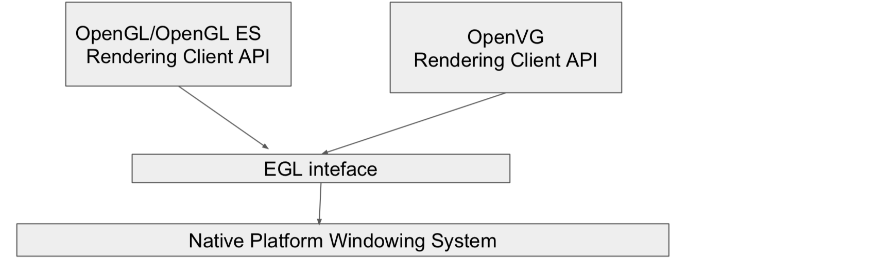
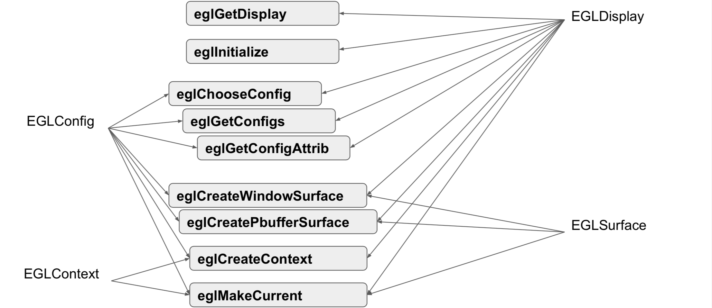
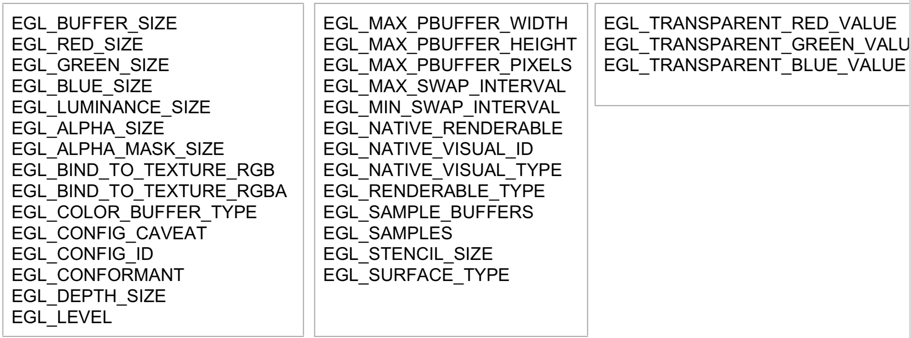
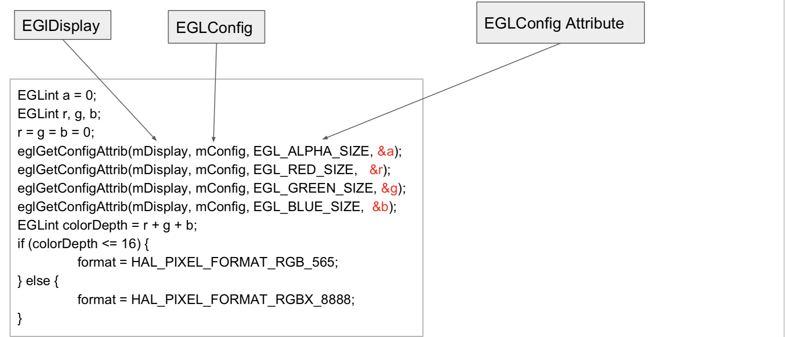

# 深入理解EGL和GLSurfaceView

## 什么是EGL？

OpenGL只是个跨平台的图形编程接口，而接口的实现是由厂商来完成的。EGL就处在OpenGL接口层和本地窗口系统（native platform window system）之间的中间层，主要是完成底层图像的转换，显示到屏幕上。



具体功能包括：

* 保证和本地窗口系统的通信
* 图像上下文的管理（graphics context management）
* surface/buffer的创建和绑定
* 在 OpenGL ES和其他图形渲染API之间同步渲染（rendering synchronization）
* 管理rendering resources，比如texture
* 高性能
* 加速
* mixed-mode 2D and 3D rendering

为了让 OpenGL ES 能够绘制在当前设备上，我们需要 EGL 作为 OpenGL ES 与设备的桥梁。我们可以直接用 GLSurfaceView 来进行 OpenGL 的渲染，就是因为在 GLSurfaceView 的内部已经完成了对 EGL 的使用封装，当然我们也可以封装自己的EGL环境。

EGL也是由对应的产商完成的。

## EGLDisplay & EGLSurface & EGLContext

**EGLDisplay**：负责显示图像，是对实际显示设备的抽象，通过创建与本地窗口系统的连接而得到具体的对象
**EGLSurface**：创建渲染表面，是对用来存储图像的内存区域FrameBuffer的抽象
**EGLContext**：显示所需要的上下文了，包含对应的顶点、片段着色器、顶点数据矩阵等

## 使用实践

EGL 的使用要遵循一些固定的步骤，按照这些步骤去配置、创建、渲染、释放。

* **创建与本地窗口系统的连接**
 * 调用 eglGetDisplay 方法得到 EGLDisplay
* 初始化 EGL 方法
 * 调用 eglInitialize 方法初始化
* **确定渲染表面的配置信息**
 * 调用 eglChooseConfig 方法得到 EGLConfig
* **创建渲染上下文**
 * 通过 EGLDisplay 和 EGLConfig ，调用 eglCreateContext 方法创建渲染上下文，得到 EGLContext
* **创建渲染表面**
 * 通过 EGLDisplay 和 EGLConfig ，调用 eglCreateWindowSurface 方法创建渲染表面，得到 EGLSurface
* **绑定上下文**
 * 通过 eglMakeCurrent 方法将 EGLSurface、EGLContext、EGLDisplay 三者绑定，接下来就可以使用 OpenGL 进行绘制了。
* **交换缓冲**
 * 当用 OpenGL 绘制结束后，使用 eglSwapBuffers 方法交换前后缓冲，将绘制内容显示到屏幕上
* **释放 EGL 环境**
 * 绘制结束，不再需要使用 EGL 时，取消 eglMakeCurrent 的绑定，销毁 EGLDisplay、EGLSurface、EGLContext。

具体的操作参考：[OpenGL 之 EGL 使用实践](https://glumes.com/post/opengl/opengl-egl-usage/#%E5%88%9B%E5%BB%BA%E6%B8%B2%E6%9F%93%E4%B8%8A%E4%B8%8B%E6%96%87)

## 主要API介绍



### eglGetDisplay

```java
// C function EGLDisplay eglGetDisplay ( EGLNativeDisplayType display_id )

public static native EGLDisplay eglGetDisplay(
    int display_id
);
```

`display_id`明确显示的设备，`EGL_DEFAULT_DISPLAY`是当前设备缺省的选择，如手机上就是屏幕。

### eglInitialize

```java
// C function EGLBoolean eglInitialize ( EGLDisplay dpy, EGLint *major, EGLint *minor )

public static native boolean eglInitialize(
    EGLDisplay dpy,
    int[] major,
    int majorOffset,
    int[] minor,
    int minorOffset
);
```

初始化EGL内部的数据结构，并且返回EGL实现的major和minor的版本号。

### eglChooseConfig

确定可用的Surface配置，即确定什么样的rendering surfaces可以被我们所使用。

该方法是设置一些配置上的要求，让EGL去推荐一个最合适的。

```java
// C function EGLBoolean eglChooseConfig ( EGLDisplay dpy, const EGLint *attrib_list, EGLConfig *configs, EGLint config_size, EGLint *num_config )

public static native boolean eglChooseConfig(
    EGLDisplay dpy,
    int[] attrib_list,
    int attrib_listOffset,
    EGLConfig[] configs,
    int configsOffset,
    int config_size,
    int[] num_config,
    int num_configOffset
);
```

主要是EGLConfig参数，决定了将得到什么样的Surface配置。



具体的介绍：[https://www.khronos.org/registry/EGL/sdk/docs/man/html/eglChooseConfig.xhtml](https://www.khronos.org/registry/EGL/sdk/docs/man/html/eglChooseConfig.xhtml)

### eglGetConfigs & eglGetConfigAttrib

这两个方法的作用是和`eglChooseConfig`所达到的效果是一样的，就是需要开发者自己去选择Surface配置。

```java
// C function EGLBoolean eglGetConfigs ( EGLDisplay dpy, EGLConfig *configs, EGLint config_size, EGLint *num_config )

public static native boolean eglGetConfigs(
    EGLDisplay dpy,
    EGLConfig[] configs,
    int configsOffset,
    int config_size,
    int[] num_config,
    int num_configOffset
);

// C function EGLBoolean eglGetConfigAttrib ( EGLDisplay dpy, EGLConfig config, EGLint attribute, EGLint *value )

public static native boolean eglGetConfigAttrib(
    EGLDisplay dpy,
    EGLConfig config,
    int attribute,
    int[] value,
    int offset
);
```

`eglGetConfigs`查询所有当前的window系统下支持的EGL surface配置，这个里面的configs字段可以为NULL；

`eglGetConfigAttrib`查询每个EGLConfig的信息，如：



### eglCreateContext

在获取到了EGLDisplay和EGLConfig对象后，可以据此创建EGLContext了。

```java
// C function EGLContext eglCreateContext ( EGLDisplay dpy, EGLConfig config, EGLContext share_context, const EGLint *attrib_list )

public static native EGLContext eglCreateContext(
    EGLDisplay dpy,
    EGLConfig config,
    EGLContext share_context,
    int[] attrib_list,
    int offset
);
```

### eglCreateWindowSurface

创建渲染到屏幕上的Surface，即`On-Screen Rendering Area`。

* The EGL Window
* Window from Native window system.
* connected NativeWindowType (ANativeWindow)

```java
public static EGLSurface eglCreateWindowSurface(EGLDisplay dpy,
    EGLConfig config,
    Object win,
    int[] attrib_list,
    int offset
)
```

这里的win是Object类型，说明可以接受多种不同类型的Surface：

```java
public static EGLSurface eglCreateWindowSurface(EGLDisplay dpy,
    EGLConfig config,
    Object win,
    int[] attrib_list,
    int offset
){
    Surface sur = null;
    if (win instanceof SurfaceView) {
        SurfaceView surfaceView = (SurfaceView)win;
        sur = surfaceView.getHolder().getSurface();
    } else if (win instanceof SurfaceHolder) {
        SurfaceHolder holder = (SurfaceHolder)win;
        sur = holder.getSurface();
    } else if (win instanceof Surface) {
        sur = (Surface) win;
    }

    EGLSurface surface;
    if (sur != null) {
        surface = _eglCreateWindowSurface(dpy, config, sur, attrib_list, offset);
    } else if (win instanceof SurfaceTexture) {
        surface = _eglCreateWindowSurfaceTexture(dpy, config,
                win, attrib_list, offset);
    } else {
        throw new java.lang.UnsupportedOperationException(
            "eglCreateWindowSurface() can only be called with an instance of " +
            "Surface, SurfaceView, SurfaceTexture or SurfaceHolder at the moment, " +
            "this will be fixed later.");
    }

    return surface;
}
```

### eglCreatePbufferSurface

创建离屏的渲染表面，即`Off-Screen Rendering Area`。

* EGL Pbuffers
* nonvisible off-screen surface called pbuffers (short for pixel buffer).
* not connected NativeWindowType

Pbuffers可以利用Opengl 3.0的硬件加速。

```java
// C function EGLSurface eglCreatePbufferSurface ( EGLDisplay dpy, EGLConfig config, const EGLint *attrib_list )

public static native EGLSurface eglCreatePbufferSurface(
    EGLDisplay dpy,
    EGLConfig config,
    int[] attrib_list,
    int offset
);
```

> 离屏

### eglMakeCurrent

将EGLContext和EGLSurface关联起来。

```java
// C function EGLBoolean eglMakeCurrent ( EGLDisplay dpy, EGLSurface draw, EGLSurface read, EGLContext ctx )

public static native boolean eglMakeCurrent(
    EGLDisplay dpy,
    EGLSurface draw,
    EGLSurface read,
    EGLContext ctx
);
```

只有在这个方法关联后，才能进行图像的输出。

### eglSwapBuffer

```java
// C function EGLBoolean eglSwapBuffers ( EGLDisplay dpy, EGLSurface surface )

public static native boolean eglSwapBuffers(
    EGLDisplay dpy,
    EGLSurface surface
);
```

该方法是完成缓冲的交换，具体有2个层面的含义：

* **surface是可见窗口**：eglSwapBuffer将post所有的buffer到对应的窗口上。eglSwapBuffers会显示的调用flush的操作。
* **surface是pixel buffer或者pixmap**：eglSwapBuffers将不起作用，也没有报错

### eglWaitClient

在一些情况下，需要在同一个窗口下（共享窗口）协调不同图像处理API的绘制，如OpenGL ES 3.0、OpenVG等。EGL提供了这个方法来同步各个tasks。

```java
// C function EGLBoolean eglWaitClient ( void )

public static native boolean eglWaitClient(
);
```

Delay execution of the client untill all rendering through a Khrnos API(e.g., OpenGL ES 3.0, OpenGL, or OepnVG) is completed.

## GLSurfaceView里的EGL

可以看出，EGL的操作步骤是程式化的，在GLSurfaceView里就是将该程式化的步骤封装在了`EglHelper`里。

