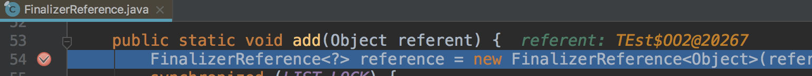
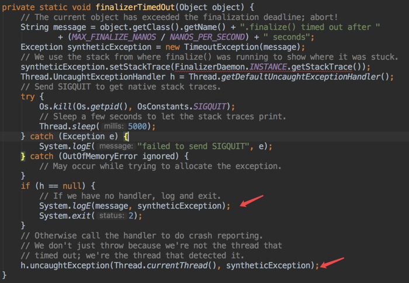

# 关于finalize()的思考

## 起因

线上crash一直在报一个非常棘手的问题，如下：

```java
java.util.concurrent.TimeoutException: android.content.res.AssetManager$AssetInputStream.finalize() timed out after 10 seconds
android.content.res.AssetManager$AssetInputStream.close(AssetManager.java:608)
android.content.res.AssetManager$AssetInputStream.finalize(AssetManager.java:641)
java.lang.Daemons$FinalizerDaemon.doFinalize(Daemons.java:206)
java.lang.Daemons$FinalizerDaemon.run(Daemons.java:189)
java.lang.Thread.run(Thread.java:818)
```

## 异常是怎么发生的？

finalize()是java里的析构函数，用来做资源的回收。它是定义在Object类里的，因此所有的类都能重写这个方法。

**而问题就坏在重写上。**

一旦重写了finalize()方法，并且该方法不为空，那么在创建该对象的时候，会将该对象加入到FinalizerReference的双向链表中。

可以用下面的代码来测试：

```java
class OO {
    public OO() {
        int i = 10;
    }
}

class OO2 {
    public OO2() {
        int i = 10;
    }

    @Override
    protected void finalize() throws Throwable {
        super.finalize();
    }
}
```

通过debug可以看到，只有OO2对象加入到了FinalizerReference链表中：



**这么做的目的是系统可以更好的控制对象，统一的做回收的事情。**那么系统是怎么做这个事情的呢？

我们先进入Zygote.java，在我们的app进程启动的时候，需要依靠Zygote来fork出新的进程，入口代码如下：

```java
public static int forkAndSpecialize(int uid, int gid, int[] gids, int debugFlags,
      int[][] rlimits, int mountExternal, String seInfo, String niceName, int[] fdsToClose,
      String instructionSet, String appDataDir) {
    VM_HOOKS.preFork();
    int pid = nativeForkAndSpecialize(
              uid, gid, gids, debugFlags, rlimits, mountExternal, seInfo, niceName, fdsToClose,
              instructionSet, appDataDir);
    // Enable tracing as soon as possible for the child process.
    if (pid == 0) {
        Trace.setTracingEnabled(true);

        // Note that this event ends at the end of handleChildProc,
        Trace.traceBegin(Trace.TRACE_TAG_ACTIVITY_MANAGER, "PostFork");
    }
    VM_HOOKS.postForkCommon();
    return pid;
}
```

主要到VM_HOOKS这个对象了吗？它是什么？

```java
private static final ZygoteHooks VM_HOOKS = new ZygoteHooks();
```

主要的方法`preFork()`、`postForkCommon()`做了什么事情呢？

```java
@libcore.api.CorePlatformApi
public void preFork() {
    Daemons.stop();
    waitUntilAllThreadsStopped();
    token = nativePreFork();
}

@libcore.api.CorePlatformApi
public void postForkCommon() {
    Daemons.startPostZygoteFork();
}
```

其实就是启动系统的守护线程。

`Daemons.java`里启动了4和守护线程，分别做不同的事情：

* `ReferenceQueueDaemon`：引用对象队列的守护线程，在引用一个对象的时候，可以关联到一个队列中。当被引用对象引用的对象被GC回收的时候，被引用对象就会被加入到其创建时关联的队列去，而这个加入到关联对象的操作就是由`ReferenceQueueDaemon`来完成的，这样系统就知道哪些被引用的对象已经被回收了。
 * LeakCanary的内存泄漏检测就是依赖这个机制。
* `HeapTaskDaemon`：堆裁剪守护线程。
* `FinalizerDaemon`：对象析构守护线程。对于重写了finalize()函数的对象，它的回收需要经过2步，GC决定需要被回收了，并将对象加入到`FinalizerReference`里的queue中，等待FinalizerDaemon守护线程去调用它们的成员函数finalize()
* `FinalizerWatchdogDaemon`：对象析构守护线程的守护线程。专门用来检测FinalizerDaemon的工作的，主要是检测finalize()的时间是否超时

**`FinalizerDaemon`和`FinalizerWatchdogDaemon`共同完成了对finalize()的资源回收。**而上面的异常就是由`FinalizerWatchdogDaemon`所抛出来的。

## 可能导致超时的因素

上面我们了解了异常抛出的原理，那么它怎么就会异常呢？？

> 1、FinalizerReference的同步锁开销

FinalizerReference队列的操作都是加有synchronized同步的。

> 2、线程阻塞

其他线程繁忙有可能会导致finalize的回收并不会很快，该线程的nice值是0，如果其他优先级高的线程繁忙则会导致回收很慢。

> 3、回收队列过长

需要回收的对象太多，扎堆到了一起。因此需要及时释放的对象就应该马上释放掉。

## 如何破解

回到我们最开始的问题，这里是`AssetInputStream.finalize()`回收的时候发生了超时，结合我们的业务可以推断：

* 打开了很多的asset文件，并且有没有没有及时释放的
* 其他线程的nice值是不是过高，并且一直在占据CPU

彻底的解决需要从代码上慢慢的梳理，作者在这里提供一个hack的方法，虽然程序仍处在异常的情况下，但是可以让app继续运行并且用户无法感知。

**既然是守护线程自己做的超时判断，是不是可以直接让它不要检测了，FinalizerDaemon还是继续回收，但是FinalizerWatchdogDaemon别管我花了多长时间。**

粗暴的办法是直接去stop掉FinalizerWatchdogDaemon线程，但是这个感觉不太好，毕竟google开启超时检测肯定是有用处的。

我们看下超时发生的时候，系统做了哪些事情：



可以看到，如果我们自己实现了UncaughtExceptionHandler，那么FinalizerWatchdogDaemon是不会直接exit(2)退出的，因此我们可以给出一个UncaughtExceptionHandler，并做一些补救的事情。

完整的代码：

```java
public class FinalizerWatchdogDaemonHack {
    public static void fix(String tag) {
        try {
            Class clazz = Class.forName("java.lang.Daemons$FinalizerWatchdogDaemon");
            Method method = clazz.getSuperclass().getDeclaredMethod(tag);
            method.setAccessible(true);
            Field field = clazz.getDeclaredField("INSTANCE");
            method.invoke(field.get(null));
            field.setAccessible(false);
        } catch (Throwable e) {
            // ignore
        }
    }

    public static class CrashHandler implements Thread.UncaughtExceptionHandler {

        @Override
        public void uncaughtException(Thread thread, Throwable ex) {
            if (ex instanceof TimeoutException && thread.getName().equalsIgnoreCase("FinalizerWatchdogDaemon")) {
                FinalizerWatchdogDaemonHack.fix("stop");
                FinalizerWatchdogDaemonHack.fix("start");
            }
        }
    }
}
```

最后只要在application里注册这个UncaughtExceptionHandler即可：

```java
Thread.setDefaultUncaughtExceptionHandler(new FinalizerWatchdogDaemonHack.CrashHandler());
```

上面的方案临时的解决了这个头疼的问题，也是一个hack办法，毕竟触动了系统。在一般模式下是没有问题的，但是如果我们开启严格模式StrictMode，过不了多久就会出现ANR的弹框，好在release的apk严格模式是不开启的。

## 开发建议

* 减少内存使用，避免不必要的对象创建，从而减少GC的次数
* 流对象应该尽可能早的释放
* 避免内存泄露的发生
* 自定义类尽量不要实现finalize()方法，如果非要实现，也需要尽可能轻量化