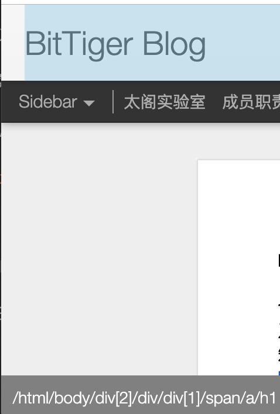
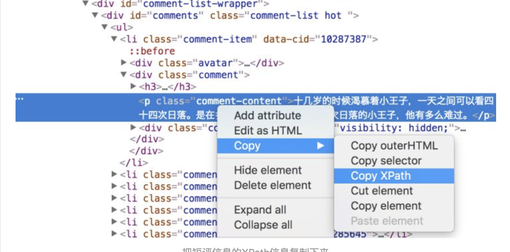
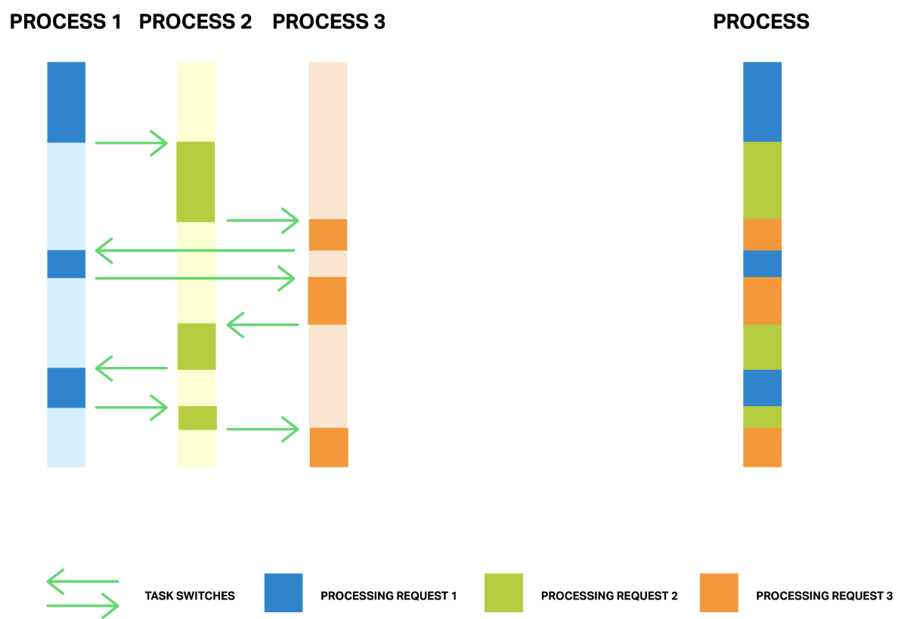
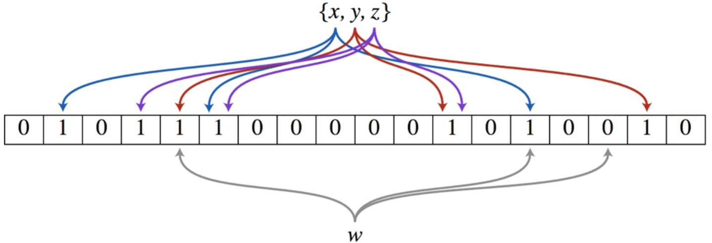
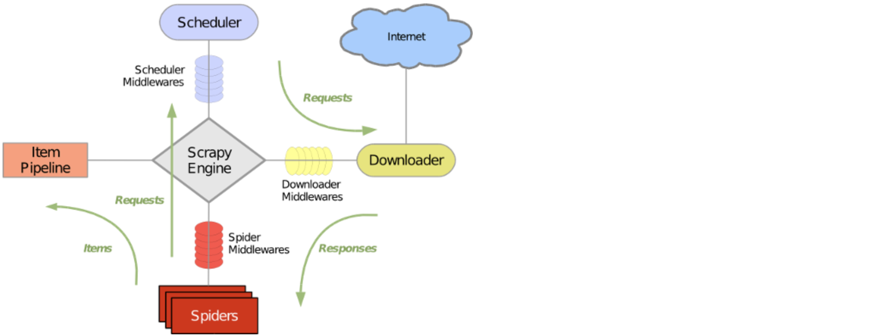

# 如何搭建一个爬虫

搭建一个接近商用的爬虫，需要做如下几件事情：

1. **了解最基本的爬虫入门知识**
2. **高效爬取，分布式爬虫**
3. **特殊场景的处理**
4. **Bloom Filter用于去重**
5. **集群抓取**
6. **分析爬取的数据**
7. **存储**
8. **成熟的爬虫框架**

## 1、了解最基本的爬虫入门知识

所有的爬虫都是一个原理：

> 发送请求 —> 获得页面 —> 解析页面 —> 下载内容（optional） —> 储存结果

### 如何发送请求？

通常的情况下，我们会用到下面的网络请求模块中的其中一个：

* urllib/urllib2/urllib3
* requests

> urllib/urllib2/urllib3

python内置的网络库，里面包含了打开网址发送请求的方法。随着互联网的发展，urllib也在迭代进步，所以有了urllib2和urllib3。

需要注意urllib2是只在python2里才有的，而urllib3是并非python内置的，需要安装。

他们各自的侧重点也不一样：

> urllib主要是有处理编码的方法，如`urlencode()`、`quote()`和`quote_plus()`，而这些是urllib2所没有的，所以经常是用urllib来做转码的事情

```python
s = urllib.quote('This is python')  #编码
print('quote:\t'+s)    # quote: This%20is%20python
s_un = urllib.unquote(s)  #解码
print('unquote:\t'+s_un) # unquote:   This is python
s_plus = urllib.quote_plus('This is python')  #编码
print('quote_plus:\t'+s_plus)   #quote_plus: This+is+python
s_unplus = urllib.unquote_plus(s_plus)      #解码
print('s_unplus:\t'+s_unplus) #quote_unplus:  This is python
s_dict = {'name': 'dkf', 'pass': '1234'}
s_encode = urllib.urlencode(s_dict)    #编码字典转换成url参数
print('s_encode:\t'+s_encode) #s_encode:  name=dkf&pass=1234
```

> urllib2模块定义的函数和类用来获取URL，他提供一些复杂的接口用于处理：基本认证，重定向，Cookies等。

和urllib结合使用的例子：

```python
import urllib
import urllib2
url = 'http://www.someserver.com/cgi-bin/register.cgi'
user_agent = 'Mozilla/4.0 (compatible; MSIE 5.5; Windows NT)'
values = {'name' : 'Michael Foord',
          'location' : 'Northampton',
          'language' : 'Python' }
headers = { 'User-Agent' : user_agent }##伪装主机的headers
data = urllib.urlencode(values)
req = urllib2.Request(url, data, headers)#headers传入Request类
response = urllib2.urlopen(req)
the_page = response.read()
```

> urllib3对内置的urllib/urllib2做了进一步的深入，在功能是使用方便性上会更加的优化。

```python
import urllib3
import json
http = urllib3.PoolManager()
r = http.request('GET', 'http://httpbin.org/ip')
json.loads(r.data.decode('utf-8'))
```

具体的介绍查看[urllib3](https://urllib3.readthedocs.io/en/latest/index.html)

> requests

非python的内置库，内部使用的是urllib3。

```python 
import requests

r = requests.get(url='http://www.baidu.com')
print(r.status_code)
#带参数的GET请求，http://dict.baidu.com/s?wd=python
r = requests.get(url='http://dict.baidu.com/s', params={'wd':'python'}) 
print(r.url)
print(r.text)
```

具体的介绍查看[Requests](https://2.python-requests.org/en/master/)

### 分析html/css

熟练掌握 F12 开发者工具。

### 如何做匹配？

我们下载完页面后，并不需要这么多的数据，而是只是其中的少量内容，那么从里面找到对应的数据就需要做匹配。

* re（regular expressions）
* XPATH
* Beautifulsoup

> re

其实就是正则表达式，如下例子：

```python
res = re.findall(r'href="(.*?)"', html)
print("\nAll links: ", res)
```

注意前面有个`r`，表示这个字符串是正则表达式，而不是简单的字符串。


> XPATH

高效的分析语言，可替换re。

XPATH的语法虽然简单，但是也是需要花时间去学习的，chome下有个插件：

**xPath Finder**

使用的效果如下：



或者chrome自带的“检查”工具也是可以的：



> Beautifulsoup

第三方库，需要自行安装，一个简答的例子：

```python
soup = BeautifulSoup(html, features='html.parser')
table = soup.find('table', {"class": "table mac-benchmark"})
trs = table.find('tbody').find_all('tr')
for tr in trs:
name = tr.find('div', {"class": "description"}).get_text()
score = tr.find('td', {"class": "score"}).get_text()
his[name] = score
```

具体的介绍查看[BeautifulSoup](https://www.crummy.com/software/BeautifulSoup/bs4/doc.zh/)

## 2、高效爬取，分布式爬虫

为了更加快速的爬取网页，单线程的处理肯定效率极低，这时就需要引入**分布式爬虫**的概念，涉及到并发的概念。

* multiprocessing
* Asyncio

> multiprocessing

就是使用python的多进程来处理爬取（注意这里是用多进程，不是多线程，python的多线程是有个全局锁的，整个的执行效率不单线程还低，多线程适合处理I/O密集型的任务）。

关于multiprocessing的介绍参考：[multiprocessing](https://morvanzhou.github.io/tutorials/python-basic/multiprocessing/)

> Asyncio

这是一个仅仅使用单线程, 就能达到多线程/进程的效果的工具。它的原理是: **在单线程里使用异步计算, 下载网页的时候和处理网页的时候是不连续的, 更有效利用了等待下载的这段时间。**

multiprocessing VS Asyncio：



一个简单的例子：

```python
import asyncio


async def job(t):                   # async 形式的功能
    print('Start job ', t)
    await asyncio.sleep(t)          # 等待 "t" 秒, 期间切换其他任务
    print('Job ', t, ' takes ', t, ' s')


async def main(loop):                       # async 形式的功能
    tasks = [
    loop.create_task(job(t)) for t in range(1, 3)
    ]                                       # 创建任务, 但是不执行
    await asyncio.wait(tasks)               # 执行并等待所有任务完成

t1 = time.time()
loop = asyncio.get_event_loop()             # 建立 loop
loop.run_until_complete(main(loop))         # 执行 loop
loop.close()                                # 关闭 loop
print("Async total time : ", time.time() - t1)

"""
Start job  1
Start job  2
Job  1  takes  1  s
Job  2  takes  2  s
Async total time :  2.001495838165283
"""
```

asyncio要进行网络请求，需要配合aiohttp使用。aiohttp是基于asyncio来实现的。

关于的详细介绍参考[asyncio](https://docs.python.org/zh-cn/3/library/asyncio-task.html)和[aiohttp](https://aiohttp.readthedocs.io/en/stable/index.html)。

## 3、特殊场景的处理

### 动态页面怎么处理？

* selenium
* PhantomJS（已经被废弃）

现在的页面都是动态的，有很多需要人为操作才会出现的页面，这时就需要模拟点击，从而爬取对应的页面内容。

可以得到点击后的页面内容：

```python
html = driver.page_source
```

更多关于selenium的介绍请看[selenium](https://selenium-python.readthedocs.io/)

### 登录态如何处理？

很多网站需要登录后才能处理，并且在多个页面之间都需要这个登录态。为了保持登录态，可以使用到Cookies或Session。

* cookies
* session

比如依赖requests库实现的登录态。

```python
payload = {'username': 'xxx', 'password': 'xxx'}
r = requests.post('http://pythonscraping.com/pages/cookies/welcome.php', data=payload)
print(r.cookies.get_dict())
r = requests.get('http://pythonscraping.com/pages/cookies/profile.php', cookies=r.cookies)
print(r.text)
```

### 验证码（或其他反爬虫）怎么处理？

对于反爬虫的问题的处理，比如验证码，就需要涉及到图像识别等内容，目前也有付费的服务，如百度的OCR，当然我们可以自己构建识别系统

* PIL
* opencv
* pybrain

PIL是用来做图片处理的，因为有些图片不是很好识别，可能就需要做转灰度、二值化以及去干扰等图像操作；opencv就是传统的图像的元数据的处理了；而pybrain则有机器学习在里面了。

更多内容请看[PIL](http://effbot.org/imagingbook/overview.html)和[pybrain](http://pybrain.org/docs/index.html)

## 4、Bloom Filter用于去重

爬取网页肯定会走到曾经走过的页面，那就会涉及到去重的问题，通过python自身set集合的去重，效率还是很低的，使用Bloom Filter可以加速这个过程。



详细的介绍参考[布隆过滤器的原理和实现](https://github.com/cpselvis/zhihu-crawler/wiki/%E5%B8%83%E9%9A%86%E8%BF%87%E6%BB%A4%E5%99%A8%E7%9A%84%E5%8E%9F%E7%90%86%E5%92%8C%E5%AE%9E%E7%8E%B0)

## 5、集群抓取

需要维护一个所有集群机器能够有效分享的分布式队列，可以用到`python-rq`

详细的介绍[python-rq](https://python-rq.org/)

## 6、分析爬取的数据

推荐使用：

* numpy
* pandas

numpy和pandas都是采用C语言编写, pandas又是基于numpy, 是numpy的升级版本。

官方参考文章[numpy](https://www.numpy.org/)和[pandas](http://pandas.pydata.org/pandas-docs/stable/index.html)

## 7、存储

这个就随便了，可以数据库，也可以文件。

## 6、成熟的爬虫框架

从上面看，要从头做个成熟的爬虫，还是有很多事情需要处理。这个时候就可以使用一些成熟的爬虫框架了，主要是：

* PySpider
* Scrapy

> PySpider

官网[pyspider](http://docs.pyspider.org/en/latest/)

* python 脚本控制，可以用任何你喜欢的html解析包（内置 pyquery）
* WEB 界面编写调试脚本，起停脚本，监控执行状态，查看活动历史，获取结果产出
* 数据存储支持MySQL, MongoDB, Redis, SQLite, Elasticsearch; PostgreSQL 及 SQLAlchemy
* 队列服务支持RabbitMQ, Beanstalk, Redis 和 Kombu
* 支持抓取 JavaScript 的页面
* 组件可替换，支持单机/分布式部署，支持 Docker 部署
* 强大的调度控制，支持超时重爬及优先级设置
* 支持python2&3

> Scrapy

官网[scrapy](https://scrapy.org/)

Scrapy自定义程度高，比 PySpider更底层一些。



## 参考

[https://www.zhihu.com/question/20899988](https://www.zhihu.com/question/20899988)