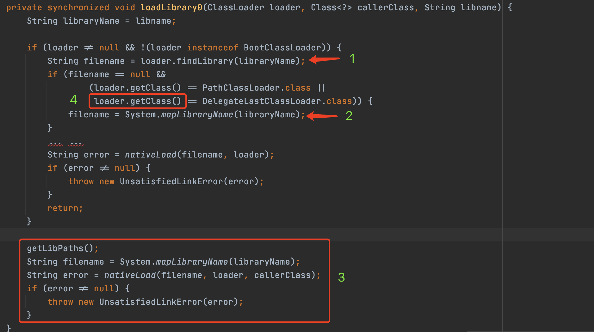
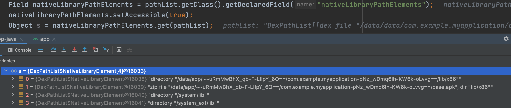
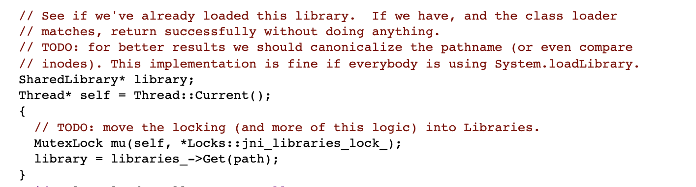
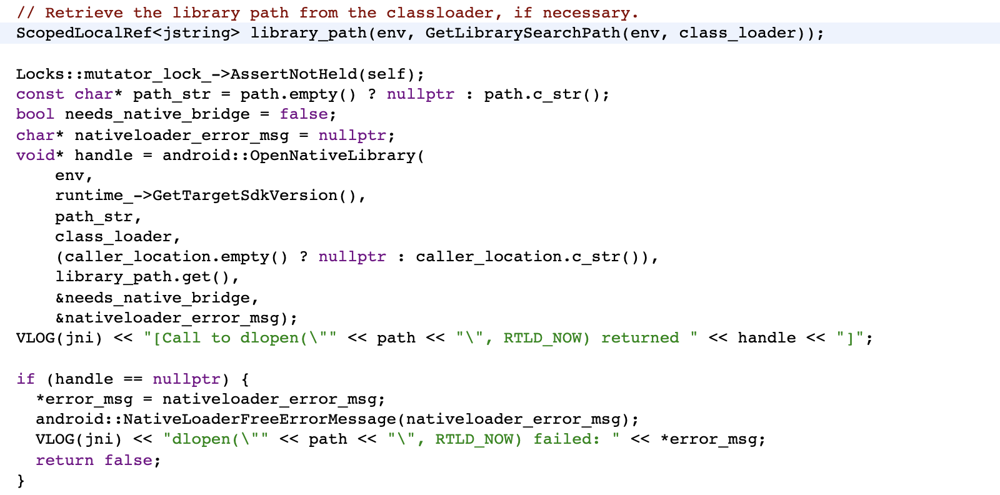
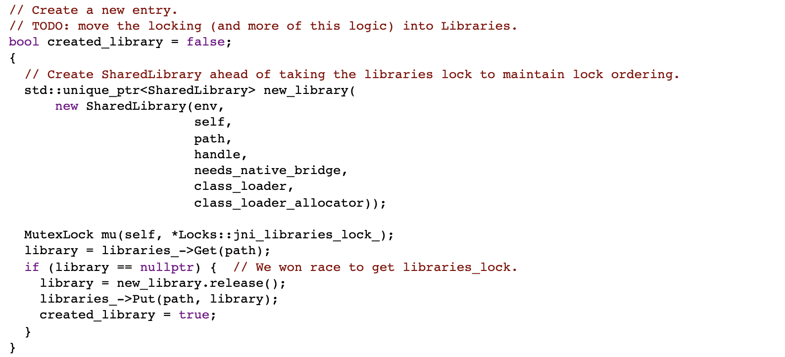
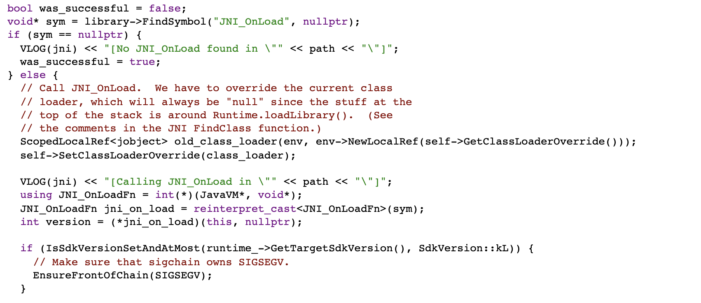
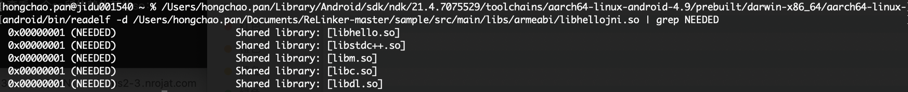

# 安卓动态库的加载

## System.loadLibrary的过程



**<font color='red'>Part.1</font>**

其实就是根据library的名字去找到这个库的绝对路径，因为最后需要根据绝对路径去加载库。

具体流程如下：触发`BaseDexClassLoader`中的`findLibrary()`方法，这个方法具体调用到` DexPathList `中的`findLibrary()`方法：

```java
public String findLibrary(String libraryName) {
    String fileName = System.mapLibraryName(libraryName);

    for (NativeLibraryElement element : nativeLibraryPathElements) {
        String path = element.findNativeLibrary(fileName);

        if (path != null) {
            return path;
        }
    }

    return null;
}
```

这里的`nativeLibraryPathElements`是`DexPathList`在初始化后生成的，包含了可能存放so的路径。可以反射看看它的内容：


这里的`findNativeLibrary()`代码为：

```java
public String findNativeLibrary(String name) {
    maybeInit();

    if (zipDir == null) {
        String entryPath = new File(path, name).getPath();
        if (IoUtils.canOpenReadOnly(entryPath)) {
            return entryPath;
        }
    } else if (urlHandler != null) {
        String entryName = zipDir + '/' + name;
        if (urlHandler.isEntryStored(entryName)) {
          return path.getPath() + zipSeparator + entryName;
        }
    }

    return null;
}
```

这里的`canOpenReadOnly()`代码比较有意思：

```java
/**
 * Do not use. This is for System.loadLibrary use only.
 *
 * Checks whether {@code path} can be opened read-only. Similar to File.exists, but doesn't
 * require read permission on the parent, so it'll work in more cases, and allow you to
 * remove read permission from more directories. Everyone else should just open(2) and then
 * use the fd, but the loadLibrary API is broken by its need to ask ClassLoaders where to
 * find a .so rather than just calling dlopen(3).
 *
 * @hide
 */
public static boolean canOpenReadOnly(String path) {
    try {
        // Use open(2) rather than stat(2) so we require fewer permissions. http://b/6485312.
        FileDescriptor fd = Libcore.os.open(path, O_RDONLY, 0);
        Libcore.os.close(fd);
        return true;
    } catch (ErrnoException errnoException) {
        return false;
    }
}
```

**<font color='red'>Part.2</font>**

`mapLibraryName()`方法很简单就是在libraryName的前后加上lib和.so。源码在`libcore/ojluni/src/main/native/System.c`：

```c
JNIEXPORT jstring JNICALL
System_mapLibraryName(JNIEnv *env, jclass ign, jstring libname)
{
    int len;
    int prefix_len = (int) strlen(JNI_LIB_PREFIX);
    int suffix_len = (int) strlen(JNI_LIB_SUFFIX);

    jchar chars[256];
    if (libname == NULL) {
        JNU_ThrowNullPointerException(env, 0);
        return NULL;
    }
    len = (*env)->GetStringLength(env, libname);
    if (len > 240) {
        JNU_ThrowIllegalArgumentException(env, "name too long");
        return NULL;
    }
    cpchars(chars, JNI_LIB_PREFIX, prefix_len);
    (*env)->GetStringRegion(env, libname, 0, len, chars + prefix_len);
    len += prefix_len;
    cpchars(chars + len, JNI_LIB_SUFFIX, suffix_len);
    len += suffix_len;

    return (*env)->NewString(env, chars, len);
}
```

**<font color='red'>Part.4</font>**

`getClass()`的说明是`Returns the runtime class of this Object.`，那什么是`runtime class`？

> Just understand it as "an object that has all the metadata of the object's type". In that object, you can find the methods declared in the class, the fields, the type hierarchy, etc. This information will be typically used by code that uses reflection to either inspect objects/types or to run method without the need to have the class defined and compiled when they, themselves are being coded.

> "Runtime" may be emphasized because the class definition may change over time, or the object may be declared as a supertype while it actually is an instance of a subtype of the one declared. When a certain class is loaded, it's that information, as loaded during that instance, that will be returned by the getClass() method.

> In short, when your code runs, the VM will have a definition of your class in a different way than the "source" form that you type in a .java file. That information, of course after being compiled, will be loaded and all the metadata (as said above) will constitute what they call the "runtime class". It's just a fancy way to say "an object with all the metadata about a class loaded when the program is running"


## System.load的过程

load()的过程就比较简单了，就是直接调用native方法进行加载：

```java
synchronized void load0(Class<?> fromClass, String filename) {
    if (!(new File(filename).isAbsolute())) {
        throw new UnsatisfiedLinkError(
            "Expecting an absolute path of the library: " + filename);
    }
    if (filename == null) {
        throw new NullPointerException("filename == null");
    }
    String error = nativeLoad(filename, fromClass.getClassLoader());
    if (error != null) {
        throw new UnsatisfiedLinkError(error);
    }
}
```

## nativeLoad的过程

入口在`libcore/ojluni/src/main/native/Runtime.c`：

```c
JNIEXPORT jstring JNICALL
Runtime_nativeLoad(JNIEnv* env, jclass ignored, jstring javaFilename,
                   jobject javaLoader, jclass caller)
{
    return JVM_NativeLoad(env, javaFilename, javaLoader, caller);
}
```

这里会调用到`art/openjdkjvm/OpenjdkJvm.cc`的`JVM_NativeLoad()`方法。

```c
JNIEXPORT jstring JVM_NativeLoad(JNIEnv* env,
                                 jstring javaFilename,
                                 jobject javaLoader,
                                 jclass caller) {
  ScopedUtfChars filename(env, javaFilename);
  if (filename.c_str() == nullptr) {
    return nullptr;
  }

  std::string error_msg;
  {
    art::JavaVMExt* vm = art::Runtime::Current()->GetJavaVM();
    bool success = vm->LoadNativeLibrary(env,
                                         filename.c_str(),
                                         javaLoader,
                                         caller,
                                         &error_msg);
    if (success) {
      return nullptr;
    }
  }

  // Don't let a pending exception from JNI_OnLoad cause a CheckJNI issue with NewStringUTF.
  env->ExceptionClear();
  return env->NewStringUTF(error_msg.c_str());
}
```

这里核心的就是vm的`LoadNativeLibrary()`方法，所在的文件路径`art/runtime/jni/java_vm_ext.cc`：

**1. 检查该动态库是否已加载，如果已经加载则直接使用**



**2. dlopen打开so**



**3. 创建SharedLibrary共享库,并添加到libraries_列表**



**4. 调用JNI_OnLoad方法**



## System.loadLibrary 和 System.load的差异

* **加载的路径不同**：System.load(String filename)是指定动态库的完整路径名；而System.loadLibrary(String libname)则只会从指定lib目录下查找，并加上lib前缀和.so后缀；
* **自动加载库的依赖库的不同**：System.load(String filename)不会自动加载依赖库；而System.loadLibrary(String libname)会自动加载依赖库。

## 系统的loadLibrary错误——UnsatisfiedLinkError

> Caused by: java.lang.UnsatisfiedLinkError: Library hello_jni not found
at java.lang.Runtime.loadLibrary(Runtime.java:461)
at java.lang.System.loadLibrary(System.java:557)
at com.your.app.NativeClass.<clinit>(Native.java:16)

出现这个问题的原因不是apk里没有这个so，而是在安装的过程中，PackageManager没有将so正确的提取。这个在Android M已经修复。

在安装 app 时，Android package manager 代码需要分析当前手机支持的指令集并拷贝相关指令集的 so。从 Android2.X 到 Android6.0 系统，由于相继加入了 x86、64位等指令集的支持，这一部分代码处理逻辑有不少变动，然而这个代码是存在逻辑缺陷的，存在遗漏拷贝的可能，导致在一些机型上并不一定保证所有的 so 都能被正确抽取到`/data/app/~~/<package name>`目录下，从而导致应用在加载 so 的时候出现 UnsatisfiedLinkError 这样的错误。

## ReLinker开源库源码分析

ReLinker的核心逻辑是自己重新解开apk，提取其中需要的so。核心逻辑在`findAPKWithLibrary()`，是找到`/data/app/~~Or548q7EQHjC-6y-DfYMew==/com.getkeepsafe.relinker.sample-1AWLSunKCWQ3u-ZIUI0vsw==/base.apk`下的apk进行解析：

```java
private ZipFileInZipEntry findAPKWithLibrary(final Context context,
                                             final String[] abis,
                                             final String mappedLibraryName,
                                             final ReLinkerInstance instance) {

    for (String sourceDir : sourceDirectories(context)) {
        ZipFile zipFile = null;
        int tries = 0;
        while (tries++ < MAX_TRIES) {
            try {
                zipFile = new ZipFile(new File(sourceDir), ZipFile.OPEN_READ);
                break;
            } catch (IOException ignored) {
            }
        }

        if (zipFile == null) {
            continue;
        }

        tries = 0;
        while (tries++ < MAX_TRIES) {
            String jniNameInApk = null;
            ZipEntry libraryEntry = null;

            for (final String abi : abis) {
                jniNameInApk = "lib" + File.separatorChar + abi + File.separatorChar
                        + mappedLibraryName;

                instance.log("Looking for %s in APK %s...", jniNameInApk, sourceDir);

                libraryEntry = zipFile.getEntry(jniNameInApk);

                if (libraryEntry != null) {
                    return new ZipFileInZipEntry(zipFile, libraryEntry);
                }
            }
        }

        try {
            zipFile.close();
        } catch (IOException ignored) {
        }
    }

    return null;
}
```

具体源码：[ReLinker](https://github.com/KeepSafe/ReLinker)。很多源码参考的了chrome的源码，可见：[LibraryLoaderHelper.java](https://chromium.googlesource.com/chromium/src/base/+/cb3590dd6d4f6417b474940aa777bbf583e4db5f/android/java/src/org/chromium/base/library_loader/LibraryLoaderHelper.java)

上面的逻辑相对简单，更重要的，我们还需要加载so所依赖的其他so，这个是怎么做的呢？可以通过如下命令查看一个so所依赖的其他so：


那我们怎么去加载这些so呢？这需要了解so的ELF格式。

## ELF格式

ELF，即 Executable and Linking Format，译为“可执行可连接格式”，具有这种格式的文件称为 ELF 文件。
详细介绍：[Understanding_ELF](https://paper.seebug.org/papers/Archive/refs/elf/Understanding_ELF.pdf)

## 动态加载so

这个比较简单，可以直接System.load()去加载，也可以通过修改系统源码来实现：

可以参考：[LoadLibraryUtil.java](https://github.com/AnyMarvel/ManPinAPP/blob/master/app/src/main/java/com/google/android/apps/photolab/storyboard/soloader/LoadLibraryUtil.java)

## 补充阅读：FileChannel类

[FileChannel 学习](https://spongecaptain.cool/SimpleClearFileIO/6.%20FileChannel.html)

[Guide to Java FileChannel](https://www.baeldung.com/java-filechannel)

