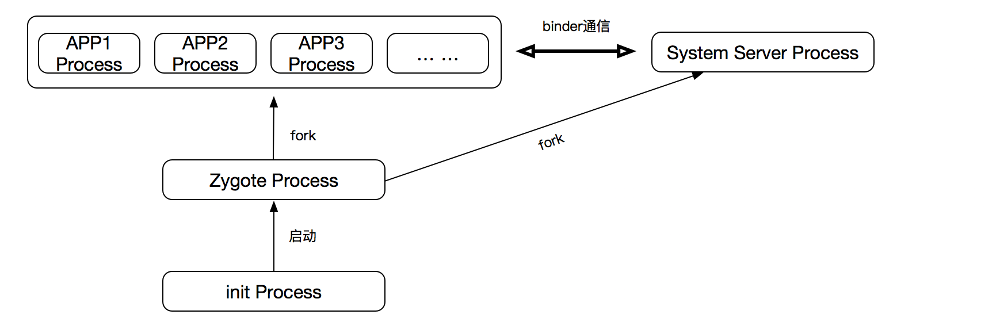
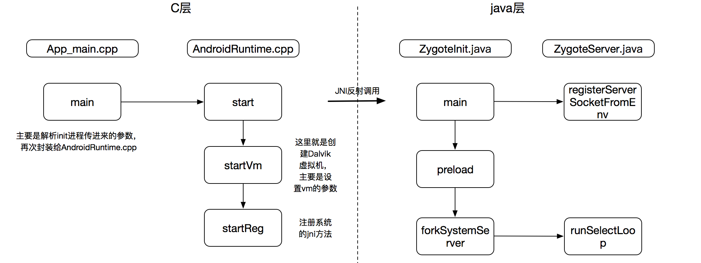
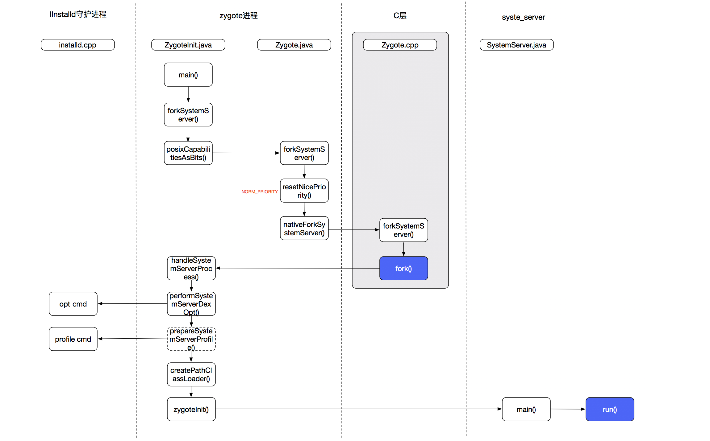
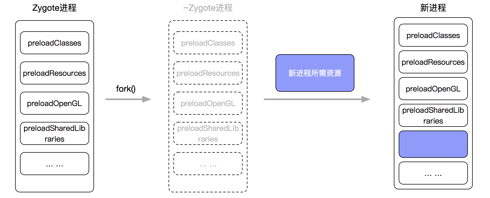
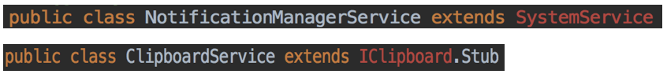
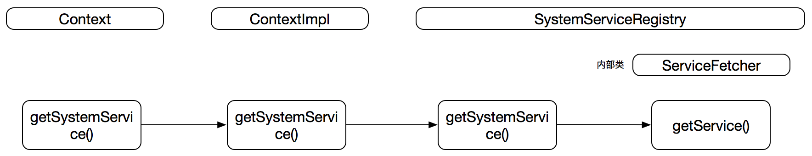
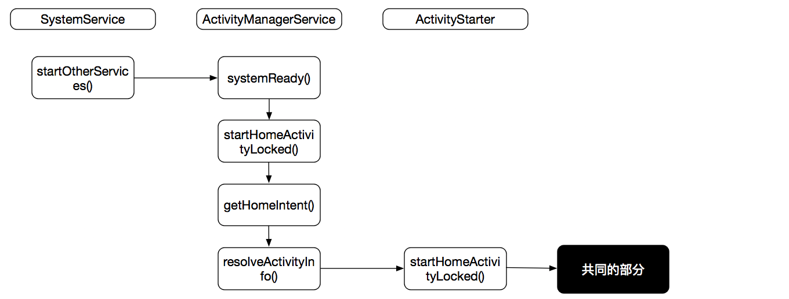
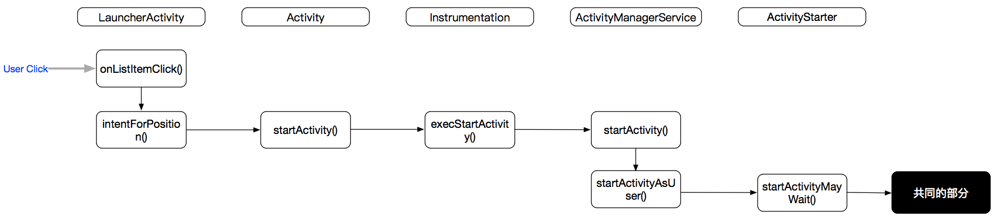
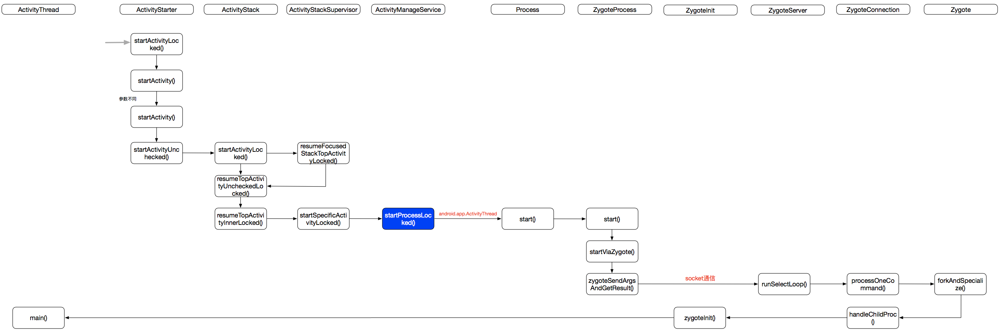
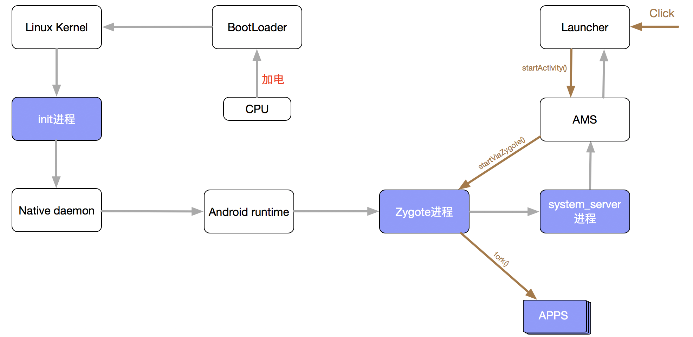

# 安卓进程启动流程

这篇文章主要是介绍安卓中核心的几个进程的启动的过程来加深对安卓系统的理解，本文的源码分析基于安卓8.0。

## 概览

安卓系统里有四类进程：

* **init进程**
* **Zygote进程**
* **System Server进程**
* **APP进程**

他们的关系可大致描述为：



## Zygote进程启动过程

zygote是由init进程执行app_process程序创建的，该程序文件位于`/system/bin/`下面。

大致的流程如下：



整个流程做的事情还是很多的，这里我们仅关注2点：

> 1、startReg

这里就是来注册系统JNI方法的，系统采用了**动态注册的方式来注册系统JNI**，我们看看是怎么做的。

源码的路径`/frameworks/base/core/jni/AndroidRuntime.cpp`下。

```cpp
static int register_jni_procs(const RegJNIRec array[], size_t count, JNIEnv* env)
{
    for (size_t i = 0; i < count; i++) {
        if (array[i].mProc(env) < 0) {
            return -1;
        }
    }
    return 0;
}
```

这里的`RegJNIRec`是个结构体：

```java
#ifdef NDEBUG
    #define REG_JNI(name)      { name }
    struct RegJNIRec {
        int (*mProc)(JNIEnv*);
    };
#else
    #define REG_JNI(name)      { name, #name }
    struct RegJNIRec {
        int (*mProc)(JNIEnv*);
        const char* mName;
    };
#endif
```

调用`mProc`就相当于调用了所指向的函数。那系统到底会加载哪些JNI方法呢，这个就定义在了`gRegJNI[]`数组里：

```cpp
static const RegJNIRec gRegJNI[] = {
    REG_JNI(register_android_debug_JNITest),
    REG_JNI(register_com_android_internal_os_RuntimeInit),
    REG_JNI(register_android_os_SystemClock),    	 REG_JNI(register_android_os_MessageQueue),
    ... ...
}
```

那所指向的函数是怎么完成注册的呢？我们以`register_android_os_MessageQueue`为例子来说明。

在`/frameworks/base/core/jni/android_os_MessageQueue.cpp`里。

```java
static JNINativeMethod gMessageQueueMethods[] = {
    /* name, signature, funcPtr */
    { "nativeInit", "()V", (void*)android_os_MessageQueue_nativeInit },
    { "nativeDestroy", "()V", (void*)android_os_MessageQueue_nativeDestroy },
    { "nativePollOnce", "(II)V", (void*)android_os_MessageQueue_nativePollOnce },
    { "nativeWake", "(I)V", (void*)android_os_MessageQueue_nativeWake }
};

int register_android_os_MessageQueue(JNIEnv* env) {
    int res = jniRegisterNativeMethods(env, "android/os/MessageQueue",
            gMessageQueueMethods, NELEM(gMessageQueueMethods));
    LOG_FATAL_IF(res < 0, "Unable to register native methods.");
    FIND_CLASS(gMessageQueueClassInfo.clazz, "android/os/MessageQueue");
    GET_FIELD_ID(gMessageQueueClassInfo.mPtr, gMessageQueueClassInfo.clazz,
            "mPtr", "I");
    
    return 0;
}
```

其核心的方法是`jniRegisterNativeMethods`，任何需要通过动态加载JNI的函数都需要调用这个方法来完成注册。

**思维扩展**

应用层进行JNI开发，一般采用的都是静态注册的方式，说白了就是反射。那我们可不可以动态注册自己的JNI方法呢？yes~

这里给出一个demo。核心是在`JNI_OnLoad`里完成注册，这个方法相当于java层的main入口。

java层的代码：

```java
package com.jni;
public class JavaHello {
    public static native String hello();
    static {
        // load library: libtest.so
        try {
            System.loadLibrary("test");
        } catch (UnsatisfiedLinkError ule) {
            System.err.println("WARNING: Could not load library!");
        }
    }
    public static void main(String[] args) {
        String s = new JavaHello().hello();
        System.out.println(s);
    }
}
```

c层代码：

```java
#include <stdlib.h>
#include <string.h>
#include <stdio.h>
#include <jni.h>
#include <assert.h>

JNIEXPORT jstring JNICALL native_hello(JNIEnv *env, jclass clazz)
{
    printf("hello in c native code./n");
    return (*env)->NewStringUTF(env, "hello world returned.");
}

#define JNIREG_CLASS "com/jni/JavaHello"//指定要注册的类

/**
* Table of methods associated with a single class.
*/
static JNINativeMethod gMethods[] = {
    { "hello", "()Ljava/lang/String;", (void*)native_hello },//绑定
};

/*
* Register several native methods for one class.
*/
static int registerNativeMethods(JNIEnv* env, const char* className,
        JNINativeMethod* gMethods, int numMethods)
{
    jclass clazz;
    clazz = (*env)->FindClass(env, className);
    if (clazz == NULL) {
        return JNI_FALSE;
    }
    if ((*env)->RegisterNatives(env, clazz, gMethods, numMethods) < 0) {
        return JNI_FALSE;
    }

    return JNI_TRUE;
}


/*
* Register native methods for all classes we know about.
*/
static int registerNatives(JNIEnv* env)
{
    if (!registerNativeMethods(env, JNIREG_CLASS, gMethods, 
                                 sizeof(gMethods) / sizeof(gMethods[0])))
        return JNI_FALSE;

    return JNI_TRUE;
}

/*
* Set some test stuff up.
*
* Returns the JNI version on success, -1 on failure.
*/
JNIEXPORT jint JNICALL JNI_OnLoad(JavaVM* vm, void* reserved)
{
    JNIEnv* env = NULL;
    jint result = -1;

    if ((*vm)->GetEnv(vm, (void**) &env, JNI_VERSION_1_4) != JNI_OK) {
        return -1;
    }
    assert(env != NULL);

    if (!registerNatives(env)) {//注册
        return -1;
    }
    /* success -- return valid version number */
    result = JNI_VERSION_1_4;

    return result;
}
```

> 2、preload

预加载安卓系统的一些内容：

```java
static void preload(TimingsTraceLog bootTimingsTraceLog){        
	preloadClasses();
    preloadResources();
    preloadOpenGL();
    preloadSharedLibraries();
    preloadTextResources();    
}
```

**2.1 preloadClasses()**

方法很长，其实就做了2件事：

* 读取需要加载的类，这个被写到了文件里，路径在`/system/etc/preloaded-classes`
* 一行行的去读取文件，调用`Class.forName()`加载

**2.2 preloadResources()**

资源加载，主要是加载`com.android.internal.R.array.preloaded_drawables`和`com.android.internal.R.array.preloaded_color_state_lists`。

比如加载`preloaded_drawables`：

```java
private static int preloadDrawables(TypedArray ar) {
    int N = ar.length();
    for (int i=0; i<N; i++) {
        int id = ar.getResourceId(i, 0);
        if (false) {
            Log.v(TAG, "Preloading resource #" + Integer.toHexString(id));
        }
        if (id != 0) {
            if (mResources.getDrawable(id, null) == null) {
                throw new IllegalArgumentException(
                        "Unable to find preloaded drawable resource #0x"
                        + Integer.toHexString(id)
                        + " (" + ar.getString(i) + ")");
            }
        }
    }
    return N;
}
```

**2.3 preloadOpenGL()**

**2.4 preloadSharedLibraries()**

加载shared的so库。

```java
private static void preloadSharedLibraries() {
    System.loadLibrary("android");
    System.loadLibrary("compiler_rt");
    System.loadLibrary("jnigraphics");
}
```

**2.5 preloadTextResources()**

```java
private static void preloadTextResources() {
    Hyphenator.init();
    TextView.preloadFontCache();
}
```

## System Server进程启动过程

System Server进程是安卓系统的server端的核心，所有的服务都是运行在system_server进程上的。

我们先大致了解下System Server进程启动的流程图：



流程也是很多，同样我们只会关注其中的几个点：

> 1、posixCapabilitiesAsBits

这个不是安卓上的概念，而是linux的权限概念。

```java
long capabilities = posixCapabilitiesAsBits(
    OsConstants.CAP_IPC_LOCK,
    OsConstants.CAP_KILL,
    OsConstants.CAP_NET_ADMIN,
    OsConstants.CAP_NET_BIND_SERVICE,
    OsConstants.CAP_NET_BROADCAST,
    OsConstants.CAP_NET_RAW,
    OsConstants.CAP_SYS_MODULE,
    OsConstants.CAP_SYS_NICE,
    OsConstants.CAP_SYS_PTRACE,
    OsConstants.CAP_SYS_TIME,
    OsConstants.CAP_SYS_TTY_CONFIG,
    OsConstants.CAP_WAKE_ALARM,
    OsConstants.CAP_BLOCK_SUSPEND
);
```

我们知道，Linux系统里的很多操作都是需要root权限才能操作的，以往的获取权限的方式是采用SUID/SGID命令，这个存在安全问题，因为该命令获取到了额root用户所拥有的全部权限，控制的粒度太大，容易被攻击。

Capabilities机制将权限细分，不同的操作对应有不同的权限，可开启或禁用。如上面代码所示，system_server进程向系统申请了这么多的权限，如向其他进程发送信号、设置系统时间、trace进程等。具体的关于Capabilities机制可参考[http://rk700.github.io/2016/10/26/linux-capabilities/](http://rk700.github.io/2016/10/26/linux-capabilities/)。

> 2、fork

这个是整个流程中最为核心的部分。

关于fork具体的底层逻辑请参考[http://gityuan.com/2017/08/05/linux-process-fork/](http://gityuan.com/2017/08/05/linux-process-fork/)。

zygote进程后续的fork操作采用`copy on write技术`来操作。系统会复制一个和zygote进程完全一样的子进程，他们：

* 共享代码空间
* 共享数据段
* 同样上下文
* 同样的程序计数器值
* ... ...

最大的不同就是是不同的PID值。在fork之后，复制的进程加上一些目标进程的资源，就得到了最后的新的进程。



`copy on write技术`是一种只有在写的时候才会拷贝内存的懒惰策略，在读的情况下是共享同一块内存区域的，该技术可参考[https://coolshell.cn/articles/11175.html](https://coolshell.cn/articles/11175.html)。

> 3、performSystemServerDexOpt

这里对执行的jar执行dex-opt的操作，那是哪些jar呢？

```java
Os.getenv("SYSTEMSERVERCLASSPATH");
```

输出的结果就是：

```json
/system/framework/services.jar:/system/framework/ethernet-service.jar:/system/framework/wifi-service.jar
```

具体的执行优化操作的是**IInstalld守护进程**。

> 4、createPathClassLoader

创建ClassLoader。

```java
static ClassLoader createPathClassLoader(String classPath, int targetSdkVersion) {
    String libraryPath = System.getProperty("java.library.path");

    return ClassLoaderFactory.createClassLoader(classPath, libraryPath, libraryPath,
            ClassLoader.getSystemClassLoader(), targetSdkVersion, true /* isNamespaceShared */,
            null /* classLoaderName */);
}
```

这里的`java.library.path`是：

```json
/vendor/lib:/system/lib
```

> 5、zygoteInit

启动system_server前的一些初始化操作。

**5.1 RuntimeInit.commonInit()**

```java
protected static final void commonInit() {
    LoggingHandler loggingHandler = new LoggingHandler();
    Thread.setUncaughtExceptionPreHandler(loggingHandler);
    Thread.setDefaultUncaughtExceptionHandler(new KillApplicationHandler(loggingHandler));

    TimezoneGetter.setInstance(new TimezoneGetter() {
        @Override
        public String getId() {
            return SystemProperties.get("persist.sys.timezone");
        }
    });
    TimeZone.setDefault(null);

    LogManager.getLogManager().reset();
    new AndroidConfig();

    String userAgent = getDefaultUserAgent();
    System.setProperty("http.agent", userAgent);

    NetworkManagementSocketTagger.install();

    String trace = SystemProperties.get("ro.kernel.android.tracing");
    if (trace.equals("1")) {
        Slog.i(TAG, "NOTE: emulator trace profiling enabled");
        Debug.enableEmulatorTraceOutput();
    }
}
```

主要是做了如下几件事情：

1. 设置默认的未捕捉异常
2. 设置时区
3. 设置log
4. 缺省的HTTP user-agent
5. 设置socket的tag，用户流量统计

**5.2 ZygoteInit.nativeZygoteInit()**

```java
private static final native void nativeZygoteInit();
```

主要工作是调用open()打开/dev/binder驱动设备。

**5.3 RuntimeInit.applicationInit()**

```java
protected static Runnable applicationInit(int targetSdkVersion, String[] argv, ClassLoader classLoader) {
	VMRuntime.getRuntime().setTargetHeapUtilization(0.75f);
	VMRuntime.getRuntime().setTargetSdkVersion(targetSdkVersion);
    final Arguments args = new Arguments(argv);
    return findStaticMain(args.startClass, args.startArgs, classLoader);
}
```

主要就2件事情：

1. 设置虚拟机的内存利用率
2. 反射调用到`SystemServer.main()`


> 6、run()

run()这里面也做了很多的事情，看下核心的部分：

```java
private void run() {
	... ...
   // Prepare the main looper thread (this thread).
    android.os.Process.setThreadPriority(
        android.os.Process.THREAD_PRIORITY_FOREGROUND);
    android.os.Process.setCanSelfBackground(false);
    Looper.prepareMainLooper();
    Looper.getMainLooper().setSlowLogThresholdMs(
            SLOW_DISPATCH_THRESHOLD_MS, SLOW_DELIVERY_THRESHOLD_MS);

    // Initialize native services.
    System.loadLibrary("android_servers");
    
    createSystemContext();

    // Create the system service manager.
    mSystemServiceManager = new SystemServiceManager(mSystemContext);
    mSystemServiceManager.setStartInfo(mRuntimeRestart,
            mRuntimeStartElapsedTime, mRuntimeStartUptime);
    LocalServices.addService(SystemServiceManager.class, mSystemServiceManager);
    // Prepare the thread pool for init tasks that can be parallelized
    SystemServerInitThreadPool.get();
    
    // Start services.
    try {
        traceBeginAndSlog("StartServices");
        startBootstrapServices();
        startCoreServices();
        startOtherServices();
        SystemServerInitThreadPool.shutdown();
    } catch (Throwable ex) {
        Slog.e("System", "******************************************");
        Slog.e("System", "************ Failure starting system services", ex);
        throw ex;
    } finally {
        traceEnd();
    }
    
    ... ...
    
    // Loop forever.
    Looper.loop();
}
```

最最核心的就是完成系统服务的启动。分别是：

* startBootstrapServices()
* startCoreServices()
* startOtherServices()

分别启动的是**引导服务**、**核心服务**和**其他服务**。这里的代码很多，但是结构简单，就是不同的addService。

通过这里我们需要搞清楚2点内容：

> 6.1 service是怎么样启动流程？

先了解2个系统类：

* SystemServiceManager
* SystemManager

他们的作用是一样的，都是addService。那为啥需要2个呢？那是因为系统的服务有2种不同的实现，如：



上面类型的服务使用SystemServiceManager来添加服务，而下面类型的服务则使用SystemManager来添加服务。并且SystemServiceManager最后也是使用到SystemManager完成服务的添加。

**SystemManager**

示例：

```java
ServiceManager.addService(Context.CLIPBOARD_SERVICE, new ClipboardService(context));
```

这里的流程就很简单：


**SystemServiceManager**

```java
mSystemServiceManager.startService(NotificationManagerService.class);
```

它的流程会稍微复杂一些：


这里我们关注2个方法：

* onStart()
* onBootPhase()

这2个类是系统服务继承`SystemService`需要实现的。主要是完成自己的一些特定的功能逻辑。

`onStart()`是每个服务做一些自己的初始化的事情等等；`onBootPhase()`是在system_server启动的各个阶段的回调，为啥要定义这些阶段呢？**这是因为有些service的启动需要依赖到其他的一些服务，或者在达到某个时刻才能做一定的事情，如发广播**。

在`SystemService`里定义如下的阶段：

* `PHASE_WAIT_FOR_DEFAULT_DISPLAY（100）`：这个是在`startBootstrapServices()`阶段注册的，是最开始的阶段
* `PHASE_LOCK_SETTINGS_READY（480）`：服务进入到可以获取lock settings data的阶段
* `PHASE_SYSTEM_SERVICES_READY（500）`：服务进入到可以很安全的调用核心的系统服务的阶段，如PowerManagerService
* `PHASE_ACTIVITY_MANAGER_READY（550）`：服务进入到可以广播intents的阶段
* `PHASE_THIRD_PARTY_APPS_CAN_START（600）`：服务进入到可以start/bind第三方app的阶段（只有在这个阶段才能发起binder的请求）
* `PHASE_BOOT_COMPLETED（1000）`：服务进入到用户可交互的阶段，这个阶段发生在boot完成，并且home application已经启动起来
 * 这个阶段会发出一个系统的广播`ACTION_BOOT_COMPLETED`

> 6.2 getSystemService()是怎么样的流程？

上面我们看到服务已经准备好了，那我们的获取流程：



获取的提前是`registerService()`方法：

```java
private static <T> void registerService(String serviceName, Class<T> serviceClass,
        ServiceFetcher<T> serviceFetcher) {
    SYSTEM_SERVICE_NAMES.put(serviceClass, serviceName);
    SYSTEM_SERVICE_FETCHERS.put(serviceName, serviceFetcher);
}
```

该方法在static块中调用，会注册完成所有的services服务的客户端：

```java
static {
    registerService(Context.ACCESSIBILITY_SERVICE, AccessibilityManager.class,
            new CachedServiceFetcher<AccessibilityManager>() {
        @Override
        public AccessibilityManager createService(ContextImpl ctx) {
            return AccessibilityManager.getInstance(ctx);
        }});
        ... ...
}
```

更为详细的代码细节，感兴趣的同学可以按照上面的流程走一遍。

> 7、Looper.loop()

到这里，系统服务启动的阶段就完成了，然后调用`Looper.loop()`让线程陷入循环，随时等待MQ的消息。

## APP进程启动过程

完成了zygote和system_server进程的启动后，就相当于给app进程提供了土壤，下面就等各色app百花齐放了。

我们看下2个不同APP进程的启动流程：

* **Launcher进程**
* **一般的APP进程**

Launcher进程也是属于APP进程，Launcher进程和我们的一般的APP进程在启动的流程上有一点区别。

**Launcher进程**

我们先看下整体流程：



**一般的APP进程**

一般的APP进程就是我们在Launcher上看到的各个APP，我们以点击它的方式启动它来看下APP的启动流程：



可以看到，Launcher进程在system_server起来的后期就启动了起来，而一般的app则是点击Launcher上的icon启动，那么我们看下二者的区别：

```java
void startHomeActivityLocked(Intent intent, ActivityInfo aInfo, String reason) {
        mSupervisor.moveHomeStackTaskToTop(reason);
        mLastHomeActivityStartResult = startActivityLocked(null /*caller*/, intent,
                null /*ephemeralIntent*/, null /*resolvedType*/, aInfo, null /*rInfo*/,
                null /*voiceSession*/, null /*voiceInteractor*/, null /*resultTo*/,
                null /*resultWho*/, 0 /*requestCode*/, 0 /*callingPid*/, 0 /*callingUid*/,
                null /*callingPackage*/, 0 /*realCallingPid*/, 0 /*realCallingUid*/,
                0 /*startFlags*/, null /*options*/, false /*ignoreTargetSecurity*/,
                false /*componentSpecified*/, mLastHomeActivityStartRecord /*outActivity*/,
                null /*inTask*/, "startHomeActivity: " + reason);
        if (mSupervisor.inResumeTopActivity) {
            // If we are in resume section already, home activity will be initialized, but not
            // resumed (to avoid recursive resume) and will stay that way until something pokes it
            // again. We need to schedule another resume.
            mSupervisor.scheduleResumeTopActivities();
        }
    }
```

Launcher在启动的时候，所有的参数都是置空的（或为0），比如caller为null，pid、uid就是为0。

```java
final int startActivityMayWait(IApplicationThread caller, int callingUid,
            String callingPackage, Intent intent, String resolvedType,
            IVoiceInteractionSession voiceSession, IVoiceInteractor voiceInteractor,
            IBinder resultTo, String resultWho, int requestCode, int startFlags,
            ProfilerInfo profilerInfo, WaitResult outResult,
            Configuration globalConfig, Bundle bOptions, boolean ignoreTargetSecurity, int userId,
            TaskRecord inTask, String reason) {
            	... ...
	            final int realCallingPid = Binder.getCallingPid();
	            final int realCallingUid = Binder.getCallingUid();
	            int callingPid;
	            if (callingUid >= 0) {
	                callingPid = -1;
	            } else if (caller == null) {
	                callingPid = realCallingPid;
	                callingUid = realCallingUid;
	            } else {
	                callingPid = callingUid = -1;
	            }
	            int res = startActivityLocked(caller, intent, ephemeralIntent, resolvedType,
                    aInfo, rInfo, voiceSession, voiceInteractor,
                    resultTo, resultWho, requestCode, callingPid,
                    callingUid, callingPackage, realCallingPid, realCallingUid, startFlags,
                    options, ignoreTargetSecurity, componentSpecified, outRecord, inTask,
                    reason);
            	... ...
}
```

一般的app启动会带上pid和uid。

到目前为止，其实应用程序的进程还没有起动起来，下面我们进入二者共同的部分，看看里面发生了什么，先还是看个整体的流程：



这里就能看到引用进程的启动过程了，我们看下核心的点：

> 1、ActivityStackSupervisor.startProcessLocked()

```java
private final void startProcessLocked(ProcessRecord app, String hostingType, String hostingNameStr, String abiOverride, String entryPoint, String[] entryPointArgs) {
	... ...
    // Start the process.  It will either succeed and return a result containing
    // the PID of the new process, or else throw a RuntimeException.
    boolean isActivityProcess = (entryPoint == null);
    if (entryPoint == null) entryPoint = "android.app.ActivityThread";
    Trace.traceBegin(Trace.TRACE_TAG_ACTIVITY_MANAGER, "Start proc: " +
            app.processName);
    checkTime(startTime, "startProcess: asking zygote to start proc");
    ProcessStartResult startResult;
    if (hostingType.equals("webview_service")) {
        startResult = startWebView(entryPoint,
                app.processName, uid, uid, gids, debugFlags, mountExternal,
                app.info.targetSdkVersion, seInfo, requiredAbi, instructionSet,
                app.info.dataDir, null, entryPointArgs);
    } else {
        startResult = Process.start(entryPoint,
                app.processName, uid, uid, gids, debugFlags, mountExternal,
                app.info.targetSdkVersion, seInfo, requiredAbi, instructionSet,
                app.info.dataDir, invokeWith, entryPointArgs);
    }
	... ...
}
```

这里可以看到我们需要启动的是`ActivityThread`类。

> 2、ZygoteServer.runSelectLoop()

Zygote采用I/O多路复用机制，在没有客户端连接请求的时候进入休眠，有消息过来则处理请求。

```java
Runnable runSelectLoop(String abiList) {
	... ...
	while (true) {
		 // 阻塞 
		 try {
            Os.poll(pollFds, -1);
        } catch (ErrnoException ex) {
            throw new RuntimeException("poll failed", ex);
        }
        
        // 处理响应
        ZygoteConnection connection = peers.get(i);
        final Runnable command = connection.processOneCommand(this);
	}
	... ...
}
```

> 3、ActivityThread.main()

这里就是我们的APP所在进程的启动入口，这里也有很多的知识要点。但不在本次课程的范围内，有兴趣的同学可扩展学习。

## 总结

我们完成了对zygote进程、system_server进程和应用进程的启动的梳理（还有init进程），我们再次总结下四者的关系。



这篇文章没有分析init进程启动的流程，感兴趣的同学可以去看[Android系统启动-Init篇](http://gityuan.com/2016/02/05/android-init/)。

## 参考文章

[https://blog.csdn.net/luoshengyang/article/details/6689748](https://blog.csdn.net/luoshengyang/article/details/6689748)

[http://gityuan.com/2016/02/14/android-system-server/](http://gityuan.com/2016/02/14/android-system-server/)

[http://rk700.github.io/2016/10/26/linux-capabilities/](http://rk700.github.io/2016/10/26/linux-capabilities/)

[https://www.kancloud.cn/alex_wsc/androids/472162](https://www.kancloud.cn/alex_wsc/androids/472162)

[https://android.googlesource.com/platform/packages/apps/Launcher3/+/master/AndroidManifest.xml](https://android.googlesource.com/platform/packages/apps/Launcher3/+/master/AndroidManifest.xml)

[https://www.kancloud.cn/alex_wsc/androids/472162](https://www.kancloud.cn/alex_wsc/androids/472162)