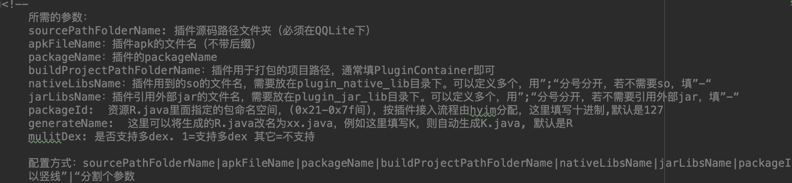
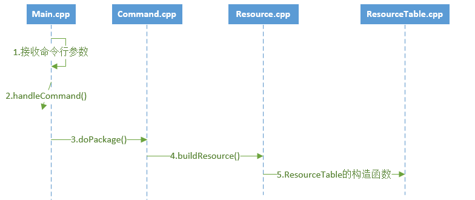
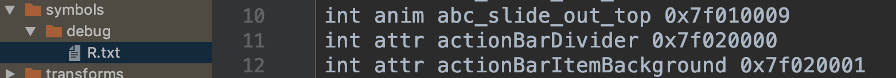
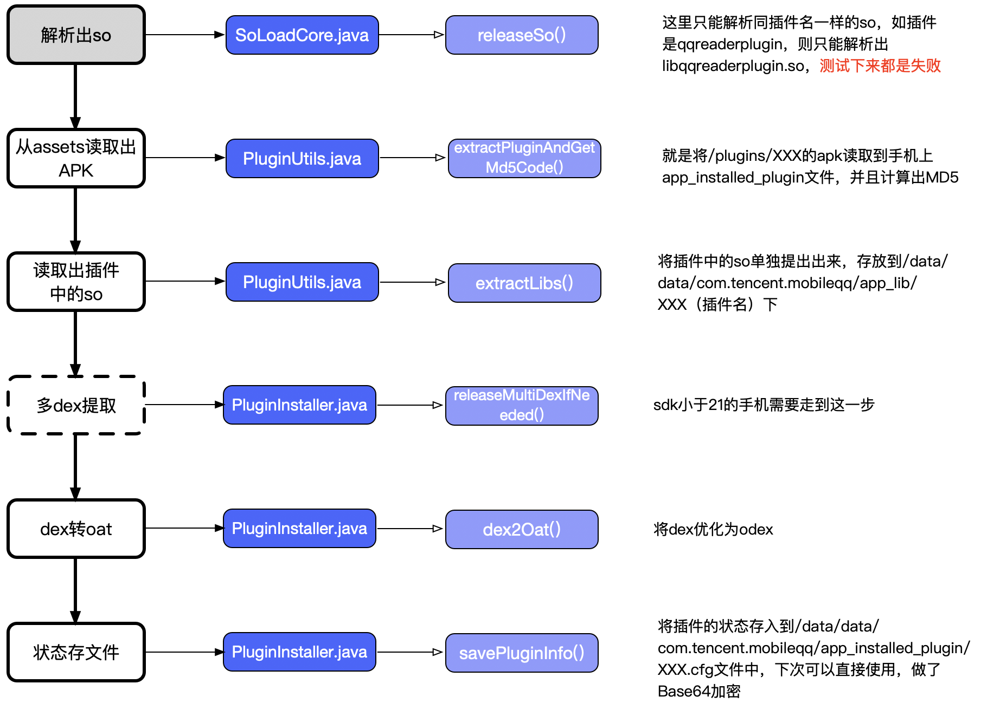
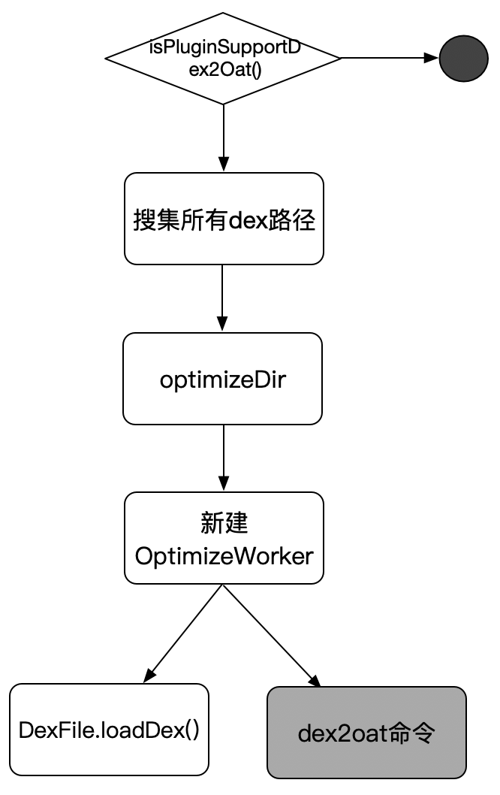
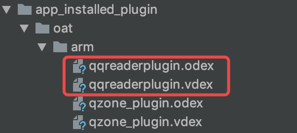
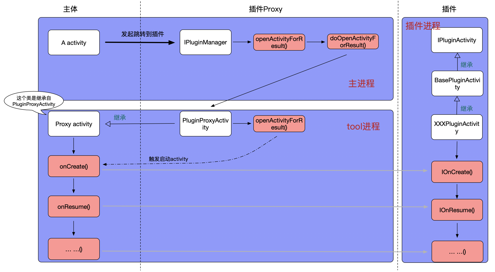
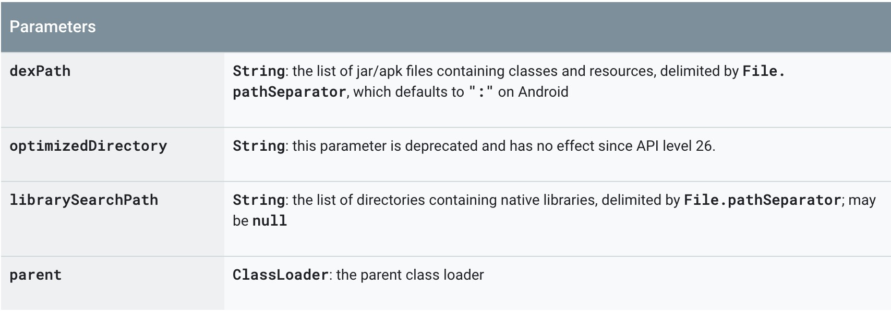
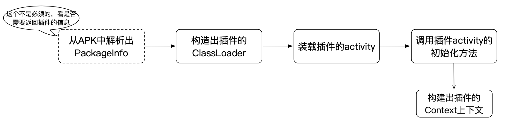
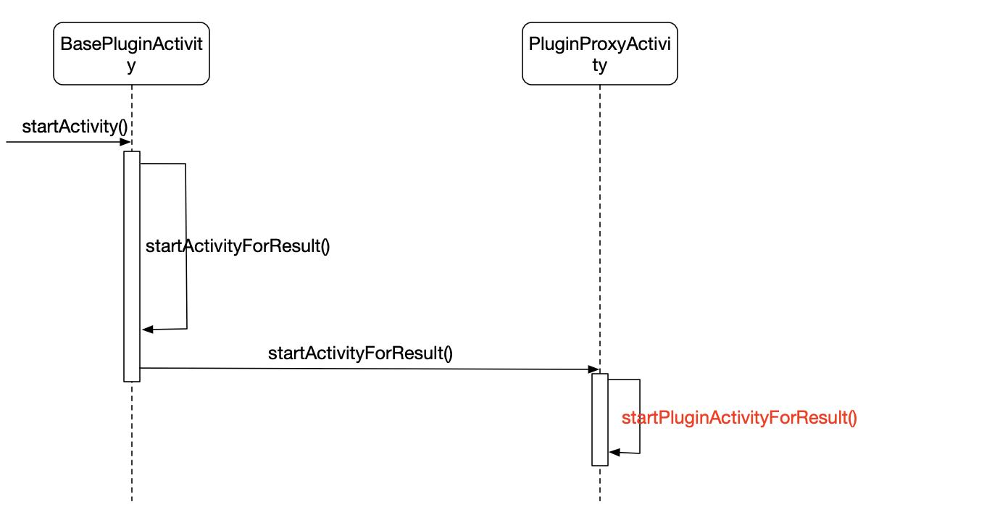

# 手Q插件化实现分析

## 插件的管理

### 插件的来源

插件有2个方式的来源：

* **内置**：打包在主app中，存放在assets/plugins下
* **下发**：就是放在服务器，需要的时候去下载

> 小插曲

放在assets下的插件就是一个完整的apk，但是为了防止破解者知道它是apk，所有的插件都不是apk作为后缀，而是以jpg结尾。虽然没啥用，但也算一种保护吧。

### 内置插件如何自动打包

打插件的命令：

> gradlew qrun -Pfcp  编译全部插件
> 
> gradlew qrun -PPlugin=qzone_plugin  单独编译空间插件

所有的插件编译管理是在`plugin_properties.xml`中定义：



### 插件的packageId

为了防止主工程和插件的资源id冲突，手Q采用了修改aapt的方式来修改插件包的packageId值的方式来解决冲突。而具体的id值在`plugin_properties.xml`会定义出，具体的思路是：



更为具体的介绍可以参考[修改aapt和自定义资源ID](https://github.com/liu00/blog/blob/master/androidBlog/%E4%BF%AE%E6%94%B9aapt%E5%92%8C%E8%87%AA%E5%AE%9A%E4%B9%89%E8%B5%84%E6%BA%90ID.md)

> 关于id冲突还有另外的方案

即编译后期重新整理插件Apk的资源，重新编排ID。该方案是一个后置的操作方案。主要是去hook住gradle的`ProcessAndroidResources`任务，该任务会生成**build/intermediates/symbols/xx/xx/R.txt**，记录了在编译资源过程中产生的资源ID信息。



难点是重写`resources.arsc`，这个需要了解格式然后去逐个解析。

## 插件的安装

安装的代码是在`PluginManagerV2.java`的`installPlugin()`。

```java
public void installPlugin(String pluginID, boolean installBuiltinOnly, boolean isPreInstall, OnPluginInstallListener listener) {
	... ...
	if (isLocalNewest(pluginID) || installBuiltinOnly) {
		mPluginInstaller.setupPlugin(info, this);
	} else {
		mPluginDownloader.downloadPlugin(info, this, isPreInstall);
	}
	... ...
}
```

可以看出，在install插件的时候，会去检查是否是最新的。下载的代码是在`PluginDownloader.java`中，具体不分析。

安装的代码是在`PluginInstaller.java`中，会启动一个新的线程来完成安装的逻辑：

```java
mSetupHandler = new Handler(getPluginInstallThread().getLooper(), this);

public static HandlerThread getPluginInstallThread() {
	if (sSetupThread == null) {
		synchronized (PluginInstaller.class) {
			if (sSetupThread == null) {
				sSetupThread = ThreadManager.newFreeHandlerThread("QQ_PLUGIN", Process.THREAD_PRIORITY_DEFAULT);
				sSetupThread.start();
			}
		}
	}
	return sSetupThread;
}
```

具体会触发`doSetupPlugin()`来进行安装操作：

```java
private void doSetupPlugin(PluginInfo info, OnPluginSetupListener l) {
	... ...
	// app_plugin_download没有任何插件，则表示未下载过，所以这里的安装是执行本地从assets里解压插件的操作即localOnly值为true
	boolean localOnly = !isDownloadPlugin(pluginID);
	if(localOnly) {
		installBuiltinPlugin(pluginID, l);
	} else {
		installDownLoadPlugin(info, l);
	}
}
```

installDownLoadPlugin()和installBuiltinPlugin()差不多，仅仅看看installBuiltinPlugin()即可。

### installBuiltinPlugin()

安装的就是内置的插件，具体的解析的流程如下图：



#### 细化分析：1、释放apk中包含的多dex

这里是针对SDK小于21的并且apk中有多个dex的情况才会走的逻辑。

> 为什么要这么做？

> 主要原因是dalvik和art虚拟机对待多dex的不同，具体就反应在DexClassLoader上，API21以上new一个DexClassLoader会自动合并apk中所有的dex文件，API19以下不会。所以在API19以下，创建的DexClassLoader并没有包含apk中所有的dex。

解决方案：

* 可以重写DexClassLoader，将apk中的所有dex都合并进来
* 单独将多余的dex解析出来（**手Q的做法**）

#### 细化分析：2、dex转oat

这个就是实现apk安装过程中的优化。

```java
if (PluginManagerV2.isPluginSupportDex2Oat()) {
	dex2Oat(pluginId, installPath, l);
}
```



经过上面的操作后，在8.0以上机器上运行的结果：



**DEX vs ODEX vs VDEX**

vdex是8.0加入的概念，进一步提升性能，避免了不必要的验证Dex文件合法性的过程。是从dex直接转化而来的可执行二进制文件。

在8.0以后，odex是从vdex这个文件中提取了部分模块生成的一个新的可执行二进制码文件，odex 从vdex中提取后，vdex的大小就减少了。（_在Android N之前，Dalvik虚拟机执行程序dex文件前，系统会对dex文件做优化，生成可执行文件odex，保存到data/dalvik-cache目录，最后把apk文件中的dex文件删除_）

所以直接的关系：**apk=vdex+odex**

更详细的介绍[Android 8.0 VDEX机制简介](https://wwm0609.github.io/2017/12/21/android-vdex/)。

## 插件的启动

插件启动的入口是在`IPluginManager.java`类里的`openActivityForResult()`方法中。

```java
/**
 * @param contextActivity 启动插件Activity
 * @param pp 启动参数
 * 		启动一个Activity，相应的参数为:
 *		PluginParams pp = new PluginParams(PluginInfo.TYPE_PART);
 *								构造器中的唯一参数为插件类型，{@see PluginInfo}
 *
 *		pp.mPluginID			插件唯一ID;
 *		pp.mPluginName			插件名称;
 *		pp.mUin = selfUin		当前用户UIN;
 *		
 *		pp.mConponentName		需要启动的插件内Activity ClassName;
 *	    pp.mProxyActivityClass	插件相应的PluginProxyActivity子类class;
 *	    pp.mIntent = intent		启动Activity需要的intent;
 *	    pp.mRequestCode			RequstCode,默认为-1，即是不需要onActivityResult;
		
 *	    pp.mDialog				启动等待框，若不需要，传null;
 *	    pp.mTimeOut				等待框超时时间，默认为1000;
 *	    pp.mProgressTips		启动时Toast提示，若不需要传null;
 */
public static void openActivityForResult(final Activity contextActivity, final PluginParams pp,final OnOpenPluginListener openPluginListener)
```

大体的流程：



所以手Q的插件化是**宿主代理的方式**：

* 优点：不需要在宿主申明插件的组件，只需要生命代码activity就ok，耦合性降低了
* 缺点：需要在宿主中管理插件中的组件的生命周期，复杂度升高

### 如何load插件

加载class肯定少不了loader类，android中的loader类的关系图谱：


由于是未安装的apk，所以我们只能用DexClassLoader。



整个load的过程是在`PluginProxyActivity.java`的`initPlugin()`中进行的：



> 1、解析PackageInfo

这个代码是`ApkFileParser.getPackageInfoWithException()`，可以手动启解析，也可以直接用系统的api实现。

> 2、构造ClassLoader

这个代码是`PluginStatic.getOrCreateClassLoaderByPath()`。在这里就会用到上面插件安装后各个文件的路径。

> 3、实例化插件的activity

关键代码：

```java
mClassLaunchActivity = (Class<?>) classLoader.loadClass(mLaunchActivity);
mPluginActivity = (IPluginActivity) mClassLaunchActivity.newInstance();
```

> 4、构建插件上下文

关键代码：

```java
if (mContext == null) {
	newContext = true;
	mContext = new PluginContext(context, 0, mApkFilePath, mDexClassLoader, context.getResources(), mPluginResourcesType);
}
attachBaseContext(mContext);
```

PluginContext方法里的context是宿主的context。这里最核心的就是加上插件的资源到上下文中：

```java
private static Resources createResources(Context c, String []paths) {
	Resources r = null;
	try {
		AssetManager asset  = AssetManager.class.newInstance();
		Method assetMag_addAssetPathMtd = AssetManager.class.getDeclaredMethod("addAssetPath", String.class);
		for(String path : paths) {
			assetMag_addAssetPathMtd.invoke(asset, path);
		}
		r = createResources(c, asset);
		r.getDisplayMetrics().setTo(c.getResources().getDisplayMetrics());
	} catch (InstantiationException e) {
		e.printStackTrace();
	} catch (IllegalAccessException e) {
		e.printStackTrace();
	} catch (NoSuchMethodException e) {
		e.printStackTrace();
	} catch (InvocationTargetException e) {
		e.printStackTrace();
	}
	return r;
}
```

### 插件内部的跳转



对于内部跳转页面的onActivityResult处理：

```java
protected void onActivityResult(int requestCode, int resultCode, Intent data) {
    super.onActivityResult(requestCode, resultCode, data);
    if (mPluginActivity != null) {
        try {
            ClassLoader classLoader = PluginStatic.getClassLoader(mPluginID);
            if (classLoader != null && data != null) {
                data.setExtrasClassLoader(classLoader);
            }
            mPluginActivity.IOnActivityResult(requestCode, resultCode, data);
        } catch (Exception e) {
            e.printStackTrace();
        }
    }
    mCanLock = false;
}
```


