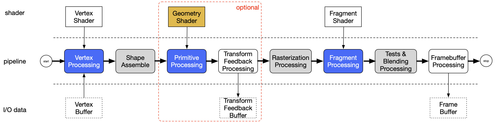
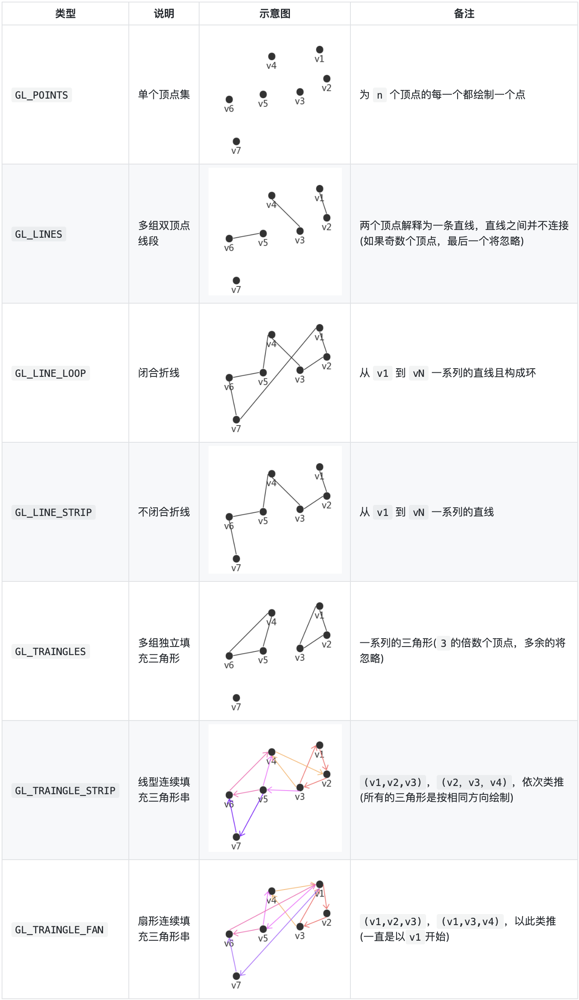
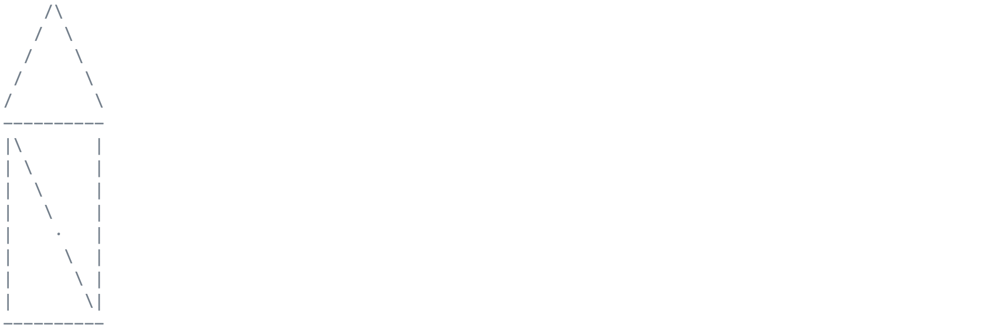
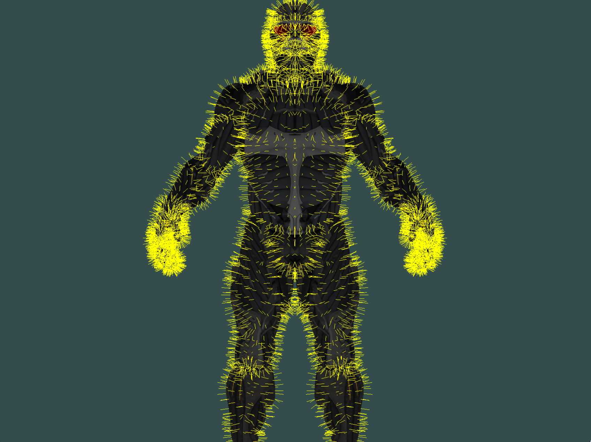
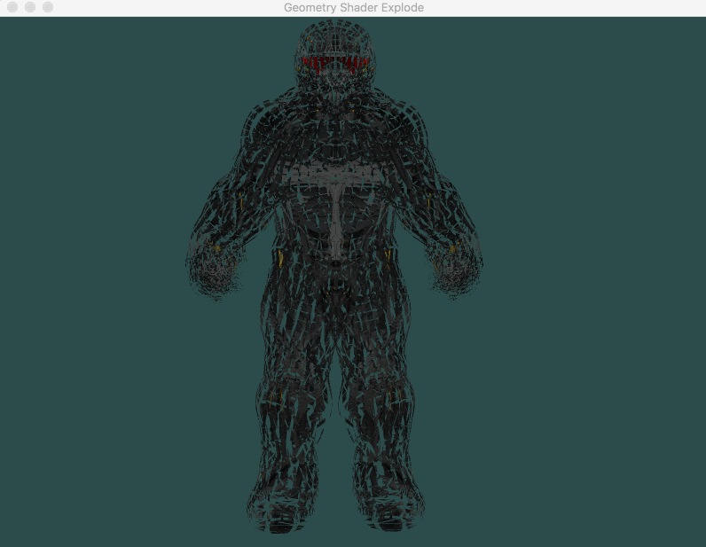

# 深入了解几何着色器

## 概述

几何着色器在opengl的整个渲染管线中是个可选项，在顶点着色器和片段着色器之间，具体位置为：



几个关键点：

* 顶点着色器以顶点数据作为输入数据，而几何着色器则以完整的图元(Primitive)作为输入数据
* 与顶点着色器不能销毁或创建顶点不同，而几何着色器的主要亮点就是可以创建或销毁几何图元
* 几何着色器的输出图元不一定和输入图元相同
* 几何着色器输出的图元由顶点列表定义而成，而且顶点必须变换到裁剪空间。也就是说，经过几何着色器处理后，得到的是一系列位于齐次裁剪空间的顶点所组成的图元。

## shader编写

一个简单的几何着色器例子：

``` C
#version 330 core       /* 指定 GLSL 版本3.3，匹配 OpenGL 版本 */

layout (points) in;     /* 指定几何着色器输入的图元类型 */

layout (line_strip, max_vertices = 2) out;  /* 指定几何着色器输出的图元类型和最大能够输出的顶点数量 */

void main()
{
    /* 修改顶点位置向量 */
    gl_Position = gl_in[0].gl_Position + vec4(-0.1, 0.0, 0.0, 0.0);
    /* 几何着色器函数，将 gl_Position 中的(位置)向量添加到图元中，
     即：发射出新顶点 */
    EmitVertex();
    
    /* 修改顶点位置向量 */
    gl_Position = gl_in[0].gl_Position + vec4( 0.1, 0.0, 0.0, 0.0);
    /* 发射新顶点 */
    EmitVertex();
    
    /* 几何着色器函数，将发射出的(Emitted)顶点合成为指定的输出渲染图元 */
    EndPrimitive();
}
```

- 输入类型 (Input Types)：

| 图元值 | 说明 |
| :--------: | -------- |
| `points` | 绘制 `GL_POINTS` 图元时（最小顶点数：1） |
| `lines` | 绘制 `GL_LINES` 或 `GL_LINE_STRIP`时（最小顶点数：2） |
| `lines_adjacency` | 绘制 `GL_LINES_ADJACENCY` 或 `GL_LINE_STRIP_ADJACENCY` 时（最小顶点数：4） |
| `triangles` | 绘制 `GL_TRIANGLES`、`GL_TRIANGLE_STRIP` 或 `GL_TRIANGLE_FAN` 时（最小顶点数：3） |
| `triangles_adjacency` | 绘制 `GL_TRIANGLES_ADJACENCY` 或 `GL_TRIANGLE_STRIP_ADJACENCY` 时（最小顶点数：6） |

括号里的数字代表一个基本图形所能包含的最少的顶点数。

对于形状的直观描述：



- 输出类型 (Output Types)：

| 图元值 |
| :--------: |
| `points`|
| `line_strip` |
| `triangle_strip` |
	
- 顶点输入 (Vertex Input)：

我们在顶点着色器使用的`gl_Position`变量其实位于`gl_in`数组中，该数组的数据成员如下
所示：

```c
in gl_Vertex
{
    vec4  gl_Position;
    float gl_PointSize;
    float gl_ClipDistance[];
} gl_in[];
```

而对于几何着色器，所输入的是图元的所有顶点，所以定义成数组。

- 顶点输出（Vertex Output）

我们使用`EmitVertex()`和`EndPrimitive()`两个函数来产生图元。每当我们调用一次
`EmitVertex()`函数时，会将顶点加入到当前的图元；当所有顶点都加入到图元后，我们可
以通过`EndPrimitive()`函数来产生图元。我们需要注意，当我们重复调用`EndPrimitive()`
时，可以生成多个同样的图元。

# 使用场景

## 创造出新的图形

可以利用几何着色器发射新顶点合成三角形图元来画房子。

其中几何着色器的shader如下：

```c
#version 330 core       /* 指定 GLSL 版本3.3，匹配 OpenGL 版本 */

layout (points) in;     /* 指定几何着色器输入的图元类型 */

layout (triangle_strip, max_vertices = 5) out;  /* 指定几何着色器输出的图元类型和最大能够输出的顶点数量 */

/* 输入接口块
  因为几何着色器是作用于输入的一组顶点的，
  从顶点着色器发来输入数据总是会以数组的形式表示出来。 */
in VS_OUT {
    vec3 color;
} gs_in[];

out vec3 fColor;  

void buildHouse(vec4 position)
{
    /* 当发射一个顶点的时候，每个顶点将会使用'最后'在 fColor 中储存的值，
       来用于片段着色器的运行
     */
    fColor = gs_in[0].color;    // gs_in[0] 因为(points类型的图元)只有一个输入顶点
    gl_Position = position + vec4(-0.2, -0.2, 0.0, 0.0);    // 1:左下
    EmitVertex();   /* 发射出新顶点 */
    gl_Position = position + vec4( 0.2, -0.2, 0.0, 0.0);    // 2:右下
    EmitVertex();
    gl_Position = position + vec4(-0.2,  0.2, 0.0, 0.0);    // 3:左上
    EmitVertex();
    gl_Position = position + vec4( 0.2,  0.2, 0.0, 0.0);    // 4:右上
    EmitVertex();
    gl_Position = position + vec4( 0.0,  0.4, 0.0, 0.0);    // 5:顶部
    fColor = vec3(1.0, 1.0, 1.0);   // 将屋顶的顶点的颜色设置为白色(模拟下雪)
    EmitVertex();
    EndPrimitive();     /* 将发射出的(Emitted)顶点合成为指定的输出渲染图元 */
}

void main()
{
    buildHouse(gl_in[0].gl_Position);
}
```

对应的定点着色器为：

```c
#version 330 core

layout (location = 0) in vec2 aPos; 
layout (location = 1) in vec3 aColor; 

/* 输出接口块 */
out VS_OUT {
    vec3 color;
} vs_out;

void main()
{
    vs_out.color = aColor;
    gl_Position  = vec4(aPos.x, aPos.y, 0.0, 1.0);
}

```

得到的效果：



## 动态生成几何体（Dynamically Generating Geometry）

我们利用几何着色器可以实现物体的LOD技术 (Level of Detail，细节提升)。比如，我们需要在游戏中绘制一个圆圈，那么我们可以根据距离摄像机的远近来调整圆圈的顶点数目，充分利用显卡的性能。


得到的效果如下：


## 法线可视化

首先在不使用几何着色器的情况下正常渲染一次场景；然后开启几何着色器第二次渲染场景，送到几何着色器的是三角形图元，我们为其每个顶点生成一个法线向量。



## 物体爆破

是指将每个三角形图元沿着法向量的方向移动一小段距离(效果就是，整个物体看起来像是沿着每个三角形的法线向量爆炸一样)。



## 参考文章

[几何着色器.pdf](https://positiveczp.github.io/%E5%87%A0%E4%BD%95%E7%9D%80%E8%89%B2%E5%99%A8.pdf)

[https://github.com/shenyuanluo/LearnOpenGL/tree/master/Ch04_AdvancedOpenGL/Sec09_GeometryShader](https://github.com/shenyuanluo/LearnOpenGL/tree/master/Ch04_AdvancedOpenGL/Sec09_GeometryShader)