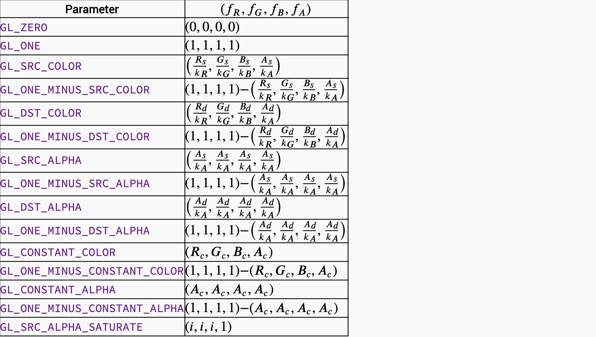
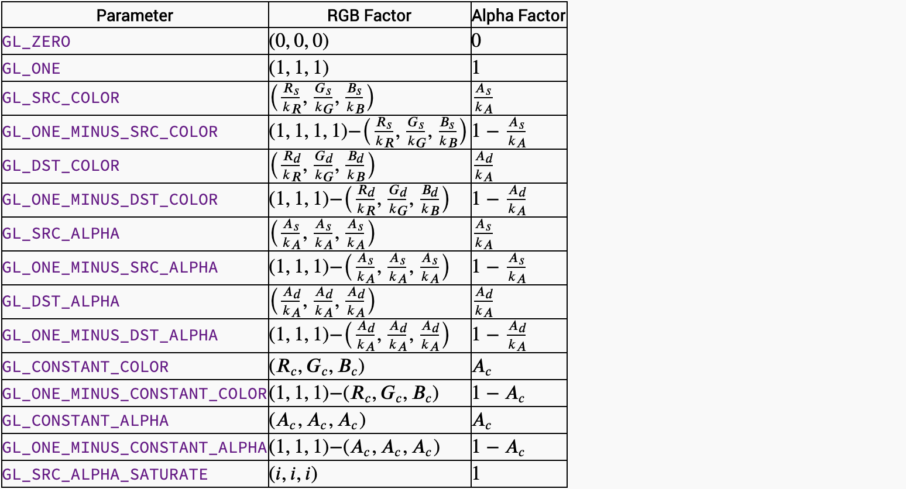
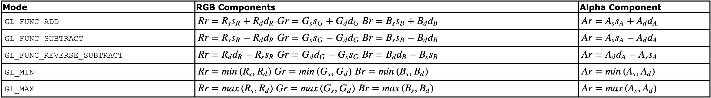
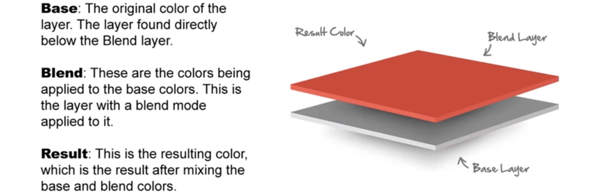
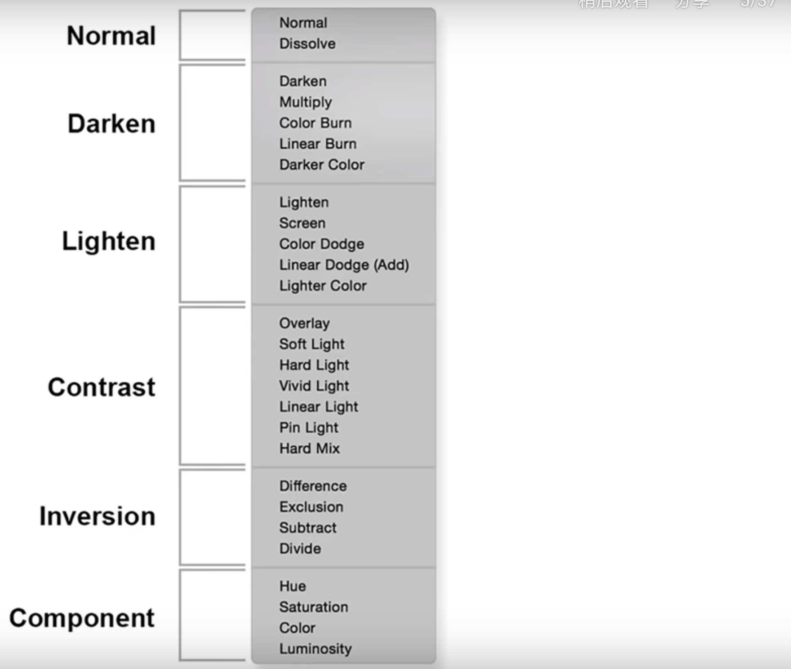

# 混合模式

## 混合相关的函数

### 源因子和目标因子

OpenGL 会把源颜色和目标颜色各自取出，并乘以一个系数（源颜色乘以的系数称为**源因子**，目标颜色乘以的系数称为**目标因子**），然后相加，这样就得到了新的颜色。（也可以不是相加，可以设置运算方式，包括加、减、取两者中较大的、取两者中较小的、逻辑运算等）

比如：

* `GL_ZERO`：表示使用0.0作为因子，实际上相当于不使用这种颜色参与混合运算。
* `GL_ONE`：表示使用1.0作为因子，实际上相当于完全的使用了这种颜色参与混合运算。
* `GL_SRC_ALPHA`：表示使用源颜色的alpha值来作为因子。
* `GL_DST_ALPHA`：表示使用目标颜色的alpha值来作为因子。
* `GL_ONE_MINUS_SRC_ALPHA`：表示用1.0减去源颜色的alpha值来作为因子（1-alpha）。
`GL_ONE_MINUS_DST_ALPHA`：表示用1.0减去目标颜色的alpha值来作为因子。
* ... ...

### 1、glEnable() / glDisable()

```java
GLES20.glEnable(GLES20.GL_BLEND)
GLES20.glDisable(GLES20.GL_BLEND)
```

混合默认是关闭的， 所以要开启混合。用完之后要进行关闭。

### 2、glBlendColor()

```java
public static native void glBlendColor(
    float red,
    float green,
    float blue,
    float alpha
);
```
在混合因子表中，`GL_CONSTANT_COLOR`、
`GL_ONE_MINUS_CONSTANT_COLOR`、
`GL_CONSTANT_ALPHA`、`GL_ONE_MINUS_CONSTANT_ALPHA`值都允许在混合方程式中引入一个常量混合颜色。这个颜色的初始为黑色**（0.0f, 0.0f, 0.0f, 0.0f）**，但可以通过调用该函数进行修改。

### 3 、glBlendFunc()

```java
public static native void glBlendFunc(
    int sfactor,
    int dfactor
);
```

指定像素的绘制算法，像素的绘制使用这样的算法：**控制被处理片段（源片段）的颜色值如何与已经存储在帧缓冲区的像素（目标像素）的颜色值进行组合**。

sfactor表示如何计算源混合因子，dfactor表示如何计算目标混合因子。默认这2个值都是`GL_ONE`，它们只有用如下指定的常量：



> 举例子：

- 如果设置了glBlendFunc(`GL_ONE`, `GL_ZERO`)，则表示完全使用源颜色，完全不使用目标颜色，因此画面效果和不使用混合的时候一致（当然效率可能会低一点点）。

- 如果设置了glBlendFunc(`GL_ZERO`, `GL_ONE`)，则表示完全不使用源颜色，因此无论你想画什么，最后都不会被画上去了。

- 如果设置了glBlendFunc(`GL_ONE`, `GL_ONE`)，则表示完全使用源颜色和目标颜色，最终的颜色实际上就是两种颜色的简单相加。例如红色(1, 0, 0)和绿色(0, 1, 0)相加得到(1, 1, 0)，结果为黄色。

- 如果设置了glBlendFunc(`GL_SRC_ALPHA`, `GL_ONE_MINUS_SRC_ALPHA`)，则表示源颜色乘以自身的alpha值，目标颜色乘以1.0减去源颜色的alpha值，这样一来，源颜色的alpha值越大，则产生的新颜色中源颜色所占比例就越大，而目标颜色所占比例则减小。

### 4、glBlendFuncSeparate()

```java
public static native void glBlendFuncSeparate(
    int srcRGB,
    int dstRGB,
    int srcAlpha,
    int dstAlpha
);
```

glBlendFunc()方法对RGB和alpha作用同样的方程，而这个方法则可以针对RGB和alpha执行不同的方程。所有值的默认值都是`GL_ONE`。



### 5、glBlendEquation() / glBlendEquationSeparate()

```java
public static native void glBlendEquation(
    int mode
);
```

使用混合方程式组合像素，包括RGB的混合方程和Alpha的混合方程。

* 源颜色： (Rs,Gs,Bs,As)
* 目标颜色： (Rd,Gd,Bd,Ad)
* 源混合因子：(sR,sG,sB,sA) 
* 目标混合因子：(dR,dG,dB,dA) 
* 结果颜色：(Rr,Gr,Br,Ar)

支持的mode，和对应的计算公式如下：



`GL_MIN`和`GL_MAX`方程适用于分析图片数据，`GL_FUNC_ADD`方程适用于反锯齿和透明。

[Visual glBlendFunc](https://www.andersriggelsen.dk/glblendfunc.php)可以在线看各种混合模式的效果，非常的方便。

## blend mode在设计中对应的术语



* **Base Color**是图片原始的颜色
* **Blend Color**是新的待混合到Base Color的颜色
* **Result Color**混合后的结果颜色

设计中大概会用到的混合为：


[Photoshop中27种图层混合模式原理图文详解](https://blog.csdn.net/chy555chy/article/details/54016317)有这27中混合模式对应的效果图。

### 正常模式

> Normal：正常

默认模式，显示混合色图层的像素，没有进行任何的图层混合。这意味着基色图层对上层没有影响。

> Dissolve：溶解

将混合色图层的图像以散乱的点状形式叠加到基色图层的图像上，对图像的色彩不产生影响，与图像的不透明度有关。在图像的填充和不透明度都是100%时，边缘的效果是最明显的。 

```c
gl_FragColor = mix(baseColor,blendColor);
```

### 图像更暗

如果想图像出来的效果更暗，可以采用如下的几个方式。

> Darken：变暗

两个图层中较暗的颜色将作为混合的颜色保留，比混合色亮的像素将被替换，而比混合色暗像素保持不变。

```c
gl_FragColor = min(baseColor,blendColor);
```

> Multiply：正片叠底

整体效果显示由上方图层和下方图层的像素值中较暗的像素合成的图像效果，任意颜色与黑色重叠时将产生黑色，任意颜色和白色重叠时颜色则保持不变。

```c
gl_FragColor = baseColor*blendColor;
```

> Color Burn：颜色加深

选择该项将降低上方图层中除黑色外的其他区域的对比度，使图像的对比度下降，产生下方图层透过上方图层的投影效果。

```c
gl_FragColor = vec4(1.0) - (vec4(1.0)-baseColor)/blendColor);
```

> Linear Burn：线性加深

上方图层将根据下方图层的灰度与图像融合，此模式对白色无效。

```c
gl_FragColor = baseColor+blendColor-vec4(1.0);
```

### 图像更亮

如果想图像出来的效果更亮，可以采用如下的几个方式。

> Lighten：变亮

使上方图层的暗调区域变为透明，通过下方的较亮区域使图像更亮。

```c
gl_FragColor = max(baseColor,blendColor);
```

> Screen：滤色

该项与“正片叠底”的效果相反，在整体效果上显示由上方图层和下方图层的像素值中较亮的像素合成的效果，得到的图像是一种漂白图像中颜色的效果。

```c
gl_FragColor = vec4(1.0) - ((vec4(1.0)-baseColor)*(vec4(1.0)-blendColor));
```

> Color Dodge：颜色减淡

和“颜色加深”效果相反，“颜色减淡”是由上方图层根据下方图层灰阶程序提升亮度，然后再与下方图层融合，此模式通常可以用来创建光源中心点极亮的效果。

```c
gl_FragColor = baseColor/(vec4(1.0)-blendColor);
```

> Linear Dodage：线性减淡

根据每一个颜色通道的颜色信息，加亮所有通道的基色，并通过降低其他颜色的亮度来反映混合颜色，此模式对黑色无效。

```c
gl_FragColor = baseColor+blendColor;
```

### 图像对比度

> Overlay：叠加

此项的图像最终效果最终取决于下方图层，上方图层的高光区域和暗调将不变，只是混合了中间调。

```c
vec4 lumCoeff=vec4(0.2125,0.7154,0.0721,1.0);
float luminance = dot(baseColor.rgb,lumCoeff.rgb);
if(luminance < 0.45)
{
    gl_FragColor = 2.0 *baseColor * blendColor;
}
else if(luminance >0.55)
{
    gl_FragColor = vec4(1.0)-2.0* ((vec4(1.0)-baseColor)*(vec4(1.0)-blendColor));
}
else
{
    vec4 colorT1 =  2.0 *baseColor * blendColor;
    vec4 colorT2 =  vec4(1.0)-2.0* ((vec4(1.0)-baseColor)*(vec4(1.0)-blendColor));
    gl_FragColor =  mix(baseColor,blendColor,(luminance-0.45)*10);
```

> Soft Light：柔光

使颜色变亮或变暗让图像具有非常柔和的效果，亮于中性灰底的区域将更亮，暗于中性灰底的区域将更暗。

```c
gl_FragColor = 2.0 * baseColor * blendColor + baseColor*baseColor -2.0*baseColor*baseColor*blendColor;
if (texColor.r >= 0.5) {
	resultFore.r = 2.0 * canvasColor.r * (1.0 - texColor.r) + (2.0 * texColor.r - 1.0) * sqrt(canvasColor.r);
}
if (texColor.g >= 0.5) {
	resultFore.g = 2.0 * canvasColor.g * (1.0 - texColor.g) + (2.0 * texColor.g - 1.0) * sqrt(canvasColor.g)
}
if (texColor.b >= 0.5) {
	resultFore.b = 2.0 * canvasColor.b * (1.0 - texColor.b) + (2.0 * texColor.b - 1.0) * sqrt(canvasColor.b);
}
```

> Hard Light：强光

此项和“柔光”的效果类似，但其程序远远大于“柔光”效果，适用于图像增加强光照射效果。

```c
vec4 lumCoeff=vec4(0.2125,0.7154,0.0721,1.0);
float luminance = dot(blendColor.rgb,lumCoeff.rgb);
if(luminance < 0.45)
{
    gl_FragColor = 2.0 *baseColor * blendColor;
}
else if(luminance >0.55)
{
    gl_FragColor = vec4(1.0)-2.0* ((vec4(1.0)-baseColor)*(vec4(1.0)-blendColor));
}
else
{
    vec4 colorT1 =  2.0 *baseColor * blendColor;
    vec4 colorT2 =  vec4(1.0)-2.0* ((vec4(1.0)-baseColor)*(vec4(1.0)-blendColor));
    gl_FragColor =  mix(baseColor,blendColor,(luminance-0.45)*10);
}
```

> Vivid Light：亮光 

根据融合颜色的灰度减少比对度，可以使图像更亮或更暗。

```c
gl_FragColor = baseColor + baseColor * (2*blendColor - vec4(1.0)) / (2*(vec4(1.0)-blendColor));
```

> Linear Light：线性光 

根据混合颜色的灰度，来减少或增加图像亮度，使图像更亮。

```c
gl_FragColor = baseColor + 2 * blendColor - vec4(1.0);
```

> Pin Light：点光 

如果混合色比50%灰度色亮，则将替换混合色暗的像素，而不改变混合色亮的像素;反之如果混合色比50%灰度色暗，则将替换混合色亮的像素，而不改变混合色暗的像素。

```c
gl_FragColor = min(baseColor,2*blendColor - vec4(1.0));
```

### 图像颜色反转

> Difference：差值

上方图层的亮区将下方图层的颜色进行反相，暗区则将颜色正常显示出来，效果与原图像是完全相反的颜色。

```c
gl_FragColor = vec4(abs(blendColor-baseColor).rgb,1.0);
```

> Exclusion：排除

创建一种与“差值”模式类似但对比度更低的效果。与白色混合将反转基色值，与黑色混合则不发生变化。

```c
gl_FragColor =vec4((baseColor + blendColor).rgb - (2.0*baseColor*blendColor).rgb,1.0);
```

> Subtract：减去

```c
gl_FragColor = vec4(baseColor.rgb-blendColor.rgb,1.0);
```

> Divide：除去

```c
gl_FragColor = baseColor/blendColor;
```

**【TIPS】**

**上面大概介绍了ps中blend算法的OpenGL实现方式，在实际使用的过程中，不一定严格按照公式来编写，只要效果看着正确就可以使用，有时候没准还会获得出乎意料的效果呢。**

## 参考文章

[Blending Modes Explained – The Complete Guide to Photoshop Blend Modes]
(https://photoshoptrainingchannel.com/blending-modes-explained/)

[Photoshop中27种图层混合模式原理图文详解](https://blog.csdn.net/chy555chy/article/details/54016317)

[Photoshop blend算法 与 图层混合模式](https://blog.csdn.net/fansongy/article/details/79303646)

[Visual glBlendFunc](https://www.andersriggelsen.dk/glblendfunc.php)

[https://github.com/jamieowen/glsl-blend](https://github.com/jamieowen/glsl-blend)